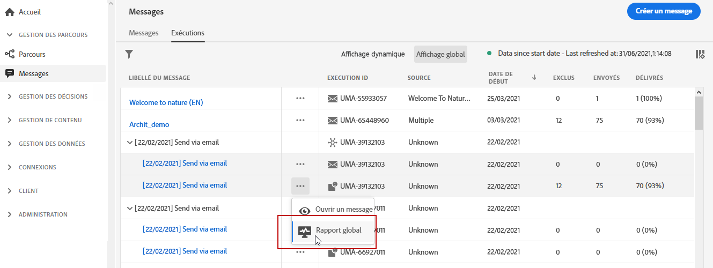
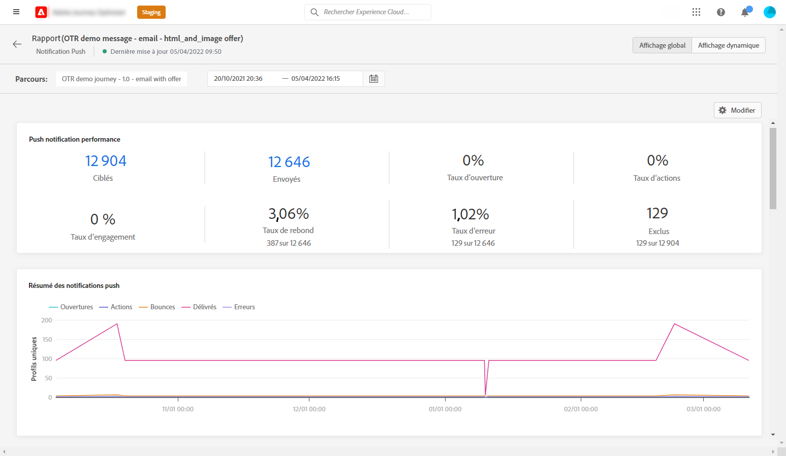
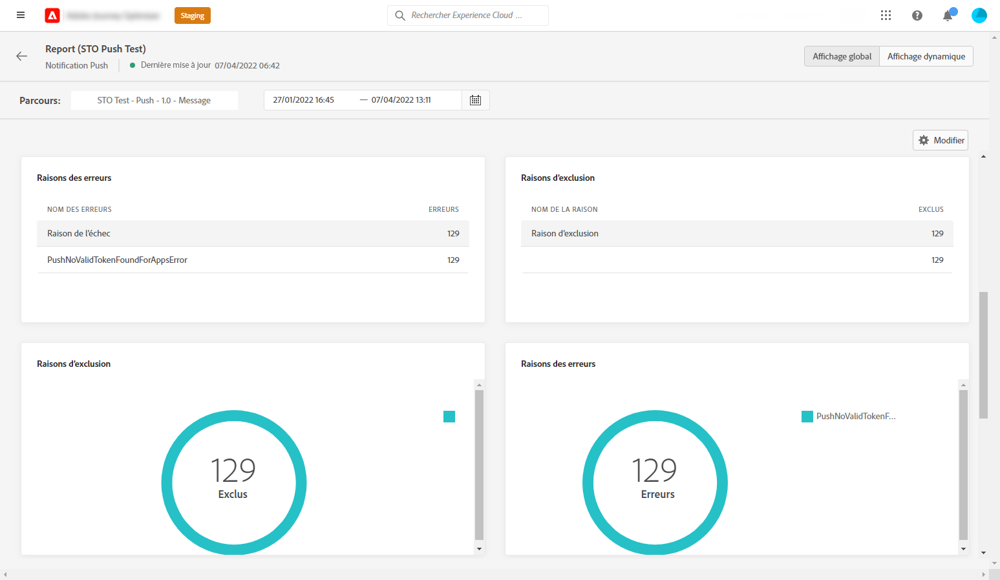
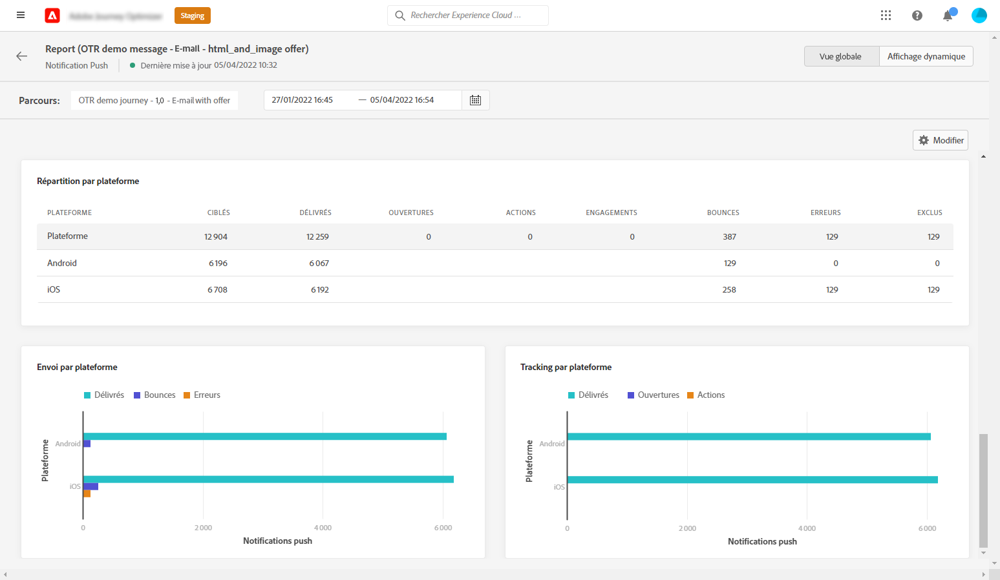

# Rapport global sur les notifications push {#push-global-report}

Le **[!UICONTROL Rapport global]** push ne cible qu’une seule diffusion push spécifique.

Dans l’onglet **[!UICONTROL Exécutions]** du menu **[!UICONTROL Messages]**, sélectionnez **[!UICONTROL Affichage global]**, puis, dans le menu avancé de la diffusion sélectionnée, sélectionnez **[!UICONTROL Rapport global]**.

Le **[!UICONTROL Rapport global]** push est divisé en différents widgets présentant le succès et les erreurs de votre diffusion. Chaque widget peut être redimensionné et supprimé en cas de besoin. Pour plus d&#39;informations à ce propos consultez cette [section](global-report.md#modify-dashboard).

Le widget **[!UICONTROL Performances des notifications push]** présente les principales informations relatives à vos notifications push avec des KPI :

* **[!UICONTROL Envoyés]** : nombre total d&#39;envois pour la diffusion.

* **[!UICONTROL Taux de bounce]** : pourcentage de notifications push ayant rebondi par rapport aux notifications push envoyées.

* **[!UICONTROL Taux d&#39;erreurs]** : pourcentage d&#39;erreurs survenues pendant une diffusion qui l&#39;empêchent d&#39;être envoyée par rapport aux notifications push envoyées.

* **[!UICONTROL Taux d&#39;actions]** : pourcentage d&#39;actions sur la notification push diffusée, par exemple clic sur un bouton ou rejet.

* **[!UICONTROL Taux d&#39;engagement]** : pourcentage d&#39;ouvertures et d&#39;actions pour cette notification push, c&#39;est-à-dire si le profil a ouvert la notification push ou si un utilisateur a cliqué sur un bouton.

Le graphique **[!UICONTROL Résumé des notifications push]** contient les données disponibles pour les notifications push envoyées, telles que :

* **[!UICONTROL Ouvertures]** : nombre de fois qu&#39;un message a été ouvert dans une diffusion.

* **[!UICONTROL Actions]** : nombre total d&#39;actions sur la notification push diffusée, par exemple clic sur un bouton ou rejet.

* **[!UICONTROL Bounces]** : nombre total d&#39;erreurs cumulées lors des diffusions et du traitement automatique des retours par rapport au nombre total de messages envoyés.

* **[!UICONTROL Délivrés]** : nombre de messages envoyés avec succès, par rapport au nombre total de messages envoyés.

* **[!UICONTROL Erreurs]** : nombre total d&#39;erreurs survenues au cours d&#39;une diffusion, l&#39;empêchant d&#39;être envoyée à des profils.

Les graphiques et tableaux **[!UICONTROL Raisons de l&#39;erreur]** et **[!UICONTROL Exclure des raisons]** vous permettent de voir quelles erreurs et exclusions ont eu lieu au cours de votre diffusion.

Les graphiques et tableaux **[!UICONTROL Suivi par plateforme]**, **[!UICONTROL Envoi par plateforme]** et **[!UICONTROL Répartition par plateforme]** décrivent le succès de votre notification push en fonction du système d&#39;exploitation de votre destinataire.
