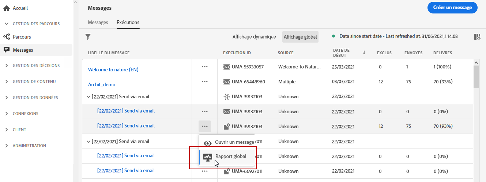

# Rapport global push {#push-global-report}

Le **[!UICONTROL Rapport global]** push ne cible qu’une seule diffusion push spécifique.

Dans l’onglet **[!UICONTROL Exécutions]** du menu **[!UICONTROL Messages]**, sélectionnez **[!UICONTROL Affichage global]**, puis, dans le menu avancé de la diffusion sélectionnée, sélectionnez **[!UICONTROL Rapport global]**.

Le **[!UICONTROL Rapport global]** push est divisé en différents widgets présentant le succès et les erreurs de votre diffusion. Chaque widget peut être redimensionné et supprimé en cas de besoin. Pour plus d’informations à ce sujet, consultez cette [section](global-report.md#modify-dashboard).
