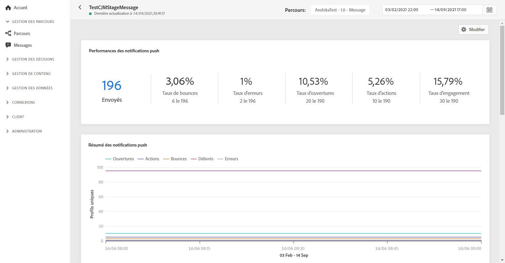
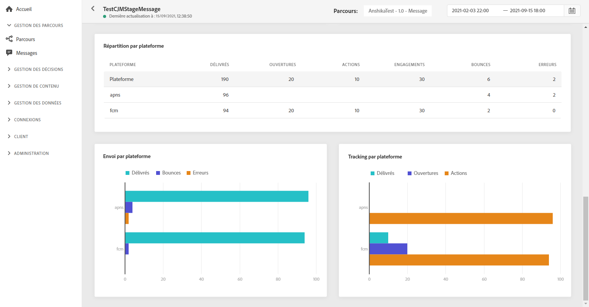

# Push Global Report {#push-global-report}

Le **[!UICONTROL Rapport global]** push ne cible qu’une seule diffusion push spécifique.

Dans l’onglet **[!UICONTROL Exécutions]** du menu **[!UICONTROL Messages]**, sélectionnez **[!UICONTROL Affichage global]**, puis, dans le menu avancé de la diffusion sélectionnée, sélectionnez **[!UICONTROL Rapport global]**.

Le **[!UICONTROL Rapport global]** push est divisé en différents widgets présentant le succès et les erreurs de votre diffusion. Chaque widget peut être redimensionné et supprimé en cas de besoin. Pour plus d’informations à ce sujet, consultez cette [section](global-report.md#modify-dashboard).

Le widget **[!UICONTROL Performances des notifications push]** détaille les informations principales relatives à vos notifications push avec des indicateurs de performance clés :

* **[!UICONTROL Envoyés]** : nombre total d’envois pour la diffusion.

* **[!UICONTROL Taux de rebond]** : pourcentage de notifications push ayant rebondi par rapport aux notifications push envoyées.

* **[!UICONTROL Taux d’erreurs]** : pourcentage d’erreurs survenues pendant une diffusion qui l’empêchent d’être envoyée par rapport aux notifications push envoyées.

* **[!UICONTROL Taux d’actions]** : Pourcentage d&#39;actions sur la notification push diffusée, par exemple clic sur un bouton ou rejet.

* **[!UICONTROL Taux d’engagement]** : pourcentage d’ouvertures et d’actions pour cette notification push, c’est-à-dire si le profil a ouvert la notification push ou si un utilisateur a cliqué sur un bouton.

Le graphique **[!UICONTROL Résumé des notifications push]** contient les données disponibles pour les notifications push envoyées, telles que :

* **[!UICONTROL Ouvertures]** : nombre de fois qu&#39;un message a été ouvert dans une diffusion.

* **[!UICONTROL Actions]** : nombre total d’actions sur la notification push diffusée, par exemple clic sur un bouton ou rejet.

* **[!UICONTROL Bounces]** : nombre total d’erreurs cumulées lors des diffusions et du traitement automatique des retours par rapport au nombre total de messages envoyés.

* **[!UICONTROL Délivrés]** : nombre de messages envoyés avec succès, par rapport au nombre total de messages envoyés.

* **[!UICONTROL Erreurs]** : nombre total d’erreurs survenues au cours d’une diffusion, l&#39;empêchant d&#39;être envoyée à des profils.

Le graphique et le tableau **[!UICONTROL Raisons de l&#39;erreur]** vous permettent de voir quelle erreur s&#39;est produite au cours de votre diffusion.

Les graphiques et tableaux **[!UICONTROL Suivi par plate-forme]**, **[!UICONTROL Envoi par plate-forme]** et **[!UICONTROL Ventilation par plate-forme]** décrivent le succès de votre notification push en fonction du système opérationnel de votre destinataire.