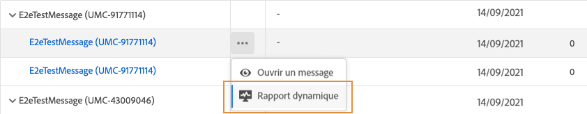
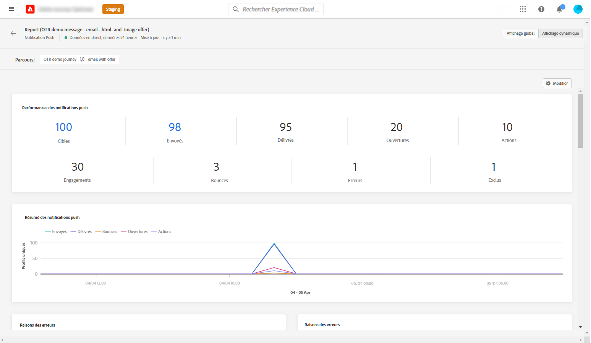
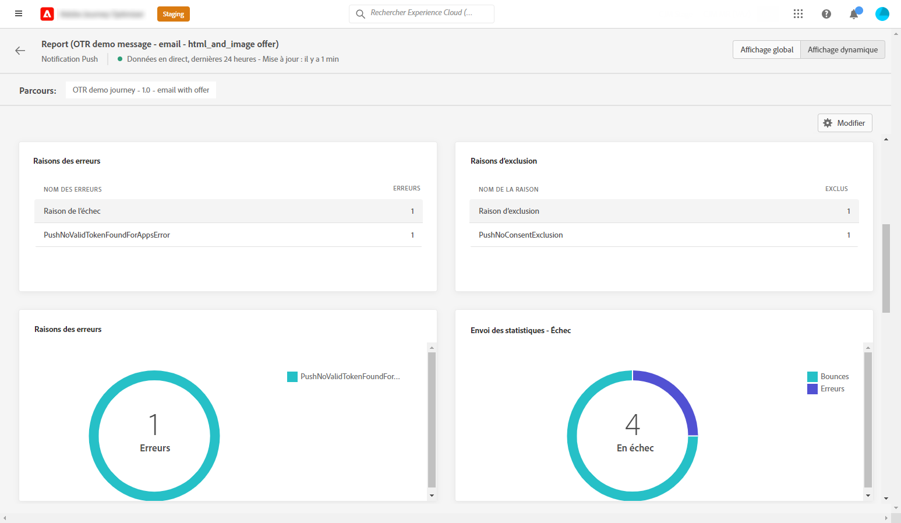
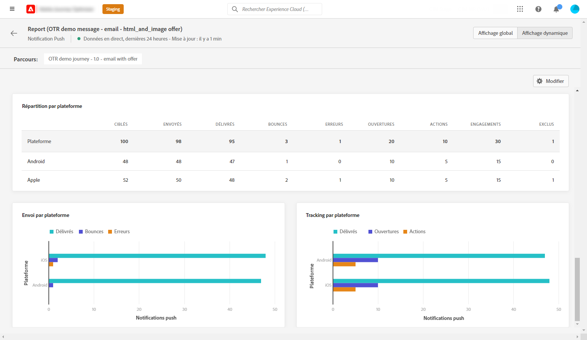

# Rapport dynamique sur les notifications push {#push-live-report}

Le **[!UICONTROL rapport dynamique]** sur les notifications push ne cible qu&#39;une seule diffusion push spécifique.

Dans l&#39;onglet **[!UICONTROL Exécutions]** du menu **[!UICONTROL Messages]**, sélectionnez **[!UICONTROL Vue active]**, puis, dans le menu avancé de la diffusion sélectionnée, sélectionnez **[!UICONTROL Rapport dynamique]**.

Le **[!UICONTROL rapport dynamique]** sur les notifications push est divisé en différents widgets détaillant la réussite et les erreurs de votre diffusion. Chaque widget peut être redimensionné et supprimé si nécessaire. Pour plus d’informations à ce propos consultez cette [section](live-report.md#modify-dashboard).

Les **[!UICONTROL performances des notifications push]** et les widgets de **[!UICONTROL résumé des notifications push]** présentent les principales informations relatives à votre message avec un graphique et des KPI :

* **[!UICONTROL Envoyés]** : nombre total d’envois pour la diffusion.

* **[!UICONTROL Délivrés]**: Nombre de messages envoyés avec succès.

* **[!UICONTROL Rebonds]**: Nombre total d&#39;erreurs cumulées lors des diffusions et du traitement automatique des retours.

* **[!UICONTROL Erreurs]** : nombre total d’erreurs qui se sont produites au cours d’une diffusion, l’empêchant d’être envoyée aux profils.

* **[!UICONTROL Ouvertures]** : nombre d’ouvertures d’un message dans une diffusion.

* **[!UICONTROL Actions]** : nombre total d’actions sur la notification push diffusée (par exemple, clic sur un bouton ou rejet).

* **[!UICONTROL Engagements]** : nombre total d&#39;ouvertures et d&#39;actions pour cette notification push, c&#39;est-à-dire si le profil a ouvert la notification ou si un utilisateur a cliqué sur un bouton.

Le tableau **[!UICONTROL Mesures d’envoi - par push]** détaille le succès de votre diffusion :

* **[!UICONTROL Ciblés]** : nombre de profils utilisateur qui sont qualifiés en tant que profils cibles pour cette diffusion.

* **[!UICONTROL Exclus]** : nombre de profils utilisateur, exclus des profils ciblés, qui n’ont pas reçu le message.

* **[!UICONTROL Envoyés]** : nombre total d’envois pour la diffusion.

* **[!UICONTROL Délivrés]**: Nombre de messages envoyés avec succès.

* **[!UICONTROL Rebonds]**: Nombre total d&#39;erreurs cumulées lors des diffusions et du traitement automatique des retours.

* **[!UICONTROL Erreurs]** : nombre total d’erreurs qui se sont produites au cours d’une diffusion, l’empêchant d’être envoyée aux profils.

* **[!UICONTROL Ouvertures]** : nombre d’ouvertures d’un message dans une diffusion.

Les graphiques et tableaux **[!UICONTROL Raisons de l&#39;erreur]** et **[!UICONTROL Exclure des raisons]** vous permettent de voir quelles erreurs et exclusions ont eu lieu au cours de votre diffusion.

Le widget **[!UICONTROL Statistiques d’envoi - Échec]** vous permet de voir combien d’erreurs et de bounces se sont produits.

Les graphiques et tableaux **[!UICONTROL Suivi par plateforme]**, **[!UICONTROL Envoi par plateforme]** et **[!UICONTROL Ventilation par plateforme]** décrivent le succès de votre notification push en fonction du système opérationnel.

