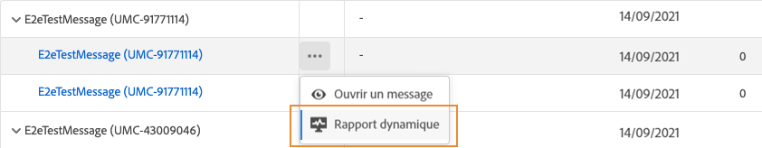

# Rapport dynamique sur les notifications push {#push-live-report}

Le **[!UICONTROL rapport dynamique]** sur les notifications push ne cible qu&#39;une seule diffusion push spécifique.

Dans l&#39;onglet **[!UICONTROL Exécutions]** du menu **[!UICONTROL Messages]**, sélectionnez **[!UICONTROL Vue active]**, puis, dans le menu avancé de la diffusion sélectionnée, sélectionnez **[!UICONTROL Rapport dynamique]**.

Le **[!UICONTROL rapport dynamique]** sur les notifications push est divisé en différents widgets détaillant la réussite et les erreurs de votre diffusion. Chaque widget peut être redimensionné et supprimé si nécessaire. Pour plus d’informations à ce propos consultez cette [section](live-report.md#modify-dashboard).

Les **[!UICONTROL performances des notifications push]** et les widgets de **[!UICONTROL résumé des notifications push]** présentent les principales informations relatives à votre message avec un graphique et des KPI :

* **[!UICONTROL Envoyés]** : nombre total d’envois pour la diffusion.

* **[!UICONTROL Délivrés]** : nombre de messages envoyés avec succès, par rapport au nombre total de messages envoyés.

* **[!UICONTROL Bounces]** : nombre total d’erreurs cumulées lors des diffusions et du traitement automatique des retours par rapport au nombre total de messages envoyés.

* **[!UICONTROL Erreurs]** : nombre total d’erreurs survenues au cours d’une diffusion, l&#39;empêchant d&#39;être envoyée à des profils.

* **[!UICONTROL Ouvertures]** : nombre de fois qu&#39;un message a été ouvert dans une diffusion.

* **[!UICONTROL Actions]** : nombre total d’actions sur la notification push diffusée, par exemple clic sur un bouton ou rejet.

* **[!UICONTROL Engagements]** : nombre total d’ouvertures et d’actions pour cette notification push, c’est-à-dire si le profil a ouvert la notification ou si un utilisateur a cliqué sur un bouton.

Les graphiques et tableaux **[!UICONTROL Suivi par plate-forme]**, **[!UICONTROL Envoi par plate-forme]** et **[!UICONTROL Ventilation par plate-forme]** décrivent le succès de votre notification push en fonction du système opérationnel.

Le widget **[!UICONTROL Statistiques d&#39;envoi - Échec]** vous permet de voir combien d&#39;erreurs et de rebonds ont eu lieu.

Le graphique et le tableau **[!UICONTROL Raisons de l&#39;erreur]** vous permettent de voir quelle erreur s&#39;est produite au cours de votre diffusion.
