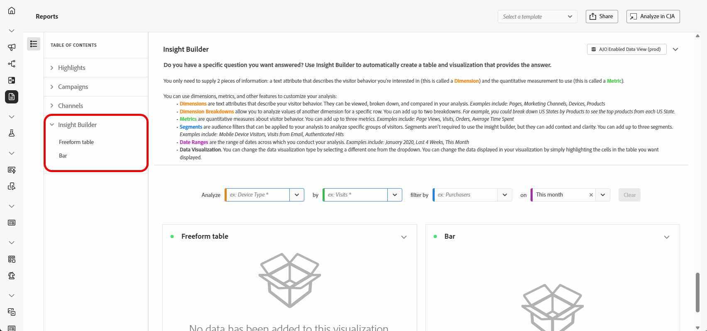

# Gérer vos rapports {#channel-cja-manage}

## Analyser dans Customer Journey Analytics {#analyze}

Améliorez votre expérience d’analyse des données avec votre licence **[!DNL Customer Journey Analytics]** en tirant parti de la fonction **[!UICONTROL Analyser dans CJA]** disponible dans tous les rapports.

Cette puissante option vous redirige aisément vers votre environnement **[!DNL Customer Journey Analytics]**, ce qui vous permet de personnaliser abondamment vos rapports. Intégrez des mesures avancées de Customer Journey Analytics dans vos widgets pour enrichir vos informations et les rendre encore plus pertinentes.

[En savoir plus sur l’interface de Customer Journey Analytics.](https://experienceleague.adobe.com/fr/docs/analytics-platform/using/cja-overview/cja-getting-started)

## Définir la période d’un rapport {#report-period}

En accédant à un rapport, vous pouvez appliquer un filtre de période situé dans le coin supérieur droit de ce dernier.

Par défaut, la période de filtrage d’une campagne ou d’un parcours est définie sur ses dates de début et de fin. En l’absence de date de fin, le filtre est défini par défaut sur la date actuelle.

Pour modifier le filtre, vous pouvez sélectionner une date de début et une durée personnalisées ou choisir parmi des options prédéfinies telles que « la semaine dernière » ou « il y a deux mois ».

Le rapport est automatiquement mis à jour une fois le filtre appliqué ou modifié.

## Exporter vos rapports {#export-reports}

Vous pouvez facilement exporter vos différents rapports au format PDF ou CSV, ce qui vous permet de les partager ou de les imprimer. Les étapes d’export des rapports sont présentées dans les onglets ci-dessous.

>[!BEGINTABS]

>[!TAB Exporter votre rapport au format CSV]

1. Dans votre rapport, cliquez sur **[!UICONTROL Exporter]** et sélectionnez **[!UICONTROL Fichier CSV]** pour générer un fichier CSV au niveau du rapport global.

   

1. Votre fichier est automatiquement téléchargé et peut se trouver dans vos fichiers locaux.

   Si vous avez généré le fichier au niveau du rapport, il contient des informations détaillées pour chaque widget, notamment son titre et ses données.

>[!TAB Exporter votre rapport au format PDF]

1. Dans votre rapport, cliquez sur **[!UICONTROL Exporter]** et sélectionnez **[!UICONTROL Fichier PDF]**.

   

1. Une fois le téléchargement demandé, cliquez sur **[!UICONTROL Télécharger]**.

   

1. Votre fichier s’ouvre automatiquement dans votre navigateur.

Vous pouvez maintenant consulter, télécharger ou partager votre rapport en fichier PDF.

>[!ENDTABS]

## Création d’une mesure simple {#create-simple-metric}

Vous pouvez créer des mesures calculées personnalisées directement dans vos rapports. Vous pouvez générer des informations plus personnalisées et mieux analyser vos données en combinant deux mesures existantes en fonction de vos besoins de création de rapports spécifiques.

1. Commencez par accéder au rapport dans lequel vous souhaitez ajouter une nouvelle mesure.

1. Dans le tableau de votre rapport, sélectionnez les mesures souhaitées en maintenant les touches `Shift` ou `CTRL/CMD` enfoncées tout en cliquant dessus. Cliquez ensuite avec le bouton droit et sélectionnez **[!UICONTROL Créer une mesure d’après la sélection]**.

   Si vous sélectionnez plus de deux mesures, seules les deux premières sont utilisées dans le créateur de mesures.

   

1. Dans le créateur de mesures calculées, nommez votre nouvelle mesure en saisissant le champ **[!UICONTROL Titre]** . Vous pouvez également ajouter une **[!UICONTROL description]**.

   >[!NOTE]
   >
   >Si vous possédez un Customer Journey Analytics, vous pouvez personnaliser davantage vos mesures à l’aide d’options supplémentaires. [En savoir plus](https://experienceleague.adobe.com/en/docs/analytics-platform/using/cja-components/cja-calcmetrics/cm-workflow/cm-build-metrics#areas-of-the-calculated-metrics-builder)

1. Sélectionnez le **[!UICONTROL nombre de décimales]** approprié et choisissez un **[!UICONTROL format]** (nombre de décimales, heure, pourcentage ou devise) en fonction de la manière dont votre mesure doit être affichée.

1. Sélectionnez l’opérateur, tel que l’addition, la soustraction, la multiplication ou la division, qui déterminera le mode de calcul de la mesure.

   

1. Vous pouvez réorganiser les composants si nécessaire.

1. Lorsque vos paramètres vous conviennent, cliquez sur **[!UICONTROL Appliquer]** pour finaliser votre nouvelle mesure.

1. La nouvelle mesure s’affiche en regard des mesures d’origine dans votre rapport.

   

La mesure que vous venez de créer sera incluse lorsque vous exportez le rapport au format PDF ou CSV. Cependant, il sera supprimé du rapport une fois que vous l’aurez quitté.

## Exploration des données à l’aide de l’analyse exploratoire {#exploratory}

Utilisez l’outil d’analyse exploratoire pour créer facilement des tableaux et des visualisations à partir des **[!UICONTROL Dimensions]** et **[!UICONTROL Mesures]** sélectionnées. Cet outil simplifie l’exploration des données, ce qui vous permet de personnaliser et d’analyser automatiquement et facilement les informations. Apprenez-en davantage en consultant [cette documentation](https://experienceleague.adobe.com/en/docs/analytics/analyze/analysis-workspace/panels/quickinsight).

1. Commencez par accéder au rapport dans lequel vous souhaitez utiliser l’ analyse exploratoire .

1. Sélectionnez le menu Analyse exploratoire dans le menu du rail de gauche.

   

1. Créez une requête en choisissant une **[!UICONTROL Dimension]** et une **[!UICONTROL mesure]** à l’aide des menus déroulants. Vous pouvez également sélectionner un **[!UICONTROL segment]** si nécessaire.

   

1. Définissez la période de votre analyse afin de spécifier la période sur laquelle vous souhaitez vous concentrer. Par défaut, la période est définie sur celle utilisée dans le panneau du rapport.

1. Utilisez les options **[!UICONTROL Ajouter une ventilation]** ou **[!UICONTROL Ajouter une mesure]** pour inclure des dimensions supplémentaires, ce qui permet une ventilation des données plus détaillée.

   Notez que vous ne pouvez ajouter que trois **[!UICONTROL Dimensions]**, **[!UICONTROL Mesures]** et **[!UICONTROL Segments]**.

Vous pouvez désormais analyser vos données à l’aide de vos outils de visualisation et de tableau personnalisés.

<!--## Create a down-funnel metric {#down-funnel}

1. Create a new journey or open an existing one. [Learn more on journey creation](../building-journeys/journey-gs.md)

1. On the canvas editor, select the option to "add a metric".

c. In the metric selector, choose whichever conversion metric seems appropriate and publish your journey

d. Open the report for the journey that you added the metric to and ensure that the metric has been added to the table alongside all the other pre-configured metrics.
-->

## Création d’une audience à partir de données de rapport {#create-audience}

Vous pouvez désormais sélectionner des données spécifiques dans le tableau et créer directement une audience à partir de ces sélections, en rationalisant et en simplifiant le processus de création d’audience.

1. Accédez tout d’abord au tableau du rapport qui contient les données que vous souhaitez transformer en audience.

1. Cliquez avec le bouton droit sur la cellule de votre choix et sélectionnez **[!UICONTROL Créer une audience]**.

   Vous pouvez également lancer la création d’audience à partir du widget **[!UICONTROL Parcours canvas]** en sélectionnant un noeud et en cliquant dessus avec le bouton droit de la souris.

1. Dans la fenêtre **[!UICONTROL Créer une audience]** , saisissez un **[!UICONTROL nom]** et définissez une **[!UICONTROL plage de dates unique]** pour l’audience que vous prévoyez de publier.

   >[!NOTE]
   >
   >Si vous possédez un Customer Journey Analytics, vous pouvez personnaliser davantage vos mesures à l’aide d’options supplémentaires. [En savoir plus](https://experienceleague.adobe.com/en/docs/analytics-platform/using/cja-components/audiences/publish)

   

1. Cliquez sur le bouton **[!UICONTROL Créer]** pour finaliser la création de l’audience. Notez que ce processus peut nécessiter un certain temps.

Vous pouvez maintenant utiliser l’audience nouvellement créée avec un Parcours ou une campagne.

