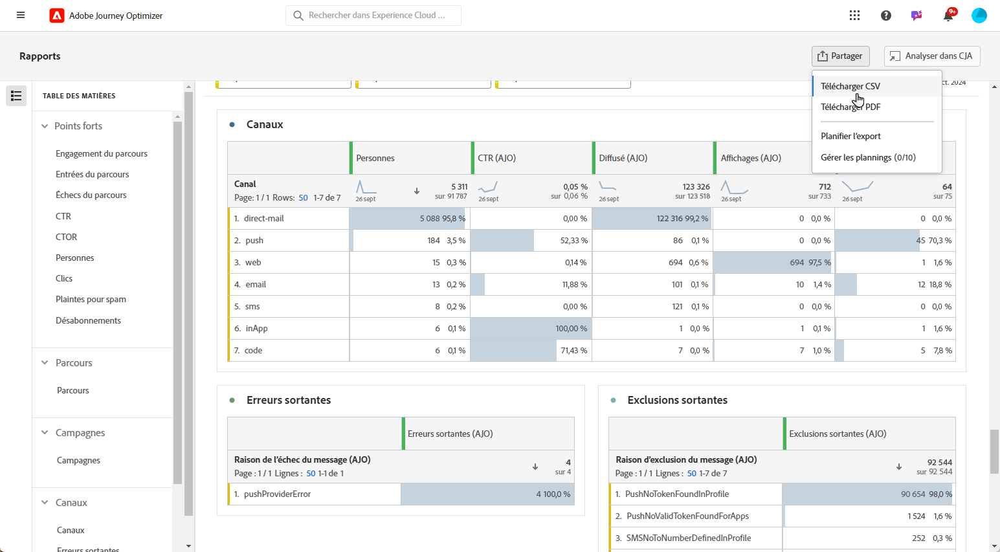

# Gérer vos rapports {#channel-cja-manage}

## Analyser dans Customer Journey Analytics {#analyze}

Améliorez votre expérience d’analyse des données avec votre licence **[!DNL Customer Journey Analytics]** en tirant parti de la fonction **[!UICONTROL Analyser dans CJA]** disponible dans tous les rapports.

Cette puissante option vous redirige aisément vers votre environnement **[!DNL Customer Journey Analytics]**, ce qui vous permet de personnaliser abondamment vos rapports. Intégrez des mesures avancées de Customer Journey Analytics dans vos widgets pour enrichir vos informations et les rendre encore plus pertinentes.

[En savoir plus sur l’interface de Customer Journey Analytics.](https://experienceleague.adobe.com/fr/docs/analytics-platform/using/cja-overview/cja-getting-started)

## Définir la période d’un rapport {#report-period}

En accédant à un rapport, vous pouvez appliquer un filtre de période situé dans le coin supérieur droit de ce dernier.

Par défaut, la période de filtrage d’une campagne ou d’un parcours est définie sur ses dates de début et de fin. En l’absence de date de fin, le filtre est défini par défaut sur la date actuelle.

Pour modifier le filtre, vous pouvez sélectionner une date de début et une durée personnalisées ou choisir parmi des options prédéfinies telles que « la semaine dernière » ou « il y a deux mois ».

Le rapport est automatiquement mis à jour une fois le filtre appliqué ou modifié.

## Exporter vos rapports {#export-reports}

Vous pouvez facilement exporter vos différents rapports au format PDF ou CSV, ce qui vous permet de les partager ou de les imprimer. Les étapes d’export des rapports sont présentées dans les onglets ci-dessous.

>[!BEGINTABS]

>[!TAB Exporter votre rapport au format CSV]

1. Dans votre rapport, cliquez sur **[!UICONTROL Exporter]** et sélectionnez **[!UICONTROL Fichier CSV]** pour générer un fichier CSV au niveau du rapport global.

   

1. Votre fichier est automatiquement téléchargé et peut se trouver dans vos fichiers locaux.

   Si vous avez généré le fichier au niveau du rapport, il contient des informations détaillées pour chaque widget, notamment son titre et ses données.

>[!TAB Exporter votre rapport au format PDF]

1. Dans votre rapport, cliquez sur **[!UICONTROL Exporter]** et sélectionnez **[!UICONTROL Fichier PDF]**.

   

1. Une fois le téléchargement demandé, cliquez sur **[!UICONTROL Télécharger]**.

   

1. Votre fichier s’ouvre automatiquement dans votre navigateur.

Vous pouvez maintenant consulter, télécharger ou partager votre rapport en fichier PDF.

>[!ENDTABS]
