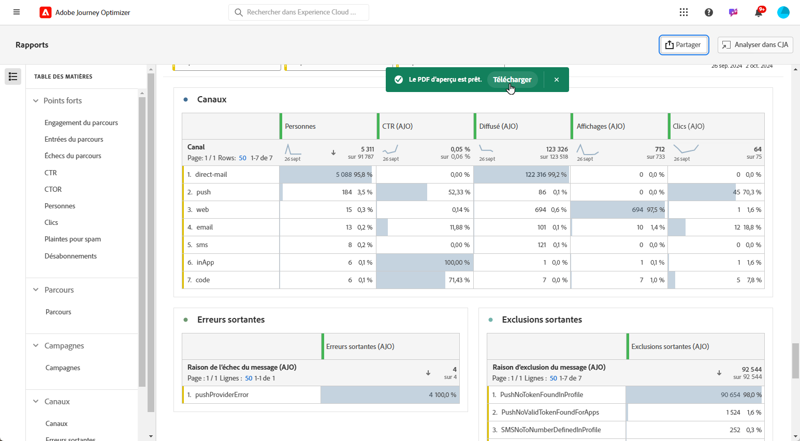

# Gérer vos rapports {#channel-cja-manage}

## Analyse en Customer Journey Analytics {#analyze}

Améliorez votre expérience d’analyse des données grâce à vos **[!DNL Customer Journey Analytics]** en exploitant la licence **[!UICONTROL Analyse dans CJA]** Cette fonctionnalité est disponible dans tous les rapports.

Cette puissante option vous redirige facilement vers votre **[!DNL Customer Journey Analytics]** , ce qui vous permet de personnaliser considérablement vos rapports. Vous pouvez enrichir vos widgets avec des mesures de Customer Journey Analytics spécialisées, ce qui vous permet d’obtenir de nouvelles informations.

[En savoir plus sur l’interface du Customer Journey Analytics.](https://experienceleague.adobe.com/en/docs/analytics-platform/using/cja-overview/cja-getting-started)

## Définition de la période du rapport {#report-period}

Lors de l’accès à un rapport, vous pouvez appliquer un filtre de période, situé dans le coin supérieur droit du rapport.

Par défaut, la période de filtrage d&#39;une campagne ou d&#39;un parcours est définie sur ses dates de début et de fin. En l’absence de date de fin, le filtre est défini par défaut sur la date actuelle.

Pour modifier le filtre, vous pouvez sélectionner une date et une durée de début personnalisées ou choisir parmi des options prédéfinies telles que la semaine dernière ou il y a deux mois.

Le rapport est automatiquement mis à jour une fois le filtre appliqué ou modifié.

## Exporter vos rapports {#export-reports}

Vous pouvez facilement exporter vos différents rapports au format PDF ou CSV, ce qui vous permet de les partager ou de les imprimer. Les étapes d’export des rapports sont présentées dans les onglets ci-dessous.

>[!BEGINTABS]

>[!TAB Exporter votre rapport au format CSV]

1. Dans votre rapport, cliquez sur **[!UICONTROL Exporter]** et sélectionnez **[!UICONTROL Fichier CSV]** pour générer un fichier CSV au niveau du rapport global.

   

1. Votre fichier est automatiquement téléchargé et peut se trouver dans vos fichiers locaux.

   Si vous avez généré le fichier au niveau du rapport, il contient des informations détaillées pour chaque widget, notamment son titre et ses données.

>[!TAB Exporter votre rapport au format PDF]

1. Dans votre rapport, cliquez sur **[!UICONTROL Exporter]** et sélectionnez **[!UICONTROL Fichier PDF]**.

   

1. Une fois le téléchargement demandé, cliquez sur **[!UICONTROL Télécharger]**.

   

1. Votre fichier s’ouvre automatiquement dans votre navigateur.

Votre rapport peut désormais être consulté, téléchargé ou partagé dans un fichier pdf.

>[!ENDTABS]
