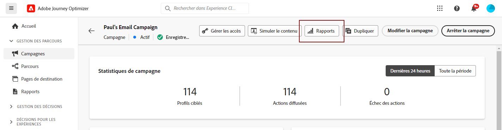

# Prise en main du rapport complet {#channel-report-gs-cja}

>[!CONTEXTUALHELP]
>id="cja_connections_enable_cja"
>title="Activer Customer Journey Analytics"
>abstract="Pour analyser ce rapport dans Customer Journey Analytics, contactez votre administrateur pour vous assurer que votre organisation a acheté Customer Journey Analytics et que l’intégration est correctement configurée."
>additional-url="https://experienceleague.adobe.com/fr/docs/journey-optimizer/using/channels/email/design-email/add-content/content-components#add-content-components" text="Customer Journey Analytics"

>[!IMPORTANT]
>
>Le fuseau UTC est actuellement la norme pour les rapports dans Adobe Journey Optimizer. La possibilité de personnaliser le fuseau horaire des rapports sera disponible dans une prochaine version.

La création de rapports Journey Optimizer est fournie avec une interopérabilité améliorée avec les fonctionnalités de Customer Journey Analytics, ce qui permet de normaliser la création de rapports sur les deux plateformes et d’améliorer la cohérence et la fiabilité des données. L’intégration transparente entre Journey Optimizer et Customer Journey Analytics fournit une meilleure visibilité des mesures de performance, ce qui aide les utilisateurs et les utilisatrices à prendre des décisions plus éclairées.

* Si vous souhaitez cibler un parcours ou des diffusions dans le contexte d’un parcours, dans le menu **[!UICONTROL Parcours]**, accédez à votre parcours et cliquez sur le bouton **[!UICONTROL Afficher le rapport]**.

  Dans la liste des parcours existants, vous pouvez également sélectionner **[!UICONTROL Rapport]** dans le menu avancé du parcours que vous avez sélectionné. [En savoir plus sur le rapport de parcours](journey-global-report-cja.md)

  

* Si vous souhaitez cibler une campagne, dans le menu **[!UICONTROL Campagnes]**, accédez à votre campagne, cliquez sur le bouton **[!UICONTROL Rapports]**, puis sur **[!UICONTROL Afficher le rapport complet]**.

  Dans la liste des campagnes existantes, vous pouvez également sélectionner **[!UICONTROL Rapport]** dans le menu avancé de la campagne que vous avez sélectionnée. [En savoir plus sur le rapport de campagne](campaign-global-report-cja.md)

  

* Si vous souhaitez cibler des mesures pour toutes les campagnes et tous les parcours de votre environnement, accédez à la **Vue d’ensemble** du rapport en accédant au menu **[!UICONTROL Rapports]** dans la section **[!UICONTROL Gestion des parcours]**. [En savoir plus sur le rapport de vue d’ensemble](channel-report-cja.md)

  

## Prérequis {#prerequisites}

* Si vous ne disposez **pas** de Customer Journey Analytics, ou si vous en disposez mais que vous n’avez **pas** accès à un profil de produit de Customer Journey Analytics, les autorisations sont gérées dans Journey Optimizer. Dans ce cas, vous aurez besoin de ce qui suit :

   * Autorisation d’**[!UICONTROL affichage des rapports des canaux]** ou rôles associés. [En savoir plus](../administration/permissions.md)

* Si vous êtes **propriétaire** de Customer Journey Analytics et que vous avez accès à un profil de produit Customer Journey Analytics, vous aurez besoin de ce qui suit :

   * Autorisations de **[!UICONTROL création d’audience]** et d’**[!UICONTROL affichage d’audience]** pour Customer Journey Analytics. [En savoir plus](https://experienceleague.adobe.com/fr/docs/analytics-platform/using/technotes/access-control)

   * Autorisation de **[!UICONTROL gestion des profils]** pour Adobe Journey Optimizer. [En savoir plus](../administration/permissions.md)

* Vos vues de données Customer Journey Analytics doivent être configurées avec le paramètre suivant : **Définir comme vue de données par défaut dans Adobe Journey Optimizer**. [En savoir plus sur les vues de données](https://experienceleague.adobe.com/fr/docs/analytics-platform/using/cja-dataviews/create-dataview)

## Vidéo pratique{#video}

La vidéo ci-dessous montre comment utiliser le reporting Journey Optimizer amélioré avec Customer Journey Analytics.

>[!VIDEO](https://video.tv.adobe.com/v/3443153?captions=fre_fr)