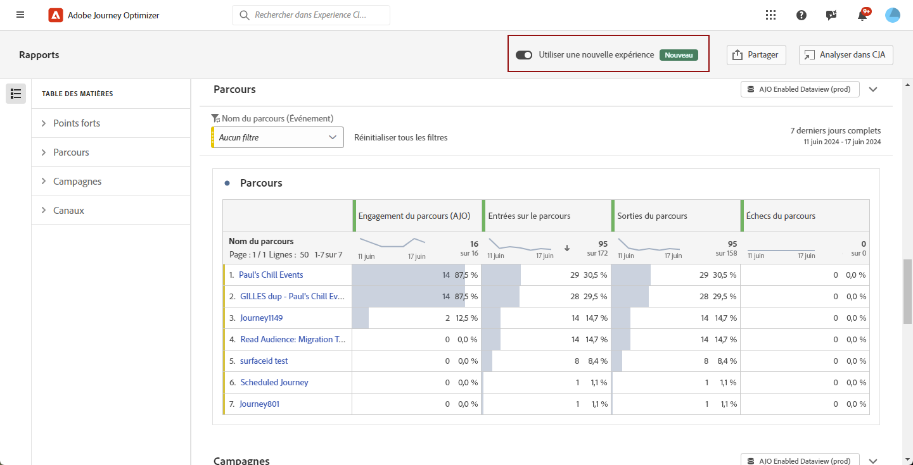

# Prise en main de la nouvelle interface de création de rapports {#channel-report-gs-cja}

>[!NOTE]
>
> Pour rétablir les rapports traditionnels de Journey Optimizer, il suffit de basculer sur le **[!UICONTROL Utiliser une nouvelle expérience]** .

La création de rapports Journey Optimizer s’accompagne d’une interopérabilité améliorée avec les fonctionnalités de Customer Journey Analytics, de la normalisation des rapports sur les deux plateformes et de l’amélioration de la cohérence et de la fiabilité des données. Cette intégration transparente entre Journey Optimizer et Customer Journey Analytics offre une vue plus claire des mesures de performances, ce qui permet aux utilisateurs et utilisatrices de prendre des décisions plus éclairées.

* Si vous souhaitez cibler un ou plusieurs parcours dans le contexte d&#39;un parcours, à partir de la **[!UICONTROL Parcours]** , accédez à votre parcours et cliquez sur le bouton **[!UICONTROL Afficher le rapport]** bouton .

  Dans la liste des parcours existants, vous pouvez également sélectionner **[!UICONTROL Rapport]** dans le menu avancé du parcours sélectionné. [En savoir plus sur le rapport Parcours](journey-global-report-cja.md)

  

* Si vous souhaitez cibler une campagne, dans le menu **[!UICONTROL Campagnes]**, accédez à votre campagne et cliquez sur le bouton **[!UICONTROL Rapports]**.

  Dans la liste des campagnes existantes, vous pouvez également sélectionner **[!UICONTROL Rapport]** dans le menu avancé de la campagne sélectionnée. [En savoir plus sur le rapport Campaign](campaign-global-report-cja.md)

  

* Si vous souhaitez cibler des mesures pour toutes les campagnes et tous les parcours de votre environnement, accédez à la **Présentation** en accédant à la **[!UICONTROL Rapports]** dans le **[!UICONTROL Gestion des parcours]** . [En savoir plus sur le rapport Aperçu](channel-report-cja.md)

  

## Conditions préalables {#prerequisites}

* Si vous **not** votre propre Customer Journey Analytics ou si vous le possédez, mais que **not** ont accès à n’importe quel profil de produit de Customer Journey Analytics, les autorisations sont gérées dans Journey Optimizer. Dans ce cas, vous n’aurez besoin que de la variable **[!UICONTROL Affichage des rapports sur les canaux]** autorisations ou rôles associés. [En savoir plus sur les autorisations Journey Optimizer](../administration/permissions.md)
* Si vous possédez un Customer Journey Analytics et avez accès à un profil de produit de Customer Journey Analytics, les autorisations de Customer Journey Analytics standard s’appliquent. L’administrateur du Customer Journey Analytics est chargé de la gestion de l’accès approprié des utilisateurs. [En savoir plus sur les autorisations de Customer Journey Analytics](https://experienceleague.adobe.com/en/docs/analytics-platform/using/technotes/access-control)
* Vos vues de données de Customer Journey Analytics doivent être configurées avec le paramètre suivant : **Défini comme vue de données par défaut dans Adobe Journey Optimizer**. [En savoir plus sur les vues de données](https://experienceleague.adobe.com/fr/docs/analytics-platform/using/cja-dataviews/create-dataview)
* Pour accéder au tableau de bord du Customer Journey Analytics dans Journey Optimizer, il vous suffit d’activer la fonction **[!UICONTROL Utiliser une nouvelle expérience]** bascule dans votre rapport.

  

## Vidéo pratique{#video}

La vidéo ci-dessous montre comment attribuer l’autorisation **Gérer la configuration de l’application** pour accéder au menu Surfaces de l’application.

>[!VIDEO](https://video.tv.adobe.com/v/3430413)