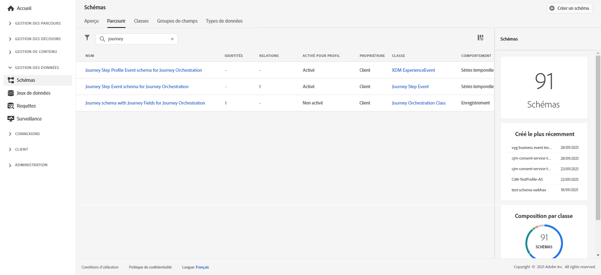
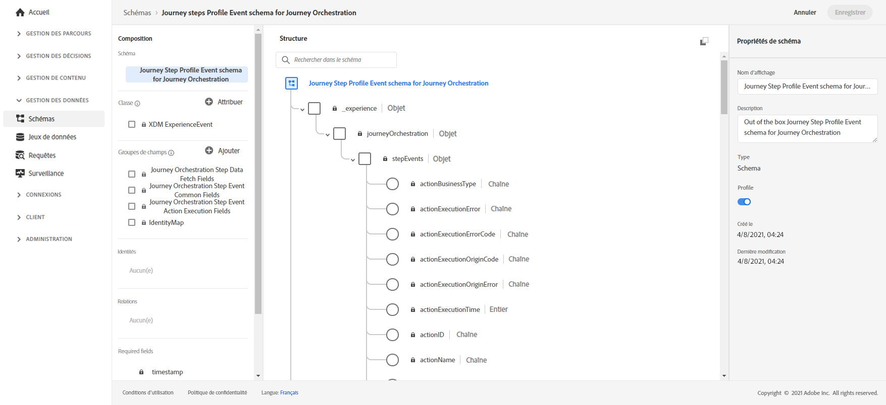
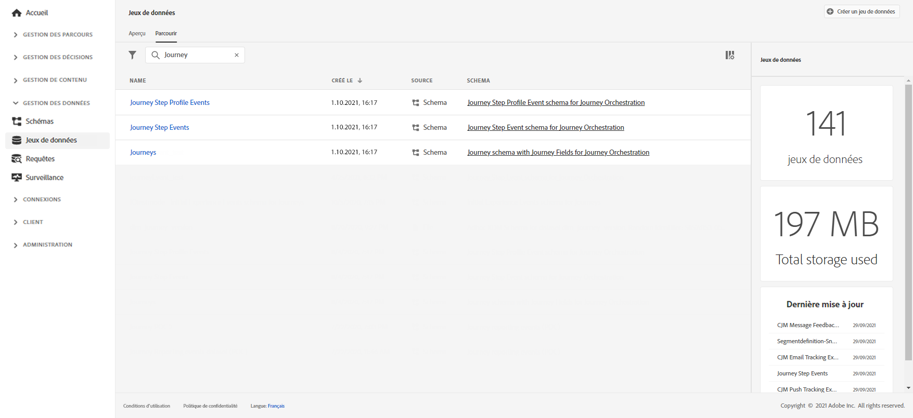

# Créer des rapports de parcours{#design-jo-reports}

Outre les [rapports en temps réel](live-report.md) et les [capacités de rapports global](global-report.md) intégrées, [!DNL Journey Optimizer] peut envoyer automatiquement des données de performances de parcours à Adobe Experience Platform afin qu&#39;elles puissent être combinées avec d&#39;autres données à des fins d&#39;analyse.

>[!NOTE]
>
>Cette fonction n’est pas activée par défaut sur toutes les instances nouvellement déployées. L&#39;activation est sur demande.

Par exemple, vous avez configuré un parcours qui envoie plusieurs courriers électroniques. Cette fonctionnalité vous permet de combiner des données [!DNL Journey Optimizer] avec des données de événement en aval, telles que le nombre de conversions survenues, le nombre d&#39;interactions survenues sur le site Web ou le nombre de transactions survenues dans le magasin. Les informations du parcours peuvent être combinées avec les données de Adobe Experience Platform, que ce soit à partir d’autres propriétés numériques ou de propriétés hors ligne, afin d’offrir une vue de performances plus complète.

[!DNL Journey Optimizer] crée automatiquement les schémas et flux nécessaires dans les jeux de données à Adobe Experience Platform pour chaque étape qu&#39;un individu effectue dans un parcours. Un événement d’étape correspond à une personne se déplaçant d’un noeud à un autre dans un parcours. Par exemple, dans un parcours qui comporte un événement, une condition et une action, trois événements d’étape sont envoyés à Adobe Experience Platform.

La liste des champs XDM transmis est complète. Certains contiennent des codes générés par le système et d&#39;autres ont des noms conviviaux lisibles. Par exemple, l’étiquette de l’activité d’parcours ou l’état de l’étape : nombre de fois où une action a expiré ou s’est terminée par erreur.

>[!CAUTION]
>
>Les jeux de données ne peuvent pas être activés pour le service de profil en temps réel. Assurez-vous que la bascule **[!UICONTROL Profil]** est désactivée.

Les parcours envoient les données au fur et à mesure, en flux continu. Vous pouvez requête ces données à l’aide de Requête Service. Vous pouvez vous connecter à un Customer Journey Analytics ou à d&#39;autres outils BI pour vue des données liées à ces étapes.

Les schémas suivants sont créés :

* Schéma de Événement de Profil d&#39;étape de parcours pour [!DNL Journey Orchestration] - Événements d&#39;expérience pour les étapes effectuées dans un Parcours avec une carte d&#39;identité à utiliser pour le mappage à un participant de Parcours individuel.
* Schéma de Événement d’étape de parcours pour [!DNL Journey Orchestration] - événement d’étape de Parcours lié à une métadonnées de Parcours.
* Schéma de parcours avec champs de Parcours pour [!DNL Journey Orchestration] - Métadonnées de Parcours pour décrire les Parcours.

Les jeux de données suivants sont transmis :

* Schéma de Événement de Profil d&#39;étape de parcours pour [!DNL Journey Orchestration]
* Événements d’étape parcours
* Parcours

Les listes des champs XDM transmis à Adobe Experience Platform sont détaillées ici :

* [Champs communs aux événements de parcoursSteps](../reports/sharing-common-fields.md)
* [Champs d&#39;exécution d&#39;action de événements de parcoursStep](../reports/sharing-execution-fields.md)
* [Champs de récupération des données des événements de voyageStep](../reports/sharing-fetch-fields.md)
* [Champs d&#39;identité du événement cheminementStep](../reports/sharing-identity-fields.md)
* [Champs de parcours](../reports/sharing-journey-fields.md)

Pour plus d’informations sur les événements d’étape rapports à Adobe Experience Platform, visionnez cette [vidéo didacticielle](https://experienceleague.adobe.com/docs/journey-orchestration-learn/tutorials/reporting-step-events-to-adobe-experience-platform.html).
