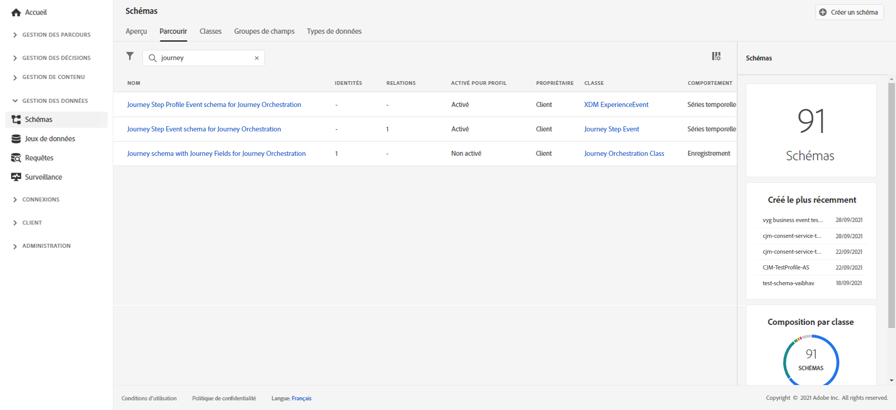
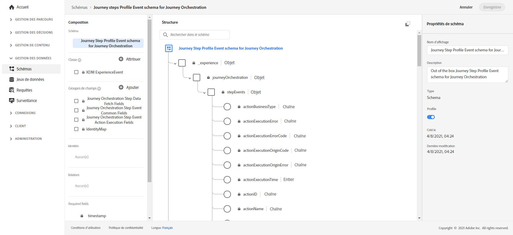
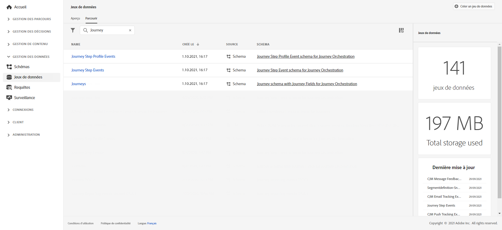

# Création de rapports de parcours {#design-jo-reports}

Outre les [rapports en temps réel](live-report.md) et les [fonctionnalités de reporting global](global-report.md) natives, [!DNL Journey Optimizer] peut automatiquement envoyer des données de performances de parcours à Adobe Experience Platform afin qu&#39;elles soient combinées à d&#39;autres données à des fins d&#39;analyse.

>[!NOTE]
>
>Cette fonction est activée par défaut sur toutes les instances pour les événements d&#39;étapes de parcours. Vous ne pouvez pas modifier ni mettre à jour les schémas et les jeux de données créés lors de l’approvisionnement des événements d’étape. Par défaut, ces schémas et jeux de données sont en lecture seule.

Par exemple, vous avez configuré un parcours qui envoie plusieurs e-mails. Cette fonctionnalité permet de combiner les données de [!DNL Journey Optimizer] avec des données d’événements situés en aval, comme le nombre de conversions réalisées, le nombre d’engagements survenus sur le site web ou le nombre de transactions effectuées dans le magasin. Les informations de parcours sont combinées avec les données d’Adobe Experience Platform, à partir d’autres propriétés numériques ou de propriétés hors ligne, pour offrir une vue plus complète des performances.

[!DNL Journey Optimizer] crée automatiquement les schémas et les flux nécessaires dans les jeux de données d’Adobe Experience Platform pour chaque étape d’un parcours individuel. Un événement d’étape correspond à un individu qui se déplace d’un nœud à un autre d’un parcours. Par exemple, dans le cadre d’un parcours comportant un événement, une condition et une action, trois événements d’étape sont envoyés à Adobe Experience Platform.

La liste des champs XDM transmis est complète. Certains contiennent des codes générés par le système et d’autres portent des noms conçus pour être lisibles. Il peut s’agir, par exemple, du libellé de l’activité de parcours ou du statut de l’étape : nombre de fois où une action a expiré ou s’est terminée par une erreur.

>[!CAUTION]
>
>Les jeux de données ne peuvent pas être activés pour le service de profil en temps réel. Assurez-vous que le bouton **[!UICONTROL Profil]** est désactivé.

[!DNL Journey Optimizer] envoie les données au fur et à mesure, en flux continu. Vous pouvez appliquer des requêtes à ces données à l’aide du service Requêtes. Vous pouvez vous connecter à Customer Journey Analytics ou à d’autres outils de BI pour visualiser les données concernant ces étapes.

Les schémas suivants sont créés :

* Schéma d’événement d’étape du parcours pour [!DNL Journey Orchestration] - Événement d’étape du parcours lié à des métadonnées de parcours.
* Schéma du parcours avec champs de parcours pour [!DNL Journey Orchestration] - Métadonnées servant à décrire les parcours.

Les jeux de données suivants sont transmis :

* Événements d’étape du parcours
* Parcours

Les listes des champs XDM transmis à Adobe Experience Platform sont détaillées ici :

* [Liste des champs d’événement d’étape](../reports/sharing-field-list.md)
* [Champs d’événement d’étape hérités](../reports/sharing-legacy-fields.md)

## Intégration à Customer Journey Analytics {#integration-cja}

Les événements d’étape [!DNL Journey Optimizer] peuvent être liés à d’autres jeux de données dans [Adobe Customer Journey Analytics](https://experienceleague.adobe.com/docs/analytics-platform/using/cja-overview/cja-overview.html?lang=fr){target="_blank"}.

Le workflow général est le suivant :

* [!DNL Customer Journey Analytics] ingère le jeu de données « Événement d&#39;étape du parcours ».
* Le champ **profileID** dans le « schéma d&#39;événement d&#39;étape du parcours pour Journey Orchestration » associé est défini comme un champ d&#39;identité. Dans [!DNL Customer Journey Analytics], vous pouvez ensuite lier ce jeu de données à tout autre jeu de données ayant la même valeur que l&#39;identifiant basé sur la personne.
* Pour utiliser ce jeu de données dans [!DNL Customer Journey Analytics], pour l&#39;analyse des parcours cross-canal, reportez-vous à la section [Documentation Customer Journey Analytics](https://experienceleague.adobe.com/docs/analytics-platform/using/cja-usecases/cross-channel.html?lang=fr){target="_blank"}.

➡️ [Utiliser Customer Journey Analytics](cja-ajo.md){target="_blank"}

