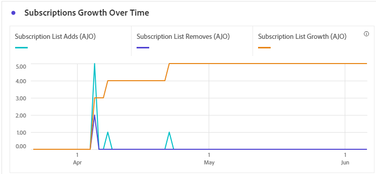

# Rapport dʼabonnement {#subscription-report-global-cja}

Le **Rapport d’abonnement** offre des informations essentielles sur les abonnements et désabonnements des profils associés à des listes spécifiques, vous aidant à comprendre l’efficacité des différentes campagnes et initiatives d’abonnement pour stimuler l’engagement et les conversions.

Pour accéder à vos rapports, cliquez sur l’icône **[!UICONTROL Rapport]** de votre liste d’abonnements sélectionnée dans le menu avancé.

Pour en savoir plus sur l’espace de travail Customer Journey Analytics et sur la manière de filtrer et d’analyser les données, consultez [cette page](https://experienceleague.adobe.com/fr/docs/analytics-platform/using/cja-workspace/home).

## Ajouts à la liste dʼabonnements

L’indicateur clé de performance **[!UICONTROL Ajouts à la liste d’abonnements]** fournit une vue d’ensemble du nombre total d’abonnements acquis au cours de la période spécifiée. Cette mesure met en évidence la croissance et l’acquisition de nouvelles personnes abonnées, offrant des informations précieuses sur l’efficacité de vos campagnes ou initiatives d’abonnement.

## Suppressions de la liste dʼabonnements

L’indicateur clé de performance **[!UICONTROL Suppressions de la liste d’abonnements]** fournit une ventilation du nombre total de désabonnements survenus au cours de la période spécifiée. Cette mesure offre des informations précieuses sur le désengagement des personnes abonnées.

## Croissance des abonnements dans le temps

Le graphe **[!UICONTROL Croissance des abonnements dans le temps]** illustre visuellement la progression des abonnements au cours de la période spécifiée, ce qui vous permet de comprendre clairement l’évolution de votre base de personnes abonnées.

* **[!UICONTROL Ajouts à la liste d’abonnements]** : nombre total dʼabonnements sur la période concernée.

* **[!UICONTROL Suppressions de la liste d’abonnements]** : nombre total de désabonnements sur la période concernée.

* **[!UICONTROL Croissance de la liste d’abonnements]** : taux auquel la liste des personnes abonnées augmente sur une période spécifique.

## Listes dʼabonnements

Le tableau **[!UICONTROL Listes d’abonnements]** fournit des informations essentielles sur les abonnements et désabonnements de vos profils associés à des listes d’abonnements spécifiques. Ces informations vous aident à comprendre l’efficacité de différentes listes d’abonnements pour stimuler l’engagement et générer des conversions.

* **[!UICONTROL Ajouts à la liste dʼabonnements]** : nombre total dʼabonnements sur la période concernée.

* **[!UICONTROL Suppressions de la liste dʼabonnements]** : nombre total de désabonnements sur la période concernée.

## Parcours

Le tableau **[!UICONTROL Parcours]** offre une vue d’ensemble exhaustive, présentant des détails précis sur les abonnements des utilisateurs et des utilisatrices dans le cadre de leur parcours.

* **[!UICONTROL Ajouts à la liste dʼabonnements]** : nombre total dʼabonnements sur la période concernée.

* **[!UICONTROL Suppressions de la liste dʼabonnements]** : nombre total de désabonnements sur la période concernée.

## Campagnes

Le tableau **[!UICONTROL Campagnes]** offre des informations précieuses sur les données relatives aux abonnements et désabonnements de vos profils déclenchés par des campagnes spécifiques. Cette vue exhaustive vous permet d’évaluer l’efficacité de vos campagnes et de suivre efficacement l’engagement avec le contenu de votre page de destination.

* **[!UICONTROL Ajouts à la liste dʼabonnements]** : nombre total dʼabonnements sur la période concernée.

* **[!UICONTROL Suppressions de la liste dʼabonnements]** : nombre total de désabonnements sur la période concernée.

## Canal

Le tableau **[!UICONTROL Canal]** affiche le nombre d’abonnements et de désabonnements des profils classés par canal.

* **[!UICONTROL Ajouts à la liste dʼabonnements]** : nombre total dʼabonnements sur la période concernée.

* **[!UICONTROL Suppressions de la liste dʼabonnements]** : nombre total de désabonnements sur la période concernée.
