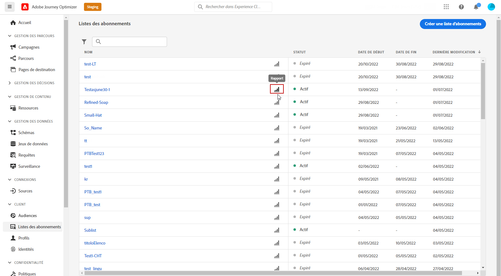
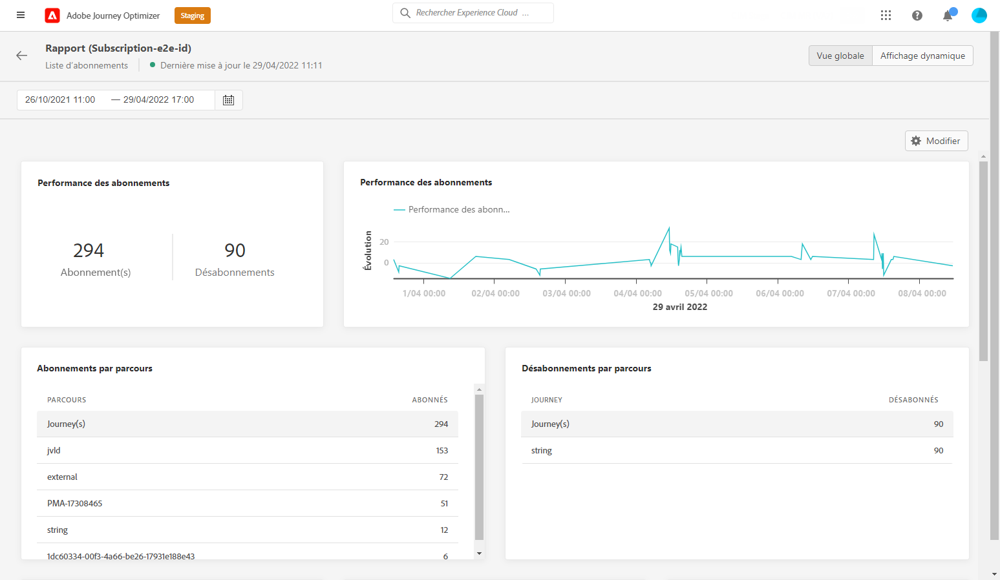
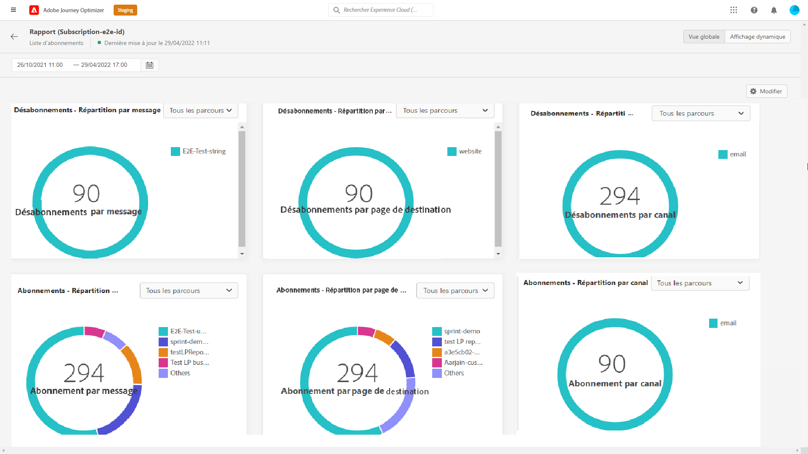

# Rapport d’abonnement global {#subscription-report-global}

>[!CONTEXTUALHELP]
>id="ajo_subscription_global_report"
>title="Rapport d’abonnement global"
>abstract="Le rapport global d’abonnement permet de mesurer et de visualiser l’activité de vos personnes abonnées au cours d’une période choisie. Celui-ci est composé de plusieurs widgets présentant vos abonnements et désabonnements. Vous pouvez modifier chaque tableau de bord de reporting en redimensionnant ou en supprimant des widgets."

>[!AVAILABILITY]
>
>L’expérience actuelle de création de rapports sera abandonnée à compter de janvier 2025. À partir de cette date, la nouvelle expérience de création de rapports deviendra la norme. Nous vous recommandons de vous familiariser avec les nouvelles fonctionnalités pour garantir une transition fluide. [Commencez avec la nouvelle interface de création de rapports de Journey Optimizer.](report-gs-cja.md)

Les rapports globaux, accessibles à partir de l’onglet À toute heure, affichent les événements qui se sont produits il y a au moins deux heures et couvrent les événements sur une période sélectionnée. En comparaison, les rapports dynamiques portent sur les événements qui se sont produits au cours des dernières 24 heures, avec un intervalle de temps minimal de deux minutes à compter de l’occurrence de l’événement.

Pour accéder à vos rapports, cliquez sur l’icône **[!UICONTROL Rapport]** de votre liste d’abonnements sélectionnée.

Le **[!UICONTROL Rapport d&#39;abonnement global]** est divisé en différents widgets détaillant vos abonnements et désabonnements. Chaque widget peut être redimensionné et supprimé si nécessaire. Pour plus d&#39;informations à ce propos consultez cette [section](global-report.md).

Les KPI des **[!UICONTROL Performances de lʼabonnement]** et les tableaux **[!UICONTROL Abonnements par parcours]**/**[!UICONTROL Désabonnements par parcours]** affichent les principales informations relatives à l’engagement des visiteurs sur votre page de destination. Les tableaux et les KPI contiennent les données disponibles relatives à votre page de destination, par exemple :

* **[!UICONTROL Abonnements]** : nombre total dʼabonnements sur la période correspondante.

* **[!UICONTROL Désabonnements]** : nombre total de désabonnements sur la période correspondante.

Le graphique **[!UICONTROL Performances de lʼabonnement]** montre lʼévolution des abonnements sur la période correspondante.

Les graphiques **Abonnements - Répartition** et **Désabonnements - Répartition** représentent le nombre total de personnes qui se sont abonnées ou désabonnées au cours de la période sélectionnée en fonction des messages, des pages de destination et des canaux.
