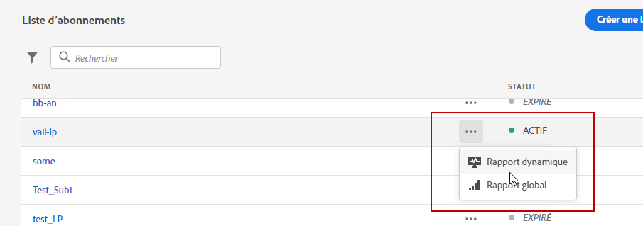
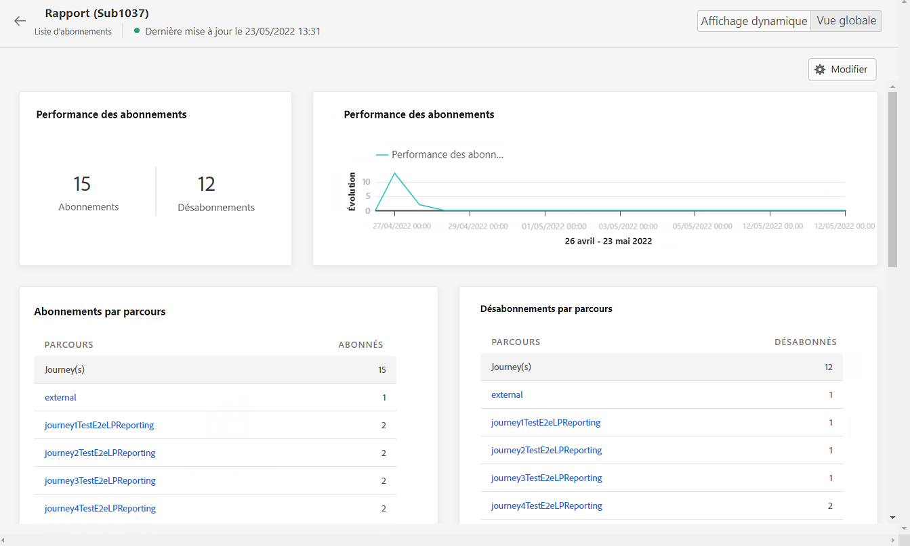
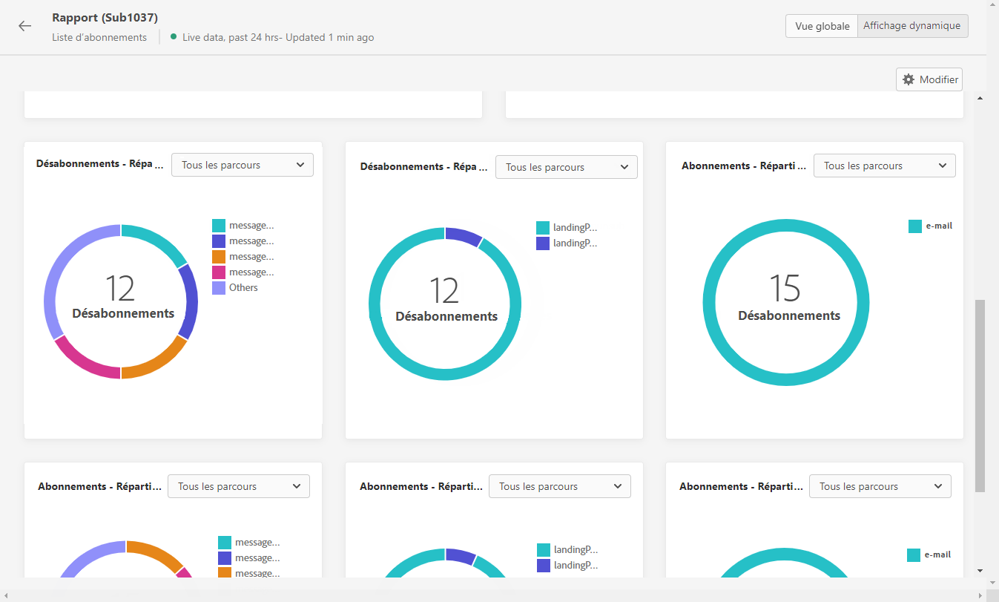

# Rapport dʼabonnement dynamique {#subscription-report-live}

L&#39;abonnement **[!UICONTROL Rapport en direct]** affiche uniquement des détails sur l’activité de vos abonnés au cours des dernières 24 heures. Pour mesurer vos abonnements sur une période sélectionnée, reportez-vous à la section [Rapport global d&#39;inscription](subscription-report-global.md).

Pour accéder à vos rapports, sélectionnez **[!UICONTROL Rapport en direct]** dans le menu avancé de la liste d’abonnements sélectionnée.

L&#39;abonnement **[!UICONTROL Rapport en direct]** est divisé en différents widgets détaillant vos abonnements et désabonnements. Chaque widget peut être redimensionné et supprimé en cas de besoin. Pour plus d&#39;informations à ce propos consultez cette [section](live-report.md).

Les KPI des **[!UICONTROL Performances de lʼabonnement]** et les tableaux **[!UICONTROL Abonnements par parcours]**/**[!UICONTROL Désabonnements par parcours]** affichent les principales informations relatives à l’engagement des visiteurs sur votre page de destination. Les tableaux et les KPI contiennent les données disponibles relatives à votre page de destination, par exemple :

* **[!UICONTROL Abonnements]** : nombre total dʼabonnements au cours des dernières 24 heures.

* **[!UICONTROL Désabonnements]** : nombre total de désabonnements au cours des dernières 24 heures.

Le graphique **[!UICONTROL Performances de lʼabonnement]** montre l’évolution des abonnements au cours des dernières 24 heures.

Les graphiques **Abonnements - Ventilation** et **Désabonnements - Ventilation** représentent le nombre total de personnes qui se sont abonnées ou désabonnées au cours des dernières 24 heures en fonction des messages, des pages de destination et des canaux.

