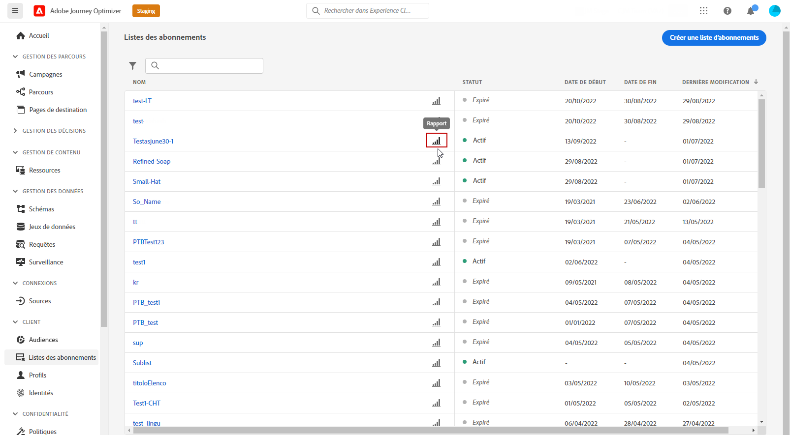
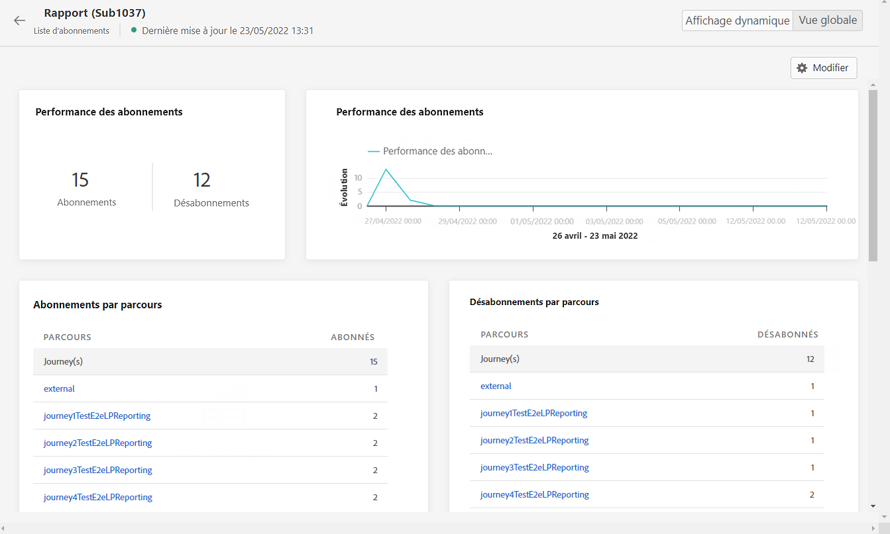
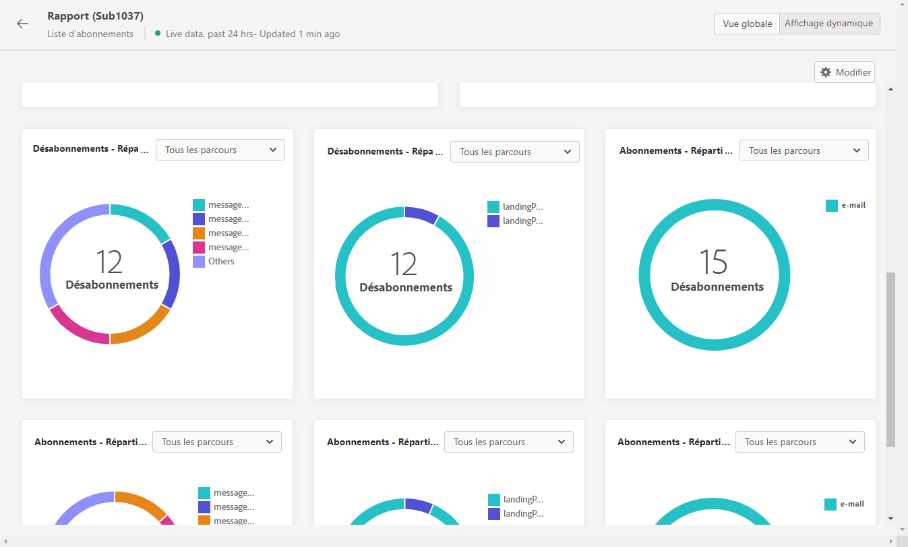

# Rapport d&#39;abonnement dynamique {#subscription-report-live}

>[!BEGINSHADEBOX]

**Sur cette page :** découvrez comment utiliser le rapport d’abonnement dynamique pour surveiller les abonnements et désabonnements de vos abonnés en temps réel au cours des dernières 24 heures.

>[!ENDSHADEBOX]

>[!CONTEXTUALHELP]
>id="ajo_subscription_live_report"
>title="Rapport d’abonnement dynamique"
>abstract="Le rapport d’abonnement dynamique vous permet de mesurer et de visualiser en temps réel l’activité de vos abonné(e)s (limité aux dernières 24 heures). Celui-ci est composé de plusieurs widgets présentant vos abonnements et désabonnements. Vous pouvez modifier chaque tableau de bord de reporting en redimensionnant ou en supprimant des widgets."

Les rapports dynamiques, accessibles à partir de l’onglet Dernières 24 heures, affichent les événements qui se sont produits au cours des dernières 24 heures, avec un intervalle de temps minimal de deux minutes à compter de l’occurrence de l’événement. En comparaison, les rapports Customer Journey Analytics portent sur les événements qui se sont produits il y a au moins deux heures et couvrent les événements sur une période sélectionnée.

Pour accéder à vos rapports, cliquez sur l’icône **[!UICONTROL Rapport]** de votre liste d’abonnements sélectionnée.

Le **[!UICONTROL Rapport d&#39;abonnement dynamique]** est divisé en différents widgets détaillant vos abonnements et désabonnements. Chaque widget peut être redimensionné et supprimé si nécessaire. Pour plus d&#39;informations à ce propos consultez cette [section](live-report.md).

Les KPI des **[!UICONTROL Performances de lʼabonnement]** et les tableaux **[!UICONTROL Abonnements par parcours]**/**[!UICONTROL Désabonnements par parcours]** affichent les principales informations relatives à l’engagement des visiteurs sur votre page de destination. Les tableaux et les KPI contiennent les données disponibles relatives à votre page de destination, par exemple :

* **[!UICONTROL Abonnements]** : nombre total dʼabonnements au cours des dernières 24 heures.

* **[!UICONTROL Désabonnements]** : nombre total de désabonnements au cours des dernières 24 heures.

Le graphique **[!UICONTROL Performances de lʼabonnement]** montre l’évolution des abonnements au cours des dernières 24 heures.

Les graphiques **Abonnements - Répartition** et **Désabonnements - Répartition** représentent le nombre total de personnes qui se sont abonnées ou désabonnées au cours des dernières 24 heures en fonction des messages, des pages de destination et des canaux.
