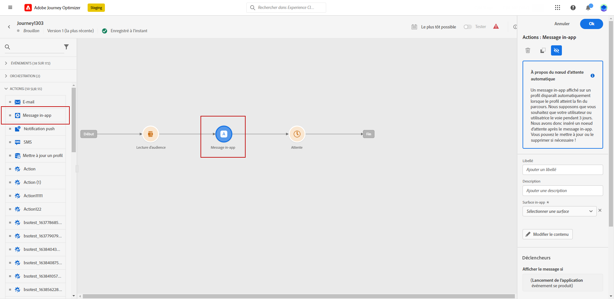

# Notes de mise à jour anticipées {#e-release-notes}

[!DNL Adobe Journey Optimizer] offre en permanence de nouvelles fonctionnalités, des améliorations aux fonctionnalités existantes et des correctifs. Toutes les modifications sont consolidées la dernière semaine de chaque mois dans les [notes de mise à jour](release-notes.md).

Les notes de mise à jour ci-dessous peuvent être modifiées sans avertissement préalable jusqu’à la date de disponibilité de la version. Les liens, les écrans et la documentation mise à jour sont publiés dans les [notes de mise à jour](release-notes.md), à la date de publication.

## Notes de mise à jour initiales d’août 2023 {#aug-rn-2023}

**Date de publication**: 23-24 août 2023

### Nouvelles fonctionnalités{#aug-2023-features}

Cette version apporte les nouvelles fonctionnalités répertoriées ci-dessous.

<table>
<thead>
<tr>
<th><strong>Envoyer des messages In-App dans vos parcours</strong> </th>
</tr>
</thead>
<tbody>
<tr>
<td>

Vous pouvez désormais envoyer des messages In-App personnalisés aux utilisateurs de votre application dans un parcours. Utilisez Journey Optimizer pour concevoir des notifications et personnaliser la mise en page, l’affichage, le texte et les boutons des messages afin de créer une expérience optimale.

Pour plus d’informations, consultez la <a href="../in-app/get-started-in-app.md">documentation détaillée</a>.

</tr>
</tbody>
</table>

<table>
<thead>
<tr>
<th><strong>Valider vos emails avec des listes de contrôle</strong> </th>
</tr>
</thead>
<tbody>
<tr>
<td>

Vous pouvez désormais créer et gérer des listes de contrôle dans Journey Optimizer. Une liste de contrôle est composée d'adresses internes qui peuvent être ajoutées à votre audience réelle et recevoir le même message que les profils ciblés au moment de l'exécution de la diffusion. Utilisez cette fonctionnalité pour surveiller les communications envoyées et vous assurer que tous les formats d’affichage, URL, images et liens sont corrects.

<!--p>For more information, refer to the <a href="../audience/get-started-audience-orchestration.md">detailed documentation</a>.</p-->
</td>
</tr>
</tbody>
</table>

<!--table>
<thead>
<tr>
<th><strong>Generate text and images with the Content assistant</strong> </th>
</tr>
</thead>
<tbody>
<tr>
<td>

Once you have created and personalized your message, take your content to the next level with the Content assistant. You can now use the Content assistant to optimize your message's impact by experimenting with different main titles, and images. Each variant is managed as a unique Treatment, to measure and compare which title effectively generates more clicks.

This capability is currently available as a private beta.

For more information, refer to the <a href="../start/search-filter-categorize.md#tags">detailed documentation</a>.

</td>
</tr>
</tbody>
</table-->

### Améliorations {#aug-2023-improvements}

Cette version est fournie avec les améliorations répertoriées ci-dessous.

**API**

Une nouvelle API pour créer et gérer des fragments de contenu est désormais disponible. [En savoir plus](https://developer.adobe.com/journey-optimizer-apis/references/content-templates/#tag/Content-fragment-API){target="_blank"}.

**Canal e-mail**

Une nouvelle option est disponible dans les paramètres de surface des emails pour inclure les adresses email supprimées en raison d’une plainte de spam dans vos audiences de messages transactionnels. Même s’ils ont marqué des messages marketing comme spam, ces profils peuvent alors recevoir des messages transactionnels, tels que la réinitialisation du mot de passe ou les instructions de compte. Par défaut, cette option est désactivée.

**Parcours**

* Vous pouvez désormais utiliser les réponses d’appel API dans des actions personnalisées et orchestrer votre parcours en fonction de ces réponses. Cette fonctionnalité est publiée sous forme de version Private Beta.
* Introduction d’un nouveau type d’alerte système. Vous pouvez désormais recevoir une notification en cas d’échec d’une action personnalisée.
  <!--* When duplicating a journey, you can now define the name of the journey copy.-->

**Courrier**

* Azure peut désormais être sélectionné comme type de serveur dans la configuration de routage de fichiers.
* L’esperluette est désormais disponible en tant que champ de séparateur de colonne dans les paramètres de surface du courrier.