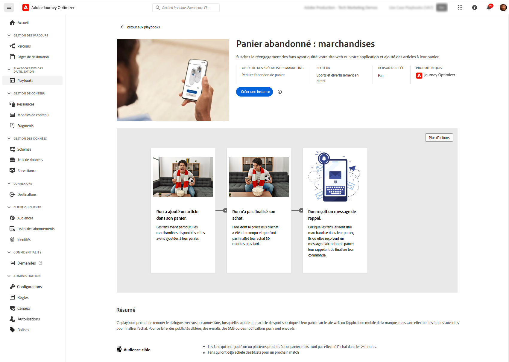

# Notes de mise à jour anticipées {#e-release-notes}

[!DNL Adobe Journey Optimizer] offre en permanence de nouvelles fonctionnalités, des améliorations aux fonctionnalités existantes et des correctifs. Toutes les modifications sont consolidées la dernière semaine de chaque mois dans les [notes de mise à jour](release-notes.md).

Les notes de mise à jour ci-dessous peuvent être modifiées sans avertissement préalable jusqu’à la date de disponibilité de la version. Les liens, les écrans et la documentation mise à jour sont publiés dans les [notes de mise à jour](release-notes.md), à la date de publication.

## Notes de mise à jour initiales de janvier 2024 {#oct-jan-2024}

**Date de publication**: 30-31 janvier 2024

### Nouvelles fonctionnalités{#jan-2024-features}

Cette version apporte les nouvelles fonctionnalités répertoriées ci-dessous.

<table>
<thead>
<tr>
<th><strong>Mises à jour de délivrabilité</strong> </th>
</tr>
</thead>
<tbody>
<tr>
<td>

Journey Optimizer prend désormais en charge la technologie d’authentification DMARC.

À compter du 1er février 2024, Google et Yahoo! Vous devez disposer d’un enregistrement DMARC pour tout domaine que vous utilisez pour leur envoyer des emails. Assurez-vous que l’enregistrement DMARC est configuré pour tous les sous-domaines que vous avez délégués ou que vous déléguez à Adobe dans Journey Optimizer.

Pour plus d’informations, consultez la <a href="../configuration/dmarc-record-update.md">documentation détaillée</a>.

</tr>
</tbody>
</table>

<table>
<thead>
<tr>
<th><strong>Cas d’utilisation des classeurs</strong> </th>
</tr>
</thead>
<tbody>
<tr>
<td>

Tirez parti d’un catalogue de playbooks de cas d’utilisation spécifiques au secteur dans Real-Time CDP et Journey Optimizer pour répondre aux cas d’utilisation courants que vous pouvez exécuter à l’aide de Adobe Experience Platform et de l’Adobe Parcours Optimiser.

Une fois que vous avez choisi le manuel qui correspond le mieux à vos besoins, vous pouvez lui permettre de générer les ressources nécessaires à la prise en charge de votre cas d’utilisation, tels que les parcours, les messages, les schémas ou les segments.

<!--
For more information, refer to the <a href="../start/">detailed documentation</a>.
-->
</tr>
</tbody>
</table>

### Améliorations {#jan-2024-improvements}

Cette version est fournie avec les améliorations répertoriées ci-dessous.

**Reporting**

* **Nouveaux widgets de ventilation basés sur des domaines** - De nouveaux widgets ont été ajoutés pour améliorer vos rapports Campaign et Parcours. La variable **Motifs de rebond par domaine**, **Envoyé et diffusé par domaines**, **Ouvertures et clics par domaine** et **Rebonds et erreurs par domaine** Les widgets fournissent une ventilation détaillée au niveau du domaine pour les mesures clés de diffusion et de suivi des emails.

**Canal SMS**

* **Double opt-in** - Le workflow Double opt-in pour les SMS garantit que les utilisateurs s’engagent explicitement à recevoir des messages lorsque la demande est lancée à partir de leur appareil. Les utilisateurs lancent le processus de consentement en envoyant un SMS entrant. Une fois qu’ils ont confirmé leur consentement, un message de relance est envoyé, demandant une vérification finale. Si un profil utilisateur n’existe pas, il est créé lors de la confirmation.

  Notez que cela s’applique uniquement aux fournisseurs SMS Sinch et Infobip.

**Parcours**

* **Durée des événements de réaction** : durée maximale que vous pouvez définir dans la variable **Événements de réaction** est désormais de 29 jours au lieu de 30.

* **Filtres de date** - Vous pouvez désormais utiliser des dates personnalisées pour filtrer l’inventaire des parcours, en plus des filtres de dates prédéfinis existants. Vous pouvez ainsi affiner la liste en affichant les parcours publiés à une date spécifique, au cours d’un mois donné, sur une année entière ou dans des périodes spécifiées.

* **Lecture d’audience**  - L’activité Lecture d’audience repose désormais sur le jeu de données d’instantané de profil pour les segments par lot, qui n’est généré qu’une fois par jour après l’exécution de la tâche par lots quotidienne planifiée.

**Règles de fréquence**

* **Limite de fréquence hebdomadaire et quotidienne** - Vous pouvez désormais spécifier le nombre maximum de messages envoyés à un profil client au cours d’une semaine ou d’un jour, en plus du mois. Le plafond de fréquence est basé sur la période calendaire sélectionnée et est réinitialisé au début de la période correspondante.

**Gestion des décisions**

* **Limitation de la fréquence sur Edge** - Le compteur de limitation de fréquence est maintenant mis à jour et disponible dans une décision de l’API Edge Decisioning en moins de 3 secondes.