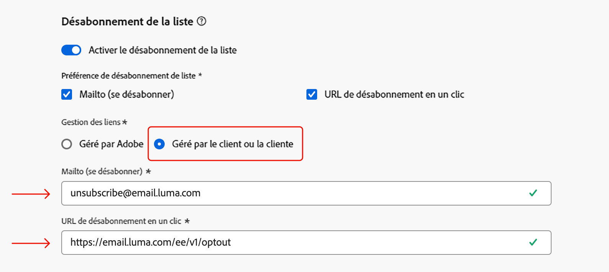

# Notes de mise à jour anticipées {#e-release-notes}

[!DNL Adobe Journey Optimizer] offre en permanence de nouvelles fonctionnalités, des améliorations aux fonctionnalités existantes et des correctifs. Toutes les modifications sont consolidées à la fin de chaque mois dans les [notes de mise à jour](release-notes.md).

**Les notes de mise à jour anticipées ci-dessous peuvent être modifiées sans avertissement préalable jusqu’à la date de disponibilité de la version**. Les liens, les copies d’écran et la documentation mise à jour sont publiés dans les [notes de mise à jour](release-notes.md) à la date de publication.

## Notes de mise à jour anticipées de février 2025 {#25-02-rn}

### Nouvelles fonctionnalités {#25-02-features}

Les nouvelles fonctionnalités de cette version sont présentées ci-dessous.

<table>
<thead>
<tr>
<th><strong>Règles métier</strong> </th>
</tr>
</thead>
<tbody>
<tr>
<td>

Vous pouvez désormais créer des règles métier à l’aide d’ensembles de règles. Les ensembles de règles sont des groupes de règles qui vous permettent de limiter les messages envoyés dans les campagnes et les actions de parcours sur plusieurs canaux, ainsi que de contrôler les entrées de profils dans les parcours.

<ul><li>Créez des ensembles de règles de canal pour limiter le nombre de messages envoyés sur un ou plusieurs canaux. Appliquez-les à des campagnes ou à des actions de parcours pour appliquer les règles définies dans l’ensemble de règles. L’ensemble de règles de canal vous permet d’appliquer des règles de limitation en fonction des types de communication. Par exemple, définissez un ensemble de règles pour limiter les « messages promotionnels » et un autre pour les « newsletters ». Appliquez le jeu de règles approprié dans votre campagne ou action de parcours en fonction du type de communication que vous envoyez.</li>
<li> Créez des ensembles de règles de parcours pour contrôler les entrées de profil dans les parcours. Limiter la fréquence à laquelle un profil peut rejoindre un parcours au cours d’une période donnée ou le nombre de parcours auxquels un profil peut être inscrit simultanément. Appliquez-les au niveau du parcours pour assurer une bonne gestion des entrées.</li>

Auparavant disponibles pour un ensemble d’organisations (LA), les règles métier sont désormais disponibles pour tous les utilisateurs (GA).

<!--p>For more information, refer to the <a href="../configuration/business-rules.md">detailed documentation</a>.</p-->
</td>
</tr>
</tbody>
</table>

<table>
<thead>
<tr>
<th><strong>Prise en charge multi-régionale des SMS</strong> </th>
</tr>
</thead>
<tbody>
<tr>
<td>

Vous pouvez désormais gérer la diffusion de messages SMS à partir de points d’entrée multi-régionaux en remplaçant les URL de diffusion, de retour, d’entrée et de rappel. Pour ce faire, une nouvelle URL de remplacement de champ a été ajoutée à la configuration des informations d’identification d’API. Cette modification est disponible uniquement auprès du fournisseur Sinch.

<!--p>For more information, refer to the <a href="../configuration/business-rules.md">detailed documentation</a>.</p-->
</td>
</tr>
</tbody>
</table>

<table>
<thead>
<tr>
<th><strong>Modèles Customer Journey Analytics</strong> </th>
</tr>
</thead>
<tbody>
<tr>
<td>

Vous avez désormais la possibilité d’améliorer vos rapports Journey Optimizer à l’aide de modèles Customer Journey Analytics. Cette nouvelle fonctionnalité vous permet de rationaliser votre processus de création de rapports à l’aide de modèles préconçus et adaptés à vos besoins en matière d’analyse.

Pour plus d’informations, consultez la <a href="../reports/report-cja-manage.md#cja-template">documentation détaillée</a>.

Date de disponibilité : à partir du 15 janvier 2025

</tr>
</tbody>
</table>

<table>
<thead>
<tr>
<th><strong>Évaluation D’Audience Flexible (Disponibilité Limitée)</strong> </th>
</tr>
</thead>
<tbody>
<tr>
<td>

L’évaluation d’audience flexible vous permet d’exécuter une tâche de segmentation à la demande pour des audiences sélectionnées, en vous assurant de toujours disposer des données d’audience les plus récentes avant de les cibler dans des parcours et des campagnes Journey Optimizer.

Pour plus d’informations, consultez la <a href="../audience/about-audiences.md#flexible">documentation détaillée</a>.

 L’évaluation flexible des audiences n’est disponible que pour un ensemble d’organisations (disponibilité limitée). Pour en bénéficier, contactez votre représentant ou représentante Adobe.

Date de disponibilité : 28 janvier 2025

</tr>
</tbody>
</table>

### Améliorations {#25-02-improvements}

Les améliorations ci-dessous accompagnent la mise à jour de février.

* **Parcours** - Vous pouvez désormais tester vos actions personnalisées de parcours en envoyant des appels API à partir de l’interface utilisateur d’administration. Cette nouvelle fonctionnalité vous permet de résoudre les problèmes liés aux actions personnalisées.

* **Durée de vie (TTL) du jeu de données** - À compter de ce mois-ci, un mécanisme de sécurisation de durée de vie (TTL) sera déployé vers les jeux de données générés par le système Journey Optimizer dans de nouveaux sandbox et de nouvelles organisations, comme suit :

   * 90 jours pour les données dans la banque de profils
   * 13 mois pour les données du lac de données

  Cette modification sera déployée dans les sandbox clients existants au cours d’une phase ultérieure.

* **Playbooks** - Vous pouvez désormais créer et publier vos propres playbooks de cas d’utilisation dans Journey Optimizer.

* **Publipostage direct** - DLZ (DAta Landing Zone) est désormais pris en charge en tant que type de serveur pour le routage des fichiers dans la configuration du publipostage direct.

**Personnalisation**

<!--
* The personalization editor has been enhanced with new capabilities such as Auto-complete, Search, and filtering options. You can also show or hide deprecated attributes.-->

* Date de disponibilité : 29 janvier 2025 - De nouvelles fonctions d’assistance date/heure sont disponibles dans l’éditeur de personnalisation. [En savoir plus](../personalization/functions/dates.md)

**Configuration des emails** - Date de disponibilité : 12 février 2025

* Si vous gérez le consentement en dehors d’Adobe, vous pouvez désormais définir une adresse e-mail de désabonnement personnalisée et une URL de désabonnement en un clic personnalisée dans le cadre des paramètres de configuration de votre canal e-mail. [En savoir plus](../email/list-unsubscribe.md#custom-managed)

  {width="80%"}

  >[!AVAILABILITY]
  >
  >Cette fonctionnalité est publiée en disponibilité limitée pour un petit groupe de personnes.

**Decisioning** - Date de disponibilité : 28 janvier 2025

* Decisioning prend désormais en charge les types de données Objet lors de la modification du schéma du catalogue d&#39;articles. [En savoir plus](../experience-decisioning/catalogs.md)