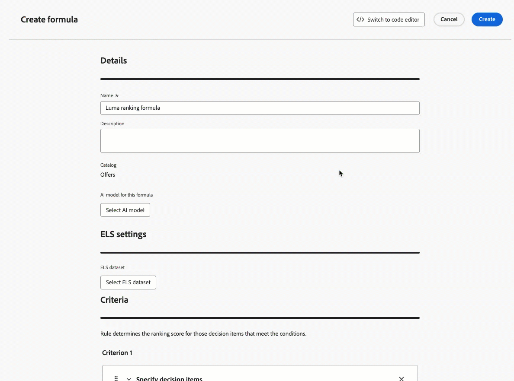

# Notes de mise à jour anticipées {#e-release-notes}

[!DNL Adobe Journey Optimizer] offre en permanence de nouvelles fonctionnalités, des améliorations aux fonctionnalités existantes et des correctifs. Toutes les modifications sont consolidées à la fin de chaque mois dans les [notes de mise à jour](release-notes.md).

**Les notes de mise à jour anticipées ci-dessous peuvent être modifiées sans avertissement préalable jusqu’à la date de disponibilité de la version**. Les liens, les copies d’écran et la documentation mise à jour sont publiés dans les [notes de mise à jour](release-notes.md) à la date de publication.

## Notes de mise à jour anticipées du 25 mai {#25-5-rn}

**Les notes de mise à jour anticipée ci-dessous peuvent être modifiées sans avertissement préalable jusqu’à la date de disponibilité de la version**. Les liens, les copies d’écran et la documentation mise à jour sont publiés à la date de publication.

**Date de publication** : 20-21 mai 2025

### Nouvelles fonctionnalités {#25-04-features}

Les nouvelles fonctionnalités de cette version sont présentées ci-dessous.

<table>
<thead>
<tr>
<th><strong>Synchroniser le planning de lecture d’audience avec la tâche de segmentation par lots</strong> </th>
</tr>
</thead>
<tbody>
<tr>
<td>

Vous pouvez désormais déclencher des exécutions de parcours quotidiennes une fois la segmentation par lots terminée. Cette option est désormais disponible dans les parcours planifiés quotidiennement pour tous les clients. Il vous permet de définir pendant une période allant jusqu’à 6 heures l’attente des données d’audience des tâches de segmentation par lots, en veillant à ce que les parcours s’exécutent avec les données les plus récentes ou soient ignorés s’ils ne sont pas prêts.

Publiée précédemment en disponibilité limitée, cette fonctionnalité est désormais disponible dans tous les environnements (disponibilité générale).

</td>
</tr>
</tbody>
</table>

<table>
<thead>
<tr>
<th><strong>Decisioning - Nouveau créateur de formules d’IA</strong> </th>
</tr>
</thead>
<tbody>
<tr>
<td>

Vous pouvez désormais créer des formules de classement de prise de décision spécifiques en définissant et en combinant des critères à partir d’une nouvelle interface améliorée. Au lieu de vous fier uniquement à une priorité d’offre statique, vous pouvez définir des formules de classement personnalisées qui combinent les scores du modèle d’IA, les priorités d’offre, les attributs de profil, les attributs d’offre et les signaux contextuels par le biais d’une interface guidée.

Pour plus d’informations, consultez la <a href="../experience-decisioning/exd-ranking-formulas.md">documentation détaillée</a>.

Date de disponibilité : jeudi 14 mai 2025

</td>
</tr>
</tbody>
</table>

<table>
<thead>
<tr>
<th><strong>Intégration du fragment de contenu Adobe Experience Manager</strong> </th>
</tr>
</thead>
<tbody>
<tr>
<td>

Grâce à l’intégration de Adobe Experience Manager et de Adobe Journey Optimizer, vous pouvez désormais utiliser facilement des fragments de contenu Adobe Experience Manager dans votre contenu Journey Optimizer. Cette connexion transparente facilite l’accès et l’utilisation de votre contenu AEM directement dans Journey Optimizer.

Auparavant disponible pour un nombre limité d’organisations (LA), cette fonctionnalité est désormais généralement disponible avec les améliorations suivantes :

<ul>
<li>Créez des offres en sélectionnant directement un fragment de contenu AEM.</li>
<li>Définissez des espaces réservés et mappez des valeurs de personnalisation dans la signature de fragment à l’aide du mode Éditeur.</li>
</ul>
</td>
</tr>
</tbody>
</table>

<table>
<thead>
<tr>
<th><strong>Vue Calendrier pour l’inventaire des campagnes et des Parcours</strong> </th>
</tr>
</thead>
<tbody>
<tr>
<td>

Une vue Calendrier est désormais disponible dans les listes des parcours et des campagnes. Il vous permet de visualiser toutes les activations de parcours et de campagnes dans les listes respectives.

Cette modification est disponible uniquement pour un ensemble d’organisations (disponibilité limitée). Pour en bénéficier, contactez votre représentant ou représentante Adobe.

</td>
</tr>
</tbody>
</table>

<table>
<thead>
<tr>
<th><strong>Intégration de Adobe Experience Manager Dynamic Media</strong> </th>
</tr>
</thead>
<tbody>
<tr>
<td>

Les ressources Dynamic Media sont désormais directement disponibles et accessibles dans Journey Optimizer. Cette intégration vous permet d’effectuer les opérations suivantes :

<ul>
<li>Gérez de manière centralisée les ressources avec des mises à jour en temps réel.</li>
<li>Modifiez instantanément les paramètres de vos ressources, tels que la largeur et la hauteur.</li>
<li>Personnalisez les modèles Dynamic Media en mettant à jour votre contenu et en ajoutant des champs de personnalisation.</li>
</ul>

Publiée précédemment en disponibilité limitée, cette fonctionnalité est désormais disponible dans tous les environnements (disponibilité générale).

</td>
</tr>
</tbody>
</table>

<table>
<thead>
<tr>
<th><strong>Thèmes dans le Designer Email</strong> </th>
</tr>
</thead>
<tbody>
<tr>
<td>

Vous pouvez désormais rapidement appliquer des thèmes préapprouvés pour garantir la cohérence de la marque dans tous les e-mails, accélérer le processus de création de votre campagne et produire indépendamment des e-mails de haute qualité tout en réduisant la dépendance aux équipes de conception.

Cette fonctionnalité est actuellement en version bêta et disponible uniquement pour les clientes et clients bêta. Pour rejoindre le programme bêta, contactez votre représentant ou représentante Adobe.

Date de disponibilité : jeudi 14 mai 2025

</td>
</tr>
</tbody>
</table>

<table>
<thead>
<tr>
<th><strong>Conflit et hiérarchisation</strong> </th>
</tr>
</thead>
<tbody>
<tr>
<td>

Dans Journey Optimizer, la gestion du volume et du calendrier des campagnes et des parcours est essentielle pour éviter de submerger les clientes et clients avec un trop grand nombre d’interactions. Journey Optimizer propose désormais plusieurs outils de gestion des conflits et de hiérarchisation, auparavant réservés aux organisations à accès limité (LA), qui sont désormais accessibles au public (GA).

Publiée précédemment en disponibilité limitée, cette fonctionnalité est désormais disponible dans tous les environnements. Les améliorations suivantes ont été apportées à cette version à disponibilité générale :

<ul>
<li>Prise en charge étendue : les outils de gestion des conflits prennent désormais en charge les Parcours unitaires et les Parcours de qualification d’audience, en plus des parcours Lecture d’audience .</li>
<li>Amélioration de la résolution des problèmes : deux nouveaux champs d’événement d’étape sont désormais disponibles dans Query Service, ce qui vous permet d’analyser pourquoi un profil a été rejeté d’un parcours ou d’une campagne.</li>
<li>Amélioration des rapports : les rapports indiquent désormais quelle règle spécifique a exclu un profil d’un parcours ou d’une campagne, ce qui offre une plus grande transparence et des informations exploitables.</li>
</ul>
</td>
</tr>
</tbody>
</table>

<table>
<thead>
<tr>
<th><strong>Simuler les variations de contenu</strong> </th>
</tr>
</thead>
<tbody>
<tr>
<td>

Auparavant disponible en version bêta, la simulation de variations de contenu est désormais en disponibilité générale. Elle vous permet de prévisualiser différentes variantes de votre contenu à l’aide d’exemples de données d’entrée chargées à partir d’un fichier CSV/JSON ou ajoutées manuellement. Tous les attributs de profil utilisés dans votre contenu pour la personnalisation sont automatiquement détectés par le système et peuvent être utilisés pour vos tests afin de créer plusieurs variantes.

Publiée précédemment en disponibilité limitée, cette fonctionnalité est désormais disponible dans tous les environnements. Avec cette version de disponibilité générale, la fonctionnalité prend désormais en charge le contenu multilingue et les expériences de contenu, ce qui vous permet de tester des variations dans différentes langues et traitements. En outre, elle prend désormais en charge les attributs contextuels (en plus des attributs de profil), ce qui permet d’effectuer des tests de contenu encore plus dynamiques et situationnels.

</td>
</tr>
</tbody>
</table>

<table>
<thead>
<tr>
<th><strong>Mettre à l’échelle l’expérience gagnante</strong> </th>
</tr>
</thead>
<tbody>
<tr>
<td>

Mettre à l’échelle le gagnant vous permet de déployer automatiquement ou manuellement la variation gagnante d’une expérience sur l’ensemble de votre audience. Cette fonctionnalité vous permet d’optimiser la portée et l’efficacité d’un système performant identifié, sans surveillance manuelle constante.

</td>
</tr>
</tbody>
</table>

<table>
<thead>
<tr>
<th><strong>Fournisseur de SMS personnalisé</strong> </th>
</tr>
</thead>
<tbody>
<tr>
<td>

Journey Optimizer vous permet désormais de configurer des fournisseurs SMS supplémentaires au-delà des options par défaut : Sinch, Infobip et Twilio. Grâce à la configuration personnalisée des fournisseurs SMS, vous pouvez intégrer directement des fournisseurs tiers, utiliser la personnalisation avancée de la payload pour la messagerie dynamique et gérer les préférences de consentement (opt-in/opt-out) pour garantir la conformité.

Pour plus d’informations, consultez la <a href="../sms/sms-configuration-custom.md">documentation détaillée</a>.
</td>

Publiée précédemment en disponibilité limitée, cette fonctionnalité est désormais disponible dans tous les environnements (disponibilité générale).

</td>
</tr>
</tbody>
</table>

<table>
<thead>
<tr>
<th><strong>ID supplémentaire pour les parcours déclenchés par un événement</strong> </th>
</tr>
</thead>
<tbody>
<tr>
<td>

Vous pouvez désormais déclencher des parcours à l’aide d’un identifiant de profil ainsi que d’un autre identifiant, tel qu’un identifiant de commande, d’abonnement ou de prescription, ce qui permet au même profil de se trouver plusieurs fois dans le même parcours à la fois. Cela permet des scénarios tels que la gestion de plusieurs commandes ou abonnements en parallèle, chaque instance suivant son propre chemin d’accès dans le parcours.

Cette fonctionnalité est disponible uniquement pour un nombre limité d’organisations (disponibilité limitée). Pour en bénéficier, contactez votre représentant ou représentante Adobe.

</td>
</tr>
</tbody>
</table>

### Améliorations {#25-05-improv}

Les améliorations apportées à cette version sont répertoriées ci-dessous.

* **Activation des pilules pour la personnalisation** - Date de disponibilité : 5 mai 2025

  Un nouveau bouton « Pilules » a été ajouté à l’éditeur de personnalisation. Une fois activés, les attributs de profil et contextuels s’affichent sous forme de pilules, ce qui améliore la lisibilité de votre code. [En savoir plus](../personalization/personalization-build-expressions.md#options)

  >[!AVAILABILITY]
  >
  >Cette fonctionnalité sera progressivement déployée dans tous les environnements au cours des 30 prochains jours.

* **Dossiers pour les landing pages** - Date de disponibilité : 9 mai 2025
Pour gérer facilement vos pages de destination, vous pouvez désormais utiliser des dossiers pour les organiser plus efficacement dans une hiérarchie structurée. [En savoir plus](../landing-pages/manage-lp.md)

* **Suivi des clics dans les modèles d’e-mail**\
  Le suivi des clics sur les éléments `<area>` dans les zones cliquables des modèles d’e-mail est désormais pris en charge nativement dans Journey Optimizer. Cela permet de s’assurer que les zones cliquables reçoivent le même habillage de suivi, les mêmes données de suivi et les mêmes paramètres ajoutés que les liens hypertexte standard.

* **Prise de décision - Utilisation des jeux de données Adobe Experience Platform**\
  Journey Optimizer vous permet désormais d’exploiter les jeux de données Adobe Experience Platform dans les objets Decisioning suivants : règles d’éligibilité, formules de classement et règles de limitation.

* **Dossiers dans les modèles et les fragments**\
  Les dossiers vous permettent d’organiser vos modèles et fragments de contenu plus facilement et plus efficacement dans une hiérarchie structurée. Auparavant disponibles pour un ensemble d’organisations (LA), les dossiers sont désormais accessibles à tous les utilisateurs (GA) pour gérer leurs modèles et fragments de contenu.

* **Prise en charge des nouveaux objets de campagne pour la copie de sandbox** <!-- - Availability date: -->
Lors de la copie de campagnes sur plusieurs sandbox à l’aide des fonctionnalités d’exportation et d’importation de package, les dépendances suivantes sont désormais également copiées : configurations de canal, variantes et paramètres d’expérience, politiques de décision et éléments. [En savoir plus](../configuration/copy-objects-to-sandbox.md)

* **&#39;Prise en charge de la redirection vers une URL&#39; dans le canal web**\
  Le canal web Journey Optimizer vous permet désormais de rediriger les visiteurs et visiteuses vers une autre URL existante plutôt que de créer une nouvelle variation dans l’éditeur visuel. Cette fonctionnalité peut être utilisée pour exécuter des expériences en comparant deux pages complètement différentes au lieu de simplement modifier quelques éléments dans une page.

* **Outil Sandbox - Prise en charge des nouveaux objets Campaign**\
  Lors de la copie de campagnes sur plusieurs sandbox à l’aide des fonctionnalités d’exportation et d’importation de package, les dépendances suivantes sont désormais également copiées : configurations de canal, variantes et paramètres d’expérience, politiques de décision et éléments.

* **Rail de droite dans la liste des campagnes**\
  Dans la liste des campagnes, la sélection d’une campagne ouvre désormais un volet affichant ses détails.

* **Champs de formulaire dans le contenu d’expérience basé sur le code**\
  Dans les modèles de contenu, vous pouvez désormais définir des champs JSON ou HTML spécifiques qui permettent aux utilisateurs non techniques de modifier facilement le contenu dans les expériences basées sur du code sans avoir à manipuler le code.

* **Prise en charge des attributs d’élément de décision pour les règles de prise de décision**\
  Vous pouvez désormais tirer parti des attributs d’élément de décision pour créer des règles de prise de décision.

* **Sous-domaines - méthode &#39;Délégation personnalisée&#39;**\
  Outre la délégation complète et la méthode CNAME, une nouvelle méthode de configuration de sous-domaine est désormais disponible : la méthode de délégation personnalisée, qui vous permet de posséder entièrement le contrôle et la maintenance de tous les aspects du DNS nécessaires à la diffusion, au rendu et au suivi des messages.

* **Courrier - Prise en charge SSH**\
  Outre le type d’authentification SFTP avec mot de passe existant, vous pouvez désormais exporter votre fichier de publipostage direct vers un serveur SFTP avec authentification par clé SSH.