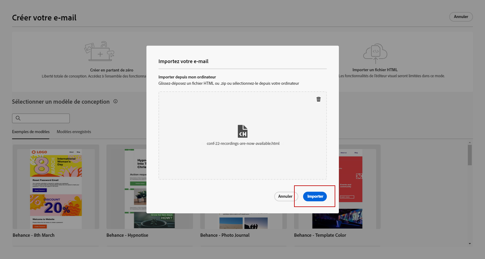

# Notes de mise à jour anticipées {#e-release-notes}

[!DNL Adobe Journey Optimizer] offre en permanence de nouvelles fonctionnalités, des améliorations aux fonctionnalités existantes et des correctifs. Toutes les modifications sont consolidées la dernière semaine de chaque mois dans les [notes de mise à jour](release-notes.md).

Les notes de mise à jour ci-dessous peuvent être modifiées sans avertissement préalable jusqu’à la date de disponibilité de la version. Les liens, les écrans et la documentation mise à jour sont publiés dans les [notes de mise à jour](release-notes.md), à la date de publication.

## Notes de mise à jour anticipées de juillet 2023 {#july-rn-2023}

**Date de publication** : 26/27 juillet

### Nouvelles fonctionnalités{#july-2023-features}

Cette version apporte les nouvelles fonctionnalités répertoriées ci-dessous.

<table>
<thead>
<tr>
<th><strong>Composition de l’audience</strong> </th>
</tr>
</thead>
<tbody>
<tr>
<td>

Vous pouvez désormais créer des workflows de composition afin de combiner les audiences Adobe Experience Platform existantes dans une zone de travail visuelle et d’exploiter diverses activités (comme le partage, l’enrichissement…) pour créer de nouvelles audiences. Les audiences nouvellement créées sont réenregistrées dans Adobe Experience Platform avec les audiences existantes et peuvent être exploitées dans les campagnes Journey Optimizer pour cibler la clientèle.

Pour plus d’informations, consultez la <a href="../audience/get-started-audience-orchestration.md">documentation détaillée</a>.

La composition de l’audience est entièrement intégrée au nouveau menu « Audiences » d’Adobe Experience Platform qui sert de portail centralisé vers les audiences. Vous pouvez désormais utiliser une page de navigation qui comprend un nouveau tableau de bord avec des tendances et des chevauchements de segments afin de trouver de nouvelles informations et d’explorer les outils d’organisation pour la création de dossiers et le balisage. Cette expérience s’accompagne de contrôles de gouvernance pour l’étiquetage normalisé des audiences ainsi que de fonctionnalités de gestion du cycle de vie des audiences afin de gérer les workflows d’activation. Grâce à cette nouvelle expérience de gestion, vous pouvez désormais gérer facilement et en toute sécurité les audiences depuis un seul emplacement. Pour plus d’informations, consultez la <a href="https://experienceleague.adobe.com/docs/experience-platform/segmentation/ui/overview.html?lang=fr" target="_blank">documentation Adobe Experience Platform</a>.

</td>
</tr>
</tbody>
</table>

<!--table>
<thead>
<tr>
<th><strong>Direct mail channel</strong> </th>
</tr>
</thead>
<tbody>
<tr>
<td>

You can now add direct mail messages in your campaigns. Direct mail is an offline channel that allows you to personalize and generate the files required by direct mail providers to send mail to your customers.

When you prepare a direct mail delivery, Journey Optimizer generates a file including all the targeted profiles and the chosen contact information (postal address for example). You will then be able to send this file to your direct mail provider who will take care of the actual sending.

For more information, refer to the <a href="../direct-mail/create-direct-mail.md">detailed documentation</a>.

</tr>
</tbody>
</table-->

<table>
<thead>
<tr>
<th><strong>Convertir votre contenu HTML pour le Concepteur d’e-mail</strong> </th>
</tr>
</thead>
<tbody>
<tr>
<td>

Vous pouvez désormais importer et convertir n’importe quel contenu HTML dans l’éditeur d’e-mail de Journey Optimizer. Les blocs de contenu sont automatiquement identifiés et disponibles dans le Concepteur d’e-mail : utilisez ses puissantes fonctionnalités de conception pour les mettre à jour et les personnaliser !

<!--p>For more information, refer to the <a href="../audience/get-started-audience-orchestration.md">detailed documentation</a>.</p-->
</td>
</tr>
</tbody>
</table>

<table>
<thead>
<tr>
<th><strong>Utiliser des balises dans Journey Optimizer</strong> </th>
</tr>
</thead>
<tbody>
<tr>
<td>

Outre les campagnes et les parcours, vous pouvez désormais attribuer des balises unifiées Adobe Experience Platform à vos pages de destination, modèles de contenu, fragments et listes d’abonnements. Vous pouvez ainsi facilement les classer et améliorer la recherche et la navigation dans toutes les listes. 

Pour plus d’informations, consultez la <a href="../start/search-filter-categorize.md#tags">documentation détaillée</a>.

</td>
</tr>
</tbody>
</table>

<table>
<thead>
<tr>
<th><strong>API de modèles de contenu</strong> </th>
</tr>
</thead>
<tbody>
<tr>
<td>

Vous pouvez désormais créer et gérer des modèles de contenu Adobe Journey Optimizer à l’aide d’API dédiées, ce qui permet une intégration transparente de votre système de contenu existant.

<!--
For more information, refer to the <a href="../start/search-filter-categorize.md#tags">detailed documentation</a>.
-->
</td>
</tr>
</tbody>
</table>

### Améliorations {#july-2023-improvements}

Cette version est fournie avec les améliorations répertoriées ci-dessous.

<!--
**Journeys**

* You can now leverage API call responses in custom actions and orchestrate your journey based on these responses.-->
* Introduction d’un nouveau type d’alerte système. Vous pouvez désormais recevoir une notification en cas d’échec d’une action personnalisée.
-->

**Campagnes**

* Les événements contextuels liés aux campagnes sont désormais disponibles dans le menu « Attributs contextuels » de l’éditeur de personnalisation.

**Audiences**

Des améliorations ont été apportées au sélecteur d’audiences dans les parcours ou les campagnes, avec l’ajout de nouvelles colonnes indiquant l’origine et la fréquence de mise à jour des audiences.

Avec la publication du portail de composition de l’audience, Adobe Experience Platform et Adobe Journey Optimizer ont mis à jour l’utilisation des « audiences » et des « segments » dans le système et la documentation.

* Audience : ensemble de personnes, de comptes, de foyers ou d’autres entités qui partagent des caractéristiques et des comportements communs.
* Définition d’un segment : règles utilisées pour décrire les caractéristiques ou le comportement clés d’une audience cible dans Adobe Experience Platform. Ce terme était auparavant appelé « segment ».

Par conséquent, dans Adobe Journey Optimizer et l’interface utilisateur d&#39;Adobe Experience Platform, « Segments » est remplacé par « Audiences » pour refléter ce nouveau chemin de création et de gestion d’audience.

**API**

Authentification des API Adobe Journey Optimizer : la méthode JWT pour générer des jetons d’accès a été abandonnée. Toutes les nouvelles intégrations doivent être créées à l’aide de la méthode d’authentification OAuth de serveur à serveur. Adobe vous recommande également de migrer vos intégrations existantes vers la méthode OAuth. [En savoir plus](https://developer.adobe.com/journey-optimizer-apis/references/authentication/).

**Autres modifications**

L’export des jeux de données Journey Optimizer vers les destinations d’espace de stockage est désormais disponible pour toute la clientèle en version bêta. Cette fonctionnalité vous permet d’établir une connexion active aux emplacements d’espace de stockage pour exporter le contenu de vos jeux de données. [En savoir plus](../data/export-datasets.md).

