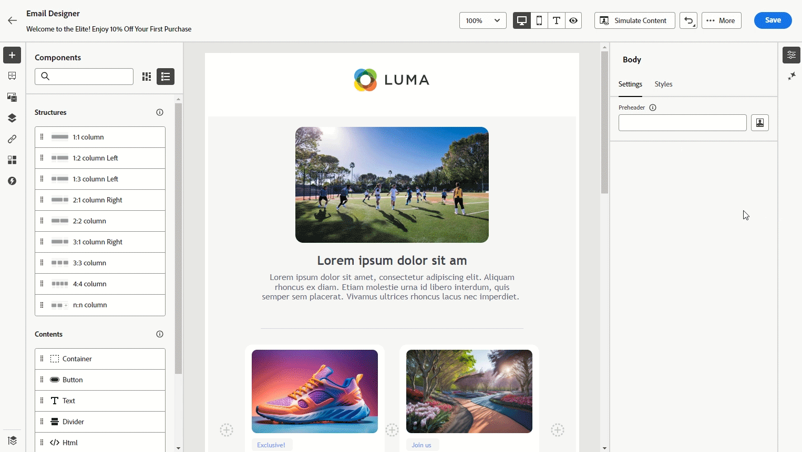

# Notes de mise à jour anticipées {#e-release-notes}

[!DNL Adobe Journey Optimizer] offre en permanence de nouvelles fonctionnalités, des améliorations aux fonctionnalités existantes et des correctifs. Toutes les modifications sont consolidées à la fin de chaque mois dans les [notes de mise à jour](release-notes.md).

**Les notes de mise à jour anticipées ci-dessous peuvent être modifiées sans avertissement préalable jusqu’à la date de disponibilité de la version**. Les liens, les copies d’écran et la documentation mise à jour sont publiés dans les [notes de mise à jour](release-notes.md) à la date de publication.

## Notes de mise à jour anticipées d’octobre 2024 {#e-2024}

**Date de publication** : 29-30 octobre 2024

### Nouvelles fonctionnalités {#e-features}

Cette version apporte les nouvelles fonctionnalités détaillées ci-dessous.

<table>
<thead>
<tr>
<th><strong>Verrouillage du contenu d’e-mail</strong> </th>
</tr>
</thead>
<tbody>
<tr>
<td>

Journey Optimizer vous permet désormais de verrouiller le contenu dans les modèles d’e-mail, soit en verrouillant l’intégralité du modèle, soit des structures et composants spécifiques. Cela vous permet d’éviter les modifications ou suppressions involontaires, de mieux contrôler la personnalisation des modèles et d’améliorer l’efficacité et la fiabilité de vos campagnes par e-mail.

<!--p>For more information, refer to the <a href="../content-management/gs-generative.md">detailed documentation</a>.

</td>
</tr>
</tbody>
</table>

<table>
<thead>
<tr>
<th><strong>Approbations dans les parcours et les campagnes (disponibilité générale)</strong> </th>
</tr>
</thead>
<tbody>
<tr>
<td>

Grâce aux politiques d’approbation, vous pouvez désormais configurer un processus d’approbation dans Journey Optimizer qui permet aux équipes marketing de s’assurer que les campagnes et les parcours sont examinés et approuvés par les parties prenantes appropriées avant qu’ils ne soient mis en ligne.

Auparavant disponibles pour un ensemble d’organisations (LA), les politiques d’approbation sont désormais disponibles pour tous les utilisateurs et toutes les utilisatrices (GA).

Pour plus d’informations, consultez la <a href="../test-approve/gs-approval.md">documentation détaillée</a>.

</td>
</tr>
</tbody>
</table>

<table>
<thead>
<tr>
<th><strong>Personnalisation de la configuration du canal e-mail (disponibilité générale)</strong> </th>
</tr>
</thead>
<tbody>
<tr>
<td>

Vous pouvez désormais définir des sous-domaines dynamiques et des paramètres d’en-tête personnalisés lors de la création de configuration de canal e-mail pour une meilleure flexibilité et un meilleur contrôle de vos paramètres d’e-mail.

L’utilisation d’une configuration personnalisée dans une campagne ou un parcours vous permet de prévisualiser le contenu de votre e-mail afin de rechercher les erreurs potentielles avec les paramètres dynamiques que vous avez définis.

Auparavant disponible pour un ensemble d’organisations (LA), la personnalisation de la configuration du canal e-mail est désormais disponible pour tous les utilisateurs et toutes les utilisatrices (GA).

Pour plus d’informations, consultez la <a href="../email/surface-personalization.md">documentation détaillée</a>.

</td>
</tr>
</tbody>
</table>

<table>
<thead>
<tr>
<th><strong>Tester votre contenu à l’aide d’exemples de données d’entrée (version bêta)</strong> </th>
</tr>
</thead>
<tbody>
<tr>
<td>

Désormais, Journey Optimizer vous permet de tester différentes variantes du contenu de votre e-mail en le prévisualisant et en envoyant des épreuves à l’aide d’exemples de données d’entrée chargées à partir d’un fichier CSV ou ajoutées manuellement. Tous les attributs de profil utilisés dans votre contenu pour la personnalisation sont automatiquement détectés par le système et peuvent être utilisés pour vos tests afin de créer plusieurs variantes.

Cette fonctionnalité est actuellement disponible en version bêta.

<!--
For more information, refer to the <a href="../email/surface-personalization.md">detailed documentation</a>.
-->
</td>
</tr>
</tbody>
</table>

<table>
<thead>
<tr>
<th><strong>Gestion des conflits et des priorités (disponibilité limitée)</strong> </th>
</tr>
</thead>
<tbody>
<tr>
<td>

Dans Journey Optimizer, la gestion du volume et du calendrier des campagnes et des parcours est essentielle pour éviter de submerger les clientes et clients avec un trop grand nombre d’interactions. Journey Optimizer propose désormais plusieurs outils de gestion des conflits et de hiérarchisation des priorités.

<ul><li><b>Capping de la fréquence des parcours</b> : vous pouvez désormais créer des jeux de règles à appliquer à vos parcours, ce qui vous permet de limiter le nombre de parcours d’un profil par jour, semaine ou mois, ainsi que de contrôler le nombre de parcours simultanés exécutés simultanément.</li>
<li><b>Score de priorité</b> : vous pouvez désormais attribuer un score de priorité à une campagne ou à un parcours, allant de 0 à 100. Un nombre plus élevé indique une priorité plus élevée. Lorsque deux campagnes ou actions de parcours utilisent la même configuration des canaux, Journey Optimizer sélectionne celle ayant le score de priorité le plus élevé. Si les campagnes ont le même score, la campagne la plus anciennement modifiée sera choisie.</li>
<li><b>Afficher les conflits potentiels</b> : un nouveau bouton « Afficher les conflits potentiels » dans les parcours et les campagnes vous permet désormais d’identifier le chevauchement avec d’autres parcours ou campagnes tels que la date de début, l’audience ciblée ou la configuration des canaux sélectionnée.</li>
<li><b>Arbitrage du parcours</b> : cette nouvelle fonctionnalité vous permet de hiérarchiser les parcours les plus importants pour vos clientes et clients. Vous pouvez créer une règle pour supprimer une entrée dans un parcours de priorité inférieure lorsqu’un client ou une cliente est admissible pour un parcours de priorité supérieure à venir.</li></ul>

<!--
For more information, refer to the <a href="../email/surface-personalization.md">detailed documentation</a>.
-->

Les fonctionnalités de gestion des conflits et des priorités sont accessibles en disponibilité limitée pour un groupe sélectionné de clientes et clients. Notez que ces fonctionnalités seront progressivement déployées vers d’autres utilisateurs et utilisatrices à l’avenir. Contactez votre équipe de compte si vous souhaitez qu’elle vous ajoute à la liste d’attente pour ces fonctionnalités.

</td>
</tr>
</tbody>
</table>

<table>
<thead>
<tr>
<th><strong>Mode de modification non visuel pour le concepteur web</strong> </th>
</tr>
</thead>
<tbody>
<tr>
<td>

Vous pouvez désormais apporter des modifications à votre site web à l’aide d’un éditeur non visuel, au lieu d’utiliser le concepteur web de Journey Optimizer. Il vous permet d’effectuer vos modifications manuellement sans ouvrir les pages dans l’éditeur visuel.
Ce mode de modification non visuel est utile si vous ne pouvez pas installer d’extensions de navigateur telles que Visual Helper d’Adobe Experience Cloud, nécessaires pour charger vos pages dans le concepteur web.

<!--p>For more information, refer to the <a href="../email/surface-personalization.md">detailed documentation</a>.</p-->
</td>
</tr>
</tbody>
</table>

<table>
<thead>
<tr>
<th><strong>Expérimentation de contenu dans les parcours (disponibilité générale)</strong> </th>
</tr>
</thead>
<tbody>
<tr>
<td>

Déjà disponible dans les campagnes, Adobe Journey Optimizer prend désormais en charge les expérimentations dans les parcours. Les expériences sont des essais randomisés, ce qui, dans le cadre des tests en ligne, signifie que vous exposez certains utilisateurs et utilisatrices sélectionnés de manière aléatoire à une variante donnée d’un message et un autre ensemble d’utilisateurs et utilisatrices sélectionnés de manière aléatoire à une autre variation de traitement. Après l’exposition, vous pouvez ensuite mesurer les mesures de résultats qui vous intéressent, par exemple les ouvertures d’e-mails, les abonnements ou les achats.

Auparavant disponibles pour un ensemble d’organisations (LA), les expérimentations dans les parcours sont désormais disponibles pour tous les utilisateurs et toutes les utilisatrices (GA).

</td>
</tr>
</tbody>
</table>

<table>
<thead>
<tr>
<th><strong>Prise de décision (disponibilité générale)</strong> </th>
</tr>
</thead>
<tbody>
<tr>
<td>

La prise de décision, auparavant disponible pour un ensemble d’organisations (LA) et appelée Décisions pour les expériences, est désormais disponible pour tous les utilisateurs et toutes les utilisatrices (GA). Elle simplifie la personnalisation en offrant un catalogue centralisé d’offres marketing connues sous le nom d’« éléments de décision » et un moteur de décision sophistiqué. Ce moteur tire parti des règles et des critères de classement pour sélectionner et présenter les éléments de décision les plus pertinents à chaque personne. Ces éléments de décision sont intégrés de manière transparente à un large éventail de surfaces entrantes grâce au canal d’expérience basé sur le code.

Pour l’instant, la prise de décision n’est pas disponible pour les clientes et les clients qui ont acheté les offres complémentaires Adobe Healthcare Shield et Privacy and Security Shield.

<!--p>For more information, refer to the <a href="../configuration/business-rules.md">detailed documentation</a>.</p-->
</td>
</tr>
</tbody>
</table>

<table>
<thead>
<tr>
<th><strong>Jeux de règles (disponibilité limitée)</strong> </th>
</tr>
</thead>
<tbody>
<tr>
<td>

Vous pouvez désormais créer des règles de capping de la fréquence granulaires et les appliquer à vos messages ou parcours par le biais des jeux de règles. Cette nouvelle fonctionnalité vous permet de contrôler la fréquence à laquelle vos audiences reçoivent un message en définissant des règles cross-canal qui excluent automatiquement les profils sur-sollicités des messages et actions.

Elle vous permet également de limiter le nombre de parcours par jour, semaine ou mois, ainsi que de contrôler le nombre de parcours simultanés exécutés simultanément.

Les jeux de règles sont accessibles en disponibilité limitée pour un groupe sélectionné de clientes et clients. Notez que ces fonctionnalités seront progressivement déployées vers d’autres utilisateurs et utilisatrices à l’avenir. Contactez votre équipe de compte si vous souhaitez qu’elle vous ajoute à la liste d’attente pour cette fonctionnalité.

<!--p>For more information, refer to the <a href="../configuration/business-rules.md">detailed documentation</a>.</p-->
</td>
</tr>
</tbody>
</table>

<table>
<thead>
<tr>
<th><strong>Messages multilingues dans les parcours et les campagnes (disponibilité générale)</strong> </th>
</tr>
</thead>
<tbody>
<tr>
<td>

Vous pouvez désormais créer facilement du contenu dans plusieurs langues au sein d’une campagne ou d’un parcours. Grâce à cette fonctionnalité, vous pouvez passer d’une langue à une autre lors de la modification de votre campagne ou de votre parcours, ce qui optimise l’ensemble du processus de modification et améliore votre capacité à gérer efficacement du contenu multilingue.

Offert en disponibilité générale, le contenu multilingue est désormais accessible sur tous les canaux. 

<!--p>For more information, refer to the <a href="../configuration/business-rules.md">detailed documentation</a>.</p-->
</td>
</tr>
</tbody>
</table>

<table>
<thead>
<tr>
<th><strong>Intégration de Movable Ink et d’Adobe Journey Optimizer</strong> </th>
</tr>
</thead>
<tbody>
<tr>
<td>

Vous pouvez désormais intégrer Movable Ink Da Vinci et Adobe Journey Optimizer. Avec cette nouvelle intégration, vous pouvez effectuer les actions suivantes : 

<ul><li>Tirer parti des puissantes fonctionnalités du produit Da Vinci de Movable Ink pour assembler et personnaliser les variations d’e-mail pour les campagnes par lot</li>
<li>Accélérer les workflows de mise en œuvre pour les clientes et clients Journey Optimizer à l’aide de Da Vinci pour la création et d’AJO pour l’optimisation et la diffusion</li>
<li>Optimisez les modèles Da Vinci avec les données d’Adobe.</li></ul>

<!--p>For more information, refer to the <a href="../code-based/get-started-code-based.md">detailed documentation</a>.</p-->
</tr>
</tbody>
</table>

<table>
<thead>
<tr>
<th><strong>Mise à jour de l’expérience de création de rapports (disponibilité générale)</strong> </th>
</tr>
</thead>
<tbody>
<tr>
<td>

Disponible depuis le 16 octobre 2024

La création de rapports Journey Optimizer est désormais en disponibilité générale (GA) et est dotée d’une interopérabilité améliorée avec les fonctionnalités de Customer Journey Analytics, ce qui permet de normaliser la création de rapports sur les deux plateformes et d’améliorer la cohérence et la fiabilité des données. L’intégration transparente entre Journey Optimizer et Customer Journey Analytics fournit une meilleure visibilité des mesures de performance, ce qui aide les utilisateurs et les utilisatrices à prendre des décisions plus éclairées.

Avec la disponibilité générale, quatre nouvelles fonctionnalités sont introduites : la possibilité de créer des mesures simples, de créer et de publier des audiences, de poser des questions ad hoc à l’aide d’Insight Builder et de planifier des rapports qui seront automatiquement envoyés par e-mail aux personnes destinataires clés.

Pour plus d’informations, consultez la <a href="../reports/report-cja-manage.md">documentation détaillée</a>.

Important : l’expérience actuelle de création de rapports sera abandonnée à compter de janvier 2025. À partir de cette date, la nouvelle expérience de création de rapports deviendra la norme. Nous vous recommandons de vous familiariser avec les nouvelles fonctionnalités pour garantir une transition fluide. <a href="../reports/report-gs-cja.md">Découvrir la nouvelle interface de création de rapports de Journey Optimizer</a>

</tr>
</tbody>
</table>

<table>
<thead>
<tr>
<th><strong>Expériences basées sur le code dans les parcours</strong> </th>
</tr>
</thead>
<tbody>
<tr>
<td>

Disponible depuis le 1er octobre 2024

Grâce au nouveau canal d’expérience basée sur le code, Adobe Journey Optimizer vous permet d’effectuer des tests et des personnalisations avancés pour l’une de vos propriétés entrantes, ce qui vous permet de diffuser facilement des expériences personnalisées sur différents points de contact (touchpoints) tels que des applications web, des applications mobiles, des applications de bureau, des consoles vidéo, des appareils connectés à la télévision, des téléviseurs intelligents, des kiosques, des distributeurs automatiques, des périphériques IoT, etc. Le canal d’expérience basée sur le code est désormais disponible dans la zone de travail du parcours.

Pour plus d’informations, consultez la <a href="../code-based/create-code-based.md">documentation détaillée</a>.

</tr>
</tbody>
</table>

<table>
<thead>
<tr>
<th><strong>Expériences web dans les parcours</strong> </th>
</tr>
</thead>
<tbody>
<tr>
<td>

Disponible depuis le 1er octobre 2024

Avec le canal web, Adobe Journey Optimizer vous permet de personnaliser l’expérience web que vous diffusez à votre clientèle par le biais de parcours web entrants. Le canal web est désormais disponible dans la zone de travail du parcours.

Pour plus d’informations, consultez la <a href="../web/create-web.md">documentation détaillée</a>.

</tr>
</tbody>
</table>

### Améliorations {#e-improvements}

Cette version est fournie avec les améliorations répertoriées ci-dessous.

**Canal SMS**

>[!AVAILABILITY]
>
>Les améliorations suivantes ne sont disponibles que pour les fournisseurs Sinch et Infobip.

Des améliorations ont été apportées aux SMS pour améliorer vos fonctionnalités de messagerie :

* Vous pouvez définir et gérer des mots-clés uniques pour vos campagnes et parcours SMS, ce qui permet une communication plus personnalisée et efficace.

* Vous pouvez créer et diffuser un SMS par défaut lorsqu’un mot-clé n&#39;est pas reconnu.

* Vous pouvez désormais modifier ou supprimer une configuration de canaux de l’API SMS.

<!--**Journeys**-->

<!--* **Path experiment in journeys** - With the journey path experiment, you can now define and track key metrics for your journey paths, allowing you to measure the impact of your activities and to provide clearer insights into your performance. -->

<!--* **Max number of Live journeys** - Journey Optimizer now has a guardrail of 500 live journeys on production sandboxes, instead of 100. The number of live journeys is visible in the journey canvas. (DOCAC-10977) -->

**Jeux de données**

* **Mécanisme de sécurisation sur la durée de vie** : à compter du 1er novembre 2024, un mécanisme de sécurisation sur la durée de vie (TTL) sera déployé sur les jeux de données générés par le système Journey Optimizer dans les nouveaux sandbox et les nouvelles organisations comme suit :

   * 90 jours pour les données dans la banque de profils
   * 13 mois pour les données du lac de données

  Cette modification sera déployée ultérieurement sur les sandbox des clientes et clients existants dans une seconde phase.

  En outre, à compter du 1er novembre, la segmentation du streaming ne prendra plus en charge l’utilisation des événements d’envoi et d’ouverture provenant des jeux de données de tracking et de commentaires. Cette modification s’appliquera à l’ensemble des sandbox et organisations des clientes et clients à ce moment-là. [En savoir plus](../data/datasets-ttl.md)

* **Paramètres dans les actions personnalisées** (date de disponibilité : 3 octobre 2024) : les paramètres NULL et facultatifs sont désormais pris en charge dans les actions personnalisées. [En savoir plus](../action/about-custom-action-configuration.md#define-the-message-parameters).

**Créer des rapports**

* **La création de rapports pour la prise de décision** est désormais disponible et offre des informations essentielles sur la manière dont vos visiteurs et visiteuses interagissent avec vos expériences.

**Gouvernance des données et politiques de consentement** : date de disponibilité : 7 octobre 2024

* L’application des **politiques de gouvernance des données** a désormais lieu sur tous les canaux dans Journey Optimizer. Pour les clientes et clients qui ont créé des politiques dans Adobe Experience Platform, ces dernières sont appliquées aux actions marketing dans le cadre des configurations des canaux. Lorsque vous créez du contenu à l’aide d’une configuration, le système vérifie tous les champs de personnalisation à la recherche de toute violation de gouvernance des données. Si une violation est trouvée, la publication d’un parcours ou d’une campagne n’est pas possible. [En savoir plus](../action/action-privacy.md)

* Les **politiques de consentement personnalisé** s’appliquent désormais à tous les canaux Journey Optimizer. Lors de l’application, avant l’envoi d’un message ou avant la diffusion d’une expérience entrante, le système vérifie que la personne a donné son consentement pour utiliser des champs de personnalisation dans le contenu qu’elle reçoit. Si aucun consentement n’est donné, l’expérience ne s’affiche pas. [En savoir plus](../action/consent.md)

  >[!NOTE]
  >
  >Les politiques de consentement ne sont actuellement disponibles que pour les organisations qui ont acheté les offres complémentaires Adobe **Healthcare Shield** et **Privacy and Security Shield**.

**Audiences** : date de disponibilité : 8 octobre 2024

* Lors du ciblage d’une audience de fichier CSV, vous pouvez désormais utiliser les attributs du fichier dans l’éditeur de personnalisation et dans le créateur de règles de parcours et de campagnes. [En savoir plus](../audience/about-audiences.md)

* L’utilisation des audiences et des attributs du chargement personnalisé (fichiers CSV) est désormais disponible avec Healthcare Shield ou Privacy and Security Shield.

**Canal basé sur le code**

* Des modèles de contenu sont désormais disponibles. Vous pouvez accélérer la création de vos expériences basées sur du code à partir d’un modèle de contenu créé par vos développeurs et développeuses. L’utilisation d’un modèle de contenu permet aux spécialistes marketing de modifier uniquement certaines valeurs ou certains champs, au lieu de composer l’ensemble de l’HTML ou du payload du contenu JSON.

**Prise de décision**

Les utilisateurs et utilisatrices d’[Adobe Customer Journey Analytics](https://experienceleague.adobe.com/docs/analytics-platform/using/cja-overview/cja-overview.html?lang=fr) peuvent désormais choisir des modèles personnalisés à optimiser lors de la configuration d’un modèle IA dans la prise de décision (anciennement appelée Décisions pour les expériences). Cela vous permet, par exemple, d’optimiser sur une table personnalisée « achats » plutôt que sur des contraintes définies telles que le taux de clics.
