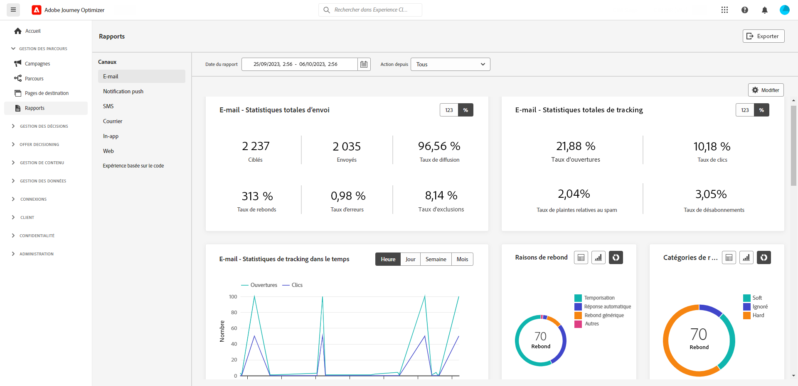

# Notes de mise à jour anticipées {#e-release-notes}

[!DNL Adobe Journey Optimizer] offre en permanence de nouvelles fonctionnalités, des améliorations aux fonctionnalités existantes et des correctifs. Toutes les modifications sont consolidées la dernière semaine de chaque mois dans les [notes de mise à jour](release-notes.md).

Les notes de mise à jour ci-dessous peuvent être modifiées sans avertissement préalable jusqu’à la date de disponibilité de la version. Les liens, les écrans et la documentation mise à jour sont publiés dans les [notes de mise à jour](release-notes.md), à la date de publication.

## Notes de mise à jour initiales de septembre 2023 {#sept-rn-2023}

**Date de publication**: 26-27 septembre 2023

### Nouvelles fonctionnalités{#sept-2023-features}

Cette version apporte les nouvelles fonctionnalités répertoriées ci-dessous.

<table>
<thead>
<tr>
<th><strong>Rapports Canal consolidé</strong> </th>
</tr>
</thead>
<tbody>
<tr>
<td>

La fonction Rapport Canal offre aux analystes et aux spécialistes du marketing un aperçu complet des mesures de trafic et d’engagement au niveau du canal. Pour accéder au menu "Rapport", vous devez disposer de l’autorisation **Afficher les rapports de canal**.

<!--p>For more information, refer to the <a href="../in-app/get-started-in-app.md">detailed documentation</a>.</p-->
</tr>
</tbody>
</table>

<table>
<thead>
<tr>
<th><strong>Destinations d’exportation de jeux de données (GA)</strong> </th>
</tr>
</thead>
<tbody>
<tr>
<td>

L’exportation des jeux de données Journey Optimizer vers des destinations de stockage dans le cloud est désormais disponible en général. Cette fonctionnalité vous permet d’établir une connexion active aux emplacements d’espace de stockage pour exporter le contenu de vos jeux de données.

<!--p>For more information, refer to the <a href="../audience/get-started-audience-orchestration.md">detailed documentation</a>.</p-->
</td>
</tr>
</tbody>
</table>

### Améliorations {#sept-2023-improvements}

Cette version est fournie avec les améliorations répertoriées ci-dessous.

**Audiences**

* Vous pouvez désormais cibler les audiences chargées à partir d’un fichier CSV dans les parcours et les campagnes.
* Des améliorations ont été apportées au sélecteur d’audiences dans les parcours ou les campagnes, avec l’ajout de nouvelles colonnes indiquant l’origine et la fréquence de mise à jour des audiences.
* Vous pouvez désormais cibler les audiences issues des workflows de composition en parcours.

**Personnalisation**

* Outre les fragments visuels, il est désormais possible de créer, enregistrer et réutiliser des fragments d’expression à partir de l’interface de Journey Optimizer via l’éditeur d’expression. Les fragments d’expression remplacent les expressions enregistrées précédemment.
* Vous pouvez désormais utiliser des attributs calculés Adobe Experience Platform pour la personnalisation dans Journey Optimizer. Les attributs calculés sont des valeurs agrégées qui sont calculées selon les jeux de données d’événements d’expérience activés pour le profil ingérés dans Adobe Experience Platform.

**Alerte**

Introduction d’un nouveau type d’alerte système. Vous pouvez désormais être averti lorsqu’un segment de lecture échoue.

**Canal web**

* Vous pouvez maintenant sélectionner les vues spécifiques auxquelles vous souhaitez appliquer les modifications de vos pages web. Une vue peut être définie comme un site entier ou un groupe d’éléments visuels sur un site, tels que la page d’accueil, l’ensemble du site de produits ou les préférences de livraison, encadrés sur toutes les pages de passage en caisse.
* Lors de la modification d’une page à l’aide du concepteur web, vous pouvez désormais ajouter de nouvelles modifications à votre contenu directement à partir du volet Modifications , sans avoir à sélectionner un composant et à le modifier dans l’interface du concepteur.
* Lors de la configuration de sous-domaines web, vous avez désormais la possibilité d’ajouter votre propre sous-domaine, en plus d’utiliser un sous-domaine déjà délégué à Adobe.

**Parcours**

* Introduction d’un nouveau type d’alerte système. Vous pouvez désormais recevoir une notification en cas d’échec d’une action personnalisée.
* Lors de la duplication d’un parcours, vous pouvez désormais définir le nom de la copie de parcours.

**Canal e-mail**

Une nouvelle option de configuration de la surface de l&#39;email permet de choisir d&#39;envoyer des messages transactionnels aux profils même si leurs adresses email se trouvent dans la liste de suppression de Adobe Journey Optimizer.

**Gestion des décisions**

Des améliorations ont été apportées au sélecteur d’audiences dans les parcours ou les campagnes, avec l’ajout de nouvelles colonnes indiquant l’origine et la fréquence de mise à jour des audiences.