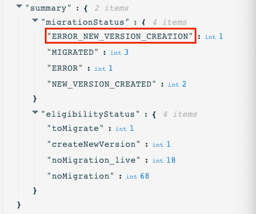

# Etapes de migration de création en ligne{#migration-steps}

Le nouveau processus de création de contenu dans Adobe Journey Optimizer est décrit dans cette section [page](../rn/inline-messages.md). Une conversion automatique de parcours est effectuée pour vous. Cela dit, nous avons besoin de votre aide avec quelques étapes.

>[!VIDEO](https://video.tv.adobe.com/v/344699)

Les principales phases et étapes sont les suivantes :

**[Avant la migration](../rn/inline-messages-steps.md#migration-step-1)**

1. Sur les environnements de test hors production, arrêtez tous les parcours actifs et fermés. [En savoir plus](../rn/inline-messages-steps.md#migration-step-1-1)
1. Sur l’environnement de test de production, arrêtez tous les parcours ad hoc actifs sans profil toujours présent. [En savoir plus](../rn/inline-messages-steps.md#migration-step-1-2)

**[Après la première itération](../rn/inline-messages-steps.md#migration-step-2)**

1. Recherchez des erreurs sur vos parcours actifs migrés. [En savoir plus](../rn/inline-messages-steps.md#migration-step-2-1)
1. Liste de toutes les nouvelles versions créées par la migration. [En savoir plus](../rn/inline-messages-steps.md#migration-step-2-2)
1. Testez-les et publiez-les un par un. [En savoir plus](../rn/inline-messages-steps.md#migration-step-2-3)
1. Liste de toutes les versions actives. [En savoir plus](../rn/inline-messages-steps.md#migration-step-2-4)
1. Recherchez les erreurs sur les versions préliminaires migrées. [En savoir plus](../rn/inline-messages-steps.md#migration-step-2-5)

**[Après la seconde itération](../rn/inline-messages-steps.md#migration-step-3)**

1. Vérifiez les deux phases de migration. [En savoir plus](../rn/inline-messages-steps.md#migration-step-3-1)
1. Arrêtez les versions précédentes. [En savoir plus](../rn/inline-messages-steps.md#migration-step-3-2)

**[Avant la troisième et la dernière itération](../rn/inline-messages-steps.md#migration-step-4)**

Vérifiez que tout a été migré avant l’obsolescence.

  

## Avant la migration (25 juillet){#migration-step-1}

### 1. Arrêter tous les parcours actifs et fermés{#migration-step-1-1}

Activé **environnements de test hors production**, arrêtez tous les parcours actifs et fermés. Cela permet au processus de migration automatisée de migrer tous les parcours de ces environnements de test sans que vous n’ayez aucune action de votre part. Après la migration, vous pourrez dupliquer les versions de parcours arrêtées et les utiliser.

### 2. Arrêtez tous les parcours ad hoc actifs sans profil toujours dans{#migration-step-1-2}

Sur le **environnement de test de production**, arrêtez tous les parcours ad hoc actifs qui ne contiennent plus de profils.

+++Comment trouver ces parcours ?

Pour trouver ces parcours, accédez à la **Parcours** et filtrez la liste sur &quot;État = En direct&quot; et &quot;Type = Lecture de segment&quot;. Vous pouvez également classer les parcours par ordre chronologique, de la date la plus ancienne à la date la plus récente &quot;Publié&quot;.

Ouvrez-les de haut en bas.

* Vérifiez que le parcours comporte un message.
* Vérifiez qu’il ne s’agit pas de parcours récurrents. Il ne s’agit pas de mesures ad hoc. Vous voulez probablement les garder en vie. Par exemple, celui-ci est un parcours récurrent (et non ad hoc) :

   

* Si vous avez utilisé des écouteurs d’attente ou d’événement dans ces parcours, les profils peuvent toujours se trouver à l’intérieur. Examinez la date d’exécution du parcours et ajoutez les heures/jours que vous avez définis dans vos programmes d’attente ou écouteurs d’événements afin de déduire la date réelle à laquelle aucun profil n’est laissé à l’intérieur. Si cette date se situe dans le passé, vous pouvez arrêter le parcours. Dans le cas contraire, ce parcours passe automatiquement à l’état &quot;Terminé&quot; 30 jours après la date d’exécution du parcours.

+++

**Remarques importantes**

* Evitez de fermer les parcours avant la date de migration (25 juillet). Sachant que le script de migration ne migre pas les parcours actifs ou fermés, la limitation du nombre de parcours fermés dans l’environnement de test de production limite le nombre d’actions manuelles nécessaires après la migration.

* Si vous disposez de parcours actifs qui ne sont pas la dernière version, c’est-à-dire que vous avez créé une autre version de parcours dans le brouillon, publiez-la ou supprimez-la.

* Si des messages ne sont pas utilisés dans parcours et que vous souhaitez les conserver, enregistrez-les en tant que modèles. Voir cette [page](../design/email-templates.md#save-as-template). Notez que vous pourrez toujours y accéder jusqu’à l’obsolescence.

## Après la première itération de la migration (25 juillet){#migration-step-2}

La migration est séquencée en deux phases : la phase automatisée (à l’heure de la nuit, entre le 25 et le 26 juillet) et la phase manuelle (à partir du 26 juillet) qui nécessite des éléments d’action.

Pour la phase automatisée, reportez-vous à cette section [page](../rn/inline-messages.md#process). Pour la phase manuelle, voici les actions à effectuer sur l’événement **environnement de test de production**:

<!--
_On non-production sandboxes:_

**1. Check the migration status report for any error**

Click the **Check status** button in the top banner and check that there has been no error during the automatic migration and that there is nothing left to migrate. 

Look for the "ERROR" status. 

* If there is no error, you are good to go.
* If there are errors, look for the error by searching "errorMessage". The following error is expected as migration of multi-channel messages is not supported: "Migration of multi-channel messages is not supported". You will have to rebuild this journey.

    

_On the production sandbox:_

-->

### 1. Recherchez des erreurs sur vos Parcours actifs migrés.{#migration-step-2-1}

Recherchez les erreurs sur les parcours en direct migrés automatiquement dans le rapport d’état ([en savoir plus](../rn/inline-messages.md#status). Cliquez sur le bouton **Vérifier l’état** dans la bannière supérieure.

Recherchez &quot;ERROR_NEW_VERSION_CREATION&quot; :

* En l’absence d’erreur, cela signifie que toutes les versions de parcours actives nécessitant une migration ont été traitées et qu’une nouvelle version de brouillon migrée a été créée automatiquement.

* Si une erreur s’affiche, vous pouvez rechercher &quot;errorMessage&quot; et vérifier le message d’erreur dans les journaux. Les messages multicanaux ne sont pas migrés. Vous devrez créer un autre parcours.

   

* Pour toute autre erreur, veuillez contacter votre CSM ou tout représentant d’Adobe pour obtenir des conseils.

### 2. Répertorier toutes les nouvelles versions créées par la migration{#migration-step-2-2}

Ils sont marqués comme [MIGRATION] dans le libellé du parcours et la date de création est mise à jour.

### 3. Testez-les et publiez-les un par un{#migration-step-2-3}

Assurez-vous que le parcours doit toujours être exécuté en production. Si la variable [préparation avant migration](../rn/inline-messages-steps.md#migration-step-1) n’a pas été exécuté correctement, il se peut qu’une nouvelle version soit créée pour un parcours ponctuel qui n’est plus nécessaire.

Testez votre version préliminaire du parcours qui contient désormais des actions de canal intégrées.

Publiez votre nouvelle version de parcours. La version active précédente passe alors à l’état &quot;Fermé&quot;.

### 4. Répertorier toutes les versions actives{#migration-step-2-4}

Ils doivent tous être identifiés comme les plus récents. dans le cas contraire, recherchez la version la plus récente, testez-la et publiez-la.

### 5. Rechercher les erreurs sur les versions préliminaires migrées {#migration-step-2-5}

Cliquez sur le bouton **Vérifier l’état** bouton dans la bannière supérieure ([en savoir plus](../rn/inline-messages.md#status) et vérifiez qu’il n’y a pas eu d’erreur lors de la migration automatique et qu’il ne reste plus rien à migrer. N’oubliez pas que tout parcours en erreur (avec les messages) sera obsolète après le 5 septembre (sur tous les environnements de test).

Recherchez l’état &quot;ERREUR&quot;.

* S&#39;il n&#39;y a pas d&#39;erreur, tu es bon d&#39;y aller.

* En cas d’erreur, recherchez l’erreur en recherchant &quot;errorMessage&quot;. L’erreur suivante est attendue, car la migration des messages multicanaux n’est pas prise en charge : &quot;La migration des messages multicanaux n’est pas prise en charge&quot;. Vous devrez reconstruire ce parcours.

## Après la deuxième itération (1er août){#migration-step-3}

La deuxième itération a lieu de nuit entre le 1er août et le 2 août.

<!--
_On non-production sandboxes:_

**1. Check at the status report**

Click the **Check status** button in the top banner and check that all journeys have been migrated and there's nothing left to migrate. If there is an error or something left to migrate, please reach out to your CSM or Adobe representative for guidance.

-->

Si toutes les étapes précédentes ont été effectuées à temps, tous vos parcours ont été migrés, à l’exception des  fermés et ceux en erreur. Voici les étapes à suivre pour la **environnement de test de production**:

### 1. Vérifier les deux phases de migration{#migration-step-3-1}

En l’absence d’erreur, vous ne devriez avoir aucun parcours dans &quot;éligibilitéStatus&quot;, sous &quot;toMigrate&quot; et &quot;createNewVersion&quot;. Dans l’exemple suivant, il y a un &quot;ERROR&quot; et un &quot;ERROR_NEW_VERSION_CREATION&quot;.

### 2. Arrêter les versions précédentes{#migration-step-3-2}

Si vous n’avez pas publié de nouvelles versions de parcours (voir ceci [section](../rn/inline-messages-steps.md#migration-step-2-3)) dans le temps, c’est-à-dire avant l’itération 2 (1er août), puis publiez la version la plus récente.

>[!NOTE]
>
>Arrêtez la version précédente ou vous la perdrez, ainsi que les rapports associés.

## Avant la troisième et dernière itération (5 septembre){#migration-step-4}

Entre le 1er août et le 5 septembre, vous devrez vérifier que tout a été migré et qu’il ne reste plus aucun parcours utilisant encore les messages. Sinon, ils seront obsolètes le 5 septembre.

