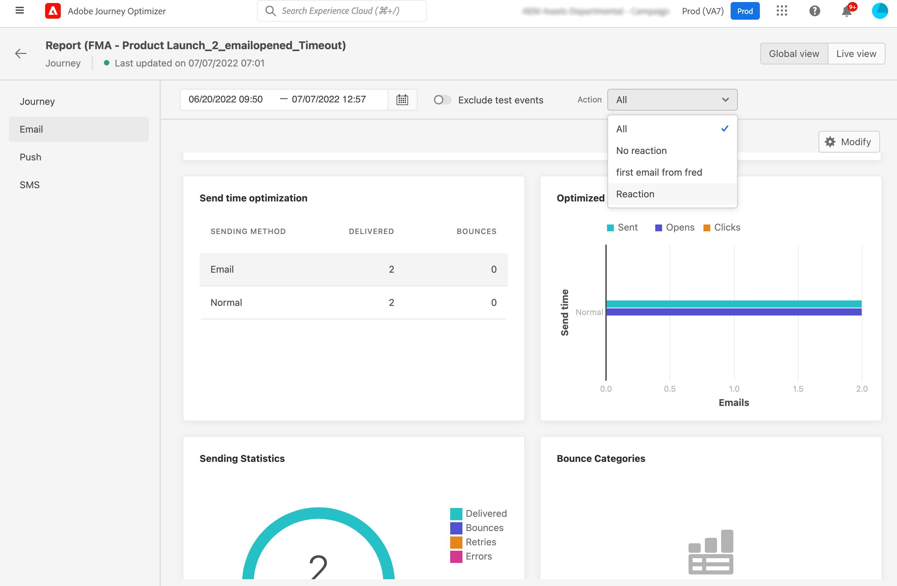

# Migration de la création en ligne - Aperçu{#inline-authoring}

>[!CONTEXTUALHELP]
>id="ajo_messages_migration_before"
>title="En savoir plus sur la nouvelle fonctionnalité de création en ligne"
>abstract="Depuis le 25 juillet 2022, les messages sont créés directement depuis un Parcours. Les messages existants sont automatiquement migrés vers le nouveau modèle. Des actions supplémentaires seront nécessaires après la migration, si vous utilisez actuellement des messages dans vos parcours."
>additional-url="https://experienceleague.adobe.com/docs/journey-optimizer/using/whats-new/inline-authoring/inline-messages-steps.html?lang=en" text="Etapes de migration"

>[!CONTEXTUALHELP]
>id="ajo_messages_migration_during"
>title="Découvrez ce qui se passe"
>abstract="Depuis le 25 juillet 2022, les messages sont créés directement depuis un Parcours. Votre environnement est en cours de migration. Des actions supplémentaires seront nécessaires après la migration."
>additional-url="https://experienceleague.adobe.com/docs/journey-optimizer/using/whats-new/inline-authoring/inline-messages-steps.html?lang=en" text="Etapes de migration"

>[!CONTEXTUALHELP]
>id="ajo_messages_migration_after"
>title="Découvrez comment migrer vos messages"
>abstract="Depuis le 25 juillet 2022, les messages sont créés directement depuis un Parcours. Les messages existants ont été migrés vers le nouveau modèle. En tant que praticien de parcours, des actions supplémentaires sont désormais nécessaires."
>additional-url="https://experienceleague.adobe.com/docs/journey-optimizer/using/whats-new/inline-authoring/inline-messages-steps.html?lang=en" text="Etapes de migration"

>[!CONTEXTUALHELP]
>id="ajo_messages_depecrated_inventory"
>title="Découvrez comment migrer vos messages"
>abstract="Depuis le 25 juillet 2022, le menu Messages disparaît et les messages sont créés directement à partir d’un Parcours. Si vous souhaitez réutiliser vos messages hérités dans parcours, vous devez les enregistrer en tant que modèles."
>additional-url="https://experienceleague.adobe.com/docs/journey-optimizer/using/design/email-templates.html#save-as-template?lang=en" text="Enregistrer les messages en tant que modèles"

Adobe Journey Optimizer propose une nouvelle fonctionnalité qui améliore la création de contenu pour les canaux Journey Optimizer (email, push, SMS). En tant que praticien de Journey Optimizer, vous créez maintenant vos messages directement à partir d’un parcours.

Cette fonctionnalité nécessite une migration des parcours existants qui utilisent des messages. Dans cette page, vous trouverez les informations nécessaires sur cette modification ainsi que les étapes que vous devez suivre.

Pour plus d’informations sur vos rôles et responsabilités en tant que praticien Journey Optimizer, reportez-vous à cette section [page](../start/path/marketer.md).

<!--
Here are the main changes in the interface:

* Messages are created direcly from journeys.
* The **Messages** entry in the left navigation menu has been removed. 
* There is no separate library of messages, the journey now centralizes all components.

-->

>[!VIDEO](https://video.tv.adobe.com/v/344698)

## Principales prises en charge{#keys}

* **Suis-je affecté ?**: vous êtes affecté si vous créez des messages à partir du **Messages** dans le volet de navigation de gauche et utilisez-les dans vos parcours. Si vous utilisez un système tiers (tel qu’Adobe Campaign), vous n’êtes pas affecté par cette migration.

* **Modifications des produits**: à la phase de disponibilité générale (25 juillet), le contenu de votre canal est créé et géré dans chaque parcours. Le **Messages** , dans le volet de navigation de gauche n’est plus disponible ([en savoir plus](../rn/inline-messages.md#change)). Nous allons procéder à une migration pour vos parcours existants.

* **Chronologie**: la migration se produit pour chaque région la nuit, via plusieurs [itérations](../rn/inline-messages.md#iterations).

   

* **Actions requises**: une conversion automatique de parcours est effectuée pour vous. Cela dit, nous avons besoin de votre aide avec quelques étapes. En savoir plus sur les étapes requises dans cette section [page](../rn/inline-messages-steps.md).

* **Obsolescence**: après le 6 septembre, tous les parcours qui utilisent encore des messages hérités sont arrêtés et seront supprimés ultérieurement.

## Avantages et modifications des produits{#change}

La vision d’Adobe est de simplifier le produit en continu afin de fournir des flux d’utilisateurs efficaces et optimisés. Cette nouvelle méthode de création de messages simplifie le processus utilisateur.

Nous avons conçu ce nouveau workflow pour centraliser le contenu à un seul endroit, directement là où il est utilisé.

La création de contenu est désormais effectuée directement dans le parcours. L&#39;immédiat **avantages** vous obtenez :

* Création plus rapide de parcours à l’aide des canaux Journey Optimizer dans un seul flux.
* Visualisation rapide du contenu en basculant facilement entre tous les contenus d’email, de notification push et de SMS dans un parcours.
* Amélioration du flux pour les emails et les notifications push à l’aide de la personnalisation contextuelle à partir de la zone de travail.
* Les rapports de parcours centralisent les informations détaillées sur les rapports de canal.

Voici les **modifications de produit** grâce à cette nouvelle fonctionnalité :

<table>
<tr>
<th>Avant migration</th>
<th>Après la migration</th>
</tr>
<tr>
<td>
Avant, vous avez créé votre message à partir du <strong>Messages</strong> . 
</td>
<td>
Maintenant, le <strong>Messages</strong> , dans le volet de navigation de gauche n’est plus disponible. 
</td>
</tr>
<tr>
<td>
Vous avez ensuite créé un parcours et ajouté une <strong>Message</strong> et sélectionner le message créé précédemment.
</td>
<td>
Il vous suffit maintenant d’ajouter l’activité d’action de canal souhaitée (email, SMS, notification push) à votre parcours. Dans l'activité, vous pouvez directement configurer les paramètres du message et accéder à l'éditeur de contenu.
</td>
</tr>
<tr>
<td>
Auparavant, les rapports étaient accessibles aux niveaux du message et du parcours. Vous deviez naviguer entre l'onglet Exécution du message et le rapport parcours.
</td>
<td>
Tous les rapports sont désormais centralisés au niveau des parcours. Cela améliore la navigation et l’expérience utilisateur. Lorsque plusieurs emails sont présents dans un parcours, vous pouvez utiliser la variable <strong>Action</strong> menu déroulant pour afficher le rapport associé.

</td>
</tr>
</table>

Lors de la phase de disponibilité générale (25 juillet), ce nouveau flux d’utilisateurs s’applique à tous les nouveaux parcours. Le **Messages** , dans le volet de navigation de gauche n’est plus disponible.

## Chronologie de la migration{#iterations}

Une migration est requise pour activer vos parcours existants à l’aide de **Messages** dans des parcours avec des actions intégrées créées. Une conversion automatique de parcours est effectuée pour vous. Cela dit, nous avons besoin de votre aide avec quelques étapes.

La migration se produit pour chaque région la nuit, via plusieurs itérations. Voici la chronologie de migration :

* 25 juillet 2022 : GA - 1ère itération
* 1er août 2022 : 2e itération
* 5 septembre 2022 : 3e itération
* 6 septembre 2022 : obsolescence

Pourquoi avons-nous besoin de plusieurs itérations ?

Au cours d&#39;une itération, nous allons passer en revue chaque parcours et nous les migrons lorsque cela est possible. Dans certains cas, la migration automatique n’est pas souhaitée : lorsque le parcours est actif ou fermé (ce qui signifie qu’il peut toujours y avoir des profils). Dans ce cas, nous vous demandons d’effectuer une action, puis l’itération suivante migre ces parcours qui n’ont pas pu être migrés dans l’itération précédente.

## FAQ {#faq}

### Comment serai-je informé du changement ?{#inform}

Adobe communique avec vous avant la première itération.

Le changement est déployé du jour au lendemain, par le biais de plusieurs itérations. En savoir plus sur [itérations](../rn/inline-messages.md#inline-authoring).

Vous êtes également informé par des notifications internes au produit, affichées sur les écrans de Parcours :

* Avant de modifier le déploiement

   

* Pendant une itération

   

* Après une itération

   

   Après une itération, la variable **Vérifier l’état** s’affiche. Vous pouvez ainsi afficher tous vos parcours au format JSON et leur état de migration respectif. Consultez cette [section](../rn/inline-messages.md#status).

* Lorsque la bannière disparaît, vous êtes doué pour y aller. Aucune autre action de votre part n’est requise.

### Qu’est-ce que le processus de migration ?{#process}

La migration est entièrement automatique pour les parcours qui ne sont pas actifs ou fermés. Nous ne voulons pas avoir d’impact sur les parcours en direct ou fermés pour éviter tout impact sur la production. Nous vous demandons de publier la nouvelle version que nous avons créée pour vous.

Tous les environnements de test d’une organisation client sont traités simultanément. Lors du déploiement de la modification, les actions suivantes sont exécutées :

**TOUT parcours n’utilisant pas de messages**

Elles ne sont pas affectées par la modification. Seuls les parcours utilisant les messages sont ciblés par la migration. Cependant, vous pourrez toujours accéder aux messages qui ne sont pas utilisés dans un parcours via l&#39;URL suivante : https://experience.adobe.com/#/@[ORG]/sname:[ENVIRONNEMENT DE TEST]/parcours-optimizer/messages/

**BROUILLER les parcours à l’aide d’au moins un message**

Les versions préliminaires des messages sont modifiées pendant la migration. Ils ne font plus référence à un message. Le **Message** Les activités sont remplacées par les activités d’action de canal appropriées. Chacun d’eux inclut les paramètres de canal et le contenu.

Comme d’habitude, testez votre parcours de brouillon avant de le publier.

**PARCOURS LIVE utilisant au moins un message**

La version en direct d’un parcours continue à fonctionner pour éviter tout impact sur la production.

Une nouvelle version préliminaire de ce parcours est créée lors de la migration. Cette nouvelle version préliminaire est une copie de votre version active, mais les messages sont remplacés par des actions de canal créées en ligne. Chaque activité d’action de canal inclut les paramètres et le contenu du canal. Le contenu n’est pas perdu. Les rapports ne sont pas perdus.

Nous prévoyons que vous examiniez cette version préliminaire, que vous la testiez et que vous la publiiez afin qu’elle devienne la version en ligne.

**PARCOURS TERMINÉS ou ARRÊTÉS utilisant au moins un message**

Ces parcours sont également migrés.

Lors de l’affichage du rapport parcours, les rapports sont désormais plus riches et incluent le niveau d’information précédemment disponible dans le rapport Message.

**PARCOURS FERMÉS utilisant au moins un message**

La version fermée d’un parcours continue à s’exécuter pour tout profil à l’intérieur, afin d’éviter tout impact sur la production.

Les parcours fermés passent automatiquement au statut &quot;Terminé&quot; après 30 jours. Elles seront prises en compte lors de la prochaine itération, une fois qu’elles auront terminé.

**Parcours multicanaux**

Ils ne sont pas migrés. Vous devez les recréer.

### Quels sont mes éléments d’action en tant que client ?{#actions}

Une conversion automatique des parcours est effectuée pour vous, mais quelques étapes sont requises. En savoir plus sur les étapes requises dans cette section [page](../rn/inline-messages-steps.md).

<!--

The process timeline is indicated in a blue banner on the Journeys screen. See this [section](../rn/inline-messages.md#inform). 

**Before migration**

* Check the date indicated in the banner. 
* Stop non-critical journeys, on development, stage and production environments.
* If you have draft messages that you want to keep using, add them to a journey so they are migrated.

**During migration**

* Migration occurs at night-time
* Do not to create, edit or delete journeys.

**After migration**

* After each iteration, click the **Check status** button in the top banner. This page lists all journeys and their migration status. See this [section](../rn/inline-messages.md#status). 

* For each live journey, a new version is created. Review the new version, test it and publish it. 

* The **Messages** menu, in the left navigation is no longer available. You need to use the new in-line message feature. See this [section](../rn/inline-messages.md#change). 

* If you need to access a specific message which was not used in a journey, you can use this URL and save the content as a template: https://experience.adobe.com/#/@[ORG]/sname:[SANDBOX]/journey-optimizer/messages/

## How can I check the migration status?{#status}

Click the **Check status** button in the top banner. The following page is displayed.

The status report is at sandbox level. This report includes several useful sections:

**migrationStatus**

This section displays the migration information since the first iteration. Numbers are incremented after each iteration.

* MIGRATED: number of draft journeys migrated successfully.
* NEW_VERSION_CREATED: number of live journeys migrated. For each live journey, a new draft version is created: you must test and publish this version.
* ERROR: number of draft journeys not migrated because of a failure. You need to re-create them.
* ERROR_ON_NEW_VERSION_CREATION: number of live journeys not migrated because of a failure. new draft journey versions not migrated because of a failure. You need to re-create them.

**eligibilityStatus**

This section lists the remaining items after the last iteration:

* toMigrate: number of draft journeys that need to be migrated.
* createNewVersion: number of live journeys to migrate.
* noMigration_live: number of live journeys that do not need to be migrated
* noMigration: number of draft journeys that do not need to be migrated.

The **details** section gives, for each of the above indicators, the list of related journeys.

-->

### Comment puis-je vérifier l’état de migration ?{#status}

Cliquez sur le bouton **Vérifier l’état** dans la bannière supérieure. La page suivante s’affiche.

Le rapport d’état se trouve au niveau des environnements de test. Ce rapport comprend plusieurs sections utiles :

**migrationStatus**

Cette section présente les informations de migration depuis la première itération. Les nombres sont incrémentés après chaque itération.

* MIGRATED : Nombre de parcours en version préliminaire, terminés et arrêtés migrés avec succès.
* NEW_VERSION_CREATED : nombre de parcours actifs migrés. Pour chaque parcours actif, une nouvelle version de brouillon est créée : vous devez tester et publier cette version.
* ERROR : Nombre de parcours en version préliminaire, terminés et arrêtés qui n’ont pas été migrés en raison d’un échec. Vous devez les recréer.
* ERROR_ON_NEW_VERSION_CREATION : nombre de parcours actifs non migrés en raison d’un échec. les nouvelles versions de parcours de brouillons ne sont pas migrées en raison d’un échec. De nouvelles versions préliminaires n’ont pas été créées pour elles. Vous devez les recréer manuellement.

**éligibilitéStatus**

Cette section répertorie les éléments restants après la dernière itération :

* toMigrate : nombre de parcours en version préliminaire, terminés et arrêtés qui doivent être migrés.
* createNewVersion: nombre de parcours actifs à migrer.
* noMigration_live: nombre de parcours actifs qui n’ont pas besoin d’être migrés. Les parcours fermés sont également répertoriés ici.
* noMigration : nombre de parcours qui n’ont pas besoin d’être migrés.

Le **détails** donne, pour chacune des sections ci-dessus, la liste des parcours associés.

### Ce changement entraînera-t-il une interruption de service ?{#interruption}

Il n&#39;y aura pas d&#39;interruption de service.

* Sur les parcours en direct : sans impact, ils continuent à courir.
* Sur les parcours créés : lors de la migration (de nuit), il est vivement recommandé de ne pas créer, modifier ni supprimer des parcours.

### Y aura-t-il une perte de données ? {#data}

Il n’y aura aucune perte de données et aucun impact sur les parcours en direct. Vous aurez le contrôle de la publication des versions de parcours mises à jour.

### Les fonctionnalités seront-elles perdues ?{#functionality}

La façon dont vous créez un message change. Les fonctionnalités ne seront pas perdues.

### L’environnement sera-t-il accessible pendant le processus de migration ?

La migration se produit la nuit. Vous pourrez utiliser le produit. Mais ne créez, ne modifiez pas ou ne supprimez pas de parcours.

### Les messages continueront-ils à être envoyés ?

Oui, les parcours en direct continuent à courir.

### Comment puis-je savoir que la migration est terminée ?

La migration est terminée lorsque la bannière disparaît. Consultez cette [section](../rn/inline-messages.md#inform).

<!--
* Improved authoring flow and navigation
* Personalization: improved contextual personalization flow
* Reporting: the message execution screen will no longer exist. Reporting is centralized in journeys.
* You will still be able to update content in a live journey.
->>
