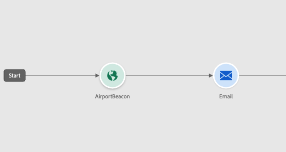

# Bienvenue dans le concepteur de Parcours amélioré {#new-canvas}

Journey Optimizer propose désormais une **modèle de parcours simplifié** qui vise à améliorer les processus internes. Bien que ce nouveau modèle soit une amélioration principale, notre équipe a profité de l’occasion pour ajouter des fonctionnalités visibles et bénéfiques pour les utilisateurs de Journey Optimizer :

* A **canevas de parcours reconçu** Conçu pour une expérience d’interface utilisateur modernisée
* A **création de rapports en direct** Interface utilisateur directement disponible dans le canevas de parcours

>[!NOTE]
>
>Gardez à l’esprit que le déploiement de cette fonctionnalité sera progressif. Il se peut que vous ne voyiez pas les modifications immédiatement.

## Mises à jour du modèle de parcours

Le nouveau modèle de parcours sera associé au modèle existant, ce qui signifie qu’il y aura des parcours utilisant **deux modèles différents**:

* Le modèle hérité
* Le nouveau modèle

Tous les parcours du modèle hérité y resteront. Vous pourrez toujours les modifier, les tester ou les publier. Toute nouvelle version créée à partir d’un parcours sur le modèle hérité y restera également. Il y a **aucune modification fonctionnelle** autour de ces parcours.

Comme vous pouvez le voir dans la capture d’écran ci-dessous, les noeuds sont en forme ronde, qui est l’ancienne interface utilisateur pour les parcours sur le modèle hérité.

Cependant, lorsque vous **créer un parcours** ou **dupliquer un existant**, il sera sur le nouveau modèle. Les parcours sur le modèle hérité seront toujours pris en charge jusqu’à ce qu’une majorité de clients soient transférés vers le nouveau modèle.

Il y a une limitation au nouveau modèle de parcours : il sera **Il n’est pas possible de copier et coller des activités du modèle hérité dans le nouveau modèle, et vice versa.**. Si vous souhaitez effectuer cette opération, nous vous conseillons de dupliquer votre parcours hérité pour le changer en nouveau modèle, puis de copier vos activités.

Dans la capture d’écran ci-dessous, vous pouvez voir l’interface utilisateur repensée pour le canevas de parcours (disponible uniquement avec le nouveau modèle) :

**À partir de maintenant, toute nouvelle fonctionnalité ajoutée au concepteur de parcours (y compris les rapports en direct) sera disponible uniquement pour les parcours sur le nouveau modèle.**

## Amélioration de la conception du canevas de parcours

Avec le nouveau modèle de parcours, nous introduisons un nouveau modèle amélioré. **Interface utilisateur du canevas de parcours**, qui s’intègre parfaitement dans l’écosystème d’applications et de solutions Adobe Experience Cloud, ce qui permet une expérience utilisateur intuitive et efficace. Tout parcours dans le nouveau modèle sera sur cette nouvelle conception.

Les activités seront désormais représentées par des cases carrées avec les fonctionnalités suivantes :

* La première ligne représentant le type d’activité qui sera souvent remplacée par des informations plus contextuelles (par exemple : sur Lecture d’audience, elle contiendra le nom de l’audience sélectionnée) ou par un libellé personnalisé si vous en définissez une.
* La deuxième ligne représente toujours le type d’activité.

Cette nouvelle interface utilisateur améliore la lisibilité du canevas de parcours en fournissant des **libellés et types d’activité plus clairs**.

Elle permet également à l’équipe produit d’ajouter plus d’informations sur la zone de travail avec moins de clics. Un exemple d’&quot;informations supplémentaires&quot; est l’inclusion des rapports en direct dans le canevas de parcours, où vous pouvez voir les profils entrant et sortant de vos activités en raison d’erreurs.

## Création de rapports en direct dans le canevas de parcours

En plus de la conception améliorée de la toile de parcours, nous introduisons la possibilité de voir **mesures de création de rapports des dernières 24 heures** (appelé &quot;création de rapports en direct&quot;) directement dans la zone de travail du parcours.

Avec chaque parcours en direct sur le nouveau modèle, vous pourrez voir : **sur chaque activité**, le nombre de profils ayant participé à cette activité et le nombre ayant quitté l&#39;activité en raison d&#39;une erreur :

<!--`
With every live journey on the new model, you will be able to see two types of "last 24 hours" reporting information:

* On a **new insert**, you will see:
    * The number of profiles that have been exported for audience-triggered journeys. You will see the number of profiles available in the last export job alongside the time when that export has been made.
    * The number of profiles who exited the journey
    * The percentage of errors
    
* **On each activity**, you will see the number of profiles who entered that activity and the number who exited because of an error:
    
-->

L’interface utilisateur est automatiquement actualisée toutes les minutes.

<!--
Please note that you may see differences between the number of exported profiles and the number of profiles flowing through the journey. The exported profiles count only provides information about the last export job being made while the number of profiles entering an activity only contains profiles who did it in the last 24 hours. This can especially be visible on recurring daily journeys as there could be a data overlap between two days.
-->
