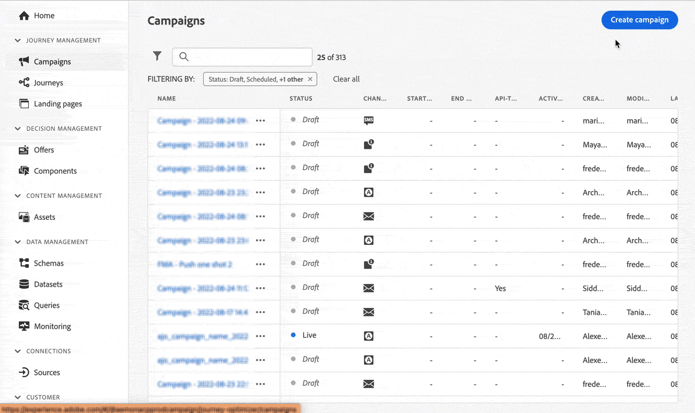

# Notes de mise à jour 2022 {#release-notes-2022}

Cette page répertorie toutes les fonctionnalités et améliorations pour [!DNL Journey Optimizer] publiées en 2022.

## Version d’octobre 2022 {#oct-2022-release}

<!--

### New capability{#oct-2022-features}

<table>
<thead>
<tr>
<th><strong>Direct Mail Channel (Limited Availability)</strong> </th>
</tr>
</thead>
<tbody>
<tr>
<td>

You can now add direct mail messages in your campaigns and journeys. Direct mail is an offline channel that allows you to personalize and generate the files required by direct mail providers to send mail to your customers.

When you prepare a direct mail delivery, Journey Optimizer generates a file including all the targeted profiles and the chosen contact information (postal address for example). You will then be able to send this file to your direct mail provider who will take care of the actual sending.

</td>
</tr>
</tbody>
</table>

-->

### Améliorations {#oct-2022-improvements}

**Parcours**

* L’option **Forcer une rentrée sur une périodicité** a été ajoutée dans les paramètres de planning de lecture d’audience récurrente. Cette option permet de faire en sorte que tous les profils toujours présents dans le parcours le quittent automatiquement lors de la prochaine exécution. Lorsque l’option est désactivée, les profils doivent terminer le parcours avant de pouvoir entrer à nouveau dans une autre occurrence. [En savoir plus](../building-journeys/read-audience.md#configuring-segment-trigger-activity)

**Administration**

* Un message a été ajouté à l’interface utilisateur pour signaler que les configurations du sous-domaine, du sous-domaine de la page de destination, de l’enregistrement PTR et du groupe d’adresses IP sont communes à tous les sandbox. Toute modification de l’une de ces configurations aura donc un impact sur les sandbox de production.
* Les étapes de chargement de la liste de suppression au format CSV à partir de l’interface utilisateur ont été modifiées. [En savoir plus](../configuration/manage-suppression-list.md#download-suppression-list)

**Campagnes**

* Désormais, vous pouvez archiver les campagnes terminées et arrêtées. [En savoir plus](../campaigns/manage-campaigns.md#archive)

## Version de septembre 2022{#sept-2022-release}

### Nouvelles fonctionnalités{#sept-2022-features}

<table>
<thead>
<tr>
<th><strong>Contenu dynamique et nouveau créateur de règles conditionnelles</strong> </th>
</tr>
</thead>
<tbody>
<tr>
<td>

Vous pouvez maintenant créer du contenu dynamique pour adapter le contenu de vos messages selon des règles conditionnelles.
 

Les règles conditionnelles sont créées à l’aide d’un créateur de règles visuel dans l’éditeur d’expression, où vous pouvez les stocker pour les réutiliser ultérieurement dans vos parcours et campagnes.

Pour plus d’informations, consultez la <a href="../personalization/get-started-dynamic-content.md">documentation détaillée</a>.
</td>
</tr>
</tbody>
</table>

<table>
<thead>
<tr>
<th><strong>Campagnes déclenchées par l’API</strong> </th>
</tr>
</thead>
<tbody>
<tr>
<td>

Outre les campagnes planifiées existantes, vous pouvez désormais créer des campagnes déclenchées par l’API dans Journey Optimizer et les appeler à partir d’un système externe à l’aide d’API.

Vous pouvez ainsi couvrir divers besoins de messagerie opérationnelle et transactionnelle tels que les réinitialisations de mot de passe, le jeton OTP, etc.

Pour plus d’informations, consultez la <a href="../campaigns/api-triggered-campaigns.md">documentation détaillée</a>.
</td>
</tr>
</tbody>
</table>

<table>
<thead>
<tr>
<th><strong>Contrôle d’accès aux données</strong> </th>
</tr>
</thead>
<tbody>
<tr>
<td>

Grâce au contrôle d’accès basé sur les attributs, les administrateurs peuvent contrôler l’accès à des objets spécifiques en fonction de certains attributs. Ces attributs peuvent être des métadonnées ajoutées à un objet, comme des libellés. À compter de cette version, les administrateurs peuvent également définir des rôles utilisateur ayant accès à des champs et/ou des objets spécifiques, ainsi qu’aux données qui correspondent à ces champs et/ou objets.

 L’utilisation du contrôle d’accès basé sur les attributs est actuellement limitée à certains clients et sera déployée dans tous les environnements dans une prochaine version.

Pour plus d’informations, consultez la <a href="../administration/object-based-access.md">documentation détaillée</a>.
</td>
</tr>
</tbody>
</table>

<table>
<thead>
<tr>
<th><strong>Gouvernance et confidentialité des données</strong> </th>
</tr>
</thead>
<tbody>
<tr>
<td>

Grâce à son cadre de gouvernance DULE (Data Usage Labelling and Enforcement), Journey Optimizer peut désormais tirer parti des politiques de gouvernance d’Adobe Experience Platform pour empêcher l’export de champs sensibles vers des systèmes tiers au moyen d’actions personnalisées. Si le système identifie un champ restreint dans les paramètres d’action personnalisée, une erreur s’affiche, vous empêchant de publier le parcours.

L’utilisation de l’outil DULE (Data Usage Labelling and Enforcement) est actuellement limitée à certains clients et sera déployée dans tous les environnements dans une prochaine version.

Pour plus d’informations, consultez la <a href="../action/action-privacy.md">documentation détaillée</a>.
</td>
</tr>
</tbody>
</table>

<table>
<thead>
<tr>
<th><strong>Application du consentement automatisée (politiques de consentement)</strong> </th>
</tr>
</thead>
<tbody>
<tr>
<td>

Adobe Experience Platform vous permet d’adopter et d’appliquer facilement des politiques marketing afin de respecter les préférences de consentement de vos clients. Les politiques de consentement sont définies dans Adobe Experience Platform. Dans Journey Optimizer, vous pouvez appliquer ces politiques de consentement à vos actions personnalisées. Par exemple, vous pouvez définir des politiques de consentement pour exclure les clients qui n’ont pas consenti à recevoir des communications par e-mail, push ou SMS.

L’application automatisée du consentement n’est actuellement disponible que pour les organisations qui ont acheté le module complémentaire Healthcare Shield.

Pour plus d’informations, consultez la <a href="../action/consent.md">documentation détaillée</a>.
</td>
</tr>
</tbody>
</table>

<table>
<thead>
<tr>
<th><strong>Gestion des autorisations</strong> </th>
</tr>
</thead>
<tbody>
<tr>
<td>

Journey Optimizer prend en charge la définition des rôles utilisateur et des politiques d’accès pour gérer les autorisations des fonctionnalités et des objets. Grâce aux <strong>autorisations Adobe Experience Cloud</strong>, vous pouvez créer et gérer des rôles, ainsi qu’attribuer les autorisations de ressource souhaitées pour ces rôles. Les autorisations vous permettent également de gérer les libellés, les sandbox et les utilisateurs associés à un rôle spécifique.

 L’utilisation des autorisations est actuellement limitée à certains utilisateurs et sera déployée dans tous les environnements dans une prochaine version.

Pour plus d’informations, consultez la <a href="../administration/attribute-based-access.md">documentation détaillée</a>.
</td>
</tr>
</tbody>
</table>

<table>
<thead>
<tr>
<th><strong>Alertes et surveillance</strong> </th>
</tr>
</thead>
<tbody>
<tr>
<td>

En tant qu’utilisateur ou utilisatrice de Journey Optimizer, vous pouvez désormais accéder aux alertes système par le biais de l’interface d’utilisation afin de recevoir une notification lorsque les parcours ne fonctionnent pas comme prévu. Vous pouvez afficher les alertes disponibles et vous y abonner. La première alerte disponible dans cette version vous avertit si une activité Lecture d’audience n’a traité aucun profil pendant la période définie. D’autres informations seront disponibles maintenant que ce workflow est déverrouillé.

<!--p>For more information, refer to the <a href="../reports/alerts.md">detailed documentation</a>.</p-->
</td>
</tr>
</tbody>
</table>

<!--table>
<thead>
<tr>
<th><strong>Data Hygiene</strong> </th>
</tr>
</thead>
<tbody>
<tr>
<td>

Adobe Experience Platform provides a suite of data hygiene capabilities that allow you manage your stored data through programmatic deletions of consumer records and datasets. This capability is now available for Adobe Journey Optimizer. 

You can manage your data stores to ensure that information is used as expected, is updated when incorrect data needs fixing, and is deleted when organizational policies deem it necessary.

<strong>Caution</strong> - Data Hygiene capabilities are currently only available for organizations that have purchased the Healthcare Shield add-on offering.

For more information, refer to the <a href="../building-journeys/read-audience.md#configuring-segment-trigger-activity">detailed documentation</a>.
</td>
</tr>
</tbody>
</table-->

### Améliorations{#sept-2022-improvements}

**Parcours**

* Le **jeu de données d’entité** est désormais disponible en tant que jeu de données prêt à l’emploi dans Adobe Journey Optimizer. Ce jeu de données de recherche comprend des métadonnées pour enrichir les informations des jeux de données de tracking et de commentaires. Vous pourrez ainsi améliorer vos rapports et requêtes avec des données plus compréhensibles. [En savoir plus](../data/datasets-query-examples.md#entity-dataset)
* Un nouveau mécanisme de sécurisation a été ajouté aux parcours unitaires (commençant par un événement ou une qualification d’audience) pour empêcher que les parcours ne soient déclenchés par erreur plusieurs fois pour le même événement. La rentrée du profil sera désormais temporairement bloquée par défaut pendant 5 minutes. [En savoir plus](../start/guardrails.md#events-g)

**Administration**

* Lors de l’activation ou de la désactivation de la liste autorisée, un nouveau message d’avertissement s’affiche désormais pour détailler les impacts de chaque action. [En savoir plus](../configuration/allow-list.md#enable-allow-list)
* Mise à jour de l’interface d’utilisation pour la création de configurations de canal, la création de groupes d’adresses IP, la gestion de la liste de suppressions et de la liste autorisée, ainsi que la configuration du canal SMS.
* Désormais, lors de la création de la première configuration de canal pour un sous-domaine donné, le temps de traitement prend entre 10 minutes et 10 jours, et jusqu’à 3 heures seulement pour les surfaces suivantes utilisant ce sous-domaine. [En savoir plus](../configuration/channel-surfaces.md#create-channel-surface)
* Mise à jour de l’interface utilisateur pour la création de préréglages de pages de destination et de sous-domaines de pages de destination. [En savoir plus](../landing-pages/lp-subdomains.md)

**Contrôles d’audit**

* Avec Journey Optimizer, vous pouvez identifier les actions effectuées par les utilisateurs du système sur divers services et fonctionnalités tels que les campagnes, les parcours, les messages, les pages de destination, etc. Les ressources du journal d’audit incluent désormais des modifications sur diverses autres actions et sont enregistrées automatiquement au fur et à mesure de l’activité. En savoir plus [sur cette page](../privacy/audit-logs.md).

**Prise en charge de l’archivage**

* Le nouveau **jeu de données d’entité** inclut un champ Modèle qui permet d&#39;exporter le format et la structure des messages envoyés sur tous les canaux à des fins d&#39;archivage. [En savoir plus](../configuration/archiving-support.md)

**Pages de destination**

* Vous pouvez désormais utiliser des données contextuelles provenant d&#39;une autre page dans la même page de destination. Par exemple, si vous associez une case à cocher à une liste d’abonnements sur la page de destination principale, vous pouvez utiliser cette liste d’abonnements sur la sous-page « merci ». [En savoir plus](../landing-pages/lp-content.md#use-primary-page-context)

<!--* When configuring the primary page, you can now create additional data to enable storing information when the landing page is being submitted. [Learn more](../landing-pages/lp-content.md#use-additional-data)-->

<!--* You can now use information that was submitted on a landing page to send communications to your customers. For example, if a user subscribes to a given subscription list, you can leverage that information to send an email recommending other subscription lists to that user.-->

### Autres modifications{#sept-2022-other}

* Le mode de parcours en rafale a été remplacé par le mode de diffusion rapide des campagnes. [En savoir plus](../push/create-push.md#rapid-delivery)
* Pour améliorer les performances, les groupes de champs d’événement d’expérience ne peuvent plus être utilisés dans les parcours commençant par une lecture d’audience, une qualification d’audience ou une activité d’événement métier. Cette modification s’applique uniquement aux nouveaux parcours. Ceux qui existent déjà conserveront le comportement actuel. [En savoir plus](../start/guardrails.md#expression-editor)
* La limitation d’une heure pour les parcours de lecture d’audience planifiés a été supprimée. Ces parcours peuvent désormais être exécutés sans délai.

## Version d’août 2022 {#aug-2022-release}

### Nouvelles fonctionnalités

<table>
<thead>
<tr>
<th><strong>Créer et gérer des campagnes dans Journey Optimizer</strong> </th>
</tr>
</thead>
<tbody>
<tr>
<td>

Utilisez les campagnes de Journey Optimizer pour diffuser du contenu ponctuel sur une audience spécifique à l’aide de divers canaux. Lors de l’utilisation de parcours, les actions sont conçues pour être exécutées en séquence. Avec les campagnes, les actions sont exécutées simultanément, immédiatement ou selon un planning spécifié. 

Découvrez comment créer une campagne dans la <a href="../campaigns/get-started-with-campaigns.md">documentation détaillée</a> et la <a href="https://video.tv.adobe.com/v/346680">vidéo sur les fonctionnalités</a>.
</td>
</tr>
</tbody>
</table>

<table>
<thead>
<tr>
<th><strong>Envoyer des SMS à vos utilisateurs (disponibilité générale)</strong> </th>
</tr>
</thead>
<tbody>
<tr>
<td>

Vous pouvez désormais créer, personnaliser et envoyer des SMS dans Journey Optimizer, grâce à une intégration à <b>Sinch</b> ou <b>Twilio</b>.

Découvrez comment créer et envoyer un SMS dans cette <a href="../sms/create-sms.md">documentation détaillée</a>.

</td>
</tr>
</tbody>
</table>

<!--table>
<thead>
<tr>
<th><strong>New Dynamic Expression Builder</strong> </th>
</tr>
</thead>
<tbody>
<tr>
<td>

You can now create conditional content blocks across different authoring services to personalize your content.

In addition to the Personalization Expression Library, the Expression Editor provides a new Conditional Rule Builder to help you design and save your content blocks.

For more information, refer to the <a href="../building-journeys/read-audience.md#configuring-segment-trigger-activity">detailed documentation</a>.
</td>
</tr>
</tbody>
</table-->

### Améliorations

**Reporting**

* Le tableau et le graphique des politiques de consentement sont désormais disponibles dans les rapports globaux de parcours. Ces widgets vous permettent de suivre les profils exclus des politiques de vos actions personnalisées. [En savoir plus](../reports/journey-global-report-cja.md#journey-global)

  Pour avoir accès aux derniers widgets, vous devrez réinitialiser les différents tableaux de bord de rapports. Pour plus d’informations sur la personnalisation des tableaux de bord, consultez la [documentation détaillée](../reports/report-gs-cja.md).

**Administration**

* Il est désormais possible de mettre à jour le principal numéro de téléphone à utiliser pour le canal SMS. [En savoir plus](../configuration/primary-email-addresses.md)

## Version de juillet 2022 {#july-2022-release}

### Nouvelles fonctionnalités

<table>
<thead>
<tr>
<th><strong>Nouveau flux de messagerie en ligne</strong> </th>
</tr>
</thead>
<tbody>
<tr>
<td>

Journey Optimizer fournit un nouveau flux pour la création de messages dans les parcours. La messagerie en ligne permet aux utilisateurs de gagner du temps et de rationaliser le workflow de création et de diffusion d’un e-mail, d’une notification push ou d’un SMS dans Journey Optimizer. Parce que les messages ne sont plus une étape distincte et qu’ils sont désormais modifiables en ligne dans le cadre d’une action sur la zone de travail du parcours, les utilisateurs devront cliquer sur moins de boutons et parcourir moins d’écrans pour concevoir et modifier leur contenu.

</td>
</tr>
</tbody>
</table>

<table>
<thead>
<tr>
<th><strong>Contrôle d’accès basé sur les attributs (disponibilité limitée)</strong> </th>
</tr>
</thead>
<tbody>
<tr>
<td>

Vous pouvez désormais identifier les champs de schéma avec des libellés qui définissent les portées d’utilisation des données ou de l’organisation. Les administrateurs peuvent utiliser l’interface Autorisations pour définir des politiques d’accès couvrant les champs de schéma XDM et mieux gérer l’accès attribué aux utilisateurs ou groupes d’utilisateurs (utilisateurs internes, externes ou tiers) et gérer l’accès à des types de données spécifiques (c’est-à-dire des données personnelles sensibles/SPD).

L’utilisation du contrôle d’accès basé sur les attributs est actuellement limitée à certains clients et sera déployée dans tous les environnements dans une prochaine version.

Pour plus d’informations, consultez la <a href="../administration/attribute-based-access.md">documentation détaillée</a>.

</td>
</tr>
</tbody>
</table>

<table>
<thead>
<tr>
<th><strong>Traitements de prise de décision par lots</strong> </th>
</tr>
</thead>
<tbody>
<tr>
<td>

Vous pouvez désormais exécuter des traitements de prise de décision par lots à partir de l’interface utilisateur. Vous n’avez ainsi plus besoin d’un développeur pour exécuter des traitements d’API par lots et le temps consacré au marketing est réduit. Cette nouvelle interface vous permet de créer des traitements et de gérer les traitements actuels/antérieurs.

Pour plus d’informations, consultez la <a href="../offers/batch-delivery.md">documentation détaillée.

</td>
</tr>
</tbody>
</table>

<table>
<thead>
<tr>
<th><strong>Utiliser automatiquement l’offre la plus performante dans vos décisions (disponibilité limitée)</strong> </th>
</tr>
</thead>
<tbody>
<tr>
<td>

Vous pouvez désormais utiliser des systèmes de modèles d’optimisation personnalisés dans la gestion des décisions. Ce nouveau type de modèle permet d’optimiser et de personnaliser les offres en fonction des audiences et des performances des offres.

L’utilisation des modèles d’IA d’optimisation personnalisés est actuellement limitée à certains utilisateurs et sera déployée dans tous les environnements dans une prochaine version.

Pour plus d’informations, consultez la <a href="../offers/ranking/personalized-optimization-model.md">documentation détaillée</a>.

</td>
</tr>
</tbody>
</table>

### Améliorations

**Parcours**

* **Terminaison d’un parcours** : dans la zone de travail du parcours, l’activité **Fin** a été supprimée de la palette. Les balises de fin sont désormais ajoutées par défaut à la fin de chaque chemin et ne peuvent pas être supprimées. Cette amélioration permet de créer un rapport plus optimal sur le moment où un client a quitté le parcours, sans aucune action requise de la part du praticien de parcours. Reportez-vous à la [documentation](../building-journeys/end-journey.md) et à la [vidéo de démonstration](https://video.tv.adobe.com/v/345376){target="_blank"}.

* L’option **Fuseau horaire du profil** est désormais décochée par défaut dans les propriétés de parcours. [En savoir plus](../building-journeys/timezone-management.md#timezone-from-profiles)

**Messages**

* Les paramètres prédéfinis de messages sont désormais les **configurations de canal**. [En savoir plus](../configuration/channel-surfaces.md)

**Administration**

* **Modification des enregistrements PTR** : désormais, lors de la mise à jour d’un enregistrement PTR, le temps de traitement ne prend que 3 heures. [En savoir plus](../configuration/ptr-records.md#processing)

* **Interface utilisateur de la liste autorisée** : vous pouvez désormais utiliser l’interface utilisateur de Journey Optimizer pour ajouter de nouvelles adresses e-mail ou de nouveaux domaines à la liste autorisée. [En savoir plus](../configuration/allow-list.md)

* **Mise à jour de la logique de la liste autorisée** : désormais, la logique de la liste autorisée s’applique dès que la fonctionnalité est activée, même si la liste est vide. [En savoir plus](../configuration/allow-list.md#logic)

* **Paramètres de tracking des URL** : vous pouvez désormais utiliser l’éditeur d’expression pour configurer les paramètres de tracking d’URL sur vos surfaces d’e-mail (c’est-à-dire les préréglages). [En savoir plus](../email/email-settings.md#url-tracking)

**Gestion des décisions**

* **Taille de l’audience** : un nouveau composant d’estimation de la taille de l’audience s’affiche désormais dans l’interface utilisateur lors de la création d’une règle de décision, lors de la sélection d’une audience ou d’une règle pour définir l’éligibilité d’une offre ou lors de l’ajout d’une audience ou d’une règle à une portée de décision.

## Version de juin 2022 {#june-2022-release}

### Nouvelles fonctionnalités

<table>
<thead>
<tr>
<th><strong>Envoyer des SMS à vos utilisateurs (disponibilité limitée)</strong> </th>
</tr>
</thead>
<tbody>
<tr>
<td>

Vous pouvez désormais créer, personnaliser et envoyer des SMS dans Journey Optimizer, grâce à une intégration à <b>Sinch</b> ou <b>Twilio</b>.

<!--img src="assets/do-not-localize/SMS.gif"/-->

Le canal SMS est actuellement disponible uniquement pour un ensemble d’organisations (disponibilité limitée). Pour en savoir plus, contactez votre représentant Adobe.

Découvrez comment créer et envoyer un SMS dans cette <a href="../sms/create-sms.md">documentation détaillée</a>.

</td>
</tr>
</tbody>
</table>

<table>
<thead>
<tr>
<th><strong>Trouvez des images plus percutantes plus rapidement grâce à l’intégration d’Adobe Stock.</strong> </th>
</tr>
</thead>
<tbody>
<tr>
<td>

Le module d’intégration du concepteur d’e-mail Adobe Stock et Adobe Journey Optimizer fournit aux clients une façon simple de naviguer, d’acquérir des produits sous licence et d’enregistrer des images en vue de les utiliser dans la création de messages.  La nouvelle option <b>Rechercher des photos Stock similaires</b> vous permet également de localiser les photos Stock qui correspondent au contenu, à la couleur et à la composition de vos images. 

Pour plus d’informations, consultez la <a href="../integrations/stock.md">documentation détaillée</a>.

</td>
</tr>
</tbody>
</table>

<table>
<thead>
<tr>
<th><strong>Utiliser la fonctionnalité E-mail Cci sur tous vos e-mails</strong> </th>
</tr>
</thead>
<tbody>
<tr>
<td>

Vous pouvez désormais utiliser la fonctionnalité Email Cci (copie carbone invisible) pour stocker les e-mails envoyés par Adobe Journey Optimizer. Activez cette option dans vos préréglages d’e-mail de sorte que chaque e-mail envoyé soit copié de façon invisible vers votre adresse Cci.

Pour plus d’informations, consultez la <a href="../configuration/archiving-support.md#bcc-email">documentation détaillée</a>.

</td>
</tr>
</tbody>
</table>

<!--<table>
<thead>
<tr>
<th><strong>Automatically use the best performing offer in your decisions</strong> </th>
</tr>
</thead>
<tbody>
<tr>
<td>

You can now use personalized optimization model systems in Decision Management. This new type of model allows you to optimize and personalize offers based on audiences and offer performance.

The use of personalized optimization AI models is currently restricted to selected users, and will be deployed to all environments in a future release.

For more information, refer to the <a href="../offers/ranking/personalized-optimization-model.md">detailed documentation</a>.

</td>
</tr>
</tbody>
</table>-->

<table>
<thead>
<tr>
<th><strong>Copier des objets entre sandbox</strong> </th>
</tr>
</thead>
<tbody>
<tr>
<td>

Vous pouvez désormais recréer les expériences d’un sandbox Journey Optimizer à un autre, par exemple d’un sandbox hors production vers un sandbox de production. Cette nouvelle fonctionnalité permet de copier d’une sandbox à une autre un parcours complet, y compris tous les objets nécessaires à son bon fonctionnement. Outre les parcours, vous pouvez également copier d’autres composants, tels que les offres, les messages, les schémas, les jeux de données, les sources de données, les événements et les actions.

Pour plus d’informations, consultez la <a href="../building-journeys/copy-to-sandbox.md">documentation détaillée</a>.
</td>
</tr>
</tbody>
</table>

### Améliorations

**Gestion des décisions**

* **Prise en charge des fichiers HTML et JSON** - Vous pouvez désormais glisser-déposer des fichiers HTML et JSON externes de la bibliothèque de ressources d’Adobe Experience Cloud au contenu de rendu de l’offre. [En savoir plus](../offers/offer-library/add-representations.md#html-json)

**E-mail**

* **Enregistrer en tant que modèle** - Vous pouvez désormais enregistrer un contenu d’e-mail en tant que modèle et le réutiliser lors de la création d’autres messages. [En savoir plus](../content-management/content-templates.md#video-templates)

**Administration**

* **Aperçu des paramètres d’URL de suivi** - Lors de la configuration d’un préréglage de message, si vous définissez des paramètres de suivi des URL, un aperçu dynamique de l’URL de suivi résultante s’affiche désormais. [En savoir plus](../email/email-settings.md#url-tracking)

* **Modification des préréglages de message** : lors de la mise à jour d’un préréglage de message, le temps de traitement ne peut désormais excéder 3 heures. [En savoir plus](../configuration/channel-surfaces.md#edit-channel-surface)

* **Modification du groupe d’adresses IP** : lors de la mise à jour d’un groupe d’adresses IP, le temps de traitement ne peut désormais excéder 3 heures. [En savoir plus](../configuration/ip-pools.md#edit-ip-pool)

## Version de mai 2022 {#may-2022-release}

### Nouvelles fonctionnalités

<table>
<thead>
<tr>
<th><strong>Règles de fréquence des messages</strong> </th>
</tr>
</thead>
<tbody>
<tr>
<td>

Vous pouvez désormais définir des règles métier cross-canal qui excluront automatiquement les profils sursollicités des messages et actions.

Pour plus d’informations, consultez la <a href="../conflict-prioritization/rule-sets.md">documentation détaillée</a>.

</td>
</tr>
</tbody>
</table>

<table>
<thead>
<tr>
<th><strong>Gestion des décisions - Modèle d’optimisation automatique du classement IA</strong> </th>
</tr>
</thead>
<tbody>
<tr>
<td>

Vous pouvez désormais utiliser des systèmes de modèle formés dans la gestion des décisions. Cette nouvelle fonctionnalité permet de classer les offres à afficher pour un profil donné.

Pour plus d’informations, consultez la <a href="../offers/offer-activities/configure-offer-selection.md#use-ranking-strategy">documentation détaillée</a>.

</td>
</tr>
</tbody>
</table>

<!--table>
<thead>
<tr>
<th><strong>Attribute-based Access Control (ABAC)</strong> </th>
</tr>
</thead>
<tbody>
<tr>
<td>

Permission management in Journey Optimizer has been extended to data access. You can now manage data access for specific teams or groups of users (i.e. internal, external, 3rd parties) ​and manage access to specific types of data (i.e. Sensitive Personal Data/SPD).

This capability is available for a limited set of customers.

For more information, refer to the <a href="../landing-pages/create-lp.md">detailed documentation</a>.

</td>
</tr>
</tbody>
</table-->

<table>
<thead>
<tr>
<th><strong>Journaux d’audit Journey Optimizer</strong> </th>
</tr>
</thead>
<tbody>
<tr>
<td>

Vous pouvez désormais surveiller les actions effectuées par les utilisateurs sur les ressources Adobe Journey Optimizer.

Pour plus d’informations, consultez la <a href="../privacy/audit-logs.md">documentation détaillée</a>.

</td>
</tr>
</tbody>
</table>

### Améliorations

**Personnalisation**

* **Nouvelle fonction d’assistance pour le masquage des caractères** : la fonction d’assistance `mask` vous permet de remplacer une partie d’une chaîne par des caractères « X ». [En savoir plus](../personalization/functions/string.md#mask)

**Pages de destination**

* **Pages de destination sans formulaire** : vous pouvez maintenant créer et publier une page de destination qui ne contient pas de formulaire et ne nécessite aucune action de la part des visiteurs.
* **Modèles de page de destination** : vous pouvez maintenant enregistrer une page de destination en tant que modèle et la réutiliser lors de la création d’autres pages de destination. [En savoir plus](../landing-pages/lp-templates.md)
* **Retour à la page principale** : vous pouvez maintenant ajouter un lien vers la page principale à partir de n’importe quelle sous-page de la même page de destination.
* **Prise en charge de code JavaScript personnalisé** : vous pouvez désormais ajouter du code JavaScript personnalisé au contenu de votre page de destination pour appliquer un style avancé ou ajouter des comportements personnalisés à vos pages de destination.    [En savoir plus](../landing-pages/lp-custom-js.md)

**Parcours**

* **Lecture d’audience** : les parcours de lecture d’audience en une seule fois sont désormais mis au statut Terminé 30 jours après l’exécution du parcours. Pour la Lecture d’audience planifiée, cela se passe 30 jours après l’exécution de la dernière occurrence. [En savoir plus](../building-journeys/read-audience.md)
* **Éditeur d’expression** : la fonction [limit](../building-journeys/functions/list-functions.md#limit) a été ajoutée pour vous permettre de limiter le nombre d’éléments d’une liste. La fonction [sort](../building-journeys/functions/list-functions.md#sort) vous permet désormais de trier un objet de liste. La prise en charge de listObject a également été ajoutée aux fonctions [Disctinct](../building-journeys/functions/list-functions.md#distinct) et [distinctWithNull](../building-journeys/functions/list-functions.md#distinctWithNull).

**Administration**

* **Mise à jour du tableau de bord d’utilisation des licences** : le tableau de bord d’utilisation des licences disponible dans l’interface utilisateur [!DNL Adobe Journey Optimizer] reflète désormais la valeur exacte de la richesse moyenne du profil **sous licence**. Une baisse de cette représentation de mesure s’affiche, ce qui signifie que la limite de licence est désormais correctement signalée. [En savoir plus](../audience/license-usage.md)

## Version d&#39;avril 2022 {#april-2022-release}

### Améliorations

**Pages de destination**

* **Nouvelle option pour les cases à cocher de type opt-in/opt-out** : vous pouvez désormais insérer une seule case à cocher de type opt-in/opt-out dans les pages de destination des abonnements. Les utilisateurs doivent cocher la case pour donner leur consentement (opt-in), et la décocher pour supprimer leur consentement (opt-out). [En savoir plus](../landing-pages/design-lp.md#design-lp)

* **Préremplir les champs des pages de destination** : il est désormais possible de donner aux utilisateurs la possibilité de préremplir les champs des pages de destination avec des informations de profil. [En savoir plus](../landing-pages/create-lp.md#configure-primary-page)

**Gestion des décisions**

* **API Decisioning sur Edge** : l’API Edge Decisioning peut diffuser et générer des offres personnalisées qui sont gérées dans la gestion des décisions. Vous pouvez créer vos offres et d’autres objets connexes en utilisant l’interface utilisateur de gestion de décisions ou les API. [En savoir plus](../offers/api-reference/offer-delivery-api/edge-decisioning-api.md)

**Administration**

* **Durée d’envoi des PTR** : la durée pour que la modification des PTR soit effective est maintenant de quelques heures. [En savoir plus](../configuration/ptr-records.md#processing)

**Conception d’e-mail**

* **20 nouveaux modèles d’e-mail** sont maintenant disponibles pour concevoir le contenu de vos e-mails dans Journey Optimizer.

**Interface utilisateur**

* **Aide contextuelle dans l’interface utilisateur de Journey Optimizer** : des liens d’aide contextuelle ont été ajoutés à plusieurs pages de Journey Optimizer. Lorsqu’ils sont disponibles, cliquez sur l’icône « i » pour afficher une description rapide de la fonctionnalité en cours et accéder aux articles connexes.

**Intégration à Adobe Campaign Standard**

En tant que client d’Adobe Campaign Standard, vous pouvez désormais envoyer des e-mails, des notifications push et des SMS à l’aide de Journey Optimizer. Utilisez les nouvelles actions intégrées pour tirer profit des fonctionnalités de messagerie transactionnelle de Campaign Standard dans Journey Optimizer.  [En savoir plus](../action/acs-action.md)

<!--
### Fixes

* Fixed an issue which caused tracking reports not to be available as the `JourneyActionId` was not properly populated. PLATIR-19854, CJM-26006
* Fixed an error on business events which could block the journey publication. CJM-25931
* Fixed an issue which could prevent images in Email Designer templates from being displayed. PLATIR-18176, CJM-25008
-->

## Version de mars 2022 {#march-2022-release}

### Améliorations

**Parcours**

* Pour éviter d’avoir des champs inutiles dans le schéma de profil unifié, le schéma Événement d’étape du parcours n’est plus activé par défaut pour les profils. Si nécessaire, vous pouvez l’activer. [En savoir plus](../reports/sharing-overview.md)
* Les nouveaux événements d’étape liés aux traitements d’exportation sont désormais envoyés par Journey Optimizer à Adobe Experience Platform. Des exemples de requêtes ont été ajoutés à la documentation. [En savoir plus](../reports/query-examples.md)

**Gestion des décisions**

* Vous pouvez désormais spécifier si la limitation de l’offre est appliquée à tous les utilisateurs ou à un profil spécifique, à tous les emplacements ou par emplacement. [En savoir plus](../offers/offer-library/add-constraints.md#capping)
* L’API Batch Decisioning permet aux entreprises d’utiliser la fonctionnalité de gestion des décisions pour tous les profils d’une audience donnée en un seul appel. Le contenu de l’offre pour chaque profil de l’audience est placé dans un jeu de données AEP où il est disponible pour les workflows par lots personnalisés. [En savoir plus](../offers/api-reference/offer-delivery-api/batch-decisioning-api.md)

**Administration**

* Vous pouvez maintenant activer/désactiver le lien de désabonnement dans/à partir de l’en-tête de l’e-mail au niveau du préréglage de message, et définir une URL de désabonnement personnalisée au niveau du message. [En savoir plus](../configuration/channel-surfaces.md#list-unsubscribe)
* La liste autorisée peut désormais être activée et désactivée via l’interface [!DNL Journey Optimizer] sur les sandbox de production et hors production. [En savoir plus](../configuration/allow-list.md#enable-allow-list)

**Personnalisation**

* Vous pouvez désormais enregistrer plus de 40 expressions de personnalisation dans la bibliothèque. [En savoir plus](../personalization/use-expression-fragments.md)

## Version de février 2022 {#feb-2022-release}

### Nouvelles fonctionnalités

<table>
<thead>
<tr>
<th><strong>Pages de destination d’abonnement</strong> </th>
</tr>
</thead>
<tbody>
<tr>
<td>

Vous pouvez désormais créer et concevoir des pages de destination dans Journey Optimizer afin de diriger vos utilisateurs vers des formulaires en ligne où ils pourront s’inscrire ou se désinscrire de la réception de vos communications, ou s’abonner à un service spécifique, tel qu’une newsletter.

Pour plus d’informations, consultez la <a href="../landing-pages/create-lp.md">documentation détaillée</a> et le <a href="../landing-pages/lp-use-cases.md">cas d’utilisation type</a> correspondant.

</td>
</tr>
</tbody>
</table>

<table>
<thead>
<tr>
<th><strong>Nouvelle bibliothèque d’expressions de personnalisation</strong> </th>
</tr>
</thead>
<tbody>
<tr>
<td>

Journey Optimizer propose désormais une bibliothèque qui vous donne accès à des expressions de personnalisation prédéfinies. Ces expressions sont configurées par les utilisateurs administrateurs.

Pour plus d’informations, consultez la <a href="../personalization/use-expression-fragments.md">documentation détaillée</a>.

</td>
</tr>
</tbody>
</table>

<!--table>
<thead>
<tr>
<th><strong>API Developer Site and Suppression API</strong> </th>
</tr>
</thead>
<tbody>
<tr>
<td>

Journey Optimizer provide RESTful APIs that allow you to programmatically perform key operations in your applications.
Developer SDK for Journey Optimizer is now available with the Suppression API (beta).

With this API, you can control your outgoing messages using suppression and allow lists.
The suppression list helps you with honoring the ISPs' feedback to preserve sending IP reputation. The allow list helps you ensure that you send only to those email addresses which are in the allowed list, and typically to ensure that you do not send mails to customers from your development sandbox.

See <a href="https://developer.adobe.com/journey-optimizer-apis/">Adobe Journey Optimizer APIs</a>.

</td>
</tr>
</tbody>
</table-->

<table>
<thead>
<tr>
<th><strong>Transmettre des informations pour suivre vos messages avec les paramètres de tracking UTM</strong> </th>
</tr>
</thead>
<tbody>
<tr>
<td>

Dans le contenu des messages Journey Optimizer, vous pouvez maintenant ajouter des paramètres UTM à vos liens : ils peuvent fournir des données supplémentaires sur ce lien et vous aider à identifier où et pourquoi une personne a cliqué sur ce lien.

Pour plus d’informations, consultez la <a href="../configuration/channel-surfaces.md#configure-email-settings">documentation détaillée</a>.

</td>
</tr>
</tbody>
</table>

### Améliorations

**Parcours**

* Pour optimiser les performances, tous les parcours en mode test qui n’ont pas été déclenchés depuis une semaine repassent désormais au statut de brouillon. [En savoir plus](../building-journeys/testing-the-journey.md#important_notes)
* L’intégration entre Journey Optimizer et Adobe Campaign v7/v8 a été optimisée pour améliorer les performances. La configuration par défaut de limitation a été remplacée par 4 000 appels/5 minutes. [En savoir plus](../action/acc-action.md#important-notes)

**Reporting**

* Les diffusions peuvent désormais être filtrées en fonction de leur statut :
   * Dans la liste Exécution des messages, vous pouvez désormais exclure les BAT de la liste de vos diffusions.
   * Dans vos rapports dynamiques/globaux, vous pouvez choisir d’exclure les événements de test.

* Vous pouvez désormais accéder aux rapports sur les données d’optimisation de l’heure d’envoi : le nombre de personnes qui ont reçu immédiatement des messages et le nombre de personnes qui ont reçu des messages avec une optimisation d’une heure, une optimisation de 2 heures, etc.

<!--* decision management reports are now available in Journey Optimizer. You can access the following metrics: Offers sent - Offers' impression rate - Offers' click rate - Breakdown report on Offers' sent.-->

**Gestion des décisions**

* Les classements et le classement IA sont désormais regroupés dans un seul onglet.

## Version de janvier 2022 {#january-2022-release}

### Nouvelles fonctionnalités

<table>
<thead>
<tr>
<th><strong>Parcours : optimisation de la montée en puissance des adresses IP à lʼaide des conditions de limite de profils</strong> </th>
</tr>
</thead>
<tbody>
<tr>
<td>

Lors de la configuration d’une activité <strong>Condition</strong> dans un parcours, vous pouvez désormais définir une limite de profils. Utilisez ce nouveau type de condition pour définir un nombre maximal de profils pour le chemin dʼun parcours. Lorsque cette limite est atteinte, les profils entrants prennent un autre chemin. Vous pouvez ainsi augmenter le volume de vos diffusions (montée en puissance des adresses IP). Par exemple, vous pouvez augmenter le nombre de diffusions sur un domaine en fractionnant lʼexécution : envoi de 1 000 messages le premier jour, 2 000 le deuxième jour, etc.

Pour plus d’informations, consultez la <a href="../building-journeys/condition-activity.md#profile_cap">documentation détaillée</a>.

</td>
</tr>
</tbody>
</table>

<table>
<thead>
<tr>
<th><strong>Parcours : amélioration de la lecture d’audience.</strong> </th>
</tr>
</thead>
<tbody>
<tr>
<td>

Lʼoption <strong>Lecture incrémentielle</strong> a été ajoutée aux activités <strong>Lecture d’audience</strong> récurrentes. Cette option permet de cibler uniquement les personnes qui sont entrées dans l’audience depuis la dernière exécution du parcours. La première exécution cible toujours toutes les personnes membres de l’audience.

Pour plus d’informations, consultez la <a href="../building-journeys/read-audience.md#configuring-segment-trigger-activity">documentation détaillée</a>.
</td>
</tr>
</tbody>
</table>

### Améliorations

**Parcours**

* Les événements d’étape Journey Optimizer peuvent désormais être liés à d’autres jeux de données dans [Adobe Customer Journey Analytics](https://experienceleague.adobe.com/docs/analytics-platform/using/cja-overview/cja-overview.html?lang=fr). Le champ **profileID**, dans le schéma intégré d’événement d’étape du parcours, est désormais défini comme un champ d’identité. [En savoir plus](../reports/sharing-overview.md#integration-cja)

**Gestion des décisions**

* La mise à jour dʼune offre, dʼune offre de secours, dʼune collection d’offres ou dʼune décision d’offre, directement ou indirectement référencée dans un message publié, est désormais automatiquement répercutée dans le message correspondant, sans quʼil soit nécessaire de le republier. [En savoir plus](../offers/offers-e2e.md#insert-decision-in-email)

* Lors de la simulation des offres qui seront diffusées pour un profil de test donné, vous pouvez maintenant modifier les paramètres de simulation par défaut et afficher le code correspondant à vos simulations qui peut être utilisé à des fins de dépannage. [En savoir plus](../offers/offer-activities/simulation.md#define-simulation-settings)

**Administration**

* Les administrateurs peuvent désormais modifier les enregistrements PTR avec un sous-domaine configuré en CNAME. [En savoir plus](../configuration/ptr-records.md#edit-ptr-subdomains-cname)

**Personnalisation**

* **Ajouter aux favoris** : pour aider à améliorer lʼefficacité lors de lʼutilisation de la personnalisation, nous avons introduit le concept d’enregistrement en tant que favoris. L’ajout de différents attributs à votre menu de favoris vous permet dʼaccéder rapidement aux éléments que vous utilisez le plus fréquemment. [En savoir plus](../personalization/personalize.md#fav)
