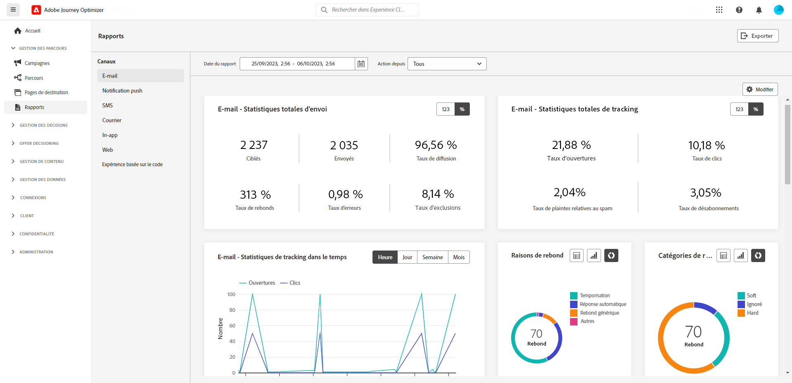
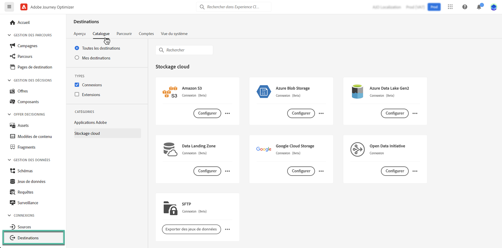
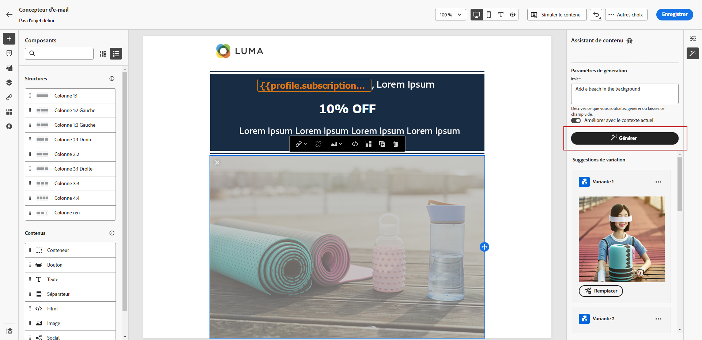
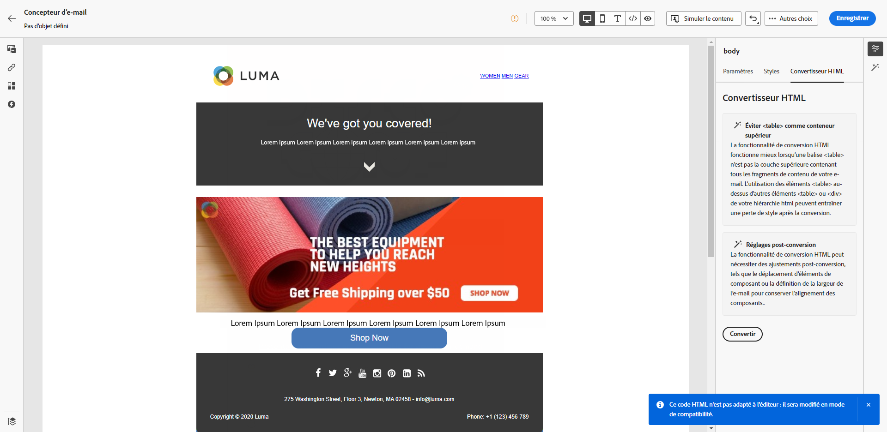
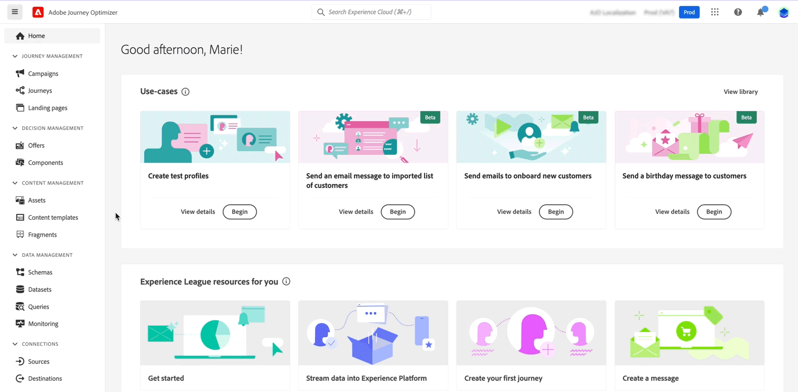

# Notes de mise à jour 2023 {#release-notes-2023}

Cette page répertorie toutes les fonctionnalités et améliorations pour [!DNL Journey Optimizer] publiées en 2023.

## Notes de mise à jour d’octobre 2023 {#oct-rn-2023}

### Nouvelles fonctionnalités{#oct-2023-features}

Cette version apporte les nouvelles fonctionnalités répertoriées ci-dessous.

<table>
<thead>
<tr>
<th><strong>Outil Sandbox</strong> </th>
</tr>
</thead>
<tbody>
<tr>
<td>

L’outil Sandbox vous permet de copier des objets sur plusieurs sandbox en exploitant l’export et l’import de packages. Un package peut se composer d’un ou de plusieurs objets. Tous les objets inclus dans un package doivent provenir du même sandbox.

<!--img src="../data/assets/dataset-export-setup.png"-->

Pour plus d’informations, consultez la <a href="../building-journeys/copy-to-sandbox.md">documentation détaillée</a>.

</td>
</tr>
</tbody>
</table>

<table>
<thead>
<tr>
<th><strong>MMS (Multimedia Message Service, service de messagerie multimédia) dans les SMS</strong> </th>
</tr>
</thead>
<tbody>
<tr>
<td>

Avec le canal SMS, vous pouvez maintenant améliorer votre communication en envoyant des MMS, ce qui permet le partage d’images, de GIF ou de vidéos avec vos clientes et clients. Notez que cette fonctionnalité est actuellement disponible avec Sinch uniquement.

Pour plus d’informations, consultez la <a href="../sms/create-sms.md#mms-content">documentation détaillée</a>.

</tr>
</tbody>
</table>

### Améliorations {#oct-2023-improvements}

Cette version est fournie avec les améliorations répertoriées ci-dessous.

**Audiences**

* Vous pouvez désormais cibler les audiences chargées à partir d’un fichier CSV dans les parcours et les campagnes. [En savoir plus](../audience/about-audiences.md#segments-in-journey-optimizer)
* Vous pouvez désormais cibler les audiences créées par le biais de la composition de l’audience et utiliser les attributs d’enrichissement dans les parcours. [En savoir plus](../building-journeys/read-audience.md)

>[!AVAILABILITY]
>
>Ces fonctionnalités sont actuellement disponibles en version bêta.

<!--
**Spam scoring for emails**

* When simulating an email content, a new option enables you to check how your content performs against inboxes spam filtering. This feature is currently proposed to a set of customers only (Limited Availability), and available for the Email channel.-->

**Campagnes**

<!--* You can now stop a live one-time campaign, make modifications and resume it again. This improvement is available in Beta.-->
* Lorsqu’une erreur se produit dans l’une de vos campagnes, une icône d’avertissement s’affiche désormais dans la liste des campagnes avec le statut de la campagne. [En savoir plus](../campaigns/modify-stop-campaign.md#statuses)

**Parcours**

* La durée maximale que vous pouvez définir dans n’importe quel temps d’attente est désormais de 29 jours au lieu de 30. Cette amélioration a été introduite afin d’éviter que les temps d’attente ne dépassent la durée de vie de 30 jours du parcours. Cela s’applique aux éléments suivants :

   * Le champ **Durée** dans l’[activité d’attente](../building-journeys/wait-activity.md).
   * La **période d’attente de reprise** dans les [propriétés du parcours](../building-journeys/journey-properties.md#entrance).
   * Le champ **Attendre pendant** dans la définition du délai d’expiration des [activités d’événement](../building-journeys/general-events.md#events-specific-time).

<!--
**Consent in channel configuration**

* You can now select a marketing action at the channel surface level. When used in a surface, all consent policies associated with that marketing action are leveraged in order to respect the preferences of your customers.-->

**Gestion des décisions**

* Plusieurs libellés relatifs à la limitation des offres dans l’interface de gestion des décisions ont été mis à jour. [En savoir plus](../offers/offer-library/add-constraints.md#capping)

## Notes de mise à jour de septembre 2023 {#sept-rn-2023}

### Nouvelles fonctionnalités{#sept-2023-features}

Cette version apporte les nouvelles fonctionnalités répertoriées ci-dessous.

<table>
<thead>
<tr>
<th><strong>Attributs calculés</strong> </th>
</tr>
</thead>
<tbody>
<tr>
<td>

Les attributs calculés permettent de résumer facilement les données d’événement dans les attributs de profil par le biais d’une interface utilisateur intuitive pour une segmentation, une personnalisation et une activation optimisées basées sur le comportement. Grâce à cette fonctionnalité, vous pouvez créer des attributs calculés en libre-service, les gérer et les utiliser dans la segmentation, les destinations de profil client en temps réel ou Journey Optimizer.  
En outre, les attributs calculés simplifient la segmentation et les workflows de parcours pour vous aider à diffuser facilement des expériences pertinentes. Pour en savoir plus, consultez la <a href="../audience/computed-attributes.md">documentation détaillée</a>.

</tr>
</tbody>
</table>

<table>
<thead>
<tr>
<th><strong>Rapports consolidés sur le canal</strong> </th>
</tr>
</thead>
<tbody>
<tr>
<td>

La fonction de rapports sur le canal offre aux analystes et aux spécialistes du marketing un aperçu complet du trafic et de l’engagement au niveau du canal.

Pour accéder au menu <b>Rapport</b>, vous devez disposer de l’autorisation <b>Afficher les rapports du canal</b>.

Pour plus d’informations, consultez la <a href="../reports/channel-report.md">documentation détaillée</a> et visualisez la <a href="../reports/channel-report.md#channel-report-video">vidéo pratique</a>.

</tr>
</tbody>
</table>

<table>
<thead>
<tr>
<th><strong>Destinations d’export des jeux de données (GA)</strong> </th>
</tr>
</thead>
<tbody>
<tr>
<td>

L’export des jeux de données Journey Optimizer vers les destinations d’espace de stockage sont désormais disponibles pour tous. Cette fonctionnalité vous permet d’établir une connexion active aux emplacements d’espace de stockage pour exporter le contenu de vos jeux de données.

Pour plus d’informations, consultez la <a href="../data/export-datasets.md">documentation détaillée</a>.

</td>
</tr>
</tbody>
</table>

<table>
<thead>
<tr>
<th><strong>Stockage des informations d’identification de l’application mobile par sandbox</strong> </th>
</tr>
</thead>
<tbody>
<tr>
<td>

Cette nouvelle fonctionnalité vous permet de gérer et d’associer facilement des informations d’identification push à une sandbox dédiée dans les surfaces d’application.

Pour plus d’informations, consultez la <a href="../in-app/inapp-configuration.md#channel-prerequisites">documentation détaillée</a>.

</tr>
</tbody>
</table>

### Améliorations {#sept-2023-improvements}

Cette version est fournie avec les améliorations répertoriées ci-dessous.

**Gestion des décisions**

* De nouvelles API pour la création et la gestion d’objets de gestion de décision sont désormais disponibles. Ces API offrent des performances accrues et une expérience client améliorée. Les API héritées seront prises en charge jusqu’au 27/03/2024. [En savoir plus](../offers/api-reference/getting-started.md)

**Personnalisation**

* Outre les fragments visuels, il est désormais possible de créer, d’enregistrer et de réutiliser des fragments d’expression à partir de l’interface de Journey Optimizer via l’éditeur d’expression. Les fragments d’expression remplacent les expressions enregistrées précédemment. [En savoir plus](../personalization/use-expression-fragments.md)

**Alerte**

* Introduction d’un nouveau type d’alerte système. Vous pouvez désormais recevoir une notification en cas d’échec d’une activité **Lecture d’audience**. [En savoir plus](../reports/alerts.md).

**Canal web**

* Les applications monopage (SPA) peuvent désormais être créées dans l’éditeur visuel web, ce qui vous permet de sélectionner les vues spécifiques auxquelles vous souhaitez appliquer les modifications de vos pages web. Une vue peut être définie pour un site entier ou un groupe d’éléments visuels sur un site, tels que la page d’accueil, l’ensemble du site de produits ou les préférences de livraison, encadrés sur toutes les pages de passage en caisse. Les développeurs et développeuses ont besoin d&#39;une configuration unique pour définir les vues dans l’implémentation du SDK web d’Adobe Experience Platform. Cela permet aux spécialistes du marketing de créer et d’exécuter des campagnes web Adobe Journey Optimizer sur les applications monopage. [En savoir plus](../web/web-spa.md)

* Lors de la modification d’une page à l’aide du concepteur web, vous pouvez désormais ajouter de nouvelles modifications à votre contenu directement à partir du volet Modifications, sans avoir à sélectionner un composant et à le modifier dans l’interface du concepteur. [En savoir plus](../web/manage-web-modifications.md#add-modifications)

* Lors de la configuration de sous-domaines web, vous avez désormais la possibilité d’ajouter votre propre sous-domaine, en plus d’utiliser un sous-domaine déjà délégué à Adobe. [En savoir plus](../web/web-delegated-subdomains.md#web-configure-new-subdomain)

**Parcours**

* Lors de la duplication d’un parcours, vous pouvez désormais définir le nom de la copie de parcours. [En savoir plus](../building-journeys/journey-gs.md#duplicate-a-journey)

* La prise en charge des réponses d’action personnalisée est désormais disponible pour tout le monde. Cette fonctionnalité vous permet d’utiliser les réponses d’appel API dans des actions personnalisées et orchestrer votre parcours en fonction de ces réponses. En outre, un [nouveau mécanisme de sécurisation des limitations](../start/guardrails.md#custom-actions-g) a été ajouté pour limiter automatiquement les appels d’action personnalisés. [En savoir plus](../action/action-response.md)
<!--
* The maximum duration that you can define in the Wait activity is now 29 days instead of 30.
-->

**Canal e-mail**

* Une nouvelle option de configuration de la surface de l’e-mail permet de choisir d’envoyer des messages transactionnels aux profils même si leurs adresses e-mail se trouvent dans la liste de suppression d’Adobe [!DNL Journey Optimizer]. [En savoir plus](../email/email-settings.md#send-to-suppressed-email-addresses)

**Canal SMS**

* Deux nouveaux champs, **Message d’opt-in** et **Message d’aide**, ont été ajoutés à l’écran de configuration de l’API, ce qui permet aux utilisateurs et utilisatrices de personnaliser les réponses pour les mots-clés entrants. Notez que ceci est uniquement disponible pour le fournisseur SMS Sinch. [En savoir plus](../sms/sms-configuration.md)

* La désinscription aux SMS n’est plus gérée au niveau du canal. Il est maintenant spécifique au nombre, ce qui signifie que si certains profils indiquent leur opt-out pour un numéro ou un numéro abrégé donné, vous pouvez toujours leur envoyer des messages à partir d’autres numéros que vous utilisez pour envoyer des SMS. Une nouvelle option vous permet de sélectionner le **numéro d’opt-out** que vous souhaitez utiliser pour une surface donnée. [En savoir plus](../sms/sms-configuration.md)

**Canal courrier**

* Vous pouvez désormais chiffrer les fichiers destinés à vos fournisseurs de publipostage direct lorsqu’ils sont transférés sur un serveur. Pour ce faire, un nouveau champ est disponible dans l’écran de configuration du routage des fichiers, ce qui vous permet de copier-coller votre clé de chiffrement. [En savoir plus](../direct-mail/direct-mail-configuration.md).

**Reporting**

* Vous pouvez désormais exporter des rapports Journey Optimizer en tant que fichier CSV. En savoir plus dans la [documentation détaillée](../reports/global-report.md#export-reports) et la [vidéo pratique](../reports/global-report.md#video-csv).

**Assets**

* Une nouvelle option pour Assets vous permet de choisir le référentiel pour vos ressources dans Journey Optimizer. Vous pouvez opter pour un référentiel Assets Essentials ou un référentiel Assets as a Cloud Service, à condition que vous possédiez cette solution. [En savoir plus](../content-management/assets.md)

<!--**Decision management**

Enhancements have been made to the audience picker in journeys or campaigns, with the addition of new columns displaying the origin and update frequency of audiences.    -->

## Notes de mise à jour d’août 2023 {#aug-rn-2023}

### Nouvelles fonctionnalités{#aug-2023-features}

Cette version apporte les nouvelles fonctionnalités répertoriées ci-dessous.

<table>
<thead>
<tr>
<th><strong>Envoyer des messages in-app dans vos parcours</strong> </th>
</tr>
</thead>
<tbody>
<tr>
<td>

Vous pouvez désormais envoyer des messages in-app personnalisés aux utilisateurs et utilisatrices de votre application dans un parcours. Utilisez Journey Optimizer pour concevoir des notifications et personnaliser la disposition, l’affichage, le texte et les boutons des messages afin de créer une expérience optimale.

Pour plus d’informations, consultez la <a href="../in-app/create-in-app.md">documentation détaillée</a>.

</tr>
</tbody>
</table>

<table>
<thead>
<tr>
<th><strong>Valider vos e-mails avec des listes de contrôle</strong> </th>
</tr>
</thead>
<tbody>
<tr>
<td>

Vous pouvez désormais créer et gérer des listes de contrôle dans Journey Optimizer. Une liste de contrôle est composée d’adresses internes qui peuvent être ajoutées à votre audience réelle et recevoir le même message que les profils ciblés au moment de l’exécution de la diffusion. Utilisez cette fonctionnalité pour surveiller les communications envoyées et vous assurer que les formats d’affichage, les URL, les images et les liens sont corrects.

Pour plus d’informations, consultez la <a href="../configuration/seed-lists.md">documentation détaillée</a>.

</td>
</tr>
</tbody>
</table>

<!--table>
<thead>
<tr>
<th><strong>Generate text and images with the Content assistant</strong> </th>
</tr>
</thead>
<tbody>
<tr>
<td>

Once you have created and personalized your message, take your content to the next level with the Content assistant. You can now use the Content assistant to optimize your message's impact by experimenting with different main titles, and images. Each variant is managed as a unique Treatment, to measure and compare which title effectively generates more clicks.

This capability is currently available as a private beta.

For more information, refer to the <a href="../start/search-filter-categorize.md#tags">detailed documentation</a>.

</td>
</tr>
</tbody>
</table-->

### Améliorations {#aug-2023-improvements}

Cette version est fournie avec les améliorations répertoriées ci-dessous.

<!--
**APIs**

A new API to create and manage Content Fragments is now available. [Learn more](https://developer.adobe.com/journey-optimizer-apis/references/content-templates/#tag/Content-fragment-API){target="_blank"}.-->

<!--**Email channel**

A new option is available in the email surface settings to include email addresses suppressed due to spam complaint in your transactional messages audiences. Even if they marked marketing messages as spam, these profiles can then receive transactional messages, such as password reset or account statements. This option is disabled by default.-->

**Parcours**

* Vous pouvez désormais utiliser les réponses d’appel API dans des actions personnalisées et orchestrer votre parcours en fonction de ces réponses. Cette fonctionnalité est actuellement disponible en version bêta. [En savoir plus](../action/action-response.md).
* Introduction d’un nouveau type d’alerte système. Vous pouvez désormais recevoir une notification en cas d’échec d’une action personnalisée. [En savoir plus](../reports/alerts.md).
  <!--* When duplicating a journey, you can now define the name of the journey copy.-->

**Courrier (publipostage direct)**

* Azure peut désormais être sélectionné comme type de serveur dans la configuration de routage des fichiers. [En savoir plus](../direct-mail/direct-mail-configuration.md#file-routing-configuration)
* L’esperluette est désormais disponible en tant que champ de séparateur de colonne dans les paramètres de surface du courrier. [En savoir plus](../direct-mail/direct-mail-configuration.md#direct-mail-surface)

## Notes de mise à jour de juillet 2023 {#july-rn-2023}

### Nouvelles fonctionnalités{#july-2023-features}

<table>
<thead>
<tr>
<th><strong>Composition de l’audience</strong> </th>
</tr>
</thead>
<tbody>
<tr>
<td>

Vous pouvez désormais créer des workflows de composition afin de combiner les audiences Adobe Experience Platform existantes dans une zone de travail visuelle et d’exploiter diverses activités (comme le partage, l’enrichissement…) pour créer de nouvelles audiences. Les audiences nouvellement créées sont réenregistrées dans Adobe Experience Platform avec les audiences existantes et peuvent être exploitées dans les campagnes Journey Optimizer pour cibler la clientèle.

Pour plus d’informations, consultez la <a href="../audience/get-started-audience-orchestration.md">documentation détaillée</a>.

La composition de l’audience est entièrement intégrée au nouveau menu « Audiences » d’Adobe Experience Platform qui sert de portail centralisé vers les audiences. Vous pouvez désormais utiliser une page de navigation qui comprend un nouveau tableau de bord avec des tendances et des chevauchements de segments afin de trouver de nouvelles informations et d’explorer les outils d’organisation pour la création de dossiers et le balisage. Cette expérience s’accompagne de contrôles de gouvernance pour l’étiquetage normalisé des audiences ainsi que de fonctionnalités de gestion du cycle de vie des audiences afin de gérer les workflows d’activation. Grâce à cette nouvelle expérience de gestion, vous pouvez désormais gérer facilement et en toute sécurité les audiences depuis un seul emplacement. Pour plus d’informations, consultez la <a href="https://experienceleague.adobe.com/docs/experience-platform/segmentation/ui/overview.html?lang=fr" target="_blank">documentation Adobe Experience Platform</a>.

</td>
</tr>
</tbody>
</table>

<table>
<thead>
<tr>
<th><strong>Canal courrier</strong> </th>
</tr>
</thead>
<tbody>
<tr>
<td>

Vous pouvez désormais ajouter du courrier dans une campagne. Le courrier est un canal hors ligne qui vous permet de personnaliser et de générer les fichiers requis par les prestataires de services postaux pour envoyer du courrier à votre clientèle.

Lorsque vous créez une diffusion par courrier, Journey Optimizer génère un fichier contenant tous les profils ciblés et les coordonnées sélectionnées (adresse postale, par exemple). Vous pourrez alors envoyer ce fichier à votre prestataire de services postaux qui prendra en charge l’envoi réel.

Pour l’instant, le canal Courrier n’est pas disponible pour les organisations qui ont acheté l’offre de module complémentaire Healthcare Shield d’Adobe.

Pour plus d’informations, consultez la <a href="../direct-mail/get-started-direct-mail.md">documentation détaillée</a>.

</tr>
</tbody>
</table>

<table>
<thead>
<tr>
<th><strong>Convertir votre contenu HTML pour le concepteur d’e-mail</strong> </th>
</tr>
</thead>
<tbody>
<tr>
<td>

Vous pouvez désormais importer et convertir n’importe quel contenu HTML dans l’éditeur d’e-mail de Journey Optimizer. Les blocs de contenu sont automatiquement identifiés et disponibles dans le concepteur d’e-mail : utilisez ses puissantes fonctionnalités de conception pour les mettre à jour et les personnaliser !

Pour plus d’informations, consultez la <a href="../email/existing-content.md">documentation détaillée</a>.

</td>
</tr>
</tbody>
</table>

<table>
<thead>
<tr>
<th><strong>Utiliser des balises dans Journey Optimizer</strong> </th>
</tr>
</thead>
<tbody>
<tr>
<td>

Outre les campagnes et les parcours, vous pouvez désormais attribuer des balises unifiées Adobe Experience Platform à vos pages de destination, modèles de contenu, fragments et listes d’abonnements. Vous pouvez ainsi facilement les classer et améliorer la recherche et la navigation dans toutes les listes. 

Pour plus d’informations, consultez la <a href="../start/search-filter-categorize.md#tags">documentation détaillée</a>.

</td>
</tr>
</tbody>
</table>

<table>
<thead>
<tr>
<th><strong>API de modèles de contenu</strong> </th>
</tr>
</thead>
<tbody>
<tr>
<td>

Vous pouvez désormais créer et gérer des modèles de contenu Adobe Journey Optimizer à l’aide d’API dédiées, ce qui permet une intégration transparente de votre système de contenu existant.

Pour plus d’informations, consultez la <a href="https://developer.adobe.com/journey-optimizer-apis/references/content/">documentation détaillée</a>.

</td>
</tr>
</tbody>
</table>

### Améliorations {#july-2023-improvements}

Cette version est fournie avec les améliorations répertoriées ci-dessous.

**Campagnes**

Les événements contextuels liés aux campagnes sont désormais disponibles dans le menu « Attributs contextuels » de l’éditeur de personnalisation.

**Audiences**

Des améliorations ont été apportées au sélecteur d’audiences dans les parcours ou les campagnes, avec l’ajout de nouvelles colonnes indiquant l’origine et la fréquence de mise à jour des audiences. Avec la publication du portail de composition de l’audience, Adobe Experience Platform et Adobe Journey Optimizer ont mis à jour l’utilisation des « audiences » et des « segments » dans le système et la documentation.

* Audience : ensemble de personnes, de comptes, de foyers ou d’autres entités qui partagent des caractéristiques et des comportements communs.
* Définition d’un segment : règles utilisées pour décrire les caractéristiques ou le comportement clés d’une audience cible dans Adobe Experience Platform. Ce terme était auparavant appelé « segment ».

Par conséquent, dans Adobe Journey Optimizer et l’interface utilisateur d’Adobe Experience Platform, « Segments » est remplacé par « Audiences » pour refléter ce nouveau chemin de création et de gestion d’audience.

**API**

La méthode JWT pour générer des jetons d’accès pour l’authentification des API Adobe Journey Optimizer a été abandonnée. Toutes les nouvelles intégrations doivent être créées à l’aide de la méthode d’authentification OAuth de serveur à serveur. Adobe vous recommande également de migrer vos intégrations existantes vers la méthode OAuth. [En savoir plus](https://developer.adobe.com/journey-optimizer-apis/references/authentication/){target="_blank"}.

**Autres modifications**

L’export des jeux de données Journey Optimizer vers les destinations d’espace de stockage est désormais disponible pour toute la clientèle en version bêta. Cette fonctionnalité vous permet d’établir une connexion active aux emplacements d’espace de stockage pour exporter le contenu de vos jeux de données. [En savoir plus](../data/export-datasets.md).

## Notes de mise à jour de juin 2023 {#june-rn-2023}

<table>
<thead>
<tr>
<th><strong>Campagnes déclenchées par API pour les cas d’utilisation marketing</strong> </th>
</tr>
</thead>
<tbody>
<tr>
<td>

Vous pouvez désormais utiliser des API pour déclencher des campagnes marketing dans Adobe Journey Optimizer à partir d’un système externe.

Avant cette version, la fonctionnalité de campagnes déclenchées par API répondait à divers scénarios de messages opérationnels et transactionnels, tels que les réinitialisations de mot de passe ou les jetons OTP, mais ne permettait pas de créer des campagnes marketing. Les canaux disponibles pour les campagnes déclenchées par API sont E-mail, SMS et les messages push.

Pour plus d’informations, consultez la <a href="../campaigns/api-triggered-campaigns.md">documentation détaillée</a>.
</td>
</tr>
</tbody>
</table>

<!--
### Improvements {#june-2023-improvements}

**Audiences**

Enhancements have been made to the audience picker in journeys or campaigns, with the addition of new columns displaying the origin and update frequency of audiences.

**Journeys**

You can now leverage API call responses in custom actions and orchestrate your journey based on these responses.
-->

<!--
## June 2023 early release notes {#june-rn-2023}

Information below is subject to change without prior notice until the release availability date. Updated documentation will be published at the release date, and direct links will be added in this page.

**Audiences**

Enhancements have been made to the audience picker in journeys or campaigns, with the addition of new columns displaying the origin and update frequency of audiences.    

**Journeys**

* You can now leverage API call responses in custom actions and orchestrate your journey based on these responses.     

* A new type of system alert has been introduced. You can now get notified when a custom action fails.
-->

## Notes de mise à jour de mai 2023 {#may-rn-2023}

### Nouvelles fonctionnalités{#may-2023-features}

<table>
<thead>
<tr>
<th><strong>Expérimentation de contenu dans les campagnes</strong> </th>
</tr>
</thead>
<tbody>
<tr>
<td>

Adobe Journey Optimizer prend désormais en charge les expériences dans les campagnes. Les expériences sont des essais randomisés, ce qui, dans le cadre des tests en ligne, signifie que vous exposez certains utilisateurs et utilisatrices sélectionnés de manière aléatoire à une variante donnée d’un message et un autre ensemble d’utilisateurs et utilisatrices sélectionnés de manière aléatoire à une autre variation de traitement. Après l’exposition, vous pouvez ensuite mesurer les mesures de résultats qui vous intéressent, par exemple les ouvertures d’e-mails, les abonnements ou les achats.

Pour plus d’informations, consultez la <a href="../campaigns/content-experiment.md">documentation détaillée</a>.

</td>
</tr>
</tbody>
</table>

<!--
<table>
<thead>
<tr>
<th><strong>Objective reporting and performance measurement in campaigns</strong> </th>
</tr>
</thead>
<tbody>
<tr>
<td>

You can now measure the performance of your campaigns across inbound and outbound through dedicated reports. Adobe Journey Optimizer reports can retrieve additional metrics to use in the Objectives tab of your campaign reports.

For more information, refer to the <a href="../reports/campaign-global-report.md">detailed documentation</a>.

</td>
</tr>
</tbody>
</table>
-->

<table>
<thead>
<tr>
<th><strong>Créer et utiliser des fragments dans le contenu de votre e-mail</strong> </th>
</tr>
</thead>
<tbody>
<tr>
<td>

Vous pouvez désormais créer, utiliser et gérer des fragments pour rédiger rapidement vos e-mails et vos modèles de contenu. Un fragment est un composant réutilisable prédéfini, qui peut être intégré à plusieurs e-mails dans les campagnes et parcours Journey Optimizer, pour un processus de conception amélioré et plus rapide.

Pour plus d’informations, consultez la <a href="../content-management/fragments.md">documentation détaillée</a>.

</td>
</tr>
</tbody>
</table>

<table>
<thead>
<tr>
<th><strong>Utiliser des balises dans vos campagnes (version Beta)</strong> </th>
</tr>
</thead>
<tbody>
<tr>
<td>

Vous pouvez désormais attribuer des balises unifiées Adobe Experience Platform à vos campagnes. Vous pouvez ainsi facilement les classer et améliorer la recherche à partir de la liste des campagnes. Notez que la fonctionnalité de balises unifiées est actuellement en version Beta.

Pour plus d’informations, consultez la <a href="../start/search-filter-categorize.md#tags">documentation détaillée</a>.

</td>
</tr>
</tbody>
</table>

<table>
<thead>
<tr>
<th><strong>Modèle de classement AI d’optimisation personnalisée (disponibilité générale)</strong> </th>
</tr>
</thead>
<tbody>
<tr>
<td>

Les modèles de classement AI d’optimisation personnalisée sont désormais disponibles dans la gestion des décisions. Ce nouveau type de modèle permet d’optimiser et de personnaliser les offres en fonction des audiences et des performances des offres.

Pour plus d’informations, consultez la <a href="../offers/ranking/personalized-optimization-model.md">documentation détaillée</a>.

</td>
</tr>
</tbody>
</table>

### Améliorations {#may-2023-improvements}

**Audiences**

* En vue de la disponibilité générale de la fonctionnalité Audience Portal, Adobe Experience Platform met à jour l’utilisation d’audiences et de segments dans le système et dans la documentation.

   * Audience : ensemble de personnes, de comptes, de foyers ou d’autres entités qui partagent des caractéristiques et des comportements communs.
   * Définition d’un segment : règles utilisées pour décrire les caractéristiques ou le comportement clés d’une audience cible dans Adobe Experience Platform. Ce terme était auparavant appelé « segment ».

  Par conséquent, dans Adobe Journey Optimizer et l’interface utilisateur d&#39;Adobe Experience Platform, « Segments » est remplacé par « Audiences » pour refléter ce nouveau chemin de création et de gestion d’audience.

  Les traductions du terme « audience » lorsqu’elles font référence à un groupe de profils destinés à recevoir un message ont été harmonisées dans l’ensemble des produits de l’expérience digitale pour certaines langues :

   * Allemand : Zielgruppe
   * Portugais brésilien : público-alvo
   * Espagnol : público desatario

<!--* Enhancements have been made to the audience picker in journeys or campaigns, with the addition of new columns displaying the origin and update frequency of audiences.-->

**Canal SMS**

* Infobip a été ajouté en tant que fournisseur lors de la configuration des surfaces de vos canaux SMS. [En savoir plus](../sms/sms-configuration.md).
* Twillio – La configuration des informations d’identification API inclut désormais la possibilité d’ajouter le SID du service de messagerie pour une intégration transparente à votre compte Twillio. [En savoir plus](../sms/sms-configuration.md).

**Canal in-app**

* Ajout de nouvelles règles de déclenchement de message pour Adobe Places Service. [En savoir plus](../in-app/inapp-configuration.md).
* Ajout de nouvelles fonctionnalités Adobe Experience Platform Assurance permettant de capturer des événements d’appareil à ajouter en tant que règles de déclenchement.

<!--
**Journeys**

* You can now leverage API call responses in custom actions and orchestrate your journey based on these responses.
-->

**Campagnes**

* Il est désormais possible de dupliquer une campagne à partir de l’écran d’inventaire à l’aide du menu d’action représentant des points de suspension. [En savoir plus](../campaigns/modify-stop-campaign.md#duplicate).
* Vous pouvez désormais supprimer les brouillons des modifications d’une campagne active.
* Les étapes d’activation d’une campagne ont été simplifiées. [En savoir plus](../campaigns/modify-stop-campaign.md).

**Gestion des décisions**

* Vous pouvez désormais modifier le capping de la fréquence si le statut de l’offre est **[!UICONTROL Brouillon]** et si l’offre n’a jamais été publiée auparavant avec le capping de la fréquence activée. [En savoir plus](../offers/offer-library/add-constraints.md#frequency-capping).

**Personnalisation**

* Vous pouvez désormais sélectionner et insérer des références de ressources directement à partir de l’éditeur de personnalisation lorsque vous travaillez dans du contenu HTML.

### Correctifs{#may-2023-fixes}

* Messages in-app : correction d’un problème en raison duquel la planification de campagne était en conflit avec les paramètres de fréquence des messages.

## Notes de mise à jour d’avril 2023 {#apr-rn-2023}

<!--Information below is subject to change without prior notice until the release availability date. Updated documentation will be published at the release date, and direct links will be added in this page.

**Release date**: April 27, 2023-->

### Nouvelles fonctionnalités{#apr-2023-features}

<table>
<thead>
<tr>
<th><strong>Canal web (disponibilité générale)</strong> </th>
</tr>
</thead>
<tbody>
<tr>
<td>

Adobe Journey Optimizer étend ses fonctionnalités cross-canal en ajoutant la prise en charge du canal web. Vous pouvez désormais créer, modifier et prévisualiser des expériences web comme n’importe quel autre canal, au moyen d’une interface visuelle intelligente et intuitive qui vous permettra de personnaliser l’expérience de vos utilisateurs et utilisatrices. Notez qu’actuellement, Journey Optimizer permet de créer des expériences web dans les campagnes uniquement.

Pour plus d’informations, consultez la <a href="../web/get-started-web.md">documentation détaillée</a>.

</tr>
</tbody>
</table>

<table>
<thead>
<tr>
<th><strong>Workflow de démarrage rapide de l’intégration mobile (Beta)</strong> </th>
</tr>
</thead>
<tbody>
<tr>
<td>

Le nouveau workflow de démarrage rapide de l’intégration mobile est désormais disponible. Utilisez cette nouvelle fonctionnalité de produit pour configurer rapidement le SDK mobile afin de commencer à collecter et valider les données d’événement mobile et d’envoyer des notifications push mobiles avec Adobe Journey Optimizer. Cette fonctionnalité est accessible via la page d’accueil de collecte de données en tant que version Beta publique.

Pour plus d’informations, consultez la <a href="../push/mobile-onboarding-wf.md">documentation détaillée</a>.

</td>
</tr>
</tbody>
</table>

<table>
<thead>
<tr>
<th><strong>Nouveau tableau de bord des parcours (Beta)</strong> </th>
</tr>
</thead>
<tbody>
<tr>
<td>

 Le tableau de bord des parcours est maintenant divisé en deux onglets :

<ul><li>Depuis l’onglet <strong>Aperçu</strong>, vous pouvez accéder à un nouveau tableau de bord qui affiche les mesures clés liées à vos parcours.</li>
<li>Utilisez l’onglet <strong>Parcourir</strong> pour accéder à la liste de tous les parcours.</li></ul>

Cette fonctionnalité est accessible en version Beta publique dans tous les parcours.

Pour plus d’informations, consultez la <a href="../building-journeys/journey-gs.md#journey-access">documentation détaillée</a>.

</td>
</tr>
</tbody>
</table>

### Améliorations {#april-2023-improvements}

**Parcours**

* La zone de travail du parcours affiche désormais l’ID d’activité sur les activités de message et les balises de fin. Le reporting et le reciblage sont ainsi améliorés.
* La disposition du volet de configuration, qui s’affiche dans les actions, les sources de données, les événements et les parcours, a été améliorée.
* Nouvelles informations sur le nombre de nœuds sur la zone de travail, avec des limitations pour stimuler la croissance : la lecture, l’assurance qualité et le dépannage des parcours sont ainsi plus faciles, avec un nombre maximal de nœuds par parcours établi à 50. [En savoir plus](../start/guardrails.md#journeys-guardrails-journeys).
* Lors de l’ajout d’une action [E-mail](../email/create-email.md), [SMS](../sms/create-sms.md) ou [Push](../push/create-push.md) dans un parcours, la surface est désormais préremplie par défaut avec la dernière surface utilisée pour ce canal dans le parcours actuel.
* Vous pouvez désormais définir des paramètres de requête statiques ou dynamiques dans vos actions personnalisées. [En savoir plus](../action/about-custom-action-configuration.md#url-configuration).

**Créer des rapports**

* Vous pouvez désormais exporter des rapports Journey Optimizer en tant que PDF. [En savoir plus](../reports/global-report.md#export-reports).

**Concepteur de contenu**

* Le Concepteur de contenu d’Adobe Journey Optimizer a été mis à jour et l’accès aux styles et composants de conception est désormais plus facile. Cette nouvelle version offre une expérience client améliorée et s’accompagne de performances accrues, d’une compatibilité partielle du mode sombre et de nouvelles normes d’accessibilité.

## Notes de mise à jour de mars 2023 {#mar-2023}

### Nouvelles fonctionnalités{#mar-2023-features}

<table>
<thead>
<tr>
<th><strong>Canal in-app (Disponibilité générale)</strong> </th>
</tr>
</thead>
<tbody>
<tr>
<td>

Vous pouvez désormais envoyer des messages in-app personnalisés aux utilisateurs et utilisatrices de votre application dans une campagne. Utilisez Journey Optimizer pour concevoir des notifications et personnaliser la disposition, l’affichage, le texte et les boutons des messages afin de créer une expérience optimale.

Pour plus d’informations, consultez la <a href="../in-app/get-started-in-app.md">documentation détaillée</a>.

</tr>
</tbody>
</table>

<table>
<thead>
<tr>
<th><strong>Suivi des clics dans les SMS</strong> </th>
</tr>
</thead>
<tbody>
<tr>
<td>

Grâce au suivi des clics dans les SMS, vous pouvez surveiller les performances de vos URL raccourcies, identifier les clients et les clientes qui ont cliqué dessus et utiliser ces données pour les recibler dans vos campagnes ultérieures.

Pour plus d’informations, consultez la <a href="../sms/create-sms.md#sms-content">documentation détaillée</a>.

</td>
</tr>
</tbody>
</table>

<table>
<thead>
<tr>
<th><strong>Utiliser les balises dans les parcours (version Beta)</strong> </th>
</tr>
</thead>
<tbody>
<tr>
<td>

En tant qu’utilisateur ou utilisatrice de Journey Optimizer, vous pouvez désormais organiser vos objets commerciaux à l’aide de balises. Les balises constituent un moyen simple et rapide de classer des objets afin de faciliter leur recherche. Cette fonctionnalité est actuellement en version bêta et n’est disponible que pour les parcours.

Pour plus d’informations, consultez la <a href="../start/search-filter-categorize.md#tags">documentation détaillée</a>.

</td>
</tr>
</tbody>
</table>

### Améliorations {#mar-2023-improvements}

**Parcours**

* La nouvelle **API de limitation** vous permet de limiter le nombre d’événements envoyés par seconde. Vous pouvez ainsi éviter les pics de trafic importants sur vos systèmes ou API externes. Lorsque la limite définie est atteinte, tous les appels API suivants sont placés en file d’attente et traités dès que possible, dans l’ordre dans lequel ils ont été reçus. Notez que cette fonctionnalité ne prend en charge qu’une seule configuration de limitation pour toutes vos sandbox. [En savoir plus](../configuration/external-systems.md).
* Amélioration de la zone de travail Parcours pour offrir une expérience utilisateur plus fluide et épurée. Suppression des espaces réservés vides à la fin de chaque chemin de la zone de travail. Vous pouvez maintenant simplement ajouter vos activités en les faisant glisser à la fin d’un chemin.
* Dans la zone de travail Parcours, la balise **Fin** n’est plus définie automatiquement avec le nom de l’activité précédente. Si nécessaire, les utilisateurs et utilisatrices peuvent indiquer un libellé personnalisé manuellement.
* Le délai d’expiration par défaut et la durée d’erreur dans les propriétés du parcours passent de 5 à 30 secondes. [En savoir plus](../configuration/external-systems.md#timeout).
* Le taux de limitation par défaut dans les activités de lecture d’audience passe de 20 000 à 5 000 messages par seconde. [En savoir plus](../building-journeys/read-audience.md#configuring-segment-trigger-activity).
* Un mécanisme de sécurisation a été ajouté au mode test pour n’écouter que les événements envoyés via l’interface. Les événements envoyés par l’intermédiaire d’un outil externe ne sont pas pris en compte. [En savoir plus](../building-journeys/testing-the-journey.md)

<!-- 
* When adding an Email, SMS or Push action in a journey, the surface is now pre-filled, by default, with the last used surface for that channel.
* A new type of system alert has been introduced. You can now get notified when a custom action fails. [Learn more](../reports/alerts.md)
* Timeout and error management has been improved in journeys. Timeout and error paths are now always added on the canvas. A new toolbar button is available to show/hide these paths. [Learn more](../building-journeys/journey-gs.md#timeout_and_error)
* The Journey dashboard is now split in two tabs:
    * Use the **Overview** tab to access a new dashboard which displays key metrics related to your journeys.
    * Use the **Browse** tab to access list of all journeys.
-->

**Gestion des décisions**

* Pour éviter toute confusion potentielle avec la version récente de la fonctionnalité des balises dans Adobe Experience Platform, les balises de gestion des décisions ont été renommées « qualificateurs de collection ».

  Notez que bien que le terme « balise » ne soit plus utilisé dans l’interface utilisateur de la gestion des décisions, il l’est toujours dans les services back-end, tels que les API et les jeux de données.

* Vous pouvez choisir de réinitialiser le compteur de limitation des offres tous les jours, toutes les semaines ou tous les mois. [En savoir plus](../offers/offer-library/add-constraints.md#capping).

* Vous pouvez également choisir l’événement Adobe Experience Platform à prendre en compte pour la limitation de la gestion des décisions. [En savoir plus](../offers/offer-library/add-constraints.md#capping).

* Des paramètres supplémentaires ont été ajoutés à l’écran de création d’emplacements. Ils vous permettent de contrôler si une offre peut être dupliquée à plusieurs emplacements et d’indiquer si le contenu et les métadonnées de l’offre doivent être inclus dans la réponse API. [En savoir plus](../offers/offer-library/creating-placements.md).

**Personnalisation**

* Vous pouvez désormais inclure un texte de remplacement par défaut dans les attributs de profil basés sur des chaînes de l’éditeur d’expression. Ces valeurs s’affichent si les attributs sélectionnés ne renvoient aucun résultat. [En savoir plus](../personalization/personalization-build-expressions.md#add).

**Créer des rapports**

* Amélioration de la fonctionnalité de widget de création de rapports et personnalisation de l’affichage des données des utilisateurs et utilisatrices. Grâce à cette amélioration, les utilisateurs et utilisatrices peuvent désormais choisir entre plusieurs options de visualisation, notamment les graphiques, les tableaux et les graphiques en anneau.

  Pour avoir accès aux derniers widgets, vous devrez réinitialiser les différents tableaux de bord de rapports. Pour plus d’informations sur la personnalisation des tableaux de bord, consultez la [documentation détaillée](../reports/global-report.md#modify-dashboard).

## Notes de mise à jour de février 2023 {#feb-2023}

### Nouvelles fonctionnalités{#feb-2023-features}

<table>
<thead>
<tr>
<th><strong>Canal in-app (Beta)</strong> </th>
</tr>
</thead>
<tbody>
<tr>
<td>

Vous pouvez désormais envoyer des messages in-app personnalisés aux utilisateurs et utilisatrices de votre application dans une campagne. Utilisez Journey Optimizer pour concevoir des notifications et personnaliser la disposition, l’affichage, le texte et les boutons des messages afin de créer une expérience optimale.

<strong>Attention</strong> : cette fonctionnalité est actuellement en version bêta et disponible uniquement pour les clientes et clients bêta. Pour rejoindre le programme Beta, contactez l’assistance clientèle d’Adobe.

Pour plus d'informations, consultez la <a href="../in-app/get-started-in-app.md">documentation détaillée</a>.

</td>
</tr>
</tbody>
</table>

<table>
<thead>
<tr>
<th><strong>Exporter des jeux de données Journey Optimizer vers des destinations d’espace de stockage (Beta)</strong> </th>
</tr>
</thead>
<tbody>
<tr>
<td>

Vous pouvez maintenant établir une connexion active aux emplacements d’espace de stockage pour exporter le contenu de vos jeux de données. Les destinations disponibles sont les suivantes : espace de stockage Amazon S3, Blob Azure, Azure Data Lake Gen 2, zone d’atterrissage des données, Google Cloud Storage, SFTP.

<strong>Attention</strong> : cette fonctionnalité est actuellement en version bêta et disponible uniquement pour les utilisateurs et utilisatrices d’Adobe Journey Optimizer. Contactez votre représentant ou représentante Adobe pour obtenir l’accès aux destinations si vous n’y avez pas déjà accès.

Pour plus d’informations, consultez la <a href="../data/export-datasets.md">documentation détaillée</a>.

</td>
</tr>
</tbody>
</table>

<!--

<table>
<thead>
<tr>
<th><strong>Performance Measurement in campaigns</strong> </th>
</tr>
</thead>
<tbody>
<tr>
<td>

You can now measure the performance of your campaigns across inbound and outbound through dedicated reports. Adobe Journey Optimizer reports can retrieve additional metrics to use in the <strong>Objective</strong> tab of your campaign reports. 

For more information, refer to the <a href="../privacy/data-hygiene.md">detailed documentation</a>.

</td>
</tr>
</tbody>
</table>

+++ Learn more about Performance Measurement

The **[!UICONTROL Objective]** tab of your Campaign report allows you to better fine-tune your deliveries' reports by targeting one specific metric. With this feature, you can effectively track and analyze your campaign's performance and make informed decisions to improve your results.

The **[!UICONTROL Objectives]** listed are linked to **[!UICONTROL Datasets]** that define a connection to a system in order to retrieve additional information. A list of pre-configured **[!UICONTROL Objectives]** is available, but you can also customize your report by adding new **[!UICONTROL Datasets]** and defining your own objectives. 

By selecting the desired Objectives, the **[!UICONTROL Performance overview]** and **[!UICONTROL Campaign objective]** widgets provide a comprehensive and insightful summary of your delivery performance, allowing you to closely monitor and evaluate the success of your campaign.

With the **[!UICONTROL Campaign objective]** widget, you can also choose to compare your primary objective against another performance metric.

Note that each widget can be resized and deleted as needed.
+++

<table>
<thead>
<tr>
<th><strong>Use Tags in your Journeys</strong> </th>
</tr>
</thead>
<tbody>
<tr>
<td>

As a Journey Optimizer practitioner, you can now organize your business objects using tags. Tags are a quick and easy way of classifying objects to improve search. Tags are currently only available for Journeys.

</td>
</tr>
</tbody>
</table>

-->

### Améliorations {#feb-2023-improvements}

**Parcours**

* Le champ **Période d’attente de reprise** a été ajouté aux propriétés du parcours. Ce champ vous permet de définir le temps d’attente avant d’autoriser un profil à entrer à nouveau dans un parcours pour les parcours unitaires (en commençant par un événement ou une qualification d’audience). Cela empêche les parcours d’être déclenchés plusieurs fois par erreur pour le même événement. Par défaut, le champ est défini sur 5 minutes. [En savoir plus](../building-journeys/journey-properties.md#entrance).

* Des améliorations ont été apportées aux **dates de début et de fin de parcours**. Si vous n’avez pas spécifié de date de début, elle est désormais automatiquement ajoutée au moment de la publication. Pour les parcours **Lecture d’audience**, vous pouvez désormais ajouter une date de fin. Cela permet aux profils de se fermer automatiquement lorsque la date est atteinte. [En savoir plus](../building-journeys/journey-gs.md#dates)

<!--

* The Journey canvas has been enhanced for a simpler and improved user experience. At the end of each path in the canvas, the empty placeholders have been removed. You can now simply add your activities by dragging them anywhere between nodes. [Learn more](../building-journeys/using-the-journey-designer.md)

* Timeout and error management has been improved in journeys. Timeout and error paths are now always added on the canvas. A new toolbar button is available to show/hide these paths. [Learn more](../building-journeys/journey-gs.md#timeout_and_error)

* A new type of system alert has been introduced. You can now get notified when a custom action fails. [Learn more](../reports/alerts.md)

* The Journey dashboard is now split in two tabs:
    * Use the **Overview** tab to access a new dashboard which displays key metrics related to your journeys.
    * Use the **Browse** tab to access list of all journeys.
-->

**Administration**

* **Liste autorisée** : vous pouvez désormais télécharger la liste autorisée sous la forme d’un fichier .csv. [En savoir plus](../configuration/allow-list.md#download-allowed-list).

* **Surface d’e-mail** : une vérification supplémentaire a été ajoutée aux paramètres de surface d’e-mail. Si l’enregistrement MX pour le sous-domaine utilisé dans l’**adresse (e-mail) de réponse** ou dans l’**adresse e-mail en Cci** n’est pas correctement configuré, la surface d’e-mail ne peut plus être créée. Vous devez le configurer ou en utiliser un autre. [En savoir plus](../email/email-settings.md#reply-to-email).

* **Surface d’e-mail** : dans la section **Paramètres de suivi des URL** des paramètres de surface d’e-mail, la limite de chaque champ **Valeur** a été mise à jour de 255 caractères à 5 Ko pour des raisons de compatibilité avec le suivi Adobe Analytics. [En savoir plus](../email/email-settings.md#url-tracking)

**Gestion des décisions**

* **Emplacements** : ajout de paramètres supplémentaires à l’écran de création d’emplacements. Ils vous permettent de contrôler si une offre peut être dupliquée à plusieurs emplacements et d’indiquer si le contenu et les métadonnées de l’offre doivent être inclus dans la réponse API. [En savoir plus](../offers/offer-library/creating-placements.md).

* **Personnalisation des URL** : lorsque vous ajoutez des URL en tant que contenu aux représentations de vos offres, vous pouvez désormais personnaliser ces URL à l’aide de l’éditeur d’expression. [En savoir plus](../offers/offer-library/add-representations.md).

## Notes de mise à jour de janvier 2023{#jan-2023-release}

### Nouvelles fonctionnalités{#jan-2023-features}

<table>
<thead>
<tr>
<th><strong>Hygiène des données</strong> </th>
</tr>
</thead>
<tbody>
<tr>
<td>

Adobe Experience Platform offre toute une gamme de fonctionnalités d’hygiène des données. Celles-ci vous permettent de gérer vos données stockées par le biais de suppressions programmées d’enregistrements et de jeux de données de consommateurs et consommatrices. Cette fonctionnalité est désormais disponible pour Adobe Journey Optimizer. 

Vous pouvez gérer vos stocks de données pour vous assurer que les informations sont utilisées comme prévu, qu’elles sont mises à jour lorsque des données incorrectes doivent être corrigées et qu’elles sont supprimées lorsque les politiques d’entreprise le jugent nécessaire.

<strong>Attention</strong> - Les fonctionnalités d’hygiène des données ne sont actuellement disponibles que pour les organisations qui ont acheté les offres complémentaires <strong>Healthcare Shield</strong> et <strong>Privacy and Security Shield</strong>.

Pour plus d’informations, consultez la <a href="../privacy/data-hygiene.md">documentation détaillée</a>.
</td>
</tr>
</tbody>
</table>

<table>
<thead>
<tr>
<th><strong>Modèles de contenu d’e-mail</strong> </th>
</tr>
</thead>
<tbody>
<tr>
<td>

Vous pouvez désormais créer des modèles de contenu autonomes qui peuvent être utilisés dans plusieurs parcours et campagnes pour une réutilisation rapide.
 

Découvrez comment créer, modifier et utiliser des modèles de contenu dans <a href="https://experienceleague.adobe.com/docs/journey-optimizer-learn/tutorials/email-channel/content-templates.html?lang=fr">cette vidéo</a>. Pour plus d’informations, consultez la <a href="../content-management/content-templates.md">documentation détaillée</a>.

</td>
</tr>
</tbody>
</table>

### Améliorations {#jan-2023-improvements}

**Parcours**

* Lors de l’ajout d’une **qualification d’audience** ou d’une **lecture d’audience** dans un parcours, l’espace de noms sera désormais prérempli par défaut avec le dernier espace de noms utilisé. Reportez-vous aux sections [Qualification d’audience](../building-journeys/audience-qualification-events.md#about-segment-qualification) et [Lecture d’audience](../building-journeys/read-audience.md#configuring-segment-trigger-activity).

* Dans la zone de travail du parcours, un nouveau bouton est disponible dans la barre d’outils. Il permet de télécharger une copie d’écran de votre parcours.

**Concepteur d’e-mail**

* Vous pouvez désormais exporter le contenu de l’e-mail à partir du menu **Exporter le HTML**. Les fichiers exportés sont disponibles dans un fichier d’archive (.ZIP).

**Administration**

* Une nouvelle sous-section fournit des recommandations sur la création de l’adresse **Répondre à (e-mail)** et sur la garantie d’une gestion adéquate des réponses. [En savoir plus](../email/email-settings.md#reply-to-email)

* Lors de la création ou de la modification des **Groupes d’adresses IP**, les enregistrements PTR associés sont désormais affichés dans la liste des adresses IP et lorsque vous passez la souris sur les adresses IP sélectionnées. [En savoir plus](../configuration/ip-pools.md#create-ip-pool)

* Une fois qu’un groupe d’adresses IP a été sélectionné dans la surface d’un canal, les informations d’enregistrement PTR sont désormais visibles lorsque vous passez la souris sur les adresses IP. [En savoir plus](../email/email-settings.md#subdomains-and-ip-pools)

* L’interface utilisateur pour la modification des [enregistrements PTR](../configuration/ptr-records.md#edit-ptr-record) et des [champs d’exécution](../configuration/primary-email-addresses.md) a été mise à jour.

* L’interface utilisateur de création et de modification des sous-domaines a été améliorée. [En savoir plus](../configuration/delegate-subdomain.md)

* La liste de suppression de l’écran **Téléchargements récents** a été mise à jour. [En savoir plus](../configuration/manage-suppression-list.md#recent-uploads)

**Campagnes**

* Un exemple de requête cURL permettant l’exécution de campagnes déclenchées par l’API est désormais généré automatiquement et rendu disponible dans l’écran de la campagne. [En savoir plus](../campaigns/api-triggered-campaigns.md)

**Personnalisation**

* De nouvelles fonctions d’assistance sont disponibles : formatCurrency, charCodeAt, stringToDate, toString, formatNumber et toHexString. De plus, la fonction toDateTimeOnly accepte désormais les types de champs chaîne, date, long et int. [En savoir plus](../personalization/functions/functions.md)
