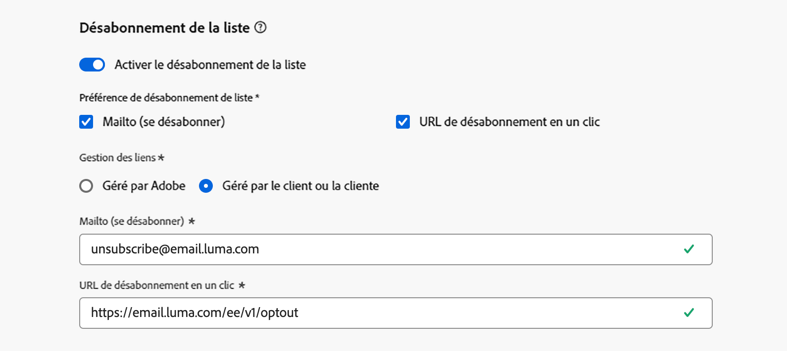

# Notes de mise à jour de 2025 {#release-notes-2025}

Cette page répertorie toutes les fonctionnalités et améliorations pour [!DNL Journey Optimizer] publiées en 2025.

## Notes de mise à jour de septembre 2025 {#25-9-rn}

**Date de publication** : 23 et 24 septembre 2025

### Nouvelles fonctionnalités {#sept-25-9-features}

<table>
<thead>
<tr>
<th><strong>Experimentation Accelerator de Journey Optimizer</strong> </th>
</tr>
</thead>
<tbody>
<tr>
<td>

Experimentation Accelerator de Journey Optimizer est un produit IA conçu pour faire passer votre expérimentation au niveau supérieur. Conçu pour les utilisateurs et utilisatrices d’Adobe Journey Optimizer et d’Adobe Target, il unifie la gestion des expériences, fournit des informations et des opportunités optimisées par l’IA et introduit un nouvel agent d’expérimentation.

Vous pouvez vous attendre aux points suivants :

<ul>
<li><strong>Inventaire d’expériences unifié :</strong> permet d’afficher, de filtrer et de gérer rapidement toutes les expériences d’Adobe Journey Optimizer et d’Adobe Target dans un espace de travail central.</li>
<li><strong>Informations et opportunités des expériences IA :</strong> allez au-delà des lectures statistiques avec des informations et des recommandations pilotées par GenAI. Chaque expérience fait désormais apparaître des opportunités exploitables, accompagnées d’une justification, afin que les équipes puissent décider en toute confiance de la suite des tests.</li>
<li><strong>Prise en charge du bandit manchot (MAB) dans Journey Optimizer :</strong> optimisez l’impact tout en réduisant le trafic gâché grâce aux expériences de bandit manchot. Au lieu de répartir les audiences de manière égale, MAB affecte automatiquement davantage de visiteurs et visiteuses aux variations les plus performantes en temps réel, afin que vous puissiez offrir de meilleures expériences à davantage de clientes et clients, tout en découvrant ce qui fonctionne.</li></ul>

Pour plus d’informations, consultez la <a href="https://experienceleague.adobe.com/fr/docs/experimentation-accelerator/using/overview">documentation détaillée</a>.

Date de disponibilité : 3 octobre_2025

</td>
</tr>
</tbody>
</table>

<table>
<thead>
<tr>
<th><strong>L’agent Journey est là !</strong> </th>
</tr>
</thead>
<tbody>
<tr>
<td>

Optimisé par <a href="https://experienceleague.adobe.com/fr/docs/experience-cloud-ai/experience-cloud-ai/agents/agent-orchestrator" target="_blank">Adobe Experience Platform Agent Orchestrator</a>, l’agent Journey est disponible dans Journey Optimizer. Il permet d’analyser les parcours par le biais d’une interface en langage naturel. L’agent détecte les conflits d’audience ou de planning et les rejets de profils dans un parcours afin de vous permettre de prendre des mesures pour les résoudre. Vous pourrez bientôt créer des parcours avec l’aide d’un agent.

Pour plus d’informations, consultez la <a href="https://experienceleague.adobe.com/fr/docs/experience-cloud-ai/experience-cloud-ai/agents/ajo-agent-analyze" target="_blank">documentation détaillée</a>.

Date de disponibilité : 24 septembre 2025

</td>
</tr>
</tbody>
</table>

<table>
<thead>
<tr>
<th><strong>Mode sombre dans le Concepteur d’e-mail</strong> </th>
</tr>
</thead>
<tbody>
<tr>
<td>

Le Concepteur d’e-mail de Journey Optimizer permet désormais de passer en mode sombre, pour que vous puissiez notamment définir des paramètres personnalisés spécifiques qui s’afficheront uniquement pour les destinataires qui lisent leurs e-mails en mode sombre.

Prenez note des points suivants :

<ul>
<li>Le rendu final du mode sombre dépend du client de messagerie de la personne destinataire.</li>
<li>Les clients de messagerie ne prennent pas tous en charge le mode sombre personnalisé. De plus, certains clients de messagerie appliquent uniquement leur propre mode sombre par défaut pour tous les e-mails reçus. Dans les deux cas, le rendu des paramètres personnalisés que vous avez définis dans le Concepteur d’e-mail ne pourra pas être affiché.</li>
</ul>

Pour plus d’informations, consultez la <a href="../email/dark-mode.md">documentation détaillée</a>.

 
Date de disponibilité : 16 septembre 2025

</td>
</tr>
</tbody>
</table>

<table>
<thead>
<tr>
<th><strong>Optimisation des chemins de parcours</strong> </th>
</tr>
</thead>
<tbody>
<tr>
<td>

Utilisez le nouveau nœud Optimiser pour cibler des audiences spécifiques ou exécuter des tests A/B afin de déterminer le meilleur moyen d’atteindre vos indicateurs de performance clés orientés métier.

Cet outil vous permet de tester, varier et personnaliser les communications, le séquencement et les délais afin d’atteindre avec précision votre clientèle.

Cette fonctionnalité est en disponibilité limitée. Contactez votre représentant ou représentante Adobe pour en obtenir l’accès.

Pour plus d’informations, consultez la <a href="../building-journeys/optimize.md">documentation détaillée</a>.

Date de disponibilité : 4 septembre 2025

</td>
</tr>
</tbody>
</table>

<table>
<thead>
<tr>
<th><strong>Méthode de délégation personnalisée pour les sous-domaines</strong> </th>
</tr>
</thead>
<tbody>
<tr>
<td>

Outre la délégation complète et la méthode CNAME, une nouvelle méthode de configuration de sous-domaine est désormais disponible : la méthode de délégation personnalisée. Elle vous permet de contrôler et de gérer totalement l’ensemble des aspects du DNS nécessaires à la diffusion, au rendu et au suivi des messages.

Cette fonctionnalité est en disponibilité limitée. Contactez votre représentant ou représentante Adobe pour en obtenir l’accès.

Pour plus d’informations, consultez la <a href="../configuration/delegate-custom-subdomain.md">documentation détaillée</a>.

Date de disponibilité : 4 septembre 2025

</td>
</tr>
</tbody>
</table>

<table>
<thead>
<tr>
<th><strong>Utiliser les données Adobe Experience Platform pour la personnalisation et la prise de décision</strong> </th>
</tr>
</thead>
<tbody>
<tr>
<td>

Publiée précédemment en version Beta publique, cette fonctionnalité est désormais disponible dans tous les environnements. Les améliorations suivantes ont été apportées à cette version :

<ul><li>Prise en charge de la personnalisation de la recherche de jeux de données dans les canaux entrants.</li>
<li>La fonction d’assistance « datasetLookup » peut désormais être utilisée dans les fragments d’expression. Pour l’instant, cette fonctionnalité est disponible pour un nombre limité de clientes et clients. Pour en bénéficier, contactez votre représentant ou représentante Adobe.</li>
<li>Une option de l’interface de gestion des jeux de données permet désormais d’activer les jeux de données basés sur des enregistrements pour la personnalisation de la recherche, sans avoir à effectuer d’appel API.</li>
<li>Surveillance améliorée pour suivre le statut d’ingestion des données et déterminer le moment auquel les jeux de données sont prêts pour la recherche.</li>
<li>Mise à jour des instructions d’utilisation et des mécanismes de sécurisation pour garantir des performances et une fiabilité optimales.</li>
<li>Les jeux de données Adobe Experience Platform peuvent désormais être utilisés dans les règles de limitation de prise de décision.</li></ul>

Pour plus d’informations, consultez la <a href="../data/lookup-aep-data.md">documentation détaillée</a>.

Date de disponibilité : 1er septembre 2025

</td>
</tr>
</tbody>
</table>

### Améliorations {#sept-25-9-improvements}

* **Prise en charge des webhooks pour les campagnes déclenchées par API**\
  Les campagnes déclenchées par API prennent désormais en charge les webhooks. Configurez une URL de webhook pour recevoir des mises à jour en temps réel du statut de chaque message, ce qui améliore l’observabilité et permet une surveillance et une automatisation efficaces. [En savoir plus](../configuration/feedback-webhooks.md)

  Date de disponibilité : 29 septembre 2025

* **Prise en charge de mTLS pour le canal SMS**
Lors de la configuration d’un fournisseur de SMS personnalisé, vous avez désormais la possibilité d’activer l’authentification TLS mutuelle (mTLS), qui nécessite que le client et le serveur confirment mutuellement leur identité avant qu’une connexion sécurisée ne soit établie. [En savoir plus](../sms/sms-configuration-custom.md) - Date de disponibilité : 23 septembre 2025

* **Schémas relationnels**\
  Les schémas relationnels peuvent désormais être utilisés pour prendre en charge vos besoins de modélisation relationnelle dans les campagnes orchestrées. [En savoir plus](../orchestrated/gs-schemas.md) - Date de disponibilité : 23 septembre 2025

* **Prise en charge de la recherche de jeux de données dans les parcours**\
  Une nouvelle activité dans les parcours, intitulée **Recherche de jeu de données**, permet de récupérer dynamiquement des données à partir de jeux de données d’enregistrement Adobe Experience Platform au moment de l’exécution. Grâce à cette fonctionnalité, vous pouvez accéder à des données qui peuvent ne pas figurer dans la payload de profil ou d’événement, ce qui garantit des interactions clients pertinentes et au moment opportun. [En savoir plus](../building-journeys/dataset-lookup.md) - Date de disponibilité : 23 septembre 2025

  Cette activité est disponible uniquement pour un ensemble d’organisations (disponibilité limitée). Pour en bénéficier, contactez votre représentant ou représentante Adobe.

* **Prise en charge de la redirection dans les actions personnalisées de parcours**\
  Les redirections (302) sont désormais prises en charge dans les actions personnalisées de parcours. - Date de disponibilité : 23 septembre 2025

* **Alertes de surveillance de la configuration des canaux** : vous pouvez désormais vous abonner pour recevoir des alertes système, soit par e-mail, soit dans le centre de notifications Journey Optimizer, en cas d’erreur de configuration du canal e-mail utilisant le type de délégation de sous-domaine personnalisé. [En savoir plus](../reports/alerts.md#alert-channel-config-failure) - Date de disponibilité : 23 septembre 2025

* **Demandes de désabonnement en un clic** : nous avons apporté des améliorations qui renforcent encore davantage le traitement des demandes de désabonnement en un clic configurées sous Adobe Managed, en garantissant un traitement fiable et cohérent. - Date de disponibilité : 23 septembre 2025

* **Les paramètres de corps JSON imbriqués sont désormais pris en charge dans l’authentification personnalisée.**\
  Lors de la configuration de l’authentification personnalisée pour une action personnalisée, les objets JSON imbriqués (par exemple, les sous-objets dans `bodyParams`) sont désormais pris en charge. [En savoir plus](../datasource/external-data-sources.md#custom-authentication-mode) - Date de disponibilité : 18 septembre 2025

* **Fréquence du capping redéfini à l’heure** : vous pouvez désormais appliquer un capping de la fréquence à l’heure pour les jeux de règles de canal. Auparavant proposée en disponibilité limitée, cette fonctionnalité est désormais proposée pour tous les environnements et permet de choisir une heure (auparavant trois heures). [En savoir plus](../conflict-prioritization/channel-capping.md) - Date de disponibilité : 17 septembre 2025

* **Simulation des variations de contenu pour tous les canaux entrants**\
  Auparavant uniquement disponible pour les canaux E-mail, SMS et Notification push, la simulation de variations de contenu s’applique désormais également à tous les canaux entrants. [En savoir plus](../test-approve/simulate-sample-input.md) - Date de disponibilité : 17 septembre 2025

* **Expression pour les règles de limitation de prise de décision** : vous pouvez désormais créer vos propres expressions pour définir le seuil d’une règle de limitation pour un élément de décision. [En savoir plus](../experience-decisioning/items.md#capping) - Date de disponibilité : 16 septembre 2025

* **Prise en charge des domaines dynamiques** : Journey Optimizer prend désormais en charge la personnalisation complète/de base des URL pour les domaines prédéfinis acceptés par Adobe. [En savoir plus](../personalization/personalization-build-expressions.md#where) - Date de disponibilité : 12 septembre 2025

  Cette fonctionnalité est proposée en disponibilité limitée pour un certain nombre de clientes et clients.

* **Webhooks** : cette version introduit les améliorations suivantes pour les webhooks lors de la configuration d’un fournisseur de SMS personnalisé :

   * Vous pouvez désormais définir l’objectif de votre webhook, soit Entrant, soit Commentaires, en fonction du type de données que vous souhaitez capturer. [En savoir plus](../sms/sms-configuration-custom.md#webhook) - Date de disponibilité : 23 septembre 2025

   * L’interface de configuration des mots-clés a été améliorée afin de faciliter la configuration. [En savoir plus](../sms/sms-configuration-custom.md#webhook) - Date de disponibilité : 23 septembre 2025

* **SMS**

   * Lors de la configuration d’un fournisseur de SMS personnalisé, vous pouvez désormais définir un mot-clé **par défaut** utilisé lorsqu’un SMS entrant contient un mot-clé non reconnu. Vous pouvez également créer des mots-clés **personnalisés** pour des actions spécifiques. [En savoir plus](../sms/sms-configuration-custom.md) - Date de disponibilité : 23 septembre 2025

   * Vous pouvez désormais accéder aux réponses envoyées par SMS pour des mots-clés entrants non définis, y compris les fautes de frappe, les mots ou les phrases qui ne sont pas explicitement définis dans la configuration. Elles sont stockées pendant 13 mois dans le jeu de données **Événement d’expérience de suivi d’e-mail AJO**, sous **Message entrant**. Disponible uniquement avec Sinch, Infobip et le fournisseur de SMS personnalisé. - Date de disponibilité : 23 septembre 2025

## Notes de mise à jour d’août 2025 {#25-8-rn}

**Date de publication** : 19 août 2025

### Nouvelles fonctionnalités {#Aug-25-8-features}

Les nouvelles fonctionnalités de cette version sont présentées ci-dessous.

<table>
<thead>
<tr>
<th><strong>Suspendre et reprendre les parcours</strong> </th>
</tr>
</thead>
<tbody>
<tr>
<td>

Vous pouvez maintenant suspendre et reprendre les parcours. Cette fonctionnalité offre aux concepteurs et conceptrices du parcours un meilleur contrôle et une plus grande flexibilité en leur permettant de suspendre temporairement les parcours actifs sans perturber l’expérience client. Lorsque le parcours est suspendu, aucune communication n’est envoyée et les profils restent suspendus jusqu’à la reprise du parcours.

Vous pouvez suspendre et reprendre un seul parcours ou un groupe de parcours par le biais d’opérations en bloc.

Il est également possible d’appliquer des critères de sortie basés sur les attributs de profil (anciennement appelés « filtre global ») aux parcours en pause afin d’exclure les profils en fonction de leurs attributs.

Publiée précédemment en disponibilité limitée, cette fonctionnalité est désormais proposée dans tous les environnements (disponibilité générale).

Pour plus d’informations, consultez la <a href="../building-journeys/journey-pause.md">documentation détaillée</a>.

</td>
</tr>
</tbody>
</table>

<table>
<thead>
<tr>
<th><strong>Vue Calendrier</strong> </th>
</tr>
</thead>
<tbody>
<tr>
<td>

Une vue Calendrier est désormais disponible dans les listes des parcours et des campagnes. Elle vous permet de visualiser toutes les activations de parcours et de campagnes dans les listes respectives.

Publiée précédemment en disponibilité limitée, cette fonctionnalité est désormais disponible dans tous les environnements. Avec cette version en disponibilité générale, la fonctionnalité inclut les points suivants :

<ul>
<li>Améliorations de la conception pour la navigation dans les dates</li>
<li>Possibilité de voir les brouillons de campagne si vous avez défini une date de début et une date de fin</li>
<li>Nouveau paramètre permettant de masquer et d’afficher les éléments de calendrier s’exécutant sur une longue période</li>
</ul>

Pour plus d’informations, consultez la <a href="../building-journeys/journey-ui.md#calendar">documentation détaillée</a>.

</td>
</tr>
</tbody>
</table>

<!--table>
<thead>
<tr>
<th><strong>Use Adobe Experience Platform data for personalization</strong> </th>
</tr>
</thead>
<tbody>
<tr>
<td>

Leverage data from [!DNL Adobe Experience Platform] in the personalization editor to personalize your content and decision attributes. In particular, this allows you to extend the definition of your attributes to additional data in datasets for bulk updates that change periodically without having to manually update the attributes one at a time.

With this release, the following enhancements have been introduced:

<ul>
<li>Support of inbound channels,</li>
<li>The "datasetLookup" helper function can now be used within expression and visual fragments to personalize content using data from Adobe Experience Platform datasets,</li>
<li>An option in the dataset now allows you to enable datasets for lookup personalization, without having to perform an API call.</li>
</ul>

This capability is available in Limited Availability. Contact your Adobe representative to gain access.

For more information, refer to the <a href="../personalization/aep-data-perso.md">detailed documentation</a>

</td>
</tr>
</tbody>
</table-->

<!--table>
<thead>
<tr>
<th><strong>Use Decisioning in email channel</strong> </th>
</tr>
</thead>
<tbody>
<tr>
<td>

You can now add Decision policies into email journeys and campaigns. Decision policies are containers for your offers that leverage the Decisioning engine to dynamically return the best content to deliver for each audience member.

Previously released in Limited Availability, this capability is now available to all environments (General Availability).

<For more information, refer to the <a href="../FILE.md">detailed documentation</a>

</td>
</tr>
</tbody>
</table-->

<table>
<thead>
<tr>
<th><strong>Activité d’action dans les parcours</strong> </th>
</tr>
</thead>
<tbody>
<tr>
<td>

Journey Optimizer prend en charge une nouvelle activité d’action générique qui vous permet de configurer des actions uniques et des groupes d’actions entrantes multiples, ce qui simplifie la configuration des actions dans la zone de travail de parcours. Cette nouvelle fonctionnalité permet notamment les opérations suivantes :

<ul>
<li>Configuration d’action native simplifiée dans la zone de travail de parcours</li>
<li>Création de groupes d’actions entrantes multi-actions</li>
<li>Ajout d’une optimisation à toute action de canal intégrée</li>
<li>Possibilité d’ajouter des options d’expérimentation et multilingues à n’importe quelle action</li>
</ul>

Cette fonctionnalité est en disponibilité limitée. Contactez votre représentant ou représentante Adobe pour en obtenir l’accès.

Pour plus d’informations, consultez la <a href="../building-journeys/journey-action.md">documentation détaillée</a>.

</td>
</tr>
</tbody>
</table>

<table>
<thead>
<tr>
<th><strong>Pièces jointes PDF aux e-mails</strong> </th>
</tr>
</thead>
<tbody>
<tr>
<td>

Vous pouvez désormais joindre un fichier PDF statique à un e-mail envoyé avec Journey Optimizer.

<ul>
<li>Vous pouvez envoyer jusqu’à 6 messages avec une pièce jointe PDF par profil et par an.</li>
<li>La taille maximale autorisée pour chaque fichier joint est de 5 Mo.</li>
<li>Pour augmenter la taille ou le volume, vous pouvez acheter un module complémentaire de pack de pièces jointes. Pour plus d’informations, contactez votre représentant ou représentante Adobe.</li>
</ul>

Cette fonctionnalité est en disponibilité limitée. Contactez votre représentant ou représentante Adobe pour en obtenir l’accès.

Pour plus d’informations, consultez la <a href="../email/pdf-attachments.md">documentation détaillée</a>.

</td>
</tr>
</tbody>
</table>

<!--
<table>
<thead>
<tr>
<th><strong>Landing page custom forms</strong> </th>
</tr>
</thead>
<tbody>
<tr>
<td>

With [!DNL Journey Optimizer], you can now capture profile attributes though your landing pages.

Create, design and manage custom forms tailored to your needs based on a specific dataset. You can then leverage these forms in landing pages to add the profile attributes of your choice into the dataset defined for each form.

This capability is currently in beta version and only available to beta customers. To join the beta program, contact your Adobe representative.

For more information, refer to the <a href="../FILE.md">detailed documentation</a>

</td>
</tr>
</tbody>
</table>
-->

<table>
<thead>
<tr>
<th><strong>Optimisation des campagnes</strong> </th>
</tr>
</thead>
<tbody>
<tr>
<td>

Journey Optimizer vous fournit désormais les outils nécessaires pour diffuser du contenu personnalisé et optimisé à votre audience. Vous pouvez ainsi exécuter des expériences de contenu, créer un ciblage basé sur des règles et utiliser des combinaisons avancées des deux pour optimiser l’efficacité de vos campagnes et parcours.

Avec l’optimisation, vous pouvez réaliser les actions suivantes :

<ul>
<li>Tester plusieurs variations de contenu pour identifier le message le plus efficace.</li>
<li>Diffuser du contenu personnalisé en fonction des attributs d’utilisation et des données contextuelles.</li>
<li>Combinez le ciblage et l’expérimentation pour obtenir des stratégies avancées.</li>
<li>Filtrer les utilisateurs et utilisatrices qui ne correspondent pas aux critères de variante.</li>
<li>Garantir des mécanismes de secours pour maintenir l’engagement client.</li>
</ul>

Une fois la campagne ou le parcours actif, les profils sont évalués en fonction des critères définis. Puis, en fonction des critères correspondants, ils sont diffusés avec l’expérience ou le contenu approprié.

Précédemment publiée le 8 août dans les campagnes uniquement, cette fonctionnalité est désormais également disponible dans les parcours à partir du 22 août.

Pour plus d’informations, consultez la <a href="../campaigns/campaigns-message-optimization.md">documentation détaillée</a>.

</td>
</tr>
</tbody>
</table>

### Améliorations {#Aug-25-8-improv}

Les améliorations de cette version sont présentées ci-dessous.

* **Administration**

   * **Alertes de surveillance de la configuration des canaux** : vous pouvez désormais vous abonner pour recevoir des alertes système, par e-mail ou dans le centre de notifications Journey Optimizer, au cas où <!--a channel configuration failure happens or if -->un enregistrement DNS est manquant. [En savoir plus](../reports/alerts.md#alert-dns-record-missing)

* **Assistant IA**

   * **Génération de contenu dans plusieurs langues** : le contenu peut désormais être généré en français, espagnol, allemand, italien, japonais, suédois, néerlandais et norvégien. [En savoir plus](../content-management/generative-uc.md#languages)

     Date de disponibilité : 25 août

* **Campagnes**

   * **Contrôle des taux dans les campagnes sortantes** : vous pouvez désormais activer le contrôle des taux pour les campagnes sortantes (e-mail, SMS, notifications push), ce qui vous permet d’éviter la surcharge des systèmes en aval, tels que les pages de destination ou les plateformes d’assistance clientèle. [En savoir plus](../campaigns/campaign-schedule.md#set-rate-control)

   * **Planification de campagnes d’action** : les planificateurs de campagnes quotidiens, hebdomadaires et mensuels ont été mis à jour afin d’assurer un contrôle plus détaillé des planifications récurrentes :

      * **Périodicité hebdomadaire** : vous pouvez désormais choisir de répéter la campagne toutes les semaines ou toutes les deux semaines, et sélectionner le ou les jours de la semaine où elle doit s’exécuter.

      * **Récurrence mensuelle** : vous pouvez désormais choisir de répéter la campagne tous les mois ou tous les deux mois, et sélectionner le jour du mois où elle doit s’exécuter.

      * **Plannings quotidiens, hebdomadaires ou mensuels** : vous pouvez indiquer si le planning récurrent doit s’arrêter à une date spécifique ou après un certain nombre d’occurrences.

   * **Campagnes d’action transactionnelles planifiées** : les campagnes d’action transactionnelles planifiées sont désormais disponibles pour l’envoi de communications transactionnelles par lots, basées sur l’audience, via des canaux e-mail, SMS et push.

* **Canal - Cartes de contenu**

   * **Modèles de disposition de carte de contenu** : le canal de carte de contenu fournit désormais des dispositions de message prêtes à l’emploi qui rationaliseront votre expérience de création. Cette version comprend des modèles de disposition Petite image, Grande image et Image seule. [En savoir plus](../content-card/design-content-card.md)

* **Canal - Push**

   * **Date d’expiration des notifications push** : vous pouvez désormais spécifier une date d’expiration pour chaque notification push. Cela empêche l’envoi de messages urgents (comme les soldes du Black Friday) après une certaine date, évitant ainsi une mauvaise expérience pour vos clientes et clients.

* **Canal - SMS**

   * **Opt-out en logique floue** : lorsqu’elle est activée, l’option **Opt-out en logique floue** détecte les messages entrants qui ressemblent fortement aux mots-clés d’opt-out définis (par exemple, « CANCIL ») et envoie automatiquement une réponse de confirmation pour vérifier l’intention de désabonnement de l’utilisateur ou l’utilisatrice. Si la personne confirme en utilisant l’invite définie, elle est désabonnée. [En savoir plus](../sms/sms-configuration-sinch.md)

     >[!NOTE]
     >
     >Notez que l’**Opt-out en logique floue** n’est disponible qu’avec Sinch et Infobip.

   * **Vérifier la connexion SMS** : vous pouvez désormais facilement tester et vérifier vos informations d’identification d’API SMS dans Adobe Journey Optimizer en envoyant un exemple de message à un appareil désigné. [En savoir plus](../sms/sms-configuration-sinch.md)

* **Configuration**

   * **Prise en charge des attributs personnalisés avec l’URL de désabonnement en un clic** : a-vec Journey Optimizer, si vous gérez le consentement en dehors d’Adobe, vous pouvez définir un point d’entrée personnalisé externe en définissant votre propre lien de désabonnement en un clic dans la configuration de l’e-mail. Lorsque les personnes destinataires cliquent sur le lien de désabonnement, Journey Optimizer ajoute certains paramètres par défaut, spécifiques au profil, à l’événement de mise à jour du consentement.

     Pour personnaliser davantage votre lien de désabonnement en un clic, vous pouvez maintenant définir des attributs personnalisés qui seront également ajoutés à l’événement de consentement. [En savoir plus](../email/list-unsubscribe.md#custom-attributes)

* **Jeux de données**

   * **Référentiel d’objets de décisions pour les expériences - Éléments d’offres personnalisées** : le jeu de données d’export intégré capture désormais tous les attributs de l’offre et le statut du cycle de vie, ce qui permet une personnalisation et un reporting complets. [En savoir plus](../data/export-datasets.md)

   * Ajout de la vérification des versions via le champ `etag` pour améliorer la cohérence et suivre les modifications afin de proposer des éléments de manière plus fiable.

* **Prise de décision**

   * **Joindre des fragments aux éléments de décision** : Journey Optimizer permet désormais de joindre des fragments aux éléments de décision qui peuvent être utilisés dans les campagnes d’expérience basées sur du code par le biais de politiques de décision. Cette fonctionnalité est proposée en disponibilité limitée pour un certain nombre de clientes et clients. [En savoir plus](../experience-decisioning/create-decision.md#fragments)

* **Parcours**

   * **Opérations de parcours en masse** : dans la liste de vos parcours, vous pouvez désormais sélectionner plusieurs éléments. Une fois la sélection réalisée, vous pouvez suspendre ou reprendre jusqu’à 10 parcours à la fois.

   * **Prise en charge de la redirection (302) dans les actions personnalisées** : les actions personnalisées peuvent désormais gérer les redirections HTTP 302 requête par requête. Cela permet aux parcours de s’intégrer aux API qui redirigent les requêtes vers des URL localisées ou spécifiques à une région. Les redirections sont suivies automatiquement, ce qui garantit que le contenu diffusé est correct, sans configuration supplémentaire.

   * **Plusieurs actions entrantes dans les campagnes** : pour simplifier l’orchestration de parcours, vous pouvez désormais définir plusieurs actions entrantes dans un seul parcours. Auparavant disponible dans les campagnes, cette fonctionnalité vous permet de diffuser plusieurs expériences basées sur du code, messages in-app, cartes de contenu ou actions web à différents emplacements en même temps, chaque action comportant du contenu spécifique. [En savoir plus](../building-journeys/journey-action.md#multi-action)

## Orchestration de campagne

**Date de disponibilité** : 4 août 2025

Journey Optimizer comprend désormais l’**orchestration des campagnes**, une nouvelle fonctionnalité spécialement conçue pour les campagnes par lots lancées par la marque. Cette version présente une zone de travail d’orchestration de campagne et une modélisation des données améliorée, qui fonctionnent ensemble pour permettre aux spécialistes marketing de planifier, de cibler et de diffuser des campagnes cross-canal personnalisées.

>[!IMPORTANT]
>
>Pour accéder à l’orchestration de campagne, votre licence doit inclure le package **Journey Optimizer - Campagnes et parcours** ou **Journey Optimizer - Campagnes**. Contactez votre représentant ou représentante Adobe pour confirmer votre licence et effectuer une mise à jour si nécessaire.

Elle comprend des [jeux de données et des schémas relationnels](#oc-relational) et une [zone de travail de campagne](#oc-canvas). Ensemble, ces deux innovations ouvrent la voie à un nouveau standard d’orchestration des campagnes par lots dans Journey Optimizer. Les fonctionnalités principales sont répertoriées ci-dessous.

### Fonctionnalités principales {#oc-capabilities}

* **Workflows à plusieurs étapes**

  Pilotez des campagnes par lots multicanaux sophistiquées avec la nouvelle zone de travail personnalisée pour l’orchestration de campagne.

* **Audiences à la demande**

  Segmentez les audiences à la demande pour une activation immédiate.

* **Segmentation d’entités multiples**

  Créez des audiences à l’aide du contexte commercial (dimensions autres que les personnes), par exemple les produits, les magasins, les renouvellements, les réservations, etc.

* **Visibilité avant envoi**

  Examinez, affiner et optimiser les audiences et les campagnes avant le lancement et pendant l’exécution des campagnes.

### Zone de travail de campagne {#oc-canvas}

Une toute nouvelle interface d’orchestration visuelle, conçue spécialement pour les campagnes par lots. Cette zone de travail permet d’effectuer les opérations suivantes :

* Planification visuelle des flux de campagnes multicanaux et à plusieurs étapes

* Prise en charge des audiences à la demande créées à partir de requêtes relationnelles

* Partage d’audience, attentes et logique conditionnelle avancés

* Nombre précis de pré-envois après l’application de règles et de filtres métier

### Jeux de données et schémas relationnels {#oc-relational}

Adobe Journey Optimizer prend désormais en charge les entités relationnelles (produits, magasins, réservations, contrats, etc.) liées à des profils basés sur des personnes. Cela permet la segmentation et la personnalisation sur des structures de données multidimensionnelles, en activant des cas d’utilisation tels que :

* Un message par réservation, abonnement ou contrat

* Segmentation basée sur les attributs d’entité associés (par exemple, catégorie de produits ou emplacement de magasin)

* Adressabilité améliorée (par exemple, envoi à tous les contacts connus liés à une entité)

### Importance de ces éléments

Cette version donne aux spécialistes marketing un contrôle total sur le marketing par lots initié par la marque et basé sur l’audience, en combinant la modélisation flexible des données avec une expérience d’orchestration personnalisée. Elle est spécialement conçue pour l’orchestration de campagne par lots à partir de parcours en temps réel, tout en offrant une personnalisation et une évolutivité avancées.

### En savoir plus

Pour en savoir plus, consultez la [documentation sur l’orchestration de campagne](../orchestrated/gs-orchestrated-campaigns.md).

## Notes de mise à jour de juillet 2025 {#25-7-rn}

**Date de publication** : 29 juillet 2025

### Nouvelles fonctionnalités {#features-25-7}

Les nouvelles fonctionnalités de cette version sont présentées ci-dessous.

#### Fonctionnalités

<table>
<thead>
<tr>
<th><strong>Marques</strong> </th>
</tr>
</thead>
<tbody>
<tr>
<td>

Vous pouvez désormais créer et personnaliser vos propres marques pour définir clairement votre identité visuelle et verbale dans les communications. Grâce au score d’alignement de la marque, vous pouvez recevoir des commentaires en temps réel sur la cohérence de votre contenu avec le ton, le style et les directives de votre marque, ce qui vous permet de vous assurer que chaque message envoyé soit constamment en phase avec la marque.

Publiée précédemment en version Beta, cette fonctionnalité est désormais disponible dans tous les environnements (disponibilité générale).

Pour plus d’informations, consultez la <a href="../content-management/brands.md">documentation détaillée</a>.

</td>
</tr>
</tbody>
</table>

<table>
<thead>
<tr>
<th><strong>Utiliser la prise de décision dans le canal e-mail</strong> </th>
</tr>
</thead>
<tbody>
<tr>
<td>

Vous pouvez désormais ajouter des politiques de décision dans des parcours et des campagnes par e-mail. Les politiques de décision sont des conteneurs pour vos offres qui tirent profit du moteur de prise de décision afin d’effectuer un rendu dynamique du meilleur contenu à diffuser, pour chaque membre de l’audience.

Cette fonctionnalité est en disponibilité limitée. Contactez votre représentant ou représentante Adobe pour en obtenir l’accès.

Pour plus d’informations, consultez la <a href="../experience-decisioning/create-decision.md">documentation détaillée</a>.

</td>
</tr>
</tbody>
</table>

<table>
<thead>
<tr>
<th><strong>Canal LINE</strong> </th>
</tr>
</thead>
<tbody>
<tr>
<td>

Adobe Journey Optimizer a étendu ses fonctionnalités cross-canal afin d’inclure la prise en charge du canal LINE. Cette amélioration vous permet de créer, de modifier et de prévisualiser des expériences LINE offrant des interactions davantage personnalisées et plus attrayantes. Avec LINE, vous pouvez entrer en contact avec davantage de clientes et clients, envoyer du contenu pertinent et améliorer votre engagement.

Auparavant disponible uniquement sur demande, le canal LINE est désormais disponible pour tous les utilisateurs et utilisatrices (disponibilité générale).

Pour plus d’informations, consultez la <a href="../../rp_landing_pages/line-landing-page.md">documentation détaillée</a>.
</td>
</tr>
</tbody>
</table>

<table>
<thead>
<tr>
<th><strong>Test à blanc du parcours</strong> </th>
</tr>
</thead>
<tbody>
<tr>
<td>

L’essai de parcours est un mode de publication de parcours spécial dans Adobe Journey Optimizer qui permet aux concepteurs et conceptrices de tester un parcours à l’aide de données de production réelles sans contacter les clients et clientes ni modifier les informations de profil. Cette fonctionnalité permet aux concepteurs et conceptrices du parcours de valider leur conception et leur ciblage d’audience avant de publier le parcours.

Publiée précédemment en disponibilité limitée, cette fonctionnalité est désormais proposée dans tous les environnements (disponibilité générale).

Pour plus d’informations, consultez la <a href="../building-journeys/journey-dry-run.md">documentation détaillée</a>.

</td>
</tr>
</tbody>
</table>

<table>
<thead>
<tr>
<th><strong>ID supplémentaire pour les parcours</strong> </th>
</tr>
</thead>
<tbody>
<tr>
<td>

Vous pouvez désormais déclencher des parcours à l’aide d’un identifiant de profil ainsi que d’un autre identifiant, tel qu’un identifiant de commande, d’abonnement ou de prescription, ce qui permet au même profil de se trouver plusieurs fois dans le même parcours à la fois. Cela permet des scénarios tels que la gestion de plusieurs commandes ou abonnements en parallèle, chaque instance suivant son propre chemin d’accès dans le parcours.

Publiée précédemment en disponibilité limitée, l’utilisation d’ID supplémentaires dans les parcours est désormais disponible pour tous les environnements. Avec cette version en disponibilité générale, la fonctionnalité prend désormais en charge les parcours Lecture d’audience.

Pour plus d’informations, consultez la <a href="../building-journeys/supplemental-identifier.md">documentation détaillée</a>.

</td>
</tr>
</tbody>
</table>

### Alertes intégrées au produit

Vous pouvez désormais vous abonner à des **alertes par e-mail et intégrées aux produits** pour connaître les mises à jour des produits Journey Optimizer.

Pour vous abonner :

* Accédez aux **préférences d’Adobe Experience Cloud**.
* Sous **Notifications**, recherchez **Nouvelles versions de Journey Optimizer**.
* Activer les notifications in-app et par e-mail

{width="70%" align="left"}

### Modification des conditions du parcours {#ee-change@}

À compter du 8 juillet, dans les nouvelles organisations clients, la création d’expressions à l’aide d’événements d’expérience n’est plus prise en charge dans l’éditeur d’expression utilisé dans les conditions de parcours. Par conséquent, les événements d’expérience dans la [source de données Experience Platform](../datasource/adobe-experience-platform-data-source.md) ne peuvent pas être utilisés pour créer des expressions. Les autres approches et bonnes pratiques pour créer des expressions/logiques avec des événements d’expérience sont référencées [ici](../building-journeys/exp-event-lookup.md).

L’accès aux données d’événement de contexte de parcours dans les parcours unitaires reste inchangé. Dans les éditeurs d’expression et de personnalisation, les utilisateurs et utilisatrices peuvent continuer à accéder aux données transmises avec l’événement de parcours initial.

Pour en savoir plus, consultez [ces questions fréquentes](../building-journeys/exp-event-lookup.md#faq-ee).

### Améliorations {#25-7-improv}

Les améliorations de cette version sont présentées ci-dessous.

* **Campagnes**

   * **Plusieurs actions entrantes dans les campagnes** : pour simplifier l’orchestration de campagne, vous pouvez désormais définir plusieurs actions entrantes dans une seule campagne. Cette fonctionnalité permet de diffuser plusieurs expériences basées sur du code, messages in-app, cartes de contenu ou actions web à différents emplacements en même temps, chaque action comportant du contenu spécifique.
     [En savoir plus](../campaigns/campaign-action.md#multi-action)

   * **Réorganisation de l’inventaire des campagnes** : les campagnes planifiées et déclenchées par API sont désormais divisées en onglets distincts dans l’inventaire des campagnes pour une navigation et une gestion plus faciles.

[En savoir plus](../campaigns/manage-campaigns.md)

* **Gestion des données**
   * **Mise à jour des jeux de données du système de gestion des décisions** : les offres personnalisées et de secours supprimées sont désormais marquées comme étant archivées dans les jeux de données « decision_object_repository_personalized_offers » et « decision_object_repository_fallback_offers ». Les enregistrements existants du jeu de données ne sont pas modifiés.

[En savoir plus](../offers/export-catalog/access-dataset.md)

* **Parcours**
   * **Améliorations des outils de sandbox de parcours** : lors de la copie de parcours dans plusieurs sandbox à l’aide des fonctionnalités d’export et d’import de package, les fonctionnalités suivantes sont désormais également disponibles :
      * Sélectionner un événement existant au niveau de la destination
      * Copier sur un événement indépendamment d’un parcours
      * Détecter des relations entre les groupes de champs et les sources de données, effectuer des liaisons vers ces dernières au niveau de la destination si elles existent, les créer si elles n’existent pas.

[En savoir plus](../configuration/copy-objects-to-sandbox.md)

* **Canal - In-app**
   * **Paires clé/valeur in-app** : avec les messages in-app, vous pouvez définir des paires clé/valeur pour inclure des variables personnalisées dans la payload du message. Ces paires clé-valeur vous permettent de transmettre des données supplémentaires en fonction de votre configuration et de votre cas d’utilisation spécifiques. [En savoir plus](../in-app/design-in-app.md)

* **Canal - Carte de contenu**

   * **Disqualification de campagne basée sur des règles** : lors de la modification de règles de diffusion supplémentaires, l’option Règles de diffusion précédente a été remplacée par trois types de règles distincts pour mieux contrôler le timing et la visibilité des messages :
      * Afficher le message si : conditions qui déterminent le moment auquel la carte de contenu est affichée.
      * Ignorer le message si : conditions qui masquent temporairement la carte de contenu. Elle peut réapparaître si les conditions d’affichage sont à nouveau remplies.
      * Disqualifier le message si : conditions qui empêchent définitivement l’affichage de la carte de contenu.

[En savoir plus](../content-card/design-content-card.md)

* **Prise de décision**
   * **API d’outils de migration** : l’équipe Journey Optimizer travaille actuellement sur des API d’outils de migration pour migrer les entités de gestion de décision vers la prise de décision. Ces outils permettent une migration transparente entre les sandbox avec des fonctionnalités de résolution de dépendance et de restauration. Si cela vous intéresse, contactez votre représentant ou représentante Adobe.

* **Personnalisation**
   * Une nouvelle fonction d’assistance, « SHA256 », a été ajoutée à l’éditeur de personnalisation. Cette fonction est utilisée pour calculer et renvoyer le hachage sha256 d’une chaîne.

[En savoir plus](../personalization/functions/string.md#sha256)

## Notes de mise à jour de juin 2025 {#25-6-rn}

**Date de publication** : 18 juin 2025

### Nouvelles fonctionnalités {#25-06-features}

Les nouvelles fonctionnalités de cette version sont présentées ci-dessous.

<table>
<thead>
<tr>
<th><strong>Jeux de données Adobe Experience Platform dans la prise de décision (version Beta)</strong> </th>
</tr>
</thead>
<tbody>
<tr>
<td>

Auparavant disponibles pour la personnalisation, les jeux de données Adobe Experience Platform peuvent désormais être utilisés pour la prise de décision. Vous pouvez ainsi étendre la définition des attributs de décision aux données supplémentaires des jeux de données pour les mises à jour en masse qui changent régulièrement sans avoir à mettre à jour manuellement les attributs un par un. Par exemple, la disponibilité, les temps d’attente, etc.

Cette fonctionnalité est actuellement disponible en version Beta publique pour l’ensemble des clientes et clients. Contactez votre représentant ou représentante de compte si vous souhaitez y accéder.

Pour plus d’informations, consultez la <a href="../experience-decisioning/aep-data-exd.md">documentation détaillée</a>.

Date de disponibilité : 20 juin 2025

</td>
</tr>
</tbody>
</table>

<table>
<thead>
<tr>
<th><strong>Messages RCS</strong> </th>
</tr>
</thead>
<tbody>
<tr>
<td>

Vous pouvez désormais configurer, personnaliser et diffuser des messages RCS (Rich Communication Services) via un fournisseur tiers en assurant l’intégration à une solution de fournisseur de SMS personnalisée.

Pour plus d’informations, consultez la <a href="../sms/sms-configuration-custom.md">documentation détaillée</a>.

</td>
</tr>
</tbody>
</table>

<table>
<thead>
<tr>
<th><strong>Champs de formulaire dans le contenu d’expérience basée sur du code</strong> </th>
</tr>
</thead>
<tbody>
<tr>
<td>

Vous pouvez désormais définir des champs modifiables spécifiques dans les modèles de contenu JSON ou HTML qui permettent aux personnes sans connaissances techniques de modifier facilement le contenu d’une vue de formulaire dans la création de canal d’expérience basée sur du code, sans avoir à manipuler de code. En outre, lors de la définition des modèles de contenu d’expérience basés sur du code, vous pouvez désormais insérer des politiques de décision dans le modèle, ce qui favorise la réutilisation et facilite l’utilisation.

Pour plus d’informations, consultez la <a href="../code-based/code-based-form-fields.md">documentation détaillée</a>.

</td>
</tr>
</tbody>
</table>

<!--
<table>
<thead>
<tr>
<th><strong>Custom delegation method for subdomains</strong> </th>
</tr>
</thead>
<tbody>
<tr>
<td>

In addition to the full delegation and the CNAME method, a new subdomain configuration method is now available: the Custom delegation method, which enables you to fully own controlling and maintaining all aspects of DNS that are required for delivering, rendering and tracking messages.

</td>
</tr>
</tbody>
</table>
-->

<table>
<thead>
<tr>
<th><strong>Activité Décision de contenu dans les parcours</strong> </th>
</tr>
</thead>
<tbody>
<tr>
<td>

Vous pouvez désormais inclure des offres personnalisées dans vos parcours par le biais d’une activité Décision de contenu dédiée dans la zone de travail du parcours et les utiliser dans des activités de parcours, y compris des conditions et des actions personnalisées.

Cette fonctionnalité n’est disponible que pour un certain nombre d’organisations (disponibilité limitée) et sera proposée à l’ensemble des utilisateurs et utilisatrices dans une prochaine version.

Pour plus d’informations, consultez la <a href="../building-journeys/content-decision.md">documentation détaillée</a>.

</td>
</tr>
</tbody>
</table>

<table>
<thead>
<tr>
<th><strong>Test à blanc du parcours</strong> </th>
</tr>
</thead>
<tbody>
<tr>
<td>

L’essai de parcours est un mode de publication de parcours spécial dans Adobe Journey Optimizer qui permet aux concepteurs et conceptrices de tester un parcours à l’aide de données de production réelles sans contacter les clients et clientes ni modifier les informations de profil. Cette fonctionnalité permet aux concepteurs et conceptrices du parcours de valider leur conception et leur ciblage d’audience avant de publier le parcours.

Cette fonctionnalité n’est disponible que pour un certain nombre d’organisations (disponibilité limitée) et sera proposée à l’ensemble des utilisateurs et utilisatrices dans une prochaine version.

Pour plus d’informations, consultez la <a href="../building-journeys/journey-dry-run.md">documentation détaillée</a>.

</td>
</tr>
</tbody>
</table>

<table>
<thead>
<tr>
<th><strong>Suspendre et reprendre les parcours</strong> </th>
</tr>
</thead>
<tbody>
<tr>
<td>

Vous pouvez maintenant suspendre et reprendre les parcours. Cette fonctionnalité offre aux concepteurs et conceptrices du parcours un meilleur contrôle et une plus grande flexibilité en leur permettant de suspendre temporairement les parcours actifs sans perturber l’expérience client. Lorsque le parcours est suspendu, aucune communication n’est envoyée et les profils restent suspendus jusqu’à la reprise du parcours.

Vous pouvez suspendre et reprendre un seul parcours ou un groupe de parcours par le biais d’opérations en bloc.

En outre, vous pouvez appliquer des filtres globaux aux parcours suspendus afin d’exclure les profils en fonction de leurs attributs.

Cette fonctionnalité n’est disponible que pour un certain nombre d’organisations (disponibilité limitée) et sera proposée à l’ensemble des utilisateurs et utilisatrices dans une prochaine version.

Pour plus d’informations, consultez la <a href="../building-journeys/journey-pause.md">documentation détaillée</a>.

</td>
</tr>
</tbody>
</table>

<table>
<thead>
<tr>
<th><strong>Mettre à l’échelle le gagnant de l’expérimentation</strong> </th>
</tr>
</thead>
<tbody>
<tr>
<td>

Mettre à l’échelle le gagnant de l’expérimentation vous permet de déployer automatiquement ou manuellement la variation gagnante d’une expérience sur l’ensemble de votre audience. Cette fonctionnalité vous permet d’optimiser la portée et l’efficacité d’un système performant identifié, sans surveillance manuelle constante.

Pour plus d’informations, consultez la <a href="../content-management/content-experiment.md">documentation détaillée</a>.

Date de disponibilité : 2 juin 2025
</td>
</tr>
</tbody>
</table>

<table>
<thead>
<tr>
<th><strong>Conflit et hiérarchisation</strong> </th>
</tr>
</thead>
<tbody>
<tr>
<td>

Dans Journey Optimizer, la gestion du volume et du calendrier des campagnes et des parcours est essentielle pour éviter de submerger les clientes et clients avec un trop grand nombre d’interactions. Journey Optimizer propose désormais plusieurs outils de gestion des conflits et de hiérarchisation, auparavant réservés aux organisations à accès limité (LA), qui sont désormais accessibles au public (GA).

Publiée précédemment en disponibilité limitée, cette fonctionnalité est désormais disponible dans tous les environnements. Les améliorations suivantes ont été apportées à cette version à disponibilité générale :

<ul>
<li>Prise en charge étendue : les outils de gestion des conflits prennent désormais en charge les Parcours unitaires et les Parcours de qualification d’audience, en plus des parcours Lecture d’audience.</li>
<li>Amélioration de la résolution des problèmes : deux nouveaux champs d’événement d’étape sont désormais disponibles dans Query Service, ce qui vous permet d’analyser pourquoi un profil a été rejeté d’un parcours ou d’une campagne.</li>
<li>Amélioration des rapports : les rapports indiquent désormais quelle règle spécifique a exclu un profil d’un parcours ou d’une campagne, ce qui offre une plus grande transparence et des informations exploitables.</li></ul>

Pour plus d’informations, consultez la <a href="../conflict-prioritization/gs-conflict-prioritization.md">documentation détaillée</a>.

Date de disponibilité : 3 juin 2025

</td>
</tr>
</tbody>
</table>

### Améliorations {#25-06-improv}

Les améliorations de cette version sont présentées ci-dessous.

* **Jeux de règles de canal**

   * **Fenêtre de durée personnalisée** pour le capping de la fréquence : un nouveau champ **Chaque** est désormais disponible dans l’écran de configuration des jeux de règles de canal. Il vous permet d’appliquer des règles de capping de la fréquence sur plusieurs jours, semaines ou mois, selon la durée spécifiée.

   * **Fréquence du capping redéfini à l’heure** : vous pouvez désormais appliquer un capping de la fréquence à l’heure pour les jeux de règles de canal. Cette fonctionnalité est disponible uniquement pour un nombre limité d’organisations (disponibilité limitée). Contactez l’assistance clientèle pour l’activer.

   * **Durée quotidienne** : auparavant en disponibilité limitée, le capping de la fréquence « quotidienne » dans les jeux de règles de canal est désormais disponible pour l’ensemble des clientes et clients.

  Pour plus d’informations, consultez la [documentation détaillée](../conflict-prioritization/channel-capping.md).

* **Expériences basées sur du code**

   * L’ajout d’une politique de décision est désormais disponible dans les modèles de contenu d’expérience basée sur du code, où elle peut être utilisée pour tirer profit des offres dans les champs de formulaire modifiables. [En savoir plus](../code-based/code-based-form-fields.md)

   * À partir du parcours d’expérience basée sur du code ou de l’écran de modification de la campagne, vous pouvez désormais ajouter directement une politique de décision, sans ouvrir l’éditeur de personnalisation. [En savoir plus](../code-based/create-code-based.md#edit-code)

* **Prise en charge des feuilles CSS personnalisées dans le Concepteur d’e-mail**

  Journey Optimizer vous permet désormais d’ajouter une feuille CSS personnalisée au contenu de votre e-mail directement dans le Concepteur d’e-mail. [En savoir plus](../email/custom-css.md)

* **Nouvelle navigation à onglets pour les campagnes**

  Le nouveau modèle de navigation permet un accès plus rapide à la création de contenu et prend en charge une extension supplémentaire des paramètres dans les campagnes. [En savoir plus](../campaigns/create-campaign.md)

* **Prise de décision**

   * **Copie de sandbox et prise de décision** (date de disponibilité : 3 juin 2025) : les objets de prise de décision peuvent désormais être copiés entre des sandbox, ce qui simplifie les workflows de test et de déploiement. [En savoir plus](../configuration/copy-objects-to-sandbox.md#decisioning)

   * **Prise en charge des attributs d’élément de décision pour les règles de prise de décision** (date de disponibilité : 4 juin 2025) * Vous pouvez désormais tirer profit des attributs d’élément de décision pour créer des règles de prise de décision. [En savoir plus](../experience-decisioning/rules.md#create)

* **Mise à jour de l’API d’exécution de message interactif** - Date de disponibilité : 6 juin 2025

  L’API d’exécution de message interactif vous permet désormais de supprimer le planning d’exécution des campagnes à venir. [En savoir plus](https://developer.adobe.com/journey-optimizer-apis/references/messaging/){target="_blank"}

## Notes de mise à jour de mai 2025 {#25-5-rn}

<!--**Release date**: May 20-21, 2025-->

### Nouvelles fonctionnalités {#25-05-features}

Les nouvelles fonctionnalités de cette version sont présentées ci-dessous.

<table>
<thead>
<tr>
<th><strong>Vue Calendrier pour l’inventaire des campagnes et des parcours</strong> </th>
</tr>
</thead>
<tbody>
<tr>
<td>

Une vue Calendrier est désormais disponible dans les listes des parcours et des campagnes. Elle vous permet de visualiser toutes les activations de parcours et de campagnes dans les listes respectives.

Ce changement n’est actuellement disponible que pour un ensemble d’organisations (disponibilité limitée). Pour demander l’accès, utilisez <a href="https://forms.cloud.microsoft/r/FC49afuJVi" target="_blank">ce formulaire</a>.

Pour plus d’informations, reportez-vous aux sections suivantes : <a href="../building-journeys/journey-ui.md">Parcourir et filtrer vos parcours</a>, <a href="../campaigns/manage-campaigns.md">Accéder aux campagnes</a>.

Date de disponibilité : 28 mai 2025

</td>
</tr>
</tbody>
</table>

<table>
<thead>
<tr>
<th><strong>Intégration de fragments de contenu Adobe Experience Manager</strong> </th>
</tr>
</thead>
<tbody>
<tr>
<td>

Grâce à l’intégration d’Adobe Experience Manager et d’Adobe Journey Optimizer, vous pouvez désormais utiliser facilement des fragments de contenu Adobe Experience Manager dans votre contenu Journey Optimizer. Cette connexion transparente facilite l’accès et l’utilisation de votre contenu AEM directement dans Journey Optimizer.

Auparavant disponible pour un nombre limité d’organisations (LA), cette fonctionnalité est désormais disponible en version GA avec l’amélioration suivante : vous pouvez maintenant définir des espaces réservés et mapper des valeurs de personnalisation dans la signature du fragment à l’aide du mode Éditeur.

<ul>
<!--li>Create offers by directly selecting an AEM Content Fragment.</li>
<li>Define placeholders and map personalization values within the fragment signature using the Editor mode.</li-->
</ul>
 

Pour plus d’informations, consultez la <a href="../integrations/aem-fragments.md">documentation détaillée</a>.

Date de disponibilité : 23 mai 2025

</td>
</tr>
</tbody>
</table>

<table>
<thead>
<tr>
<th><strong>Intégration d’Adobe Experience Manager Dynamic Media</strong> </th>
</tr>
</thead>
<tbody>
<tr>
<td>

Les ressources Dynamic Media sont désormais directement disponibles et accessibles dans Journey Optimizer. Cette intégration vous permet d’effectuer les opérations suivantes :

<ul>
<li>Gérez de manière centralisée des ressources avec mises à jour en temps réel.</li>
<li>Modifiez instantanément les paramètres de vos ressources, tels que la largeur et la hauteur.</li>
<li>Personnalisez des modèles Dynamic Media en mettant à jour votre contenu et en ajoutant des champs de personnalisation.</li>
</ul>
 

Publiée précédemment en disponibilité limitée, cette fonctionnalité est désormais proposée dans tous les environnements (disponibilité générale).

Pour plus d’informations, consultez la <a href="../integrations/aem-dynamic.md">documentation détaillée</a>.

Date de disponibilité : 23 mai 2025

</td>
</tr>
</tbody>
</table>

<table>
<thead>
<tr>
<th><strong>ID supplémentaire pour les parcours déclenchés par un événement</strong> </th>
</tr>
</thead>
<tbody>
<tr>
<td>

Vous pouvez désormais déclencher des parcours à l’aide d’un identifiant de profil ainsi que d’un autre identifiant, tel qu’un identifiant de commande, d’abonnement ou de prescription, ce qui permet au même profil de se trouver plusieurs fois dans le même parcours à la fois. Cela permet des scénarios tels que la gestion de plusieurs commandes ou abonnements en parallèle, chaque instance suivant son propre chemin d’accès dans le parcours.

Pour plus d’informations, consultez la <a href="../building-journeys/supplemental-identifier.md">documentation détaillée</a>.

Cette fonctionnalité est disponible uniquement pour un nombre limité d’organisations (disponibilité limitée). Pour en bénéficier, contactez votre représentant ou représentante Adobe.

Date de disponibilité : 23 mai 2025

</td>
</tr>
</tbody>
</table>

<table>
<thead>
<tr>
<th><strong>Simuler des variations de contenu</strong> </th>
</tr>
</thead>
<tbody>
<tr>
<td>
<!--p>Previously available in beta, content variations simulation is now generally available (GA). It allows you to preview different variations of your content using sample input data uploaded from a CSV or JSON file or added manually. All the attributes used in your content for personalization are automatically detected by the system and can be used for your tests to create multiple variants.</p-->

Publiée précédemment en disponibilité limitée, cette fonctionnalité est désormais disponible dans tous les environnements. Avec la sortie en disponibilité générale, la fonctionnalité prend désormais en charge le contenu multilingue et les expériences de contenu, ce qui vous permet de tester des variations dans différentes langues et configurations. En outre, elle prend désormais en charge les attributs contextuels (en plus des attributs de profil), ce qui permet d’effectuer des tests de contenu encore plus dynamiques et situationnels.

Pour plus d’informations, consultez la <a href="../test-approve/simulate-sample-input.md">documentation détaillée</a>.

Date de disponibilité : 23 mai 2025

</td>
</tr>
</tbody>
</table>

<table>
<thead>
<tr>
<th><strong>Synchroniser le planning de lecture d’audience avec la tâche de segmentation par lots</strong> </th>
</tr>
</thead>
<tbody>
<tr>
<td>

Vous pouvez désormais déclencher des parcours quotidiens après la fin de la segmentation par lots. Cette option est désormais disponible dans les parcours planifiés quotidiennement pour toute la clientèle. Cette option vous permet de définir une fenêtre temporelle allant jusqu’à 6 heures pour attendre les données d’audience des tâches de segmentation par lots, en vous assurant que les parcours s’exécutent avec les données les plus récentes ou sont ignorés s’ils ne sont pas prêts.

Publiée précédemment en disponibilité limitée, cette fonctionnalité est désormais proposée dans tous les environnements (disponibilité générale).

Pour plus d’informations, consultez la <a href="../building-journeys/read-audience.md#schedule">documentation détaillée</a>.

Date de disponibilité : 20 mai 2025

</td>
</tr>
</tbody>
</table>

<table>
<thead>
<tr>
<th><strong>Fournisseur de SMS personnalisé</strong> </th>
</tr>
</thead>
<tbody>
<tr>
<td>

Journey Optimizer vous permet désormais de configurer des fournisseurs SMS supplémentaires au-delà des options par défaut : Sinch, Infobip et Twilio. Grâce à la configuration personnalisée des fournisseurs SMS, vous pouvez intégrer directement des fournisseurs tiers, utiliser la personnalisation avancée de la payload pour la messagerie dynamique et gérer les préférences de consentement (opt-in/opt-out) pour garantir la conformité.

Pour plus d’informations, consultez la <a href="../sms/sms-configuration-custom.md">documentation détaillée</a>.

Publiée précédemment en disponibilité limitée, cette fonctionnalité est désormais proposée dans tous les environnements (disponibilité générale).

Date de disponibilité : 20 mai 2025

</td>
</td>
</tr>
</tbody>
</table>

<table>
<thead>
<tr>
<th><strong>Thèmes dans le concepteur d’e-mail</strong> </th>
</tr>
</thead>
<tbody>
<tr>
<td>

Vous pouvez désormais appliquer rapidement des thèmes préapprouvés pour garantir la cohérence de la marque dans tous les e-mails, accélérer le processus de création de vos campagnes et produire de manière autonome des e-mails de haute qualité tout en réduisant la dépendance à l’égard des équipes de conception.

Cette fonctionnalité est actuellement en version Beta et disponible uniquement pour les clientes et clients Beta. Pour rejoindre le programme Beta, contactez votre représentant ou représentante Adobe.

Pour plus d’informations, consultez la <a href="../email/apply-email-themes.md">documentation détaillée</a>.

Date de disponibilité : 14 mai 2025

</td>
</tr>
</tbody>
</table>

<table>
<thead>
<tr>
<th><strong>Prise de décision : nouveau créateur de formules IA</strong> </th>
</tr>
</thead>
<tbody>
<tr>
<td>

Vous pouvez désormais créer des formules de classement de prise de décision spécifiques en définissant et en combinant des critères à partir d’une nouvelle interface améliorée. Au lieu de vous fier uniquement à une priorité d’offre statique, vous pouvez définir des formules de classement personnalisées qui combinent les scores du modèle d’IA, les priorités d’offre, les attributs de profil, les attributs d’offre et les signaux contextuels par le biais d’une interface guidée.

Pour plus d’informations, consultez la <a href="../experience-decisioning/ranking/ranking-formulas.md">documentation détaillée</a>.

Date de disponibilité : 14 mai 2025

</td>
</tr>
</tbody>
</table>

### Améliorations {#25-05-improv}

Les améliorations de cette version sont présentées ci-dessous.

* **Nouvelle prise en charge des objets de campagne pour la copie dans les sandbox** - Date de disponibilité : 15 mai 2025

  Lors de la copie de campagnes sur plusieurs sandbox à l’aide des fonctionnalités d’export et d’import de package, les dépendances suivantes sont désormais également copiées : configurations de canal, variantes et paramètres d’expérience, politiques et éléments de décision. [En savoir plus](../configuration/copy-objects-to-sandbox.md)

* **Dossiers pour les pages de destination** - date de disponibilité : 9 mai 2025

  Pour gérer facilement les pages de destination, vous pouvez désormais utiliser des dossiers pour mieux les organiser dans une hiérarchie structurée. [En savoir plus](../landing-pages/manage-lp.md)

* **Courrier : prise en charge de la clé SSH pour les connexions SFTP** - date de disponibilité : 5 mai 2025

  Dans la configuration du routage des fichiers de courrier, outre le type d’authentification SFTP avec mot de passe existant, vous pouvez désormais exporter votre fichier de courrier vers un serveur SFTP avec authentification par clé SSH. [En savoir plus](../direct-mail/direct-mail-configuration.md)

* **Activation des pastilles pour la personnalisation** - date de disponibilité : 5 mai 2025

  Le nouveau bouton « Pastilles » a été ajouté à l’éditeur de personnalisation. Une fois activés, les attributs de profil et contextuels s’affichent sous forme de pastilles, ce qui améliore la lisibilité de votre code. [En savoir plus](../personalization/personalization-build-expressions.md#options)

  >[!AVAILABILITY]
  >
  >Cette fonctionnalité sera progressivement déployée dans tous les environnements au cours des 30 prochains jours.

* **Prise en charge de la « redirection vers une URL » dans le canal web** - Date de disponibilité : 20 mai 2025

  Le canal web Journey Optimizer vous permet désormais de rediriger les visiteurs et visiteuses vers une autre URL existante plutôt que de créer une nouvelle variation dans l’éditeur visuel. Cette fonctionnalité peut être utilisée pour exécuter des expériences en comparant deux pages complètement différentes au lieu de simplement modifier quelques éléments dans une page. [En savoir plus](../web/create-web.md#web-redirect-to-url)

* **Dossiers pour les modèles et fragments** - Date de disponibilité : 20 mai 2025

  Les dossiers vous permettent d’organiser vos objets plus facilement et plus efficacement dans une hiérarchie structurée. Auparavant disponibles pour un certain nombre d’organisations (disponibilité limitée), les dossiers sont désormais accessibles à tous les utilisateurs et utilisatrices (disponibilité générale) pour gérer les modèles et fragments de contenu. Pour en savoir plus, consultez les sections [Modèles de contenu](../content-management/access-content-templates.md#folders) et [Fragments](../content-management/manage-fragments.md#folders).

* **Suivi des clics dans les modèles d’e-mail** - Date de disponibilité : 20 mai 2025

  Le suivi des clics sur les éléments `<area>` dans les zones cliquables d’e-mail est désormais pris en charge de manière native dans [!DNL Journey Optimizer]. Cela permet de s’assurer que les zones cliquables reçoivent le même modèle, les mêmes données de suivi et les mêmes paramètres ajoutés que les liens hypertexte standard. [En savoir plus sur le suivi des messages](../email/message-tracking.md#manage-tracking)

<!--
* **Decisioning - Leverage Adobe Experience Platform datasets** 
  
  Journey Optimizer now allows you to leverage Adobe Experience Platform datasets in the following Decisioning objects: eligibility rules, ranking formulas, and capping rules.-->

* **Rail droit dans la liste des campagnes** - Date de disponibilité : 20 mai 2025

  Dans la liste des campagnes, la sélection d’une campagne ouvre désormais un volet affichant ses détails.

<!--* **Form fields in code-based experience content**

  In content templates, you can now define specific JSON or HTML fields which enable non-technical users to easily edit content in code-based experiences without the need to manipulate code.-->

<!--* **Subdomains - 'Custom delegation' method**  
  In addition to the full delegation and the CNAME method, a new subdomain configuration method is now available: the Custom delegation method, which enables you to fully own controlling and maintaining all aspects of DNS that are required for delivering, rendering, and tracking messages.
  -->

## Notes de mise à jour d’avril 2025 {#25-4-rn}

**Date de publication** : 29-30 avril 2025

### Nouvelles fonctionnalités {#25-04-features}

Les nouvelles fonctionnalités de cette version sont présentées ci-dessous.

<table>
<thead>
<tr>
<th><strong>Éditeur de personnalisation - Apprendre par la pratique</strong> </th>
</tr>
</thead>
<tbody>
<tr>
<td>

Un terrain de jeu de personnalisation est désormais disponible, où vous pouvez tester les expressions de personnalisation. Il vous permet d’explorer des exemples de modèles et de payloads pour que vous puissiez commencer vos propres expressions de personnalisation et les tester.

Pour plus d’informations, consultez la <a href="../personalization/personalize.md#playground">documentation détaillée</a>.

Date de disponibilité : 24 avril 2025

</td>
</tr>
</tbody>
</table>

<!--table>
<thead>
<tr>
<th><strong>Adobe Experience Manager as a Cloud Service integration</strong> </th>
</tr>
</thead>
<tbody>
<tr>
<td>

The integration between Adobe Journey Optimizer and Adobe Experience Manager as a Cloud Service is now released in General Availability (GA). This integration enables seamless content sourcing and management for personalized customer journeys.

For more information, refer to the <a href="../integrations/aem-templates.md">detailed documentation</a>.

</td>
</tr>
</tbody>
</table-->

<!--<table>
<thead>
<tr>
<th><strong>Simulate content variations (General Availability)</strong> </th>
</tr>
</thead>
<tbody>
<tr>
<td>

Previously available in beta, content variations simulation is now generally available (GA). It allows you to preview different variations of your content using sample input data uploaded from a CSV or JSON file or added manually. All the attributes used in your content for personalization are automatically detected by the system and can be used for your tests to create multiple variants.

With the General Availability release, the feature now includes support for multilingual content and content experiments, enabling you to test variations across different languages and treatments. Additionally, it now supports contextual attributes (in addition to profile attributes), allowing for even more dynamic and situational content testing.

</td>
</tr>
</tbody>
</table>-->

<table>
<thead>
<tr>
<th><strong>Canal LINE</strong> </th>
</tr>
</thead>
<tbody>
<tr>
<td>

Adobe Journey Optimizer a étendu ses fonctionnalités cross-canal afin d’inclure la prise en charge du canal LINE. Cette amélioration vous permet de créer, de modifier et de prévisualiser des expériences LINE offrant des interactions davantage personnalisées et plus attrayantes. Avec LINE, vous pouvez entrer en contact avec davantage de clientes et clients, envoyer du contenu pertinent et améliorer votre engagement.

Le canal LINE est activé sur demande pour les clientes et clients Adobe Journey Optimizer. Pour activer la fonctionnalité pour votre organisation, contactez l’assistance clientèle d’Adobe ou votre représentant ou représentante Adobe.

Pour plus d’informations, consultez la <a href="../../rp_landing_pages/line-landing-page.md">documentation détaillée</a>.
</td>
</tr>
</tbody>
</table>

<!--table>
<thead>
<tr>
<th><strong>Custom SMS provider (General Availability)</strong> </th>
</tr>
</thead>
<tbody>
<tr>
<td>

Adobe Journey Optimizer now supports custom SMS providers, allowing you to integrate your preferred SMS services for enhanced communication flexibility.

For more information, refer to the <a href="../sms/sms-configuration-custom.md">detailed documentation</a>.
</td>
</tr>
</tbody>
</table-->

<table>
<thead>
<tr>
<th><strong>Mesures de parcours</strong> </th>
</tr>
</thead>
<tbody>
<tr>
<td>

Les mesures de parcours vous permettent de mesurer l’impact de vos activités sur les mesures les plus importantes de votre entreprise et de fournir des informations plus claires sur vos performances.

 

Pour plus d’informations, consultez la <a href="../building-journeys/success-metrics.md">documentation détaillée</a>.

Date de disponibilité : 9 avril 2025

</td>
</tr>
</tbody>
</table>

<!--<table>
<thead>
<tr>
<th><strong>Calendar view for campaign and journey inventory (Limited Availability)</strong> </th>
</tr>
</thead>
<tbody>
<tr>
<td>

A new calendar view is now available for campaigns and journey activations. This feature provides a visual representation of scheduled activities, allowing you to view and manage your campaigns and journeys more effectively. Selecting a calendar item opens a right rail with detailed information. This feature is currently in Limited Availability.

</td>
</tr>
</tbody>
</table>-->

<table>
<thead>
<tr>
<th><strong>Intégration d’Adobe Express (disponibilité limitée)</strong> </th>
</tr>
</thead>
<tbody>
<tr>
<td>

Adobe Journey Optimizer s’intègre désormais à Adobe Express, ce qui vous permet de connecter facilement vos ressources de création à l’orchestration de parcours. Cette intégration simplifie le processus de conception et de déploiement de contenu personnalisé dans les campagnes. 

Cette intégration n’est actuellement pas disponible pour une utilisation avec Healthcare Shield ou Privacy and Security Shield.

Pour plus d’informations, consultez la <a href="../integrations/express.md">documentation détaillée</a>.

</td>
</tr>
</tbody>
</table>

<table>
<thead>
<tr>
<th><strong>Le parcours quotidien Déclencheur s’exécute après la fin de la segmentation par lots (disponibilité limitée)</strong> </th>
</tr>
</thead>
<tbody>
<tr>
<td>

Pour les parcours planifiés par jour, une nouvelle option vous permet de définir une fenêtre temporelle allant jusqu’à 6 heures pour attendre les données d’audience des tâches de segmentation par lots, en vous assurant que les parcours s’exécutent avec les données les plus récentes ou sont ignorés s’ils ne sont pas prêts. L’option Déclencheur après l’évaluation de l’audience par lots n’est disponible que pour un ensemble d’organisations (disponibilité limitée). Pour en bénéficier, contactez votre représentant ou représentante Adobe.

Pour plus d’informations, consultez la <a href="../building-journeys/read-audience.md#schedule">documentation détaillée</a>.

</td>
</tr>
</tbody>
</table>

<!--table>
<thead>
<tr>
<th><strong>Themes in the Email Designer (Beta)</strong> </th>
</tr>
</thead>
<tbody>
<tr>
<td>

You can now quickly apply pre-approved styling themes to your email content to ensure brand consistency across all emails, speed up your campaign creation process and independently produce hight-quality emails while reducing dependency on design teams.

This capability is currently in beta version and only available to beta customers. To join the beta program, contact your Adobe representative.

For more information, refer to the <a href="../content-management/brands-score.md">detailed documentation</a>.

Availability date: May 5, 2025

</td>
</tr>
</tbody>
</table-->

<table>
<thead>
<tr>
<th><strong>Score d’alignement de la marque (Beta)</strong> </th>
</tr>
</thead>
<tbody>
<tr>
<td>

Le score d’alignement de la marque fournit des commentaires clairs directement dans le concepteur d’e-mail, ce qui vous permet de vérifier que votre contenu correspond au ton, au style et aux règles de votre marque. Cette fonctionnalité est actuellement en version Beta.

Pour plus d’informations, consultez la <a href="../content-management/brands-score.md">documentation détaillée</a>.

</td>
</tr>
</tbody>
</table>

<!--
<table>
<thead>
<tr>
<th><strong>Decisioning - New AI formula builder</strong> </th>
</tr>
</thead>
<tbody>
<tr>
<td>

You can now create specific Decisioning ranking formulas by defining and combining criteria from a new improved interface. Ranking formulas allow you to define rules that will determine which decision items should be presented first, rather than taking into account the priority scores.

For more information, refer to the <a href="../content-management/brands-score.md">detailed documentation</a>.

Availability date: May 5, 2025

</td>
</tr>
</tbody>
</table>
-->

### Améliorations {#25-04-improv}

**API d’aperçu des campagnes**

De nouvelles API sont disponibles pour prévisualiser les campagnes, en plus des fonctionnalités existantes d’envoi de BAT. [En savoir plus](https://developer.adobe.com/journey-optimizer-apis/references/simulations/#operation/createCampaignPreview){target="_blank"}.

**Outils relatifs aux sandbox**

* **Outils relatifs aux sandbox pour les actions personnalisées**

  Les actions personnalisées sont désormais incluses dans la liste des objets Adobe Journey Optimizer qui peuvent être copiés à l’aide de la fonctionnalité d’outils relatifs aux sandbox, ce qui simplifie les tests et le déploiement. [En savoir plus](../configuration/copy-objects-to-sandbox.md)

* **Outils relatifs aux sandbox** - Date de disponibilité : 3 avril 2025

  Vous pouvez désormais copier des campagnes dans plusieurs sandbox à l’aide des fonctionnalités d’export et d’import de packages. Les campagnes sont copiées avec tous les éléments liés au profil, à l’audience, au schéma, aux messages en ligne et aux objets dépendants. Certains éléments ne sont pas copiés, tels que les éléments de décision, les libellés d’utilisation des données et les paramètres de langue. [En savoir plus](../configuration/copy-objects-to-sandbox.md#custom-actions)

**Personnalisation**

* **Nouvel attribut contextuel**

  Un nouvel attribut contextuel, **ID de profil du message**, est disponible dans l’éditeur de personnalisation. Il s’agit d’un attribut orienté message qui identifie de manière unique chaque message envoyé à chaque profil ciblé dans une diffusion. Cet identifiant unique peut notamment être utilisé comme paramètre de tracking des URL pour distinguer chaque lien ouvert ou sur lequel les destinataires ont cliqué.

* **Attributs renseignés dans le volet Attributs** - Date de disponibilité : 2 avril 2025

  Le volet Attributs de l’éditeur de personnalisation affiche désormais uniquement les attributs renseignés par défaut. Pour afficher tous les attributs, utilisez le bouton des paramètres pour activer ou désactiver l’option **[!UICONTROL Afficher uniquement les attributs renseignés]**. [En savoir plus](../personalization/personalization-build-expressions.md)

**Canal e-mail**

* **Tracking personnalisé des URL** - Date de disponibilité : 30 avril 2025

  Pour plus de flexibilité et de contrôle sur vos paramètres d’e-mail, vous pouvez désormais personnaliser tous vos paramètres de suivi des URL en même temps au niveau de la configuration des canaux e-mail, au lieu de le faire dans le concepteur d’e-mail pour chaque lien de votre contenu. [En savoir plus](../email/surface-personalization.md#personalize-url-tracking)

* **Concepteur d’e-mail** - Date de disponibilité : 1er avril 2025

  Pour améliorer l’accessibilité dans Journey Optimizer, deux nouveaux champs sont désormais disponibles dans le concepteur d’e-mail : ils correspondent à l’élément `<title>` et à l’attribut `lang` dans l’élément `<html>` du contenu de votre e-mail. Vous pouvez définir ces paramètres en plus du champ **[!UICONTROL Pré-en-tête]**, dans la section **[!UICONTROL Corps]** de l’e-mail. [En savoir plus](../email/email-metadata.md)

**Playbooks de cas d’utilisation**

* **Création et partage de playbooks (Private Beta)** : vous pouvez désormais créer, gérer et partager vos propres playbooks de cas d’utilisation. Actuellement, cette fonctionnalité n’est disponible que pour un ensemble d’organisations sous la forme d’une version Private Beta. Pour en bénéficier, contactez votre représentant ou représentante Adobe. [En savoir plus](../start/playbooks.md)

**Navigation**

* **Gestion de contenu** - Date de disponibilité : 2 avril 2025

  Pour gérer facilement vos fragments et vos modèles de contenu, vous pouvez désormais utiliser des dossiers pour mieux les organiser dans une hiérarchie structurée. Pour en savoir plus, consultez les sections [Modèles de contenu](../content-management/access-content-templates.md#folders) et [Fragments](../content-management/manage-fragments.md#folders).

  >[!AVAILABILITY]
  >
  >Cette amélioration est disponible uniquement pour un ensemble d’organisations (disponibilité limitée).

<!--- **Folders for content templates and fragments** - Availability date: May 5, 2025

  Previously available for a set of organizations (LA), folders are now available to all users (GA) to manage their content templates and fragments. Folders let you organize your content templates and fragments more easily and effectively into a structured hierarchy.

<!--- **Right rail in campaigns list**  

  A right rail has been added to the campaigns list, providing detailed information when a campaign is selected.-->

<!--**Playbooks**

- **Create your own playbooks (Beta)**
  
  You can now create your own playbooks in Adobe Journey Optimizer, enabling greater customization and flexibility in journey planning.-->

## Notes de mise à jour de mars 2025 {#25-3-rn}

### Nouvelles fonctionnalités {#25-03-features}

Les nouvelles fonctionnalités de cette version sont présentées ci-dessous.

<!--table>
<thead>
<tr>
<th><strong>Integration with Adobe Express (Limited Availability)</strong> </th>
</tr>
</thead>
<tbody>
<tr>
<td>

The Adobe Express integration in Adobe Journey Optimizer lets you use Adobe Express's editing tools directly during content creation, enabling you to resize, remove backgrounds, crop, and convert assets to JPEG or PNG.

Adobe Express integration in Adobe Journey Optimizer is currently only available for a set of organizations (Limited Availability). It cannot be deployed for use with Healthcare Shield or Privacy and Security Shield.

For more information, refer to the <a href="../integrations/express.md">detailed documentation</a>.

 

</td>
</tr>
</tbody>
</table-->

<!--table>
<thead>
<tr>
<th><strong>Journey metrics</strong> </th>
</tr>
</thead>
<tbody>
<tr>
<td>

Journey metrics are now available, allowing you to measure the impact of your activities across the key metrics of your business and to provide clearer insights into your performance.

For more information, refer to the <a href="../building-journeys/success-metrics.md">detailed documentation</a>.

</td>
</tr>
</tbody>
</table-->

<!-- table>
<thead>
<tr>
<th><strong>Calendar view for journeys (Limited Availability)</strong> </th>
</tr>
</thead>
<tbody>
<tr>
<td>

A calendar view is now available in Journey Optimizer to visualize all journeys activations. From this view, you can browse your journeys and check details and properties.

This change is only available for a set of organizations (Limited Availability). To gain access, contact your Adobe representative.

For more information, refer to the <a href="../conflict-prioritization/rule-sets.md">detailed documentation</a>.

</td>
</tr>
</tbody>
</table-->

<table>
<thead>
<tr>
<th><strong>Intégration à Dynamic Media (disponibilité limitée)</strong> </th>
</tr>
</thead>
<tbody>
<tr>
<td>

Les ressources Dynamic Media sont désormais directement disponibles et accessibles dans Journey Optimizer. Cette intégration vous permet d’effectuer les opérations suivantes :
<ul>
<li>Gérer de manière centralisée des ressources avec mises à jour en temps réel</li>
<li>Modifier instantanément les paramètres de vos ressources, tels que la largeur et la hauteur</li>
<li>Personnaliser des modèles Dynamic Media en mettant à jour votre contenu et en ajoutant des champs de personnalisation</li>
</ul>

Cette intégration est disponible uniquement pour un ensemble d’organisations (disponibilité limitée). Pour en bénéficier, contactez votre représentant ou représentante Adobe.

Pour plus d’informations, consultez la <a href="../integrations/aem-dynamic.md">documentation détaillée</a>.

</td>
</tr>
</tbody>
</table>

<table>
<thead>
<tr>
<th><strong>Intégration avec Adobe GenStudio (disponibilité limitée)</strong> </th>
</tr>
</thead>
<tbody>
<tr>
<td>

Pour améliorer l’efficacité marketing et maintenir la cohérence de la marque, vous pouvez désormais intégrer facilement des expériences GenStudio for Performance Marketing à Journey Optimizer. Vous pouvez ainsi tirer parti de la création de contenu optimisée par l’IA de GenStudio ainsi que des fonctionnalités d’orchestration avancées de Journey Optimizer.

L’utilisation de l’intégration de GenStudio dans Journey Optimizer n’est actuellement pas disponible pour une utilisation avec Healthcare Shield ou Privacy and Security Shield (disponibilité limitée).

Pour plus d’informations, consultez la <a href="../integrations/genstudio.md">documentation détaillée</a>.

</td>
</tr>
</tbody>
</table>

<table>
<thead>
<tr>
<th><strong>Évaluation d’audience flexible (GA)</strong> </th>
</tr>
</thead>
<tbody>
<tr>
<td>

Auparavant disponible pour un ensemble d’organisations (LA), l’évaluation d’audience flexible est désormais disponible pour tous les utilisateurs et toutes les utilisatrices (GA). Cette fonctionnalité vous permet d’exécuter le traitement de la segmentation à la demande pour des audiences sélectionnées, en vous assurant de toujours disposer des données d’audience les plus récentes avant de les cibler dans des parcours et des campagnes Journey Optimizer.

Pour plus d’informations, consultez la <a href="../audience/creating-a-segment-definition.md#flexible">documentation détaillée</a>.

</tr>
</tbody>
</table>
</table>

<!--table>
<thead>
<tr>
<th><strong>LINE channel (Limited Availability)</strong> </th>
</tr>
</thead>
<tbody>
<tr>
<td>

Adobe Journey Optimizer has expanded its cross-channel capabilities to include support for the LINE channel. This enhancement allows you to create, edit, and preview LINE experiences enabling more personalized and engaging interactions. With LINE, you can connect with more customers, send relevant content, and improve your engagement.

This capability is only available for a set of organizations (Limited Availability). To gain access, contact your Adobe representative.

For more information, refer to the <a href="../conflict-prioritization/rule-sets.md">detailed documentation</a>.

</td>
</tr>
</tbody>
</table-->

### Améliorations {#25-03-improv}

**Éditeur de personnalisation** (date de disponibilité : 12 mars)

L’éditeur de personnalisation Journey Optimizer a été mis à jour avec de nouvelles fonctionnalités :

* **Mise à jour de la conception de l’éditeur de code** : une interface moderne plus épurée pour une expérience plus conviviale et intuitive.
* **Rechercher et remplacer** : ajout d’une fonctionnalité pour rechercher et remplacer rapidement du contenu dans l’éditeur.
* **Prise en charge de l’annulation et de la restauration** : vous permet d’annuler ou de rétablir facilement les modifications.
* **Taille de police personnalisable** : permet d’ajuster la taille de police de l’éditeur pour une meilleure lisibilité.
* **Validation JSON intégrée** : fournit une validation côté client en temps réel du contenu JSON pour accélérer la détection des erreurs.
* **Saisie automatique pour les attributs de profil et de contexte** : propose des suggestions intelligentes pour optimiser la création de contenu.
* **Amélioration de la mise en surbrillance de la syntaxe** : améliore la lisibilité en rendant la structure du code plus identifiable visuellement.

Pour plus d’informations, consultez la [documentation détaillée](../personalization/personalization-build-expressions.md).

**Validations**

Lors de la définition des conditions d’une politique d’approbation, vous avez désormais la possibilité de filtrer par balise et/ou catégorie d’objet.

Pour plus d’informations, consultez la [documentation détaillée](../test-approve/approval-policies.md).

**Configuration**

* Vous pouvez désormais attribuer des balises unifiées Adobe Experience Platform à vos configurations de canaux. Vous pouvez ainsi les classer facilement et améliorer la recherche et la navigation dans toutes les listes. [En savoir plus](../configuration/channel-surfaces.md#channel-config-tags)

* Lors de la configuration ou de la modification d’un sous-domaine d’e-mail dans Journey Optimizer, vous pouvez désormais choisir de gérer vous-même l’enregistrement DMARC associé, s’il est disponible sur le domaine parent. [En savoir plus](../configuration/dmarc-record.md#set-up-dmarc)

**Règles métier**

Vous pouvez désormais utiliser le capping de la fréquence quotidienne dans les parcours et les campagnes avec la segmentation par lots. Pour garantir la précision des règles de capping de la fréquence quotidienne, veillez à choisir l’espace de noms de priorité la plus élevée lors de la création d’une campagne ou d’un parcours. Pour en savoir plus sur la priorité des espaces de noms, consultez le [guide sur le service d’identités Platform](https://experienceleague.adobe.com/fr/docs/experience-platform/identity/features/identity-graph-linking-rules/namespace-priority){target="_blank"}.

Pour rappel, le capping de la fréquence quotidienne dans les jeux de règles n’est disponible que pour un ensemble d’organisations (disponibilité limitée). Pour en bénéficier, contactez votre représentant ou représentante Adobe.

Pour plus d’informations sur les règles métier, consultez la [documentation détaillée](../conflict-prioritization/rule-sets.md).

**Modèles de contenu**

Les modèles de contenu de type HTML sont désormais obsolètes. Notez que vous pouvez toujours utiliser les modèles de contenu HTML existants, précédemment créés dans [!DNL Journey Optimizer]. [En savoir plus sur les modèles de contenu](../content-management/content-templates.md)

<!--**Deliverability**

You can now choose to have your emails relayed to your SMTP servers instead of being sent directly from Journey Optimizer to ISPs. This allows you to route final email deliveries through your own Mail Transfer Agents and IPs, or to perform final validations on the emails before sending them to your recipients. The SMTP relay capacity is available on demand - contact your Adobe representative.-->

## Notes de mise à jour de février 2025 {#25-02-rn}

**Date de publication** : 18 et 19 février 2025

### Nouvelles fonctionnalités {#25-02-features}

Les nouvelles fonctionnalités de cette version sont présentées ci-dessous.

<table>
<thead>
<tr>
<th><strong>Créer et gérer des règles métier</strong> </th>
</tr>
</thead>
<tbody>
<tr>
<td>

Vous pouvez désormais créer des règles métier à l’aide de jeux de règles. Les jeux de règles sont des groupes de règles qui vous permettent de limiter les messages envoyés dans les campagnes et les actions de parcours sur plusieurs canaux, ainsi que de contrôler les entrées de profils dans les parcours.

<ul><li>Créez des jeux de règles de canal pour limiter le nombre de messages envoyés sur un ou plusieurs canaux. Appliquez-les à des campagnes ou à des actions de parcours pour appliquer les règles définies dans le jeu de règles. Le jeu de règles de canal vous permet d’appliquer des règles de limitation en fonction des types de communications. Par exemple, définissez un jeu de règles pour limiter les « messages promotionnels » et un autre pour les « newsletters ». Appliquez le jeu de règles approprié dans votre campagne ou action de parcours en fonction du type de communication que vous envoyez.</li>
<li> Créez des jeux de règles de parcours pour contrôler les entrées de profil dans les parcours. Limitez la fréquence à laquelle un profil peut rejoindre un parcours au cours d’une période donnée ou le nombre de parcours auxquels un profil peut être inscrit simultanément. Appliquez-les au niveau du parcours pour assurer une bonne gestion des entrées.</li></ul>

Disponibles auparavant pour un ensemble d’organisations (disponibilité limitée), les règles métier sont désormais disponibles pour tous les utilisateurs et utilisatrices (disponibilité générale). Les règles métier de domaine parcours restent disponibles uniquement pour un nombre restreint d’organisations (disponibilité limitée).

Pour plus d’informations, consultez la <a href="../conflict-prioritization/rule-sets.md">documentation détaillée</a>.

</td>
</tr>
</tbody>
</table>

<table>
<thead>
<tr>
<th><strong>Générer des pages de destination avec l’Assistant IA</strong> </th>
</tr>
</thead>
<tbody>
<tr>
<td>

Grâce à l’Assistant IA, vous pouvez désormais concevoir du contenu attrayant pour vos pages de destination, notamment des conceptions de pages complètes, du texte et des visuels personnalisés.

Pour plus d’informations, consultez la <a href="../content-management/generative-full-content.md">documentation détaillée</a>.

</td>
</tr>
</tbody>
</table>

<table>
<thead>
<tr>
<th><strong>Marques avec l’Assistant IA (Beta)</strong> </th>
</tr>
</thead>
<tbody>
<tr>
<td>

Vous pouvez désormais choisir vos propres marques pour définir l’identité visuelle et verbale de votre marque. 

Cette fonctionnalité est disponible en version Private Beta pour un nombre limité de clientes et clients. Elle sera progressivement disponible pour l’ensemble de la clientèle dans les versions ultérieures.

Pour plus d’informations, consultez la <a href="../content-management/brands.md">documentation détaillée</a>.

</td>
</tr>
</tbody>
</table>

<table>
<thead>
<tr>
<th><strong>Résoudre les problèmes liés aux actions personnalisées</strong> </th>
</tr>
</thead>
<tbody>
<tr>
<td>

Vous pouvez désormais valider une configuration d’action personnalisée en effectuant des appels API réels directement depuis Adobe Journey Optimizer. Cette nouvelle fonctionnalité vous permet de résoudre les problèmes liés à vos actions personnalisées avant ou après leur utilisation dans un parcours. 

Pour plus d’informations, consultez la <a href="../action/troubleshoot-custom-action.md">documentation détaillée</a>.

<!--p> This capability is only available for a set of organizations (Limited Availability). To gain access, contact your Adobe representative.</p-->
</td>
</tr>
</tbody>
</table>

<table>
<thead>
<tr>
<th><strong>Évaluation flexible des audiences (disponibilité limitée)</strong> </th>
</tr>
</thead>
<tbody>
<tr>
<td>

L’évaluation flexible des audiences vous permet d’exécuter une tâche de segmentation à la demande pour des audiences sélectionnées, en vous assurant de toujours disposer des données d’audience les plus récentes avant de les cibler dans des parcours et des campagnes Journey Optimizer.

Pour plus d’informations, consultez la <a href="../audience/creating-a-segment-definition.md#flexible">documentation détaillée</a>.

Cette fonctionnalité est disponible uniquement pour un nombre limité d’organisations (disponibilité limitée). Pour en bénéficier, contactez votre représentant ou représentante Adobe.

Date de disponibilité : 28 janvier 2025

</tr>
</tbody>
</table>
</table>

### Améliorations {#25-02-improvements}

Les améliorations ci-dessous proviennent de la mise à jour de février.

* **Durée de vie du jeu de données (TTL)** : à compter de ce mois-ci, un mécanisme de sécurisation sur la durée de vie (TTL) sera déployé sur les jeux de données générés par le système Journey Optimizer dans les nouveaux sandbox et les nouvelles organisations comme suit :

   * 90 jours pour les données dans la banque de profils
   * 13 mois pour les données du lac de données

  Cette modification sera déployée sur les sandbox des clientes et clients existants au cours d’une phase ultérieure.

  En savoir plus sur cette mise à jour dans [les questions fréquentes](../data/datasets-ttl.md#frequently-asked-questions).

<!--* **Playbooks** - You can now create and publish your own Use Case Playbooks in Journey Optimizer.-->

* **Publipostage direct** : un nouveau type de serveur, la zone d’atterrissage des données, est désormais pris en charge pour le routage des fichiers dans la configuration du canal de publipostage direct. [En savoir plus](../direct-mail/direct-mail-configuration.md#file-routing-configuration)

* **SMS** : vous pouvez désormais gérer la diffusion de SMS à partir de points d’entrée multi-régionaux en remplaçant les URL de diffusion, de retour, d’entrée et de rappel. Pour ce faire, une nouvelle URL de remplacement de champ a été ajoutée à la configuration des informations d’identification d’API. Cette modification est disponible uniquement auprès du fournisseur Sinch. [En savoir plus](../sms/sms-configuration-sinch.md)

* **Personalisation** (date de disponibilité : 29 janvier 2025) : de nouvelles fonctions d’assistance date/heure sont disponibles dans l’éditeur de personnalisation. [En savoir plus](../personalization/functions/dates.md)

<!--
* The personalization editor has been enhanced with new capabilities such as Auto-complete, Search, and filtering options. You can also show or hide deprecated attributes.-->

* **Configuration du canal e-mail** : si vous gérez le consentement en dehors d’Adobe, vous pouvez désormais définir une adresse e-mail de désabonnement personnalisée et une URL de désabonnement en un clic personnalisée dans les paramètres de configuration du canal e-mail.[En savoir plus](../email/list-unsubscribe.md#custom-managed)

  {width="80%"}

* **Prise de décision** (date de disponibilité : 28 janvier 2025) : la prise de décision prend désormais en charge les types de données d’objet lors de la modification du schéma du catalogue d’éléments. [En savoir plus](../experience-decisioning/catalogs.md)
