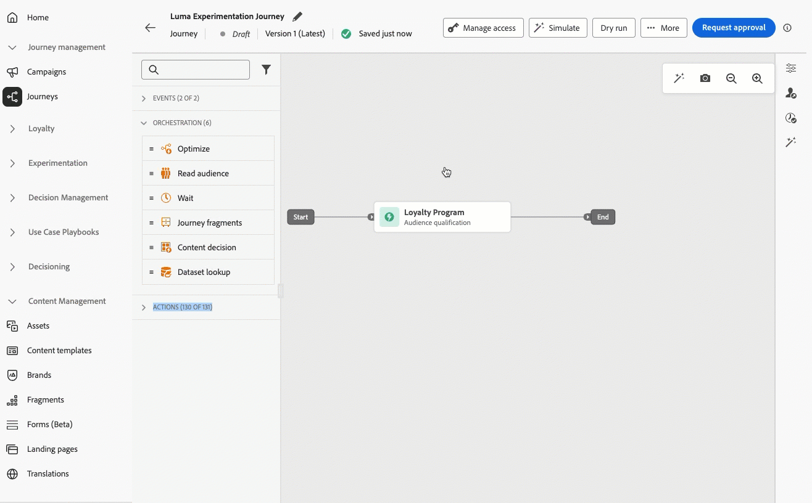
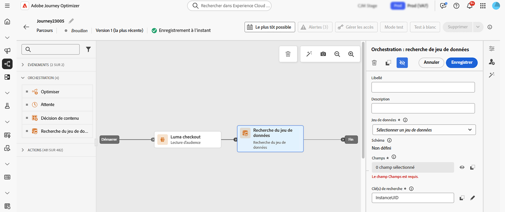

# Notes De Mise À Jour 2026 {#release-notes-2026}

Cette page répertorie toutes les fonctionnalités et améliorations des [!DNL Journey Optimizer] publiées en 2026.

## Notes de mise à jour d’avril 2026 {#april-26-rn}

**Date de publication** : 28-29 avril 2026

### Nouvelles fonctionnalités {#april-26-features}

Les fonctionnalités suivantes ont été publiées en avril 2026.

<table>
<thead>
<tr>
<th><strong>Activité Requête incrémentale dans les campagnes orchestrées</strong> </th>
</tr>
</thead>
<tbody>
<tr>
<td>

Les <strong>campagnes orchestrées</strong> prennent désormais en charge l’activité <strong>Requête incrémentale</strong> qui cible uniquement les profils ou les événements devenus éligibles depuis la dernière exécution.

Cela permet de concentrer les campagnes récurrentes sur les nouvelles audiences (nouvelles inscriptions, membres récemment qualifiés du programme de fidélité et segments similaires) tout en réduisant la charge de travail des requêtes et en évitant les envois redondants.

Pour plus d’informations, consultez la <a href="../orchestrated/activities/incremental-query.md#incremental-query-configuration">documentation détaillée</a>.

Date de disponibilité : 30 avril 2026

</td>
</tr>
</tbody>
</table>

<table>
<thead>
<tr>
<th><strong>Paramètres expéditeur dans l’en-tête des e-mails</strong> </th>
</tr>
</thead>
<tbody>
<tr>
<td>

Avec Journey Optimizer, vous pouvez désormais envoyer des e-mails dans lesquels l’entité émettrice (Expéditeur) est différente de l’entité de création (De). Les clients de messagerie qui prennent en charge cette fonctionnalité l’affichent généralement sous la forme « 'Expéditeur' au nom de 'De' » ou avec un indicateur « via ». Renseignez les champs facultatifs <strong>En-têtes d’expéditeur</strong> dans les paramètres du canal E-mail pour configurer cette fonctionnalité.

Pour plus d'informations, consultez la <a href="../email/header-parameters.md#sender-header">documentation détaillée</a>.

</td>
</tr>
</tbody>
</table>

<table>
<thead>
<tr>
<th><strong>Champ Cc dans les paramètres du canal E-mail</strong> </th>
</tr>
</thead>
<tbody>
<tr>
<td>

Vous pouvez désormais configurer un champ Cc (copie carbone) facultatif dans les paramètres de votre canal E-mail. Contrairement aux destinataires en Cci, le destinataire principal peut voir les destinataires en Cc, ce qui permet une communication transparente et des responsabilités claires.

Vous pouvez ainsi mettre automatiquement en copie l’interlocuteur ou l’interlocutrice concerné sur chaque message, tel qu’un ou une responsable de relation ou un ou une propriétaire de compte, tout en vous assurant que le client ou la cliente sait à qui s’adresser pour le suivi.

Le champ Cc prend en charge la personnalisation : une seule configuration peut acheminer dynamiquement les copies en fonction des données de profil, ce qui lui permet de s’adapter à plusieurs cas d’utilisation sans configuration supplémentaire.

Pour plus d'informations, consultez la <a href="../configuration/cc-email-field.md">documentation détaillée</a>.

</td>
</tr>
</tbody>
</table>

<table>
<thead>
<tr>
<th><strong>Copier des campagnes orchestrées dans des sandbox</strong> </th>
</tr>
</thead>
<tbody>
<tr>
<td>

L’outil Sandbox prend désormais en charge le groupement et la copie de campagnes orchestrées d’un sandbox à un autre. Vous n’avez ainsi plus besoin de recréer manuellement les campagnes dans chaque environnement. Lorsqu’une campagne est empaquetée, ses objets dépendants principaux, tels que les politiques de fusion et les messages, sont automatiquement inclus. La campagne importée est donc prête à être configurée et validée. Pour protéger les environnements de production, toutes les campagnes importées obtiennent le statut de brouillon dans le sandbox cible, ce qui permet aux équipes de réviser et d’approuver les campagnes avant qu’elles ne deviennent actives.

Pour plus d'informations, consultez la <a href="../configuration/copy-objects-to-sandbox.md">documentation détaillée</a>.

</td>
</tr>
</tbody>
</table>

<table>
<thead>
<tr>
<th><strong>Intégration de l’agent IA Journey Optimizer via MCP</strong> </th>
</tr>
</thead>
<tbody>
<tr>
<td>

Adobe Journey Optimizer fournit désormais un serveur <strong>MCP (Model Context Protocol)</strong> qui surfacie les opérations de campagne, de configuration de canal et de sandbox directement dans toute application compatible MCP. Grâce à cette intégration, plusieurs personnes peuvent collaborer autour des mêmes données d’orchestration. Au lieu d’écrire des requêtes sur l’API REST Adobe Journey Optimizer ou de parcourir plusieurs écrans d’interface d’utilisation, vous pouvez décrire votre intention par la conversation et laisser le LLM appeler les outils MCP appropriés. Cette fonctionnalité est actuellement disponible dans Claude Web et Desktop.

Cette fonctionnalité est disponible en version Beta publique pour tous les clients et clientes.

Pour plus d’informations, consultez la <a href="../integrations/ajo-mcp.md">documentation détaillée</a>.

</td>
</tr>
</tbody>
</table>

<table>
<thead>
<tr>
<th><strong>Arbitrage de parcours - Modèles d’IA</strong> </th>
</tr>
</thead>
<tbody>
<tr>
<td>

Vous pouvez désormais utiliser des <strong>modèles d’IA</strong> dans vos formules de classement pour ajuster automatiquement les scores de priorité des parcours en fonction des attributs de profil client et des facteurs contextuels, afin que les clients et clientes entrent dans les parcours les plus pertinents.

Cette fonctionnalité est disponible uniquement pour un nombre limité d’organisations (disponibilité limitée). Pour en bénéficier, contactez votre représentant ou représentante Adobe.

Pour plus d'informations, consultez la <a href="../conflict-prioritization/journey-ai-models.md">documentation détaillée</a>.

</td>
</tr>
</tbody>
</table>

<table>
<thead>
<tr>
<th><strong>Intégration d’Adobe Express</strong> </th>
</tr>
</thead>
<tbody>
<tr>
<td>

L’<b>intégration d’Adobe Express</b> dans Adobe Journey Optimizer vous permet d’utiliser les outils d’édition d’Adobe Express lors de la création de contenu. Vous pouvez ainsi redimensionner, supprimer des arrière-plans, recadrer et convertir des ressources en JPEG ou PNG.

Publiée précédemment en disponibilité limitée, cette fonctionnalité est désormais proposée dans tous les environnements (disponibilité générale).

Pour plus d'informations, consultez la <a href="../integrations/express.md">documentation détaillée</a>.

Date de disponibilité : 23 avril 2026

</td>
</tr>
</tbody>
</table>

<table>
<thead>
<tr>
<th><strong>Optimiser les e-mails pour les boîtes de réception d’IA</strong> </th>
</tr>
</thead>
<tbody>
<tr>
<td>

Adobe Journey Optimizer comprend désormais une nouvelle fonctionnalité qui garantit que vos e-mails sont structurés de manière optimale pour les boîtes de réception optimisées par l’IA telles qu’Apple Intelligence et Google Gemini dans Gmail.

À mesure que les assistants IA influencent de plus en plus la manière dont les destinataires lisent et interagissent avec les e-mails, cette fonctionnalité vous permet de générer et de créer du contenu qui s’exécute correctement dans les tâches d’IA en aval, comme la synthèse, le tri, la hiérarchisation et l’extraction d’intention.

Pour plus d’informations, voir <a href="../email/llm-email-optimizer.md">Optimiser les e-mails pour les boîtes de réception d’IA</a>.

Date de disponibilité : 17 avril 2026

</td>
</tr>
</tbody>
</table>

<table>
<thead>
<tr>
<th><strong>Assistant IA pour les expressions de personnalisation</strong> </th>
</tr>
</thead>
<tbody>
<tr>
<td>

[!DNL Adobe Journey Optimizer] inclut désormais <strong>Assistant IA</strong> directement dans l’éditeur de personnalisation et le Designer d’e-mail qui convertit les invites en langage naturel en expressions de personnalisation valides et en logique conditionnelle, aucune expertise en syntaxe requise. Décrivez la personnalisation que vous souhaitez obtenir. L’IA génère un code prêt à l’emploi que vous pouvez appliquer immédiatement ou affiner à l’aide de prompts supplémentaires.

L’assistant travaille également en sens inverse. Sélectionnez une expression existante et demandez-lui d’expliquer la logique, d’identifier les problèmes ou de suggérer des améliorations. Il sert donc à créer de nouvelles expressions, mais aussi à examiner et déboguer les expressions existantes dans votre équipe.

Pour plus d’informations, voir <a href="../content-management/generative-personalization-expressions.md">Assistant IA pour les expressions de personnalisation</a>.

Date de disponibilité : 13 avril 2026

</td>
</tr>
</tbody>
</table>

<table>
<thead>
<tr>
<th><strong>Expérimentation du chemin du parcours</strong> </th>
</tr>
</thead>
<tbody>
<tr>
<td>

Utilisez le nouveau nœud <strong>Optimiser</strong> pour exécuter des tests A/B ou des expériences de bandit à plusieurs bras afin de déterminer le meilleur moyen d’atteindre vos indicateurs de performance clés orientés métier. Cet outil vous permet de tester, de varier et de personnaliser les communications, le séquencement et le timing afin d’atteindre au mieux vos clients.

Publiée précédemment en disponibilité limitée, cette fonctionnalité est désormais proposée dans tous les environnements (disponibilité générale).

Dans le cadre de la disponibilité générale, cette version introduit la sélection du <strong>type d’expérience</strong> (A/B ou bandit manchot) et l’option <strong>Mettre à l’échelle le gagnant</strong> pour les parcours unitaires.

Pour plus d'informations, consultez la <a href="../building-journeys/path-experimentation.md">documentation détaillée</a>.

Date de disponibilité : 7 avril 2026

</td>
</tr>
</tbody>
</table>

<table>
<thead>
<tr>
<th><strong>Boîte de réception</strong> </th>
</tr>
</thead>
<tbody>
<tr>
<td>

La <strong>boîte de réception</strong> est une fonctionnalité mobile, disponible avec les cartes de contenu, qui permet aux clients et clientes de créer un emplacement centralisé dans leur application ou site web pour afficher les messages envoyés à leurs utilisateurs et utilisatrices. Cela prolonge la durée de vie des communications marketing en s’assurant que les messages restent accessibles même après avoir été ignorés.

Pour plus d'informations, consultez la <a href="../inbox/inbox-gs.md">documentation détaillée</a>.

Date de disponibilité : 7 avril 2026

</td>
</tr>
</tbody>
</table>

<table>
<thead>
<tr>
<th><strong>Prise en charge de Prise de décision dans le canal E-mail</strong> </th>
</tr>
</thead>
<tbody>
<tr>
<td>

Vous pouvez désormais utiliser <strong>Prise de décision</strong> pour personnaliser et optimiser le contenu de vos e-mails. Tirez parti des scores de priorité, des formules et des modèles d’IA pour afficher les offres et contenus les plus adaptés à chaque destinataire.

Publiée précédemment en disponibilité limitée, cette fonctionnalité est désormais proposée dans tous les environnements (disponibilité générale). Les pages miroir sont désormais prises en charge dans la version en disponibilité générale.

Pour plus d'informations, consultez la <a href="../experience-decisioning/create-decision-policy.md">documentation détaillée</a>.

Date de disponibilité : 6 avril 2026

</td>
</tr>
</tbody>
</table>

### Améliorations {#april-26-improv}

Les améliorations suivantes ont également été publiées en avril 2026.

#### IA

<!--
* **Brand alignment score in Campaign dashboard** - You can now assess your brand alignment score directly within your Campaign dashboard to ensure content stays on-brand. This allows you to verify guidelines at a glance without having to open the content designer.
-->

* **Amélioration de l’assistant de prompt** : l’assistant de prompt améliore la génération de contenu de l’IA en analysant les prompts utilisateur en temps réel et en identifiant les problèmes de clarté, les informations incomplètes et le manque de contexte. Il suggère des réécritures améliorées et donne des conseils pratiques pour ajouter aux prompts des informations clés telles que l’audience, le ton et l’intention. La fonctionnalité pose également des questions ciblées pour clarifier les données afin d’aider les utilisateurs et utilisatrices à affiner leurs entrées avant la génération. Vous obtenez ainsi des sorties plus précises et de haute qualité avec moins d’itérations. [En savoir plus](../content-management/ai-assistant-prompting-guide.md#prompt-assistant)

  Date de disponibilité : 5 mai 2026

#### Notification push

* **Personnaliser l’ID d’application dans les paramètres du canal** : dans les paramètres de configuration du canal Push, vous pouvez désormais personnaliser le champ **ID d’application** afin que chaque destinataire reçoivent une notification push de la marque appropriée en fonction des informations de son profil. [En savoir plus](../push/push-configuration.md#app-id-personalization)

#### Prise de décision

* **API de workflow de migration Decisioning** - Le contrat d’API pour la création d’analyses des dépendances et de workflows de migration a été mis à jour : transmettez **`request-level`** en tant que **paramètre de requête** sur l’URL de la requête (`sandbox`, `offer` ou `decision`). Le niveau de requête ne doit plus être envoyé dans le corps JSON. [En savoir plus](../experience-decisioning/decisioning-migration-api.md)

  Date de disponibilité : 6 mai 2026

* **Joindre des fragments aux éléments de décision** : Journey Optimizer permet désormais de joindre des fragments aux éléments de décision, qui peuvent être utilisés dans les expériences basées sur du code et les campagnes par e-mail par le biais de politiques de décision. [En savoir plus](../experience-decisioning/fragments-decision-policies.md)

  Publiée précédemment en disponibilité limitée, cette fonctionnalité est désormais proposée dans tous les environnements (disponibilité générale).

* **Les fragments temporairement indisponibles sont ignorés** : lors de l’utilisation de fragments dans des éléments de décision, si un fragment est temporairement indisponible sur Edge, il est ignoré, et le parcours ou la campagne continue de s’afficher au lieu d’échouer. [En savoir plus](../experience-decisioning/fragments-decision-policies.md#temporary-unavailable-fragments)

  Date de disponibilité : 14 avril 2026

#### Intégrations Adobe Experience Manager

* **Prise en charge des variations de fragments de contenu Adobe Experience Manager** - Vous pouvez sélectionner **variations de fragments de contenu** (par exemple, variantes de langue ou de canal) lors de l’insertion de fragments de contenu Adobe Experience Manager, avec une gestion améliorée pour les scénarios régionaux et multilingues. [En savoir plus](../integrations/aem-fragments.md#aem-variations)

  Publiée précédemment en disponibilité limitée, cette fonctionnalité est désormais proposée dans tous les environnements (disponibilité générale).

* **Contexte de fragment de contenu Adobe Experience Manager lors de la création** : votre sélection de fragments de contenu reste active lorsque vous passez d’un champ de texte à un bloc de contenu. Vous pouvez ainsi ajouter d’autres champs de fragment sans rouvrir **Ouvrir le conseiller en contenu AEM** à chaque fois. [En savoir plus](../integrations/aem-fragments.md)

  Publiée précédemment en disponibilité limitée, cette fonctionnalité est désormais proposée dans tous les environnements (disponibilité générale).

#### Conception d’e-mails

* **Éditeur HTML avancé pour le contenu d’e-mail** : le mode HTML avancé vous permet de modifier la source HTML de votre contenu dans le concepteur d’e-mail, d’ajouter des expressions avancées (comme des conditions) dans la source et de basculer entre les vues HTML et Bureau sans perdre vos modifications.

  Auparavant disponible uniquement pour les modèles de contenu d’e-mail, cette fonctionnalité est désormais déployée sur le contenu **e-mail** dans le concepteur d’e-mail (par exemple, les e-mails créés dans les parcours et les campagnes), en plus des modèles de contenu d’e-mail. Elle est actuellement à disponibilité limitée. Contactez votre représentant ou représentante Adobe pour bénéficier d’un accès. [En savoir plus](../email/email-expert-mode.md)

  Date de disponibilité : 9 avril 2026

#### Parcours

* **Taille actuelle de la payload du parcours visible dans les propriétés du parcours** - Le panneau des propriétés du parcours affiche désormais la taille actuelle de la payload du parcours par rapport à la limite configurée, par exemple, *1,5 Mo (sur 4 Mo)* Cet indicateur en lecture seule vous permet de surveiller la complexité du parcours avant publication et d’éviter les erreurs dues au dépassement de la taille maximale de la payload. [En savoir plus](../building-journeys/journey-properties.md#journey-payload-size)

  Date de disponibilité : 30 avril 2026

#### Optimisation des chemins de parcours

* **Type d’expérience** : vous pouvez désormais choisir entre une expérience A/B (partage fixe au début) ou un bandit manchot (partage automatique avec mises à jour hebdomadaires du poids) lors de la configuration d’une expérience de chemin. [En savoir plus](../building-journeys/path-experimentation.md)

  Date de disponibilité : 7 avril 2026

* **Expérimentation de chemin – Mettre à l’échelle la variation gagnante** : vous pouvez déployer automatiquement ou manuellement le chemin gagnant d’une expérience sur l’ensemble de votre audience. Une fois un gagnant déterminé, vous pouvez amplifier sa portée et son efficacité sans avoir à surveiller continuellement l’expérience. [En savoir plus](../building-journeys/path-experimentation.md#scale-winner)

  Cette fonctionnalité n’est disponible que dans les parcours unitaires (déclenchés par un événement et qualifications d’audience). Elle n’est pas disponible pour les parcours Lecture d’audience.

  Date de disponibilité : 7 avril 2026

* **Conditions** : l’activité [Optimiser](../building-journeys/optimize.md) est le nouveau moyen de créer des chemins conditionnels dans les parcours. Elle remplace l’ancienne activité **Condition**, qui a été supprimée de l’interface d’utilisation. Toute la logique conditionnelle est conservée et est désormais gérée via les conditions de l’activité **Optimiser**. [En savoir plus](../building-journeys/conditions.md)

  Publiée précédemment en disponibilité limitée, cette fonctionnalité est désormais proposée dans tous les environnements (disponibilité générale).

  Date de disponibilité : 7 avril 2026

#### Campagnes orchestrées

* **Variables globales dans les campagnes orchestrées** : les campagnes orchestrées prennent désormais en charge les variables globales qui peuvent être définies une seule fois et réutilisées dans toutes les activités d’un workflow. Cela simplifie la configuration et garantit la cohérence des valeurs dynamiques, des expressions et de la personnalisation du contenu. [En savoir plus](../orchestrated/global-variables.md)
* **Améliorations apportées au concepteur de données** : les schémas relationnels orchestrés prennent désormais en charge les clés composites s’étendant sur plusieurs champs. Le chargement d’un schéma à partir d’un fichier DDL génère également des énumérations. En outre, le chargement à partir d’un fichier DDL ou Excel crée automatiquement des relations composites entre les tables. Dans la vue de relation entre entités, les liens composites affichent désormais l’ensemble complet des correspondances de champs entre les tables après le chargement d’un fichier. [En savoir plus](../orchestrated/gs-schemas.md)

## Notes de mise à jour de mars 2026 {#march-26-rn}

Les sections [Nouvelles fonctionnalités](#march-26-features) et [Améliorations](#march-26-improv) couvrent les fonctionnalités déjà disponibles. <!--The [Coming soon](#coming-soon) section lists features and improvements scheduled for release later in March.-->

<!--
**The pre-release notes below are subject to change without prior notice until the release availability date**. Links, screens and updated documentation are published in the release notes, at the release date.

See also [Adobe Experience Platform pre-release notes](https://experienceleague.adobe.com/fr/docs/experience-platform/release-notes/pre-release-notes){target="_blank"}.
-->

**Date de publication** : 24-25 mars 2026

### Nouvelles fonctionnalités {#march-26-features}

<table>
<thead>
<tr>
<th><strong>Chiffrement des paramètres d’URL</strong> </th>
</tr>
</thead>
<tbody>
<tr>
<td>

Les paramètres d’URL dans les liens de tracking et de page de destination ajoutés à vos e-mails peuvent désormais être chiffrés, pour renforcer la sécurité des données de paramètres sensibles.

<ul>
<li>Enregistrez et gérez les clés de chiffrement dans le registre <strong>Administration</strong> dédié.</li>
<li>Utilisez la nouvelle fonction d’assistance « Chiffrer » dans les expressions afin de chiffrer les données sensibles dans les URL pour les paramètres de requête que vous souhaitez protéger au moment du rendu.</li>
</ul>

Cette fonctionnalité est disponible uniquement pour un nombre limité d’organisations (disponibilité limitée). Pour en bénéficier, contactez votre représentant ou représentante Adobe.

Pour plus d'informations, consultez la <a href="../personalization/url-parameter-encryption.md">documentation détaillée</a>.

Date de disponibilité : 31 mars 2026

</td>
</tr>
</tbody>
</table>

<table>
<thead>
<tr>
<th><strong>Convertir des images en modèles de contenu d’e-mail</strong> </th>
</tr>
</thead>
<tbody>
<tr>
<td>

Vous pouvez désormais convertir des images en modèles de contenu d’e-mail directement dans Journey Optimizer. Utilisez l’analyse optimisée par l’IA pour générer automatiquement des modèles HTML structurés à partir de références visuelles, ce qui accélère significativement la conception des e-mails.

Publiée précédemment en disponibilité limitée, cette fonctionnalité est désormais proposée dans tous les environnements (disponibilité générale).

Pour plus d'informations, consultez la <a href="../content-management/image-to-html.md">documentation détaillée</a>.

Date de disponibilité : 31 mars 2026

</td>
</tr>
</tbody>
</table>

<table>
<thead>
<tr>
<th><strong>Formulaires personnalisés de la page de destination</strong> </th>
</tr>
</thead>
<tbody>
<tr>
<td>

Avec [!DNL Journey Optimizer], vous pouvez capturer les attributs de profil via vos pages de destination.

Créez, concevez et gérez des formulaires personnalisés adaptés à vos besoins en fonction d’un jeu de données spécifique. Vous pouvez ensuite utiliser ces formulaires dans les pages de destination pour ajouter les attributs de profil de votre choix au jeu de données défini pour chaque formulaire.

Publiée précédemment en disponibilité limitée pour les clientes et clients des États-Unis et d’Australie, cette fonctionnalité est désormais proposée dans tous les environnements (disponibilité générale).

Pour plus d'informations, consultez la <a href="../landing-pages/lp-forms.md">documentation détaillée</a>.

Date de disponibilité : 26 mars 2026

</td>
</tr>
</tbody>
</table>

<table>
<thead>
<tr>
<th><strong>Activité Test dans les campagnes orchestrées</strong> </th>
</tr>
</thead>
<tbody>
<tr>
<td>

Une nouvelle activité <strong>Test</strong> est désormais disponible dans les campagnes orchestrées. Cette activité répartit l’exécution du workflow dans différentes branches en fonction de conditions définies, ce qui vous permet de valider la logique de campagne et les configurations avant d’activer les diffusions.

Pour plus d'informations, consultez la <a href="../orchestrated/activities/test.md">documentation détaillée</a>.

</td>
</tr>
</tbody>
</table>

<table>
<thead>
<tr>
<th><strong>Prise en charge de la recherche de jeu de données dans les parcours</strong> </th>
</tr>
</thead>
<tbody>
<tr>
<td>

Une nouvelle activité <strong>Recherche de jeu de données</strong> dans les parcours vous permet de récupérer dynamiquement des données provenant de jeux de données d’enregistrement Adobe Experience Platform au moment de l’exécution. Cela vous donne accès à des informations qui ne font pas partie de la payload du profil ou de l’événement, afin que les interactions avec les clients et les clientes soient pertinentes et opportunes.

Publiée précédemment en disponibilité limitée pour un nombre limité d’organisations, l’activité Recherche de jeu de données dans les parcours est désormais disponible pour tous les clients et clientes autorisés à effectuer une [dataset lookup](../data/lookup-aep-data.md), tout en restant en disponibilité limitée.

Pour plus d'informations, consultez la <a href="../building-journeys/dataset-lookup.md">documentation détaillée</a>.

</td>
</tr>
</tbody>
</table>

<table>
<thead>
<tr>
<th><strong>L’activité Action remplace les activités de parcours spécifiques à un canal</strong> </th>
</tr>
</thead>
<tbody>
<tr>
<td>

Suite à la disponibilité générale de l’activité <strong>Action</strong> en février 2026, les activités de canal natives héritées (E-mail, Push, SMS, In-app, Web, expérience basée sur du code et carte de contenu) de la zone de travail de parcours sont devenues obsolètes.

Vous devez désormais utiliser uniquement l’activité Action pour configurer toutes les actions de canal, au lieu de différents nœuds spécifiques au canal.

Les parcours existants qui utilisent les activités de canal héritées continuent à fonctionner sans aucune modification ni migration requise.

Pour plus d'informations, consultez la <a href="../building-journeys/journey-action.md">documentation détaillée</a>.

</td>
</tr>
</tbody>
</table>

<table>
<thead>
<tr>
<th><strong>Éditeur HTML avancé pour les modèles d’e-mail</strong> </th>
</tr>
</thead>
<tbody>
<tr>
<td>

Le mode HTML avancé pour les modèles de contenu d’e-mail permet de modifier la source HTML de votre contenu dans le Concepteur d’e-mail, d’ajouter des expressions avancées (telles que des conditions) dans la source et de basculer entre les vues HTML et Bureau sans perdre vos modifications.

Cette fonctionnalité est disponible uniquement pour les modèles de contenu du canal E-mail. Elle est actuellement à disponibilité limitée. Contactez votre représentant ou représentante Adobe pour bénéficier d’un accès.

Pour plus d'informations, consultez la <a href="../email/email-expert-mode.md">documentation détaillée</a>.

Date de disponibilité : 10 mars 2026

</td>
</tr>
</tbody>
</table>

<table>
<thead>
<tr>
<th><strong>Intégration de modèles Firefly personnalisés et de modèles de génération d’images tiers</strong> </th>
</tr>
</thead>
<tbody>
<tr>
<td>

Activez l’intégration transparente des modèles Firefly standard et personnalisés ainsi que des modèles d’image tiers approuvés afin de gagner en flexibilité, en contrôle et en alignement de la marque lors de la génération d’images.

Choisissez le modèle adapté à vos besoins :

<ul><li> <strong>Modèle Adobe</strong> (optimisé par Firefly Image Model 4) pour la génération d’images immédiate sans configuration supplémentaire</li><li> <strong>Modèle de partenaire</strong> (optimisé par Gemini 2.5 Flash) pour des fonctionnalités spécialisées</li><li><strong>Modèles personnalisés</strong> (modèles spécifiques à la marque entraînés avec vos propres ressources) pour une génération conforme à la marque qui respecte parfaitement l’identité, le style et les consignes visuelles de votre marque.</li></ul>

Pour plus d’informations, consultez la <a href="../content-management/generative-models.md">documentation détaillée</a>.

Date de disponibilité : 2 mars 2026

</td>
</tr>
</tbody>
</table>

<table>
<thead>
<tr>
<th><strong>Activité en direct pour iOS</strong> </th>
</tr>
</thead>
<tbody>
<tr>
<td>

Proposez des expériences en temps réel directement sur l’écran verrouillé et la Dynamic Island de vos clients et clientes avec l’<strong>activité en direct iOS</strong> dans Adobe Journey Optimizer. Affichez des mises à jour en temps réel, du suivi des commandes et du statut des vols au compte à rebours des événements, aux scores en direct et à la progression de la diffusion, sans que les utilisateurs et utilisatrices n’aient besoin d’ouvrir votre application. Gardez votre audience informée et engagée au bon moment, où qu’elle en soit dans son parcours.

Publiée précédemment en version Beta, cette fonctionnalité est désormais disponible dans tous les environnements (disponibilité générale).

Pour plus d’informations, consultez la <a href="../mobile-live/get-started-mobile-live.md">documentation détaillée</a>.

Date de disponibilité : 3 mars 2026

</td>
</tr>
</tbody>
</table>

<table>
<thead>
<tr>
<th><strong>Agent Journey : création de contenu de canal</strong> </th>
</tr>
</thead>
<tbody>
<tr>
<td>

Optimisé par <strong>Adobe Experience Platform Agent Orchestrator</strong>, l’<strong>agent Journey</strong> est disponible dans Journey Optimizer et vous permet d’analyser les parcours par le biais d’une interface en langage naturel. Vous pouvez désormais générer et gérer du contenu spécifique à un canal directement dans l’agent Journey, ce qui permet de créer du contenu pour des canaux E-mail et Push par exemple, d’appliquer et de prévisualiser des modèles, d’affiner le ton et le style via des prompts et d’ouvrir le contenu dans le <strong>Concepteur de contenu</strong> pour le modifier en contexte.

Cette fonctionnalité est disponible uniquement pour un nombre limité d’organisations (disponibilité limitée). Pour en bénéficier, contactez votre représentant ou représentante Adobe.

Pour plus d’informations, consultez la <a href="https://experienceleague.adobe.com/docs/experience-cloud-ai/experience-cloud-ai/agents/ajo-agent.html?lang=fr" target="_blank">documentation détaillée</a>.

Date de disponibilité : 4 mars 2026

</td>
</tr>
</tbody>
</table>

<table>
<thead>
<tr>
<th><strong>Surveillance des modèles d’IA</strong> </th>
</tr>
</thead>
<tbody>
<tr>
<td>

Journey Optimizer vous permet désormais de surveiller l’intégrité, le statut de l’entraînement et les performances de vos modèles d’IA Prise de décision. Vous pouvez ainsi vérifier que l’entraînement est fructueux, résoudre les problèmes et comprendre l’impact sur les résultats afin de sélectionner les offres les plus adaptées à chaque client et cliente à l’aide de l’IA. Notez que cette fonctionnalité est disponible uniquement pour <strong>Prise de décision</strong> (et non pas pour les modèles Gestion des décisions hérités).

Cette fonctionnalité est actuellement disponible uniquement pour les modèles d’<strong>optimisation personnalisée</strong> (et non pas pour l’optimisation automatique).

Pour plus d'informations, consultez la <a href="../experience-decisioning/ranking/ai-model-observability.md">documentation détaillée</a>.

Date de disponibilité : 9 mars 2026

</td>
</tr>
</tbody>
</table>

<table>
<thead>
<tr>
<th><strong>Déclencher des campagnes orchestrées à l’aide d’un signal</strong> </th>
</tr>
</thead>
<tbody>
<tr>
<td>

Les campagnes orchestrées peuvent désormais être déclenchées via un <strong>signal API</strong>. Pour cela, configurez la campagne cible comme <strong>Déclenchée par un signal</strong>, publiez-la, puis déclenchez-la à l’aide d’un appel API. Tous les paramètres inclus dans l’appel API sont disponibles en tant que variables dans la campagne en cours. Notez que les campagnes orchestrées déclenchées par un signal restent des campagnes <strong>par lots</strong> et diffèrent des campagnes déclenchées par API.

Pour plus d'informations, consultez la <a href="../orchestrated/trigger-orchestrated-campaign.md">documentation détaillée</a>.

</td>
</tr>
</tbody>
</table>

<table>
<thead>
<tr>
<th><strong>Catégorie Transactionnel dans les campagnes orchestrées</strong> </th>
</tr>
</thead>
<tbody>
<tr>
<td>

Dans les campagnes orchestrées, vous pouvez désormais définir une activité de canal dans la catégorie <strong>Transactionnel</strong>. Cela applique des configurations de canal transactionnel à cette activité. Cette fonctionnalité est utile lorsque les règles métier ne doivent pas s’appliquer ou lorsque l’opt-in des clients et clientes n’est pas requis.

Pour plus d'informations, consultez la <a href="../orchestrated/activities/channels.md#add">documentation détaillée</a>.

Cette fonctionnalité sera progressivement déployée dans toutes les régions au cours des prochains jours.

</td>
</tr>
</tbody>
</table>

### Améliorations {#march-26-improv}

Les améliorations de cette version sont présentées ci-dessous.

#### Personnalisation

* **Personnalisation complète/de base des URL** : vous pouvez personnaliser les URL de destination à l’aide d’attributs de profil (par exemple, pour le domaine ou le chemin). Pour activer cette fonctionnalité, fournissez à Adobe votre liste de domaines acceptés. [En savoir plus](../personalization/personalization-build-expressions.md#where)

  Publiée précédemment en disponibilité limitée pour une utilisation dans les parcours, cette fonctionnalité est désormais proposée dans tous les environnements (disponibilité générale).

  Date de disponibilité :1er avril 2026

#### Création de rapports

* **Optimisation de l’heure d’envoi – Emplacement des contrôles mis à jour et nouveau rapport d’effet élévateur** : les contrôles de l’optimisation de l’heure d’envoi (STO) ont été déplacés vers le menu de configuration des actions. De plus, un nouveau rapport d’effet élévateur est désormais disponible dans les rapports sur les parcours afin de mesurer l’impact de la STO sur les métriques de performances de vos campagnes. [En savoir plus](../reports/channel-report-cja.md#optimization-models)

  Date de disponibilité : 27 mars 2026

<!--
* **Exclude bot clicks for email and SMS reporting** - Email and SMS reporting now automatically filters out bot clicks from click metrics, providing more accurate engagement data and preventing automated traffic from inflating your performance figures.

#### Email Designer

* **Email Designer displayed in Unified Shell** - The Email Designer is now displayed within the Unified Shell experience, providing a consistent navigation and header experience that aligns with other Adobe applications.

* **Text mode support in fragments** - To support text-based email workflows, you can now create and manage text versions of your visual fragments for optimal use in the plain text version of emails that include that fragment.

  **Caution:** When using a fragment that was created before the current release, the fragment text version may be incorrectly rendered—both in the Email Designer and in the final email delivered to your recipients. For best results with older fragments, edit, save and republish each fragment.
-->

#### Configuration

<!--* **Folders for journeys and campaigns** - You can now organize your journeys and campaigns into folders, enabling structured navigation and easier management for teams working with large volumes of content. This capability is only available for a set of organizations (Limited Availability). To gain access, contact your Adobe representative.-->

* **Échec du renouvellement des certificats de domaine AJO** : vous pouvez désormais vous abonner pour recevoir des alertes système, par e-mail ou dans le centre de notifications Journey Optimizer, lorsqu’un certificat de domaine utilisé pour la délivrabilité des e-mails arrive à expiration ou a déjà expiré. [En savoir plus](../reports/alerts.md#alert-certificates-renewal-unsuccessful)

  Date de disponibilité : 26 mars 2026

* **Renommage du jeu de données d’événement de commentaire de destinataire secondaire AJO** : le jeu de données `AJO Email BCC Feedback Event` a été renommé jeu de données `AJO Secondary Recipient Feedback Event`. L’impact varie en fonction de votre situation :

   * **Utilisateurs et utilisatrices existants** : seul le nom d’affichage est mis à jour. Le nom de la table sous-jacente reste inchangé.
   * **Nouveaux utilisateurs et utilisatrices, et sandbox** : le nom d’affichage et le nom de la table reflètent le nouveau nom.
   * **Utilisateurs et utilisatrices existants avec de nouveaux sandbox** : le nom d’affichage et le nom de la table sont mis à jour avec le nouveau nom.

  >[!NOTE]
  >
  >Les nouveaux jeux de données affichent immédiatement le nouveau nom. Pour les anciens noms de jeux de données, le renvoi et la réconciliation se déroulent progressivement et peuvent prendre plusieurs semaines.

  Date de disponibilité : 2 mars 2026

#### Parcours

* **Action Mettre à jour le profil – Prise en charge de plusieurs attributs de profil** : l’activité d’action **Mettre à jour le profil** prend désormais en charge la mise à jour de cinq attributs de profil au maximum dans un seul nœud. Auparavant, chaque action ne pouvait mettre à jour qu’un seul attribut à la fois, ce qui nécessitait plusieurs nœuds pour mettre à jour plusieurs attributs. Utilisez le nouveau bouton **Mettre à jour un autre champ** pour ajouter des paires champ/valeur supplémentaires, ce qui réduit la complexité de la zone de travail et améliore les performances. [En savoir plus](../building-journeys/update-profiles.md)

* **Envoi par vague des messages sortants dans les parcours** : vous pouvez désormais planifier la diffusion des messages des parcours Journey Optimizer par lots contrôlés dans le temps. [En savoir plus](../building-journeys/send-using-waves.md)

  Publiée précédemment en disponibilité limitée pour une utilisation dans les parcours, cette fonctionnalité est désormais proposée dans tous les environnements (disponibilité générale).

  Date de disponibilité : 16 mars 2026

* **Informations sur la mise en pause et la reprise dans les détails techniques du parcours** : les **détails techniques** du parcours incluent désormais des informations supplémentaires sur la mise en pause et la reprise : date et heure de la dernière mise en pause et reprise, nom d’affichage et identifiant interne de l’utilisateur ou de l’utilisatrice qui a effectué chaque action, ensemble complet de paramètres de parcours mis en pause, tels que le comportement de la mise pause, la durée maximale de la mise en pause et l’état de reprise automatique. [En savoir plus](../building-journeys/journey-properties.md)

  Date de disponibilité : 2 mars 2026

#### Prise de décision

* **Migration de prise de décision – Attributs d’offre et de contexte** : le mappage d’entité de l’API de migration répertorie désormais les **attributs d’offre** (`migratedofferattributes` sur le schéma d’élément d’offre personnalisée) et les **attributs de contexte** (`migratedcontextattributes` sur le schéma du jeu de données de migration). [En savoir plus](../experience-decisioning/decisioning-migration-api.md#entity-mapping)

  Date de disponibilité : 31 mars 2026

<!--
## Coming soon {#coming-soon}

The features and improvements below are planned for release later in March/early April. Release dates and scope are **subject to change without prior notice**.

WAITING RELEASE DATE CONFIRMATION * **Target dimension simplification in Orchestrated Campaigns** - The active targeting dimension is now shown on the workflow canvas, so you can see which dimension is used by a channel activity. The multi-entity segmentation flow is simpler as you no longer need a separate "Change dimension" activity. Moreover, you can now choose explicitly whether messages are sent at the profile level or at a secondary dimension level.

WAITING RELEASE DATE CONFIRMATION
* **Target dimension simplification in Orchestrated Campaigns** - The active targeting dimension is now shown on the workflow canvas, so you can see which dimension is used by a channel activity. The multi-entity segmentation flow is simpler as you no longer need a separate "Change dimension" activity. Moreover, you can now choose explicitly whether messages are sent at the profile level or at a secondary dimension level.
-->

## Notes de mise à jour de février 2026 {#feb-26-01-rn}

### Nouvelles fonctionnalités {#feb-26-01-features}

<table>
<thead>
<tr>
<th><strong>Arbitrage des parcours</strong> </th>
</tr>
</thead>
<tbody>
<tr>
<td>

Vous pouvez désormais utiliser des <strong>formules de classement</strong> pour améliorer automatiquement les scores de priorité des parcours en fonction des attributs de profil client et des facteurs contextuels, afin que les clients puissent accéder aux parcours les plus pertinents.

Cette fonctionnalité est disponible uniquement pour un nombre limité d’organisations (disponibilité limitée). Pour en bénéficier, contactez votre représentant ou représentante Adobe.

Pour plus d’informations, consultez la <a href="../conflict-prioritization/journey-ranking-formulas.md">documentation détaillée</a>.

Date de disponibilité : 24 février 2026

</td>
</tr>
</tbody>
</table>

<table>
<thead>
<tr>
<th><strong>Activité d’action dans les parcours</strong> </th>
</tr>
</thead>
<tbody>
<tr>
<td>

Journey Optimizer prend en charge une nouvelle <strong>activité d’action</strong> générique qui vous permet de configurer des actions uniques et des groupes d’actions entrants multi-actions, ce qui permet une configuration d’action rationalisée dans la zone de travail de parcours. Cette nouvelle fonctionnalité permet notamment les opérations suivantes :

<ul>
<li>Configuration d’action native simplifiée dans la zone de travail de parcours</li>
<li>Création de groupes d’actions entrantes multi-actions</li>
<li>Ajout d’une optimisation à toute action de canal intégrée</li>
<li>Possibilité d’ajouter des options d’expérimentation et multilingues à n’importe quelle action.</li>
</ul>

Publiée précédemment en disponibilité limitée, cette fonctionnalité est désormais proposée dans tous les environnements (disponibilité générale).

Pour plus d’informations, consultez la <a href="../building-journeys/journey-action.md">documentation détaillée</a>.

Date de disponibilité : 20 février 2026

<strong>Remarque :</strong> tous les canaux natifs sont désormais accessibles via l'activité parcours d'action . Les activités de canal natives héritées seront abandonnées avec la version de mars. Les parcours existants qui incluent des actions héritées continueront à fonctionner en l’état. Aucune migration n’est requise.

</td>
</tr>
</tbody>
</table>

<table>
<thead>
<tr>
<th><strong>Vague d’envoi des messages sortants</strong> </th>
</tr>
</thead>
<tbody>
<tr>
<td>

Vous pouvez désormais planifier la diffusion des messages des campagnes ou des parcours Journey Optimizer par lots contrôlés dans le temps.

L’envoi de vagues offre les avantages suivants :

<ul>
<li>Meilleure délivrabilité : la diffusion des envois au fil du temps contribue à maintenir une bonne réputation des expéditeurs et réduit le risque d'être marqué comme spam.</li>
<li>Contrôle de la charge - Évitez de surcharger les systèmes en aval (par exemple les centres d’appels, les pages de destination) en limitant le nombre de messages diffusés en même temps.</li>
<li>Cas d’utilisation importants et sensibles au facteur temps : adaptés aux audiences importantes ou lorsque vous devez contrôler le timing (par exemple, capacité du centre d’appel, montée en réputation ou offres limitées dans le temps).</li>
</ul>

Dans les <strong>campagnes</strong>, cette fonctionnalité est disponible dans tous les environnements (Disponibilité générale). Pour plus d’informations, consultez la <a href="../campaigns/send-using-waves.md">documentation détaillée</a>.

Dans <strong></strong>, cette fonctionnalité n’est disponible que pour un ensemble d’organisations (disponibilité limitée). Pour y accéder, contactez votre représentant ou représentante Adobe. Pour plus d’informations, consultez la <a href="../building-journeys/send-using-waves.md">documentation détaillée</a>.

Date de disponibilité : 19 février 2026

</td>
</tr>
</tbody>
</table>

<table>
<thead>
<tr>
<th><strong>Migration des sous-domaines vers la délégation personnalisée</strong> </th>
</tr>
</thead>
<tbody>
<tr>
<td>

Vous pouvez désormais migrer les sous-domaines à l’aide du mode de délégation CNAME vers la délégation personnalisée directement à partir de l’interface, afin de pouvoir respecter des politiques de sécurité plus strictes conformément aux directives de votre entreprise sans recréer de configurations de canal.

Cette fonctionnalité est disponible uniquement pour un nombre limité d’organisations (disponibilité limitée). Pour en bénéficier, contactez votre représentant ou représentante Adobe.

Pour plus d’informations, consultez la <a href="../configuration/custom-subdomain-migration.md">documentation détaillée</a>.

Date de disponibilité : 19 février 2026

</td>
</tr>
</tbody>
</table>

<table>
<thead>
<tr>
<th><strong>Canal de notifications push web</strong> </th>
</tr>
</thead>
<tbody>
<tr>
<td>

Adobe Journey Optimizer prend désormais en charge les <strong>notifications push web</strong>, ce qui étend le canal push au-delà des applications mobiles. Vous pouvez facilement diffuser des notifications vers les <strong>navigateurs mobiles et de bureau</strong>, ce qui vous permet d’atteindre les clientes et clients directement sur leurs appareils sans avoir besoin d’une application. Cette amélioration permet d’interagir avec les utilisateurs et utilisatrices à l’aide de messages personnalisés et opportuns en temps réel, en utilisant les mêmes workflows de création et les mêmes fonctionnalités de ciblage que ceux déjà disponibles pour les notifications push mobiles.

Publiée précédemment dans Beta, cette fonctionnalité sera disponible pour tous les environnements (disponibilité générale).

Pour plus d’informations, consultez la <a href="../push/push-configuration-web.md">documentation détaillée</a>.

Date de disponibilité : 13 février 2026

</td>
</tr>
</tbody>
</table>

<table>
<thead>
<tr>
<th><strong>Activité de décision de contenu</strong> </th>
</tr>
</thead>
<tbody>
<tr>
<td>

Une nouvelle <strong>activité de décision de contenu</strong> est désormais disponible dans la zone de travail du parcours pour intégrer des offres personnalisées directement dans vos parcours clients. Cette activité vous permet de diffuser du contenu basé sur des décisions et de référencer ces offres dans l’ensemble de votre parcours, dans des conditions de création d’embranchements basés sur l’éligibilité, dans des actions personnalisées pour transmettre des données d’offre à des systèmes externes et dans d’autres activités pour créer des expériences client entièrement personnalisées.

Publiée précédemment en disponibilité limitée, cette fonctionnalité est désormais proposée dans tous les environnements (disponibilité générale).

Pour plus d'informations, consultez la <a href="../building-journeys/content-decision.md">documentation détaillée</a>.

Date de disponibilité : 10 février 2026

</td>
</tr>
</tbody>
</table>

<table>
<thead>
<tr>
<th><strong>API d’outils de migration en libre-service</strong> </th>
</tr>
</thead>
<tbody>
<tr>
<td>

Les API d’outils de migration sont désormais disponibles pour migrer par programmation des entités <strong>Gestion des décisions</strong> vers <strong>Prise de décision</strong>, avec les fonctionnalités suivantes :

<ul>
<li>Des portées de migration flexibles (sandbox, offre ou niveau de décision)</li>
<li>L’analyse et la validation automatisées des dépendances</li>
<li>La prise en charge de la restauration pour les migrations terminées</li>
<li>Des rapports de migration détaillés avec les mappages d’objet</li>
</ul>

Pour plus d’informations, consultez la <a href="../experience-decisioning/decisioning-migration-api.md">documentation détaillée</a>.

Date de disponibilité : 3 février 2026

</td>
</tr>
</tbody>
</table>

<table>
<thead>
<tr>
<th><strong>Surveillance des actions personnalisées</strong> </th>
</tr>
</thead>
<tbody>
<tr>
<td>

Renseignez davantage insight sur l’intégrité et les performances de vos points d’entrée d’action personnalisés grâce à un nouveau tableau de bord de surveillance et à des données d’événement d’étape de parcours enrichies. Effectuez le suivi des appels réussis, des erreurs, du débit, des temps de réponse et des temps d’attente de la file d’attente pour comprendre rapidement quand, où et pourquoi des anomalies se produisent.

Publiée précédemment en disponibilité limitée, cette fonctionnalité est désormais proposée dans tous les environnements (disponibilité générale).

Pour plus d’informations, consultez la <a href="../action/reporting.md">documentation détaillée</a>.

Date de disponibilité : 3 février 2026

</td>
</tr>
</tbody>
</table>

<table>
<thead>
<tr>
<th><strong>Prise en charge de la prise de décision dans le canal SMS</strong> </th>
</tr>
</thead>
<tbody>
<tr>
<td>

Vous pouvez désormais personnaliser et optimiser le contenu de vos SMS avec Decisioning. Utilisez des scores de priorité, des formules ou des modèles d’IA pour afficher le meilleur contenu à vos clientes et clients.

Pour plus d’informations, consultez la <a href="../experience-decisioning/create-decision.md">documentation détaillée</a>.

Date de disponibilité : 2 février 2026

</td>
</tr>
</tbody>
</table>

### Améliorations {#feb-26-01-improv}

Les améliorations de cette version sont présentées ci-dessous.

#### Configuration

* **Utilisation des événements d’expérience dans les expressions de parcours** - À compter du 1er avril 2026, l’utilisation des attributs d’événement d’expérience dans les expressions de parcours ne sera plus prise en charge pour les organisations qui n’ont pas utilisé cette fonctionnalité au cours des 90 derniers jours. Cette fonctionnalité n’est déjà plus disponible pour les nouvelles organisations clientes depuis le 8 juillet 2025. Pour obtenir des alternatives, consultez [Recherche d’événement d’expérience dans les parcours &#x200B;](../building-journeys/exp-event-lookup.md).

#### Gestion de contenu

<!--
* **Update brands with new color tab** - Brand guidelines help ensure your brand is presented consistently across all touchpoints. The new <strong>Colors</strong> section defines the standards for your brand's color system, outlining how colors are selected, organized, and applied across experiences. It ensures consistent use of primary, secondary, accent, and neutral colors to support a cohesive, accessible, and recognizable brand identity. [Read more](../content-management/brands.md)
-->

* **Utiliser des thèmes pour convertir des images en modèles d’e-mail** - Lors de la conversion d’une image en modèle d’e-mail dans Journey Optimizer, vous pouvez désormais utiliser un thème comme entrée afin que l’HTML générée suive les paramètres de votre marque. Les styles tels que la couleur d’arrière-plan, la couleur du bouton, les polices, l’espacement des lignes, les marges et la marge intérieure sont appliqués automatiquement, ce qui réduit le travail de conception manuel et fournit un modèle prêt à l’emploi avec un minimum de modifications. [En savoir plus](../content-management/image-to-html.md)

  Date de disponibilité : 17 février 2026.

<!--* **Text mode for fragments** - You can now create and manage text versions of your fragments, supporting workflows that rely on plain text content and providing the same flexibility as in email content. [Read more](../content-management/create-fragments.md)-->

#### Concepteur d’e-mail

* **Retrait de texte** - Vous pouvez désormais appliquer un retrait de gauche personnalisable à la première ligne des paragraphes des composants de texte directement à partir du panneau des propriétés. <!--The new **Indentation** control lets you define indentation in pixels or percentage via a numeric input or slider, with live preview on the canvas. --> Cela améliore la lisibilité du contenu de forme longue tel que les éditoriaux et les articles. [En savoir plus](../email/get-started-email-style.md)

  Date de disponibilité : 18 février 2026.

#### Prise de décision

* **Prise en charge entrante d’Edge pour l’utilisation des données Adobe Experience Platform dans la prise de décision** - L’utilisation des données Adobe Experience Platform dans la prise de décision prend désormais en charge les cas d’utilisation entrants Edge, en plus des e-mails et des actions personnalisées dans les parcours. [En savoir plus](../experience-decisioning/aep-data-exd.md)

  Cette fonctionnalité est disponible uniquement pour un nombre limité d’organisations (disponibilité limitée). Pour en bénéficier, contactez votre représentant ou représentante Adobe.

* **Aperçu de la prise de décision dans le canal d’expérience basé sur le code** - Vous pouvez désormais prévisualiser les éléments de décision lors de la configuration de la prise de décision avec le canal d’expérience basé sur le code. L’aperçu est disponible directement dans l’interface de création avant la mise en ligne. [En savoir plus](../code-based/test-code-based.md#preview-code-based)

  Date de disponibilité : 18 février 2026

<!--
THIS WAS FINALLY NOT RELEASED IN FEBRUARY

* **Attach fragments to decision items** - Journey Optimizer now provides the ability to attach fragments to decision items which can be leveraged in code-based experience campaigns through decision policies. [Read more](../experience-decisioning/fragments-decision-policies.md)

  Previously released in Limited Availability, this capability is now available to all environments (General Availability).

  Availability date: February 12, 2026.
-->

#### Personnalisation

* **Assistant d’exécution des métadonnées** - La fonction d’assistance `executionMetadata` est désormais disponible pour tous les clients Journey Optimizer. Utilisez-le pour ajouter de manière dynamique des informations contextuelles à toute action native et pour les capturer dans un jeu de données en vue de les exporter vers des systèmes externes. [En savoir plus](../personalization/functions/helpers.md#execution-metadata)

  Publiée précédemment en disponibilité limitée, cette fonctionnalité est désormais proposée dans tous les environnements (disponibilité générale).

  Date de disponibilité : 20 février 2026.

#### SMS

* **Webhooks SMS** - Les Webhooks sont désormais pris en charge sur tous les fournisseurs SMS. Vous pouvez configurer chaque webhook en fonction de son objectif : webhooks entrants pour capturer les messages entrants et webhooks Retours pour recevoir les accusés de réception de diffusion, les mises à jour de statut et d&#39;autres événements liés aux messages. [En savoir plus](../mobile/mobile-webhook.md)

  Date de disponibilité : 2 février 2026.

## Notes de mise à jour de janvier 2026 {#jan-26-rn}

<!--**Release date**: January 27-28, 2026-->

### Nouvelles fonctionnalités {#jan-26-01-features}

<table>
<thead>
<tr>
<th><strong>Prise en charge de la prise de décision dans le canal push</strong> </th>
</tr>
</thead>
<tbody>
<tr>
<td>

Vous pouvez désormais personnaliser et optimiser le contenu de vos <strong>notifications push</strong> avec <strong>Decisioning</strong>. Utilisez des scores de priorité, des formules ou des modèles d’IA pour afficher le meilleur contenu à vos clientes et clients.

Experience Decisioning avec les notifications push nécessite une version spécifique de Mobile SDK. Avant d’implémenter cette fonctionnalité, consultez les <a href="https://developer.adobe.com/client-sdks/home/release-notes" target="_blank">notes de mise à jour</a> pour identifier la version requise et vous assurer que vous avez effectué la mise à niveau en conséquence. Vous pouvez également afficher toutes les versions de SDK disponibles pour votre plateforme dans <a href="https://developer.adobe.com/client-sdks/home/current-sdk-versions" target="_blank">cette section</a>.

Pour plus d’informations, consultez la <a href="../experience-decisioning/create-decision.md">documentation détaillée</a>.

Date de disponibilité : 30 janvier 2026

</td>
</tr>
</tbody>
</table>

<table>
<thead>
<tr>
<th><strong>Canal Courrier dans les parcours</strong> </th>
</tr>
</thead>
<tbody>
<tr>
<td>

Auparavant limité aux campagnes, le canal <strong>Courrier</strong> est désormais disponible sur la zone de travail de parcours, ce qui vous permet d’incorporer le courrier dans vos parcours. Le courrier peut désormais être utilisé dans les <strong>scénarios de parcours par lots et individuels</strong>, avec la prise en charge de la configuration de l’extraction de fichiers et des paramètres de fréquence basés sur le temps.

Publiée précédemment en disponibilité limitée, cette fonctionnalité est désormais proposée dans tous les environnements (disponibilité générale).

Pour plus d’informations, consultez la <a href="../direct-mail/get-started-direct-mail.md">documentation détaillée</a>.

Date de disponibilité : vendredi 29 janvier 2026

</td>
</tr>
</tbody>
</table>

<table>
<thead>
<tr>
<th><strong>Heures creuses (exclusions basées sur les heures)</strong> </th>
</tr>
</thead>
<tbody>
<tr>
<td>

Les <strong>heures creuses</strong> vous permettent de définir des exclusions basées sur les heures pour les canaux E-mail, SMS, Notification push et WhatsApp. EIles garantissent qu’aucun message n’est envoyé pendant des périodes spécifiques, ce qui vous aide à respecter les préférences de la clientèle et les exigences de conformité. Vous pouvez appliquer des heures creuses par le biais d’<strong>ensembles de règles</strong> qui peuvent être affectés à des actions individuelles dans des campagnes ou des parcours pour un contrôle précis.

Publiée précédemment en disponibilité limitée, cette fonctionnalité est désormais disponible dans tous les environnements. Avec cette version en disponibilité générale, la fonctionnalité permet désormais à la clientèle de mettre en file d’attente une action de campagne jusqu’à la fin des heures creuses et de prévisualiser la règle des heures creuses activée.

Pour plus d’informations, consultez la <a href="../conflict-prioritization/quiet-hours.md">documentation détaillée</a>.

Date de disponibilité : vendredi 29 janvier 2026

</td>
</tr>
</tbody>
</table>

<table>
<thead>
<tr>
<th><strong>Exporter des messages</strong> </th>
</tr>
</thead>
<tbody>
<tr>
<td>

Une nouvelle fonctionnalité d’<strong>export des messages</strong> est désormais disponible pour les canaux e-mail et SMS. Cette fonctionnalité vous permet d’exporter automatiquement le contenu des messages envoyés vers un jeu de données Experience Platform dédié, ce qui vous permet d’effectuer les opérations suivantes :

<ul>
<li>Respecter les exigences réglementaires (telles que la loi HIPAA)</li>
<li>Archiver les messages pour les réclamations juridiques et les demandes de renseignements de l’assistance clientèle</li>
<li>Conserver des copies du contenu personnalisé envoyé aux individus</li>
</ul>

Les enregistrements sont conservés dans le jeu de données d’export des messages AJO pendant 7 jours calendaires à compter de l’ingestion. Pendant cette période de conservation, vous pouvez les exporter vers votre propre espace de stockage via les destinations Experience Platform. La fonctionnalité est activée au niveau de la configuration des canaux, ce qui vous permet de <strong>contrôler de façon précise</strong> les messages exportés.

Cette fonctionnalité n’est disponible que pour les canaux e-mail et SMS, pour les organisations qui ont acheté l’offre complémentaire d’export des messages. Pour plus d’informations, contactez votre représentant ou représentante Adobe.

Pour plus d’informations, consultez la <a href="../configuration/message-export.md#message-export">documentation détaillée</a>.

Date de disponibilité : 28 janvier 2026

</td>
</tr>
</tbody>
</table>

<table>
<thead>
<tr>
<th><strong>Canal courrier dans les campagnes orchestrées</strong> </th>
</tr>
</thead>
<tbody>
<tr>
<td>

Le canal courrier est désormais disponible dans les campagnes orchestrées. L’<strong>activité Courrier</strong> facilite l’envoi de courrier depuis votre campagne orchestrée pour les messages ponctuels et récurrents. Elle permet d’automatiser le processus de génération du <strong>fichier d’extraction</strong> requis par les prestataires de services postaux. Vous pouvez combiner des activités de canal dans la zone de travail de campagne orchestrée afin de créer des campagnes cross-canal pouvant déclencher des actions en fonction du comportement de la clientèle et des données.

Pour plus d’informations, consultez la <a href="../orchestrated/activities/channels.md#channel">documentation détaillée</a>.

Date de disponibilité : 28 janvier 2026

</td>
</tr>
</tbody>
</table>

<table>
<thead>
<tr>
<th><strong>Agent Journey : création d’un parcours</strong> </th>
</tr>
</thead>
<tbody>
<tr>
<td>

L’agent Journey offre désormais des fonctionnalités de création qui permettent aux utilisateurs et utilisatrices de Journey Optimizer de créer et de configurer des parcours marketing par le biais d’une <strong>interface en langage naturel </strong>. Grâce à ces nouvelles compétences, les utilisateurs et utilisatrices peuvent rapidement créer des parcours en décrivant simplement leurs besoins dans des <strong>prompts conversationnels</strong>. Cette innovation simplifie le processus de création de parcours, ce qui permet aux spécialistes marketing de se concentrer sur la stratégie plutôt que sur la configuration technique.

Pour plus d’informations, consultez la <a href="../start/ai-features.md#journey-agent">documentation détaillée</a>.

Date de disponibilité : 12 janvier 2026

</td>
</tr>
</tbody>
</table>

<table>
<thead>
<tr>
<th><strong>API de récupération de campagne d’action</strong> </th>
</tr>
</thead>
<tbody>
<tr>
<td>

Une nouvelle API Journey Optimizer est désormais disponible. Celle-ci vous permet de récupérer et d’inspecter par programme les <strong>données liées à la campagne</strong>, telles que les détails, les versions et les configurations.

Pour plus d’informations, consultez la <a href="https://developer.adobe.com/journey-optimizer-apis/references/campaigns-retrieve" target="_blank">documentation détaillée</a>.

Date de disponibilité : 24 novembre 2025

</td>
</tr>
</tbody>
</table>

<table>
<thead>
<tr>
<th><strong>Thèmes du Concepteur d’e-mail</strong> </th>
</tr>
</thead>
<tbody>
<tr>
<td>

Vous pouvez désormais appliquer rapidement des <strong>thèmes préapprouvés</strong> pour garantir la <strong>cohérence de la marque</strong> dans tous les e-mails, accélérer le processus de création de vos campagnes et produire de manière autonome des e-mails de grande qualité tout en réduisant la dépendance à l’égard des équipes de conception.

Publiée auparavant en version bêta, cette fonctionnalité est désormais disponible pour un ensemble d’organisations (disponibilité limitée). Pour en bénéficier, contactez votre représentant ou représentante Adobe.

Pour plus d’informations, consultez la <a href="../email/apply-email-themes.md">documentation détaillée</a>.

Date de disponibilité : 5 novembre 2025

</td>
</tr>
</tbody>
</table>

### Améliorations {#jan-26-01-improv}

#### IA

* **Contrôles de qualité du contenu de l’assistant IA** : en plus de l’alignement sur la marque, vous pouvez désormais évaluer la <strong>qualité du contenu</strong> globale pour identifier les problèmes potentiels de <strong>lisibilité</strong>, de cohésion et d’efficacité, indépendamment des directives de votre marque. Ces contrôles automatisés permettent d’identifier les messages peu clairs, le ton incohérent ou les lacunes structurelles. [En savoir plus](../content-management/brands-score.md#validate-quality).

  [Découvrez cette fonctionnalité en vidéo](https://video.tv.adobe.com/v/3470544/?learn=on).

#### Parcours

* **Combiner des actions de message natives et Adobe Campaign** : Journey Optimizer vous permet désormais de combiner des actions de message <strong>Adobe Campaign v7/v8</strong> avec des <strong>actions de canal natives</strong> dans le même parcours. [En savoir plus](../building-journeys/using-adobe-campaign-v7-v8.md)

  Date de disponibilité : mercredi 27 janvier 2026.

* **Payload de réponse d’erreur d’action personnalisée** : vous pouvez désormais définir une <strong>payload de réponse d’erreur</strong> facultative pour les actions personnalisées. Lorsqu’un appel échoue, la payload d’erreur est exposée dans le contexte du parcours (sous le nœud errorResponse de l’action) et est disponible dans la branche <strong>temporisation/erreur</strong>, avec `jo_status_code`, afin de permettre une logique de secours plus riche et le débogage. [En savoir plus](../action/about-custom-action-configuration.md#define-the-message-parameters)

  Date de disponibilité : mercredi 27 janvier 2026.

* **Validation de la taille de la payload du parcours dans les parcours** : Journey Optimizer valide désormais les <strong>tailles de la payload</strong> pour garantir des performances optimales et la stabilité du système. Lors de la création ou de la publication de parcours, vous recevez <strong>des avertissements et des erreurs</strong> clairs si les tailles de payload approchent ou dépassent les limites recommandées, ainsi que des conseils pratiques pour optimiser votre configuration de parcours. Cette validation proactive vous permet d’identifier rapidement les problèmes potentiels et de maintenir les performances du parcours. [En savoir plus](../start/guardrails.md#journey-payload-size)

  Date de disponibilité : mercredi 27 janvier 2026.

* **Alertes de parcours** : de nouvelles <strong>alertes préconfigurées</strong> sont disponibles pour les parcours.
   * <strong>Taux de rejet de profil dépassé</strong> : ratio de rejets de profil par rapport aux profils ayant rejoint le parcours au cours des 5 dernières minutes et ayant dépassé le seuil.
   * <strong>Taux d’erreur d’action personnalisée dépassé</strong> : ratio des erreurs d’action personnalisée par rapport aux appels HTTP réussis au cours des 5 dernières minutes et ayant dépassé le seuil.
   * <strong>Taux d’erreur de profil dépassé</strong> : ratio de profils erronés par rapport aux profils ayant rejoint le parcours au cours des 5 dernières minutes et ayant dépassé le seuil.

  Pour plus d’informations, consultez la [documentation détaillée](../reports/alerts.md).

  Date de disponibilité : 14 octobre 2025

#### Campagnes orchestrées

* **Héritage des libellés d’utilisation des données pour les audiences** : les libellés appliqués dans Adobe Experience Platform sont désormais automatiquement transférés lors de l’enregistrement des <strong>audiences</strong> dans les campagnes orchestrées, ce qui réduit le <strong>balisage DULE</strong> manuel. [En savoir plus](../orchestrated/activities/save-audience.md)

* **Filtres prédéfinis avec paramètres** : vous pouvez désormais créer des <strong>filtres prédéfinis</strong> avec <strong>paramètres</strong> dans les campagnes orchestrées pour des règles réutilisables et modifiables. [En savoir plus](../orchestrated/predefined-filters.md)

* **Sélectionner des attributs et copier les valeurs de distribution** : vous pouvez désormais <strong>sélectionner ou copier des valeurs</strong> directement à partir de la vue de <strong>distribution des valeurs</strong> dans les campagnes orchestrées. [En savoir plus](../orchestrated/build-query.md)

* **Confirmation des messages avant l’envoi** : une <strong>étape de confirmation</strong> est désormais activée par défaut avant l’envoi de campagnes orchestrées afin de réduire les envois accidentels. [En savoir plus](../orchestrated/activities/channels.md#confirm-message-sending)

* **Filtres de reciblage prédéfinis** : pour prendre en charge un reciblage plus facile pour les cas d’utilisation de campagnes orchestrées, cette version introduit de nouveaux <strong>filtres de commentaires sur les campagnes</strong>. Ces filtres vous permettent de cibler directement des audiences en fonction de l’<strong>interaction avec les messages</strong>, par exemple, envoyés, ouverts uniquement, ouverts ou ayant fait l’objet d’un clic ou ouverts et ayant fait l’objet d’un clic, puis de sélectionner la campagne spécifique ou la campagne en transition à recibler. [En savoir plus](../orchestrated/retarget.md)

* **Prise en charge du contrôle du débit** : les campagnes orchestrées prennent désormais en charge le <strong>contrôle du débit</strong> afin de vous permettre de réguler les diffusions et de respecter les <strong>contraintes de volume</strong>. [En savoir plus](../orchestrated/activities/channels.md#rate-control)

* **Bouton de redémarrage** : les campagnes orchestrées comprennent désormais un <strong>bouton de redémarrage</strong> afin que vous puissiez rapidement <strong>relancer les exécutions</strong> si nécessaire avant de publier la campagne. [En savoir plus](../orchestrated/start-monitor-campaigns.md)

* **Prise en charge des métadonnées générées par l’utilisateur ou l’utilisatrice** : la <strong>fonction d’assistance executionMetadata</strong> est désormais disponible dans l’éditeur de personnalisation pour les campagnes orchestrées. Vous pouvez ainsi joindre des informations contextuelles à toute action native et les stocker dans un jeu de données pour les exporter vers des systèmes externes. [En savoir plus](../personalization/functions/helpers.md#execution-metadata)

  Date de disponibilité : mercredi 27 janvier 2026.

* **Rétablir le statut de brouillon des campagnes actives** - Vous pouvez désormais rétablir le statut de brouillon des campagnes orchestrées actives lorsqu’elles rencontrent des erreurs d’exécution ou lorsque vous devez modifier les campagnes planifiées avant qu’elles ne commencent à s’exécuter. Cette option est disponible jusqu&#39;à l&#39;envoi du premier message. [En savoir plus](../orchestrated/start-monitor-campaigns.md#back-to-draft)

#### Campagnes

* **Planifier la campagne en utilisant le fuseau horaire du profil** : la planification de campagne peut désormais utiliser le <strong>fuseau horaire</strong> de chaque profil afin de diffuser les messages à l’heure locale prévue. [En savoir plus](../campaigns/campaign-schedule.md)

  **Remarque** : cette amélioration ne sera disponible que pour un ensemble d’organisations (disponibilité limitée).

  Date de disponibilité : mercredi 27 janvier 2026.

#### Autorisations

* **Empêcher l’approbation automatique pour les parcours et les campagnes** : ajout d’une option lors de la création ou de la définition de la <strong>politique d’approbation</strong> pour empêcher les créateurs et créatrices de parcours ou de campagnes d’<strong>approuver leurs propres objets</strong>. [En savoir plus](../test-approve/approval-policies.md)

  Date de disponibilité : mercredi 27 janvier 2026.
