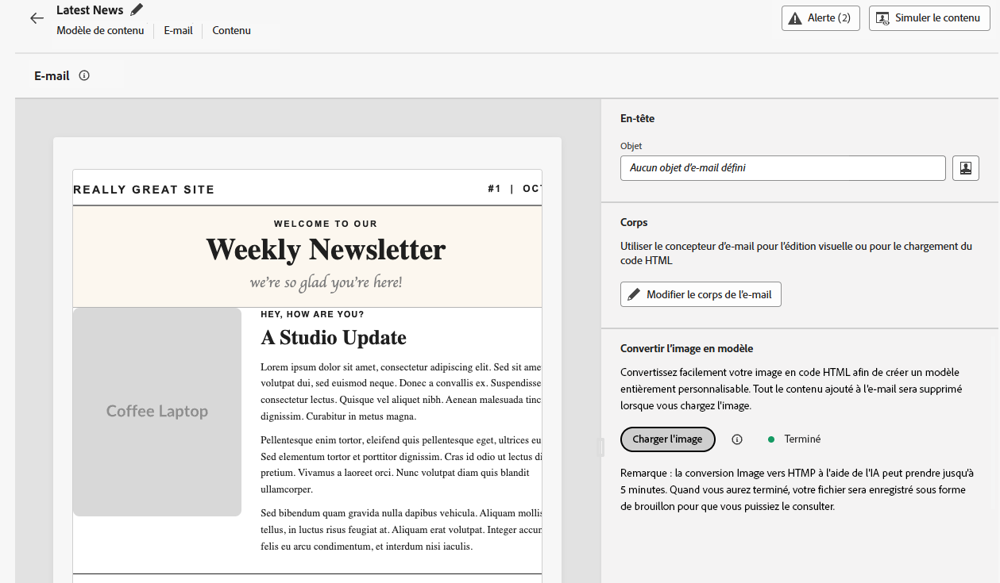

# Notes de mise à jour {#release-notes}

>[!CONTEXTUALHELP]
>id="ajo_homepage_card1"
>title="Nouveautés"
>abstract="**Adobe Journey Optimizer** offre en permanence de nouvelles fonctionnalités, des améliorations aux fonctionnalités existantes et des correctifs. Toutes les modifications sont consolidées la dernière semaine de chaque mois dans ces notes de mise à jour."

[!DNL Adobe Journey Optimizer] suit un modèle de diffusion continue, ce qui permet à Adobe de diffuser régulièrement de nouvelles fonctionnalités, de nouvelles améliorations et de nouveaux correctifs. Cette approche permet un déploiement évolutif et échelonné des fonctionnalités afin d’assurer les performances et la stabilité dans tous les environnements.

En raison de ce modèle, les notes de mise à jour sont mises à jour entre les versions mensuelles.  Une section dédiée [Dernières mises à jour](#latest-updates) met en évidence les nouvelles fonctionnalités et améliorations apportées lors de leur déploiement en production. Les informations sur tous les changements vous sont ainsi toujours communiquées en temps réel. Pour plus d’informations sur le cycle de publication et les phases de disponibilité, consultez le [cycle de publication de Journey Optimizer](releases.md).

[!DNL Adobe Journey Optimizer] est créée de manière native sur [!DNL Adobe Experience Platform] et hérite de ses dernières innovations et améliorations. En savoir plus sur ces modifications dans les [Notes de mise à jour d’Adobe Experience Platform](https://experienceleague.adobe.com/docs/experience-platform/release-notes/latest.html?lang=fr){target="_blank"}.

## Dernières mises à jour {#latest-updates}

Les nouvelles fonctionnalités et améliorations publiées au cours des dernières semaines sont répertoriées ci-dessous, avec leur date de disponibilité. Elles seront regroupées avec le contenu des notes de mise à jour suivantes à la fin du mois. Consultez également les dernières [notes de mise à jour ci-dessous](#latest-rn).

### Nouvelles fonctionnalités {#features}

<table>
<thead>
<tr>
<th><strong>Nouvelle API pour récupérer les campagnes d’action</strong> </th>
</tr>
</thead>
<tbody>
<tr>
<td>

Une nouvelle API Journey Optimizer est désormais disponible. Celle-ci vous permet de récupérer et d’inspecter par programmation les données liées à la campagne, telles que les détails, les versions et les configurations.

Pour plus d’informations, consultez la <a href="https://developer.adobe.com/journey-optimizer-apis/references/campaigns-retrieve/">documentation détaillée</a>.

Date de disponibilité : mardi 24 novembre 2025

</td>
</tr>
</tbody>
</table>

<table>
<thead>
<tr>
<th><strong>Nouvelles alertes de parcours</strong> </th>
</tr>
</thead>
<tbody>
<tr>
<td>

Trois nouvelles alertes de parcours sont désormais disponibles pour vous aider à surveiller et à suivre les événements de cycle de vie des parcours et les performances des actions personnalisées :

<ul>
<li><strong>Parcours publié</strong> : recevez des notifications lorsqu’un parcours est publié par un utilisateur ou une utilisatrice dans la zone de travail du parcours.</li>
<li><strong>Parcours terminé</strong> : recevez des alertes lorsqu’un parcours est terminé, avec des définitions spécifiques en fonction du type de parcours (Lecture d’audience ou Déclenché par un événement).</li>
<li><strong>Limitation d’action personnalisée déclenchée</strong> : recevez une notification lorsque la limitation est activée sur un point d’entrée d’action personnalisée.</li>
</ul>

Il est possible de s’abonner à ces alertes au niveau de l’organisation ou pour des parcours spécifiques.

Pour plus d’informations, consultez la <a href="../reports/alerts.md#journey-alerts">documentation détaillée</a>.

Date de disponibilité : 5 novembre 2025

</td>
</tr>
</tbody>
</table>

<table>
<thead>
<tr>
<th><strong>Thèmes dans le concepteur d’e-mail</strong> </th>
</tr>
</thead>
<tbody>
<tr>
<td>

Vous pouvez désormais appliquer rapidement des thèmes préapprouvés pour garantir la cohérence de la marque dans tous les e-mails, accélérer le processus de création de vos campagnes et produire de manière autonome des e-mails de haute qualité tout en réduisant la dépendance à l’égard des équipes de conception.

Publiée auparavant en version bêta, cette fonctionnalité est désormais disponible pour un ensemble d’organisations (disponibilité limitée). Pour en bénéficier, contactez votre représentant ou représentante Adobe.

Pour plus d’informations, consultez la <a href="../email/apply-email-themes.md">documentation détaillée</a>.

Date de disponibilité : 5 novembre 2025

</td>
</tr>
</tbody>
</table>

## Notes de mise à jour d’octobre 2025 {#latest-rn}

### Nouvelles fonctionnalités {#oct-25-10-features}

<table>
<thead>
<tr>
<th><strong>Convertisseur d’images en HTML</strong> </th>
</tr>
</thead>
<tbody>
<tr>
<td>

Le convertisseur d’images en HTML est une fonctionnalité optimisée par l’IA qui convertit des conceptions d’images statiques en modèles de contenu d’e-mail HTML entièrement personnalisables et modulaires. Cet outil sans code permet aux spécialistes marketing de transformer des conceptions visuelles en modèles d’e-mail réactifs et modifiables sans avoir besoin d’expertise technique. Il est idéal pour la migration de plateformes, la création rapide de modèles et la création de bibliothèques de modèles réutilisables.

Cette fonctionnalité est en disponibilité limitée. Contactez votre représentant ou représentante Adobe pour en obtenir l’accès.

Pour plus d’informations, consultez la <a href="../email/image-to-html.md">documentation détaillée</a>.

Date de disponibilité : 30 octobre_2025

</td>
</tr>
</tbody>
</table>

<table>
<thead>
<tr>
<th><strong>Surveillance et reporting des actions personnalisées</strong> </th>
</tr>
</thead>
<tbody>
<tr>
<td>

Cette fonctionnalité offre une meilleure visibilité sur l’intégrité et les performances des points d’entrée d’action personnalisés. Un nouveau tableau de bord de surveillance d’action personnalisée et les champs correspondants dans le jeu de données d’événement d’étape de parcours vous permettent de surveiller les appels réussis, les erreurs, le débit, le temps de réponse et le temps d’attente en file d’attente de vos points d’entrée d’action personnalisée. Vous pouvez désormais rapidement comprendre quand, où et pourquoi une situation anormale se produit dans une action personnalisée.

Cette fonctionnalité est pour le moment en disponibilité limitée pour la clientèle.

Pour plus d’informations, consultez la <a href="../action/reporting.md">documentation détaillée</a>.

Date de disponibilité : 28 octobre 2025

</td>
</tr>
</tbody>
</table>

<table>
<thead>
<tr>
<th><strong>Formulaires personnalisés de la page de destination</strong> </th>
</tr>
</thead>
<tbody>
<tr>
<td>

Avec [!DNL Journey Optimizer], vous pouvez désormais capturer les attributs de profil via vos pages de destination.

Créez, concevez et gérez des formulaires personnalisés adaptés à vos besoins en fonction d’un jeu de données spécifique. Vous pouvez ensuite utiliser ces formulaires dans les pages de destination pour ajouter les attributs de profil de votre choix au jeu de données défini pour chaque formulaire.

Cette fonctionnalité est actuellement en disponibilité limitée pour la clientèle située aux États-Unis et en Australie. Contactez votre représentant ou représentante Adobe pour en obtenir l’accès.

Pour plus d’informations, consultez la <a href="../landing-pages/lp-forms.md">documentation détaillée</a>.

Date de disponibilité : 23 octobre 2025

</td>
</tr>
</tbody>
</table>

<table>
<thead>
<tr>
<th><strong>Heures creuses/exclusions basées sur l’heure</strong> </th>
</tr>
</thead>
<tbody>
<tr>
<td>

Les heures creuses vous permettent de définir des exclusions basées sur l’heure pour les canaux E-mail, SMS, Notification push et WhatsApp. EIles garantissent qu’aucun message n’est envoyé pendant des périodes spécifiques, ce qui vous aide à respecter les préférences de la clientèle et les exigences de conformité.

Vous pouvez appliquer des heures creuses par le biais de jeux de règles, qui peuvent être affectés à des actions individuelles dans des campagnes ou des parcours pour un contrôle précis.

Actuellement, les règles relatives aux heures creuses ne sont disponibles que pour un ensemble d’organisations (disponibilité limitée).  Ils seront progressivement disponibles pour tous les clients dans les prochaines versions.

Pour plus d’informations, consultez la <a href="../conflict-prioritization/quiet-hours.md">documentation détaillée</a>.

Date de disponibilité : 22 octobre 2025

</td>
</tr>
</tbody>
</table>

<!--table>
<thead>
<tr>
<th><strong>RCS Basic Messaging</strong> </th>
</tr>
</thead>
<tbody>
<tr>
<td>

With the new RCS Basic add-on offering, you can now deliver basic Rich Communication Services (RCS) messaging in Journey Optimizer, enabling the following enhanced messaging capabilities subject to provider and geographical support:

<ul>
<li><strong>Branded and verified sender support:</strong> Send messages using verified business profiles with branding elements (logo, sender name, etc.).</li>
<li><strong>Message delivery insights:</strong> Receive detailed delivery reports including message status updates (e.g., sent, delivered, read).</li>
<li><strong>Link tracking:</strong> Embed and track URLs within RCS messages for engagement analytics.</li>
<li><strong>Fallback to SMS:</strong> Automatic fallback to SMS when the recipient's device does not support RCS or is temporarily unreachable via RCS.</li>
<li><strong>Basic message composition:</strong> Send basic text-based RCS messages.</li>
</ul>
<!--img src="assets/do-not-localize/FILE.gif"-->
<!-- p>For more information, refer to the <a href="../FILE.md">detailed documentation</a>.

<!--/td>
</tr>
</tbody>
</table-->

<!--table>
<thead>
<tr>
<th><strong>Direct mail channel in Orchestrated campaigns</strong> </th>
</tr>
</thead>
<tbody>
<tr>
<td>

Direct mail channel is now available in orchestrated campaigns. The Direct mail activity facilitates direct mail sending within your Orchestrated campaign, for both one-time and recurring messages. It serves to automate the process of generating the extraction file required by direct mail providers. You can combine channel activities into the Orchestrated campaign canvas to create cross-channel campaigns that can trigger actions based on customer behavior and data.

<!--img src="assets/do-not-localize/FILE.gif"-->
<!-- p>For more information, refer to the <a href="../FILE.md">detailed documentation</a>.

<!--/td>
</tr>
</tbody>
</table-->

<!--table>
<thead>
<tr>
<th><strong>Direct Mail channel in journeys</strong> </th>
</tr>
</thead>
<tbody>
<tr>
<td>

Previously limited to Campaigns, Direct Mail channel is now available on the journey canvas, enabling you to incorporate Direct Mail into your journeys. Direct Mail can now be used in both batch and 1:1 journey scenarios, with support for file extraction configuration and time-based frequency settings.

 Previously released in Limited Availability, this capability is now available to all environments (General Availability).

<!--img src="assets/do-not-localize/FILE.gif"-->
<!-- p>For more information, refer to the <a href="../FILE.md">detailed documentation</a>.

<!--/td>
</tr>
</tbody>
</table-->

<!--<table>
<thead>
<tr>
<th><strong>New source connectors for loyalty apps</strong> </th>
</tr>
</thead>
<tbody>
<tr>
<td>

New source connectors are now available in Adobe Experience Platform for the Talon.One, Capillary and Kobie loyalty Apps. These connectors let you seamlessly stream loyalty data into Adobe Experience Platform and leverage these data in Journey Optimizer.

For more information, refer to the <a href="../start/get-started-sources.md">detailed documentation</a>.

Availability date: October 22, 2025

</td>
</tr>
</tbody>
</table>-->

<!--table>
<thead>
<tr>
<th><strong>Decisioning support in email channel</strong> </th>
</tr>
</thead>
<tbody>
<tr>
<td>

You can now add Decision policies into email journeys and campaigns. Decision policies are containers for your offers that leverage the Decisioning engine to dynamically return the best content to deliver for each audience member.

Previously released in Limited Availability, this capability is now available to all environments (General Availability).

For more information, refer to the <a href="../FILE.md">detailed documentation</a>.

Availability date: October 22, 2025

</td>
</tr>
</tbody>
</table-->

<table>
<thead>
<tr>
<th><strong>Messagerie à débit élevé pour les campagnes par e-mail déclenchées par API</strong> </th>
</tr>
</thead>
<tbody>
<tr>
<td>

Un nouveau mode de messagerie transactionnelle à débit élevé est disponible dans les campagnes déclenchées par API. Ce mode est conçu pour les messages transactionnels en temps réel à grande échelle et prend en charge jusqu’à 5 000 transactions par seconde avec une disponibilité supérieure. Ce mode prend également en charge les messages transactionnels sans référencer ni créer de profils client, tels que le passage en caisse de la clientèle, la confirmation de commande, les réinitialisations de mot de passe, les notifications de sécurité et autres notifications de service/exploitation.

Cette fonctionnalité n’est disponible que pour le canal e-mail, pour les organisations qui ont acheté l’offre complémentaire de messagerie transactionnelle à haut débit d’Adobe. Pour plus d’informations, contactez votre représentant ou représentante Adobe.

Pour plus d’informations, consultez la <a href="../campaigns/api-triggered-high-throughput.md">documentation détaillée</a>.

Date de disponibilité : 22 octobre 2025

</td>
</tr>
</tbody>
</table>

<table>
<thead>
<tr>
<th><strong>Règles de ciblage réutilisables</strong> </th>
</tr>
</thead>
<tbody>
<tr>
<td>

Pour vous faire gagner du temps et simplifier votre travail, Journey Optimizer vous permet désormais de créer des règles réutilisables à partir d’un menu d’interface d’utilisation dédié et de les utiliser lors de la création du ciblage, soit dans le cadre de l’optimisation du contenu d’une campagne ou d’un parcours, soit dans l’activité Optimiser le parcours.

Les règles de ciblage sont actuellement en disponibilité limitée. Contactez votre représentant ou représentante Adobe pour en obtenir l’accès. Notez que cette fonctionnalité n’est disponible que pour les organisations qui ont acheté le module complémentaire de prise de décision. Elle sera progressivement disponible pour l’ensemble de la clientèle.

Pour plus d’informations, consultez la <a href="../experience-decisioning/rules.md">documentation détaillée</a>.

Date de disponibilité : 22 octobre 2025

</td>
</tr>
</tbody>
</table>

<table>
<thead>
<tr>
<th><strong>Nouvelles alertes de parcours</strong> </th>
</tr>
</thead>
<tbody>
<tr>
<td>

De nouvelles alertes préconfigurées sont disponibles pour surveiller l’exécution de votre parcours :

<ul><li><a href="../reports/alerts.md#alert-discard-rate">Taux de rejet de profil dépassé</a> : ratio de rejets de profil par rapport aux profils entrés au cours des 5 dernières minutes et ayant dépassé le seuil.</li>
<li><a href="../reports/alerts.md#alert-custom-action-error-rate">Taux d’erreur d’action personnalisée dépassé</a> : ratio des erreurs d’action personnalisée par rapport aux appels HTTP réussis au cours des 5 dernières minutes et ayant dépassé le seuil.</li>
<li><a href="../reports/alerts.md#alert-profile-error-rate">Taux d’erreur de profil dépassé</a> : ratio de profils erronés par rapport aux profils entrés au cours des 5 dernières minutes et ayant dépassé le seuil.</li></ul> 
Vous pouvez modifier les valeurs de seuil et vous abonner à des alertes individuelles au niveau du parcours et non globalement.

Pour plus d’informations, consultez la <a href="../reports/alerts.md">documentation détaillée</a>.

Date de disponibilité : 14 octobre 2025

</td>
</tr>
</tbody>
</table>

<table>
<thead>
<tr>
<th><strong>Assistant des métadonnées d’exécution</strong> </th>
</tr>
</thead>
<tbody>
<tr>
<td>

Une nouvelle fonction d’assistant « executionMetadata » est disponible dans l’éditeur de personnalisation. Il vous permet d’ajouter des informations contextuelles à toute action native et de les capturer dans un jeu de données pour les exporter vers des systèmes externes.

Cette fonctionnalité est en disponibilité limitée. Contactez votre représentant ou représentante Adobe pour en obtenir l’accès.

Pour plus d’informations, consultez la <a href="../personalization/functions/helpers.md#execution-metadata">documentation détaillée</a>.

Date de disponibilité : 13 octobre 2025

</td>
</tr>
</tbody>
</table>

<table>
<thead>
<tr>
<th><strong>Experimentation Accelerator avec l’agent d’expérimentation</strong> </th>
</tr>
</thead>
<tbody>
<tr>
<td>

Journey Optimizer Experimentation Accelerator comprend désormais l’agent d’expérimentation, un outil de conversation optimisé par l’IA qui vous permet d’interagir avec vos expériences, informations et opportunités. Il améliore l’expérience Journey Optimizer Experimentation Accelerator, ce qui vous permet d’exécuter plus efficacement des expériences, d’identifier ce qui fonctionne et de déterminer les prochaines optimisations à effectuer.

Pour plus d’informations, consultez la <a href="https://experienceleague.adobe.com/docs/experience-cloud-ai/experience-cloud-ai/agents/agent-experiment.html?lang=fr" target="_blank">documentation détaillée</a>.

Date de disponibilité : 10 octobre 2025

</td>
</tr>
</tbody>
</table>

<table>
<thead>
<tr>
<th><strong>Pièces jointes PDF aux e-mails</strong> </th>
</tr>
</thead>
<tbody>
<tr>
<td>

Vous pouvez désormais joindre un fichier PDF statique à un e-mail envoyé avec Journey Optimizer.

<ul>
<li>Vous pouvez envoyer jusqu’à 6 messages avec une pièce jointe PDF par profil et par an.</li>
<li>La taille maximale autorisée pour chaque fichier joint est de 5 Mo.</li>
<li>Pour augmenter la taille ou le volume, vous pouvez acheter le module complémentaire Pièces jointes PDF. Pour plus d’informations, contactez votre représentant ou représentante Adobe.</li>
</ul>

Publiée précédemment en disponibilité limitée, cette fonctionnalité est désormais proposée dans tous les environnements (disponibilité générale).

Pour plus d’informations, consultez la <a href="../email/pdf-attachments.md">documentation détaillée</a>.

Date de disponibilité : 30 septembre 2025

</td>
</tr>
</tbody>
</table>

<table>
<thead>
<tr>
<th><strong>API publique pour récupérer les parcours</strong> </th>
</tr>
</thead>
<tbody>
<tr>
<td>

Une nouvelle API Journey Optimizer est désormais disponible pour récupérer les parcours et leurs objets associés tels que les campagnes et les surfaces.

Pour plus d’informations, consultez la <a href="https://developer.adobe.com/journey-optimizer-apis/references/journeys-retrieve/">documentation détaillée</a>.

Date de disponibilité : 25 septembre 2025

</td>
</tr>
</tbody>
</table>

### Améliorations {#updates-improvements}

**Champ d’exécution pour le canal WhatsApp**

Outre les e-mails et les SMS, vous pouvez désormais mettre à jour le champ d’exécution par défaut de vos diffusions WhatsApp au niveau du sandbox. Il est également possible de remplacer le champ d’exécution défini globalement en le modifiant dans les paramètres avancés de l’activité de parcours WhatsApp ou dans la configuration du canal WhatsApp. [En savoir plus](../configuration/primary-email-addresses.md)

Date de disponibilité : 22 octobre 2025

**Prise en charge des attributs personnalisés avec l’adresse Mailto (désabonnement)**

Avec Journey Optimizer, si vous gérez le consentement en dehors d’Adobe, vous pouvez définir des points d’entrée personnalisés externes en définissant votre propre lien de désabonnement en un clic ainsi qu’une adresse e-mail de désabonnement personnalisée dans la configuration du canal e-mail. Lorsque les personnes destinataires cliquent sur le lien de désabonnement, Journey Optimizer ajoute certains paramètres par défaut, spécifiques au profil, à l’événement de mise à jour du consentement.

Pour personnaliser davantage vos points d’entrée personnalisés, vous pouvez maintenant définir des attributs personnalisés qui seront également ajoutés à l’événement de consentement. [En savoir plus](../email/list-unsubscribe.md#custom-attributes)

>[!AVAILABILITY]
>
>Cette fonctionnalité est déjà disponible pour l’**[!UICONTROL URL de désabonnement en un clic]** personnalisée depuis août 2025 et est désormais disponible pour l’option **[!UICONTROL Mailto (désabonnement)]** en disponibilité limitée. Contactez votre représentant ou représentante Adobe pour en obtenir l’accès.

Date de disponibilité : 6 octobre 2025

<!--
### Coming soon {#oct-25-10-soon}

In the next few days, the following capabilities and enhancements are scheduled for release. **Information is subject to change**. Updated links, screens, and documentation will be shared once these updates are live in production.

#### New capabilities {#oct-25-10-soon-features}

<table>
<thead>
<tr>
<th><strong>Themes in the Email Designer</strong> </th>
</tr>
</thead>
<tbody>
<tr>
<td>

You can now quickly apply pre-approved themes to ensure brand consistency across all emails, speed up your campaign creation process, and independently produce high-quality emails while reducing dependency on design teams.

Previously released in beta version, this capability is now available for a set of organizations (Limited Availability). To gain access, contact your Adobe representative.

For more information, refer to the <a href="../email/apply-email-themes.md">detailed documentation</a>.

Availability date: November 4, 2025

</td>
</tr>
</tbody>
</table>

#### Improvements {#oct-25-10-soon-improvements}

**Decisioning in emails through AI models**

You can now use AI models to optimize the best content in your email through the use of Decisioning. For example, this capability allows you to offer the best content based on custom events such as Purchases, Button Clicks, Add to Cart, etc.
-->

<!--
<table>
<thead>
<tr>
<th><strong>New Web Push notifications channel</strong> </th>
</tr>
</thead>
<tbody>
<tr>
<td>

Adobe Journey Optimizer now supports Web Push notifications, expanding the push channel beyond mobile. You can seamlessly deliver notifications to both mobile and desktop browsers, enabling you to reach customers directly on their devices without requiring an app.

This enhancement allows you to engage users with timely, personalized messages in real time, leveraging the same authoring workflows and targeting capabilities already available for mobile push.

For more information, refer to the <a href="../FILE.md">detailed documentation</a>

Availability date: Sept XX, 2025

</td>
</tr>
</tbody>
</table>

<table>
<thead>
<tr>
<th><strong>Custom action monitoring and reporting</strong> </th>
</tr>
</thead>
<tbody>
<tr>
<td>

Custom action monitoring and reporting is now available. This capability provides better visibility into journey health and execution, including lifecycle status and performance alerts. You can now quickly understand when, where, and why an anomalous situation is occurring in a custom action.

For more information, refer to the <a href="../FILE.md">detailed documentation</a>

Availability date: Sept XX, 2025

</td>
</td>
</tr>
</tbody>
</table>

<table>
<thead>
<tr>
<th><strong>New source connectors for loyalty apps</strong> </th>
</tr>
</thead>
<tbody>
<tr>
<td>

New source connectors are now available in Adobe Experience Platform for the Talon.One, Capillary, and Kobie loyalty apps. These connectors let you seamlessly stream loyalty data into Adobe Experience Platform and leverage these data in Journey Optimizer.

</td>
</tr>
</tbody>
</table>

-->
