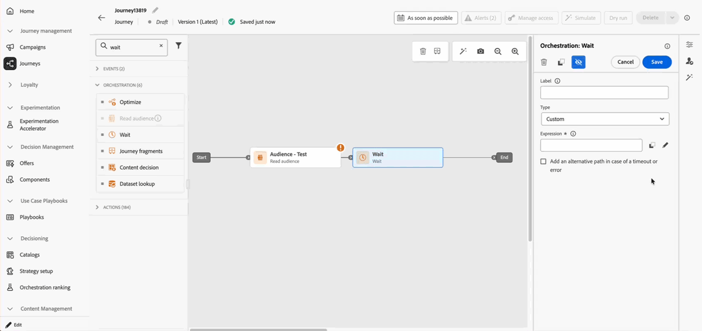
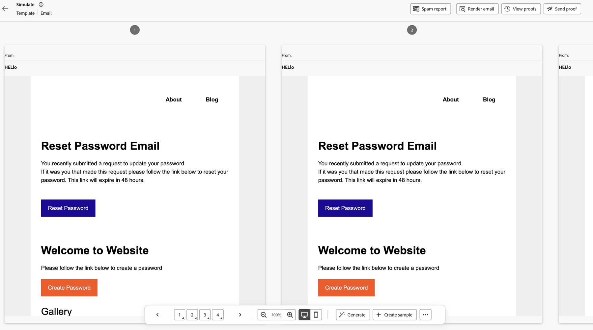

# Notes de mise à jour {#release-notes}

>[!CONTEXTUALHELP]
>id="ajo_homepage_card1"
>title="Nouveautés"
>abstract="**Adobe Journey Optimizer** offre en permanence de nouvelles fonctionnalités, des améliorations des fonctionnalités existantes et des correctifs. Toutes les modifications sont consolidées la dernière semaine de chaque mois dans ces notes de mise à jour."

[!DNL Adobe Journey Optimizer] suit un modèle de diffusion continue, ce qui permet à Adobe de proposer régulièrement de nouvelles fonctionnalités, de nouvelles améliorations et de nouveaux correctifs. Cette approche permet un déploiement évolutif et échelonné des fonctionnalités afin d’assurer les performances et la stabilité dans tous les environnements. En raison de ce modèle, les notes de mise à jour sont mises à jour entre les versions mensuelles. Pour plus d’informations sur le cycle de publication et les phases de disponibilité, consultez le [cycle de publication de Journey Optimizer](releases.md).

[!DNL Adobe Journey Optimizer] est créée de manière native sur [!DNL Adobe Experience Platform] et hérite de ses dernières innovations et améliorations. En savoir plus sur ces modifications dans les [Notes de mise à jour d’Adobe Experience Platform](https://experienceleague.adobe.com/docs/experience-platform/release-notes/latest.html?lang=fr){target="_blank"}.

>[!NOTE]
>
>Les fonctionnalités répertoriées dans ces notes de mise à jour incluent une **date de disponibilité** indiquant le moment auquel chaque modification devient accessible dans votre environnement. Des entrées dans les accordéons **bientôt disponible** sont attendues dans les prochains jours ou les prochaines semaines. Les informations contenues dans ces sections peuvent faire l’objet de modifications.

## Mises à jour de juin 2026 {#june-26-updates}

<table>
<thead>
<tr>
<th><strong>Simulation de parcours (disponibilité générale)</strong> </th>
</tr>
</thead>
<tbody>
<tr>
<td>

Vous pouvez maintenant définir votre parcours sur Simulation. Ce mode permet de valider la logique à l’aide d’utilisateurs et d’utilisatrices simulés. Il s’agit de profils temporaires créés spécifiquement pour la simulation, qui vous permettent de tester librement sans avoir à gérer de profils de test persistants dans Adobe Experience Platform. 

Publiée précédemment en disponibilité limitée, la simulation de Parcours est désormais disponible pour tous les environnements. Avec cette version de disponibilité générale, vous pouvez désormais utiliser Journey Agent pour générer des utilisateurs et des événements simulés directement dans le menu Simulation .

Pour plus d'informations, consultez la <a href="../building-journeys/simulate-journey-gs.md">documentation détaillée</a>.

Date de disponibilité : 9 juin 2026

</td>
</tr>
</tbody>
</table>

<table>
<thead>
<tr>
<th><strong>Optimisation du chemin de parcours - Ciblage</strong> </th>
</tr>
</thead>
<tbody>
<tr>
<td>

L’activité <strong>Optimiser</strong> prend désormais en charge <strong>les règles de ciblage</strong> qui permettent de définir des critères spécifiques que les clients et clientes doivent remplir pour être qualifiés pour un chemin de parcours particulier, en fonction des segments d’audience ou des attributs de profil.

Contrairement à l’expérimentation, où les clients sont affectés à des chemins de manière aléatoire, le ciblage utilise une logique déterministe pour s’assurer que l’audience ou le profil client approprié est acheminé vers le chemin prévu.

Publiée précédemment en disponibilité limitée, cette fonctionnalité est désormais proposée dans tous les environnements (disponibilité générale).

Pour plus d'informations, consultez la <a href="../building-journeys/path-targeting.md">documentation détaillée</a>.

Date de disponibilité : 8 juin 2026

</td>
</tr>
</tbody>
</table>

<table>
<thead>
<tr>
<th><strong>Fragments De parcours (Disponibilité Générale)</strong> </th>
</tr>
</thead>
<tbody>
<tr>
<td>

Vous pouvez désormais créer <strong>fragments de Parcours </strong> dans Adobe Journey Optimizer. Les fragments de parcours sont des ensembles réutilisables de nœuds de parcours que vous pouvez créer une fois et déposer dans n’importe quel parcours de votre sandbox. Qu’il s’agisse d’une vérification d’éligibilité, d’une logique de routage de canal préférée ou d’une séquence de bienvenue, les fragments aident les équipes à se déplacer plus rapidement et à rester cohérentes, sans devoir reconstruire la même logique à chaque fois.

Une fois créés, les fragments sont stockés dans un <strong>inventaire des fragments</strong> dédié et peuvent être insérés dans n’importe quel parcours à l’aide de l’activité <strong>Fragments de Parcours </strong>.

Auparavant disponible en disponibilité limitée, cette fonctionnalité est désormais disponible pour tous les clients et clientes. Les fragments de parcours prennent également en charge <strong>l’outil Sandbox</strong>, ce qui vous permet de compresser et d’exporter des fragments dans les sandbox.

Pour plus d'informations, consultez la <a href="../building-journeys/journey-fragments.md">documentation détaillée</a>.

Date de disponibilité : 9 juin 2026

</td>
</tr>
</tbody>
</table>

<table>
<thead>
<tr>
<th><strong>Simuler des variations de contenu : génération de variantes d’expérience et d’IA mises à jour</strong> </th>
</tr>
</thead>
<tbody>
<tr>
<td>

Deux mises à jour sont désormais disponibles pour le workflow <strong> Simuler du contenu </strong> :

<ul>
<li><strong>Nouveau chemin par défaut</strong> — Cliquez sur <strong>Simuler du contenu</strong> pour ouvrir désormais l’expérience <strong>Simuler des variations de contenu</strong> par défaut. À partir d’un seul écran, vous pouvez ajouter un exemple d’entrée manuellement ou à partir d’un fichier CSV/JSON, réutiliser des utilisateurs simulés, prévisualiser le rendu et envoyer des BAT. Pour prévisualiser avec des profils de test Adobe Experience Platform, envoyer des BAT avec des données de profil de test ou vérifier le rendu des boîtes de réception d’e-mails et les rapports de spam, cliquez sur <strong>Simuler du contenu</strong>, puis sélectionnez <strong>Simuler du contenu (profils AEP)</strong> dans la liste déroulante.</li>
<li><strong>Variantes de contenu générées par l’IA</strong> — Dans l’expérience <strong>Simuler des variations de contenu</strong>, cliquez sur <strong>Générer</strong> pour utiliser l’IA pour créer automatiquement des variantes de contenu. Le système analyse votre message, détecte les champs de personnalisation et les branches conditionnelles et remplit des valeurs réalistes afin que vous puissiez valider le rendu sans créer manuellement chaque variante.</li>
</ul>

Pour plus d'informations, consultez la <a href="../test-approve/simulate-sample-input.md">documentation détaillée</a>.

Date de disponibilité : 9 juin 2026

</td>
</tr>
</tbody>
</table>

<table>
<thead>
<tr>
<th><strong>Prise en charge de la prise de décision dans le canal Courrier</strong> </th>
</tr>
</thead>
<tbody>
<tr>
<td>

Vous pouvez désormais ajouter des politiques de décision dans les parcours et campagnes de publipostage direct. Les politiques de décision sont des conteneurs pour vos offres qui s’appuient sur le moteur de prise de décision pour renvoyer de manière dynamique le meilleur contenu pour chaque membre de l’audience. La prise de décision par publipostage direct prend également en charge les cas d’utilisation de prise de décision par lots, ce qui vous permet d’exporter les éléments d’offre correspondants pour chaque profil dans une audience Adobe Experience Platform donnée. 

Pour plus d'informations, consultez la <a href="../experience-decisioning/use-decision-policy.md">documentation détaillée</a>.

Date de disponibilité : 3 juin 2026

</td>
</tr>
</tbody>
</table>

<table>
<thead>
<tr>
<th><strong>Assistant AI pour les expressions de Parcours (Beta publique)</strong> </th>
</tr>
</thead>
<tbody>
<tr>
<td>

L’assistant AI fonctionne désormais dans l’éditeur d’expression avancé de parcours pour convertir les invites en langage naturel en expressions valides et en logique conditionnelle. Décrivez l’expression que vous souhaitez créer et l’assistant AI génère un code prêt à l’emploi que vous pouvez appliquer immédiatement ou affiner à l’aide d’invites de relance.

Cette fonctionnalité est disponible pour tous les clients sous la forme d’un Beta public.

Pour plus d'informations, consultez la <a href="../building-journeys/expression/expression-agent.md">documentation détaillée</a>.

Date de disponibilité : 3 juin 2026
 
</td>
</tr>
</tbody>
</table>

[!BADGE Important &#x200B;]{type=Informative} **&#x200B;**&#x200B;Jeu de données d’événement de retour de message AJO déplacé vers l’ingestion par lots **- Le** Jeu de données d’événement de retour de message AJO** passe de l’ingestion par flux à l’ingestion par lots. Par conséquent, attendez-vous à une latence des données allant jusqu’à 2 heures pour ce jeu de données. Si vous avez créé des rapports dans Customer Journey Analytics ou exécuté des requêtes à l’aide de ce jeu de données, tenez compte de cette latence accrue à l’avenir. [En savoir plus](../data/get-started-datasets.md)

Date de disponibilité : 10 juin 2026

* **Arrêt automatique pour les parcours de lecture d’audience non récurrents** - Les parcours non récurrents **lecture d’audience** passent désormais automatiquement au statut **Arrêté** une fois le dernier profil actif quitté. Auparavant, ces parcours restaient **en ligne** jusqu’à l’expiration du délai d’expiration global de 91 jours, même lorsqu’aucun profil n’y circulait plus. Grâce à cette amélioration, le statut du parcours reflète le statut d’exécution réel dès qu’il est terminé, ce qui permet de conserver un inventaire précis de vos parcours sans intervention manuelle.

  Notez que ce comportement ne s’applique pas aux parcours qui incluent des nœuds provoquant des périodes d’attente, tels que les nœuds d’attente, les nœuds de réaction ou les transitions déclenchées par un événement. Ces parcours restent soumis à la temporisation globale standard de 91 jours. [En savoir plus](../building-journeys/end-journey.md#auto-stop-non-recurring)

  Date de disponibilité : 9 juin 2026

* **Authentification personnalisée basée sur un certificat dans les actions personnalisées** - Les actions personnalisées prennent désormais en charge l’authentification personnalisée basée sur un certificat. En ajoutant `subType: "certificateCredential"` à une configuration d’autorisation personnalisée, Journey Optimizer utilise un certificat géré Adobe pour signer une assertion client JWT et l’échanger contre un jeton d’accès (aucun secret client requis). Conçu pour les API d’entreprise qui appliquent la vérification d’identité avec certificat, comme Microsoft Entra ID. [En savoir plus](../datasource/external-data-sources.md#certificate-credential)

  Date de disponibilité : 4 juin 2026

* **Alertes client pour les événements de cycle de vie de campagne** - Les nouvelles alertes système vous informent désormais des événements de cycle de vie clés pour les campagnes déclenchées par action et par API. S’abonner au niveau du sandbox. [En savoir plus](../reports/alerts.md)

  Date de disponibilité : 1 juin 2026

* **Chiffrement des paramètres d’URL** - Vous pouvez désormais chiffrer les paramètres d’URL dans les liens de tracking et de page de destination ajoutés à vos e-mails. Cela fournit une couche de sécurité supplémentaire pour les données de paramètres sensibles. Publiée précédemment en disponibilité limitée, cette fonctionnalité est désormais proposée dans tous les environnements (disponibilité générale). [En savoir plus](../personalization/url-parameter-encryption.md)

  Date de disponibilité : 1 juin 2026

* **Nouvelles autorisations pour le registre des clés** - Deux nouvelles autorisations sont désormais requises pour accéder et gérer les clés nécessaires au chiffrement des paramètres d’URL : **Gérer le registre des clés** et **Afficher le registre des clés**. [En savoir plus](../administration/high-low-permissions.md#administration-permissions)

  Date de disponibilité : 1 juin 2026

<!--
+++ Coming soon — **Information below is subject to change.**

* **Override the default execution field in campaigns** - Previously available at the journey level, you can now override the default execution field set globally for your Email, SMS and WhatsApp deliveries in the campaign parameters.

  Availability date: Early June, 2026

+++
-->

## Notes de mise à jour du 26 mai {#may-26-rn}

### Parcours {#may-26-journeys}

Les fonctionnalités et améliorations suivantes ont été ajoutées aux parcours dans cette version. D’autres modifications sont également attendues dans les jours ou semaines à venir.

<table>
<thead>
<tr>
<th><strong>Fragments De parcours (Disponibilité Limitée)</strong> </th>
</tr>
</thead>
<tbody>
<tr>
<td>

Vous pouvez désormais créer <strong>fragments de Parcours </strong> dans Adobe Journey Optimizer. Les fragments de parcours sont des ensembles réutilisables de nœuds de parcours que vous pouvez créer une fois et déposer dans n’importe quel parcours de votre sandbox. Qu’il s’agisse d’une vérification d’éligibilité, d’une logique de routage de canal préférée ou d’une séquence de bienvenue, les fragments aident les équipes à se déplacer plus rapidement et à rester cohérentes, sans devoir reconstruire la même logique à chaque fois.

Une fois créés, les fragments sont stockés dans un <strong>inventaire des fragments</strong> dédié et peuvent être insérés dans n’importe quel parcours à l’aide de l’activité <strong>Fragments de Parcours </strong>.

<!--

-->

Cette fonctionnalité est disponible uniquement pour un nombre limité d’organisations (disponibilité limitée). Pour en bénéficier, contactez votre représentant ou représentante Adobe.

Pour plus d’informations, consultez la <a href="../building-journeys/journey-fragments.md">documentation détaillée</a>.

Date de disponibilité : 13 mai 2026

</td>
</tr>
</tbody>
</table>

<table>
<thead>
<tr>
<th><strong>Simulation de parcours (disponibilité limitée)</strong> </th>
</tr>
</thead>
<tbody>
<tr>
<td>

Vous pouvez désormais définir votre parcours sur <strong>Simulation</strong>. Ce mode permet de valider la logique à l’aide d’<strong>utilisateurs simulés</strong>. Il s’agit de profils temporaires créés spécifiquement pour la simulation, qui vous permettent de tester librement sans avoir à gérer de profils de test persistants dans Adobe Experience Platform.

Cette fonctionnalité est actuellement en disponibilité limitée pour l’ensemble des clients et clientes, avec des fonctions essentielles.

Pour plus d'informations, consultez la <a href="../building-journeys/simulate-journey.md">documentation détaillée</a>.

Date de disponibilité : 5 mai 2026

</td>
</tr>
</tbody>
</table>

<!--
<table>
<thead>
<tr>
<th><strong>Journey path optimization – Targeting (General Availability)</strong> </th>
</tr>
</thead>
<tbody>
<tr>
<td>

Use the new <strong>Optimize</strong> node to target specific audiences to determine the best path to meet your business-centric KPIs.

This tool allows you to develop more effective marketing campaigns that are more likely to resonate at the 1:1 level, improve marketing personalization efforts for customers and enhance critical customer engagement KPIs, such as conversions and revenue.

Previously available in Limited Availability, this capability is now available to all environments.

Availability date: June 1, 2026

</td>
</tr>
</tbody>
</table>

<table>
<thead>
<tr>
<th><strong>Journey Arbitration – ranking formulas (General Availability)</strong> </th>
</tr>
</thead>
<tbody>
<tr>
<td>

You can now use formulas to automatically boost journey priority scores based on customer profile attributes and contextual factors, ensuring customers enter the most relevant journeys.

Previously available in Limited Availability, this capability is now available to all environments.

Availability date: June 1, 2026

</td>
</tr>
</tbody>
</table>
-->

<!--
* **Supplemental identifier support for external audiences** - Supplemental identifiers in journeys are now supported for external audiences, including audiences imported from a CSV file and audiences created with Federated Audience Composition. You can designate any non-identity attribute or non-person identity attribute from the audience as the supplemental ID, no schema labeling is required.

  Availability date: Early June, 2026
-->

### Campagnes orchestrées {#may-26-oc}

Les fonctionnalités et améliorations suivantes ont été ajoutées aux campagnes orchestrées dans cette version. D’autres modifications sont également attendues dans les jours ou semaines à venir.

<table>
<thead>
<tr>
<th><strong>Campagnes orchestrées en chaîne</strong> </th>
</tr>
</thead>
<tbody>
<tr>
<td>

Les campagnes orchestrées peuvent désormais être liées en déclenchant une campagne orchestrée directement à partir de l’activité <strong>Fin</strong> d’une autre campagne orchestrée.

Cela permet de diviser une logique d’orchestration complexe en flux plus petits et réutilisables qui peuvent être appelés à partir de plusieurs campagnes parentes plutôt que reconstruits à chaque fois. La payload transmise au moment de l’exécution est disponible pour la segmentation et la personnalisation dans la campagne en aval. De ce fait, chaque campagne liée peut se comporter en fonction du contexte qu’elle reçoit.

Pour plus d'informations, consultez la <a href="../orchestrated/trigger-orchestrated-campaign.md#signal-end">documentation détaillée</a>.

Date de disponibilité : 20 mai 2026

</td>
</tr>
</tbody>
</table>

* **Ajouter des liens dans l’activité Enrichissement** - La fonctionnalité Ajouter un lien est désormais disponible dans l’activité Enrichissement pour les campagnes orchestrées. Vous pouvez ainsi créer une relation directe entre les données de votre table de travail et vos tables de base de données existantes.

  Date de disponibilité : 20 mai 2026

<!--
+++ Coming soon — **Information below is subject to change.**

The following orchestrated campaign capability is expected in the upcoming days or weeks.

<table>
<thead>
<tr>
<th><strong>File-based targeting for orchestrated campaigns (Limited Availability)</strong> </th>
</tr>
</thead>
<tbody>
<tr>
<td>

Orchestrated campaigns now support loading a CSV or TXT file directly into the campaign canvas as the targeting audience, without first ingesting the file into Adobe Experience Platform. The file data is consumed at execution time and is not persisted as an Adobe Experience Platform dataset. During file setup, you can define column mappings, data types, NULL handling, and per-column error policies. This supports ad-hoc sends or partner list campaigns where building a full ingestion pipeline is not practical.

This capability is only available for a set of organizations (Limited Availability). To gain access, contact your Adobe representative.

Availability date: June 1, 2026

</td>
</tr>
</tbody>
</table>

* **Loop-based personalization for relational data** - The personalization editor now supports a Loop block that iterates over relational collections, such as orders, accounts, or bookings, and renders one content block per record inside a single email or SMS. Collections are configured through the data picker using personalization tokens, with no expression writing required.

  Availability date: Early June, 2026

* **Personalize email sender details per recipient and campaign** - Orchestrated campaigns now support personalization of email header fields, including From name, From address, and Reply-To, using profile attributes or relational data. This allows sender details to reflect the relevant advisor, location, or branch for each recipient, rather than routing all sends through a single corporate address.

  Header values can be set at the channel level and overridden per campaign using contextual data for more precise control.

  Availability date: Early June, 2026

+++
-->

### Prise de décision {#may-26-decisioning}

Les fonctionnalités et améliorations suivantes ont été ajoutées à Decisioning dans cette version. D’autres modifications sont également attendues dans les jours ou semaines à venir.

<table>
<thead>
<tr>
<th><strong>Règles de prise de décision et optimisation de l’IA dédiée aux formules de classement</strong> </th>
</tr>
</thead>
<tbody>
<tr>
<td>

[!DNL Adobe Journey Optimizer] utilise désormais l’IA pour détecter les règles de prise de décision et les formules de classement qui peuvent être simplifiées. Dans l’inventaire, un indicateur rouge s’affiche sur toute règle pour laquelle l’IA a identifié une opportunité d’optimisation. Cliquez sur l’indicateur pour afficher l’expression d’origine avec la version suggérée par l’IA. À partir de là, vous pouvez télécharger un fichier pour examiner la manière dont les profils simulés sont évalués par chaque version et confirmer qu’ils se comportent de manière identique, puis remplacer l’expression par l’expression optimisée.

Pour plus d’informations, consultez la <a href="../start/ai-features.md#decisioning-optimization">documentation détaillée</a>.

Date de disponibilité : 5 mai 2026

</td>
</tr>
</tbody>
</table>

* **Fragments de contenu Adobe Experience Manager dans Decisioning** - Vous pouvez désormais mapper les fragments de contenu Adobe Experience Manager aux éléments de décision dans Decisioning et les exploiter dans les politiques de décision pour diffuser le fragment approprié au bon client au bon moment. [En savoir plus](../integrations/aem-fragments.md#aem-decisioning)

  Cette fonctionnalité est disponible uniquement pour un nombre limité d’organisations (disponibilité limitée). Pour en bénéficier, contactez votre représentant ou représentante Adobe.

  Date de disponibilité : 20 mai 2026

* **Détails de la politique de décision du résumé de la campagne** - À partir de la page du résumé de la campagne, vous pouvez désormais examiner la structure complète de chaque politique de décision, y compris les stratégies de sélection, les éléments de décision et les offres de secours, sans dupliquer ni modifier la campagne. Vous pouvez également copier un résumé JSON dans le presse-papiers à des fins de dépannage auprès de l’assistance Adobe ou de votre équipe d’ingénieurs. [En savoir plus](../experience-decisioning/use-decision-policy.md#decision-policy-summary)

  Date de disponibilité : 20 mai 2026

* **API de workflow de migration Decisioning** - Le contrat d’API pour la création d’analyses des dépendances et de workflows de migration a été mis à jour : transmettez **`request-level`** en tant que **paramètre de requête** sur l’URL de la requête (`sandbox`, `offer` ou `decision`). Le niveau de requête ne doit plus être envoyé dans le corps JSON. [En savoir plus](../experience-decisioning/decisioning-migration-api.md)

  Date de disponibilité : 6 mai 2026

### Canal E-mail {#may-26-email}

Les fonctionnalités et améliorations suivantes ont été ajoutées au canal e-mail dans cette version. D’autres modifications sont également attendues dans les jours ou semaines à venir.

<table>
<thead>
<tr>
<th><strong>Liens profonds dans le Designer Email</strong> </th>
</tr>
</thead>
<tbody>
<tr>
<td>

Il est désormais possible d’ajouter des liens profonds au contenu de votre e-mail par le biais d’une option dédiée dans le Designer d’e-mail. Cela permet aux utilisateurs et utilisatrices d’accéder directement au contenu in-app approprié au lieu d’être redirigés vers des navigateurs ou des boutiques d’applications, en préservant le contexte et l’engagement.

Notez que bien que l’option Lien profond soit disponible pour tous les clients, les liens profonds ne fonctionnent que si vous avez terminé les étapes de configuration requises et de mise en œuvre des applications mobiles.

Pour plus d'informations, consultez la <a href="../email/deeplinks.md">documentation détaillée</a>.

Date de disponibilité : 12 mai 2026

</td>
</tr>
</tbody>
</table>

* **Limiter la rupture d’héritage dans les fragments** - Lors de la création ou de la modification d’un fragment, vous pouvez désormais choisir s’il peut être modifié lorsqu’il est utilisé dans des e-mails. Le verrouillage d’un fragment garantit qu’il reste synchronisé partout où il apparaît, empêchant les modifications locales qui pourraient enfreindre les normes de la marque ou les exigences de conformité. Ce paramètre peut être mis à jour ultérieurement et s’appliquer aux utilisations futures. [En savoir plus](../content-management/create-fragments.md#lock-visual-fragment)

  Date de disponibilité : 21 mai 2026

### Messagerie mobile (SMS, MMS et RCS) {#may-26-mobile}

Les fonctionnalités et améliorations suivantes ont été ajoutées à la messagerie mobile dans cette version.

<table>
<thead>
<tr>
<th><strong>Nouveau canal de message mobile et messagerie RCS améliorée</strong> </th>
</tr>
</thead>
<tbody>
<tr>
<td>

Les SMS, MMS et RCS sont désormais regroupés dans une seule action <strong>Message mobile</strong> dans Adobe Journey Optimizer, ce qui facilite la gestion de tous les types de messages mobiles à partir d’un seul emplacement. Dans le cadre de cette mise à jour, vous pouvez désormais créer des messages RCS de médias riches, y compris des images, des carrousels et des actions suggérées, directement dans Journey Optimizer grâce à une nouvelle expérience de création native.

Pour plus d’informations, consultez la <a href="../mobile/get-started-mobile.md">documentation détaillée</a>.

Date de disponibilité : 20 mai 2026

</td>
</tr>
</tbody>
</table>

* **Nombre de caractères** : dans Adobe Journey Optimizer, vous pouvez désormais utiliser le nombre de caractères pour surveiller la longueur de vos SMS en temps réel. Cela vous permet de savoir quand un message sera partagé en plusieurs segments afin de mieux gérer la mise en forme et d’éviter une hausse imprévue des coûts d’envoi. [En savoir plus](../mobile/create-mobile-message.md)

* **SMS entrant vers un jeu de données personnalisé** : dans **Informations d’identification de l’API SMS**, acheminez **SMS entrant** vers un **jeu de données d’événement d’expérience personnalisé et activé pour le profil** que vous sélectionnez au lieu du jeu de données de tracking par défaut uniquement. [En savoir plus](../mobile/mobile-webhook.md)

* **Amélioration de l’interface des webhooks** : lors de la configuration des webhooks SMS, l’interface d’utilisation comprend désormais un guide de configuration intégré avec des exemples pratiques, ce qui facilite l’alignement des payloads des fournisseurs et la résolution des problèmes sans quitter le flux de configuration. [En savoir plus](../mobile/mobile-webhook.md)

* **Liens profonds dans le contenu des SMS** - Il est désormais possible d’ajouter des liens profonds au contenu de votre SMS à l’aide de la fonction d’assistance Url. Cela permet de s’assurer que les destinataires sont dirigés directement vers le contenu in-app prévu, sans les acheminer via un navigateur web ou une boutique d’applications, à condition que vous ayez terminé les étapes de configuration requises et de mise en œuvre de l’application mobile. [En savoir plus](../email/deeplinks.md)

### Canal WhatsApp {#may-26-whatsapp}

Les améliorations suivantes ont été ajoutées au canal WhatsApp dans cette version.

* **Prise en charge et suivi des boutons WhatsApp** - Les modèles WhatsApp prennent désormais en charge **Réponse rapide**, **Call to action - URL** et **Call to action - téléphone**, **Copier le code** n’est pas pris en charge. Journey Optimizer envoie les boutons pris en charge et suit les interactions avec les autres rapports de canal.

* **Données contextuelles du canal WhatsApp** - Journey Optimizer capture désormais les données d’interaction supplémentaires renvoyées par le canal WhatsApp et les stocke dans le **Jeu de données AJO EmailTrackingExperienceEvent** sous le groupe de champs `whatsAppChannelContext`. [En savoir plus](../whatsapp/send-whatsapp.md#whatsapp-channel-context)

  +++ Les champs suivants sont capturés et peuvent être utilisés pour créer des audiences et analyser l&#39;engagement de WhatsApp

   * **`messageType`** - Type de message WhatsApp (par exemple `templateBased`, `response`)
   * **`inboundMessage`** - contenu de réponse entrante (par exemple `stop`, `start`, `subscribe`)
   * **`inboundNumber`** - ID de l’expéditeur où le message entrant a été reçu
   * **`channelType`** - Catégorie de canal (`Utility`, `Marketing` ou `Promotional`)
   * **`profileNumber`** - Numéro de téléphone à partir duquel le message entrant a été reçu
   * **`origTimestamp`** - Horodatage d&#39;origine de Meta / WhatsApp
   * **`status`** - Statut de la diffusion, y compris les commentaires normalisés du fournisseur (`sent`, `delivered`, `bounce`, `error`, `delay`, `duplicate`, `denylist`, `exclude` ou `unknown`) et le message brut de statut du fournisseur
   * **`reactionEvent`** - Contenu de la réponse de l’utilisateur : émoticône pour les réactions ou texte du message pour les réponses à un message spécifique
   * **`reactionMessageID`** - ID du message d’origine auquel une réponse est apportée
   * **`reactionActionName`** - Type d’action de réponse (`react`, `unreact` ou `reply`)
   * **`interactiveSelectedTitle`** - Titre sélectionné par l&#39;utilisateur dans un message interactif WhatsApp
   * **`interactiveType`** - Type de message interactif (`list reply`, `button reply` ou `button`)
   * **`interactiveSelectedDescription`** - Description de l&#39;option interactive WhatsApp sélectionnée
   * **`interactiveSelectedID`** - Identifiant de l&#39;option sélectionnée sur WhatsApp

  +++

### Contenu et intégrations {#may-26-content}

Les fonctionnalités et améliorations suivantes ont été ajoutées à la gestion de contenu et aux intégrations dans cette version.

<table>
<thead>
<tr>
<th><strong>Sélecteur du gestionnaire de contenu</strong> </th>
</tr>
</thead>
<tbody>
<tr>
<td>

Journey Optimizer utilise désormais le <strong>sélecteur de grille de contenu</strong>, une boîte de dialogue modale unifiée permettant de sélectionner à la fois le Experience Manager Assets et les fragments de contenu. Le nouveau sélecteur comprend :

<ul>
<li><strong>Navigation, recherche et filtrage </strong>sur toutes les ressources et tous les fragments.</li>
<li><strong>Recherche sémantique IA</strong> : décrivez ce dont vous avez besoin en langage clair et simple, par exemple « du café dans les montagnes », pour faire apparaître des ressources contextuellement pertinentes en fonction du sens et du contenu, et pas seulement des correspondances textuelles. Les requêtes multilingues sont également prises en charge.</li>
<li><strong>Chargement de résumé</strong> : chargez un résumé marketing pour faire apparaître automatiquement les ressources qui s’alignent sur le contexte de votre campagne en fonction de son contenu et des exigences.</li>
<li><strong>Rendus Dynamic Media</strong> : sélectionnez et appliquez des rendus d’image pour les ressources dynamiques sans quitter le sélecteur.</li>
</ul>

Pour plus d’informations, consultez la <a href="../integrations/aem-content-advisor.md">documentation détaillée</a>.

Date de disponibilité : 19 mai 2026

</td>
</tr>
</tbody>
</table>

<table>
<thead>
<tr>
<th><strong>Intégrations</strong> </th>
</tr>
</thead>
<tbody>
<tr>
<td>

La fonctionnalité <b>Intégrations</b> vous permet de connecter des sources de données tierces directement à Adobe Journey Optimizer. En simplifiant la manière d’extraire des données externes et du <b>contenu composable</b>, cette fonctionnalité facilite la diffusion de messages dynamiques personnalisés sur tous vos canaux.

Publiée précédemment en version Beta, cette fonctionnalité est désormais disponible dans tous les environnements (disponibilité générale).

Pour plus d’informations, consultez la <a href="../integrations/integrations.md">documentation détaillée</a>.

Date de disponibilité : 4 mai 2026

</td>
</tr>
</tbody>
</table>

* **Accès aux référentiels interorganisations dans le sélecteur Assets** - Vous pouvez désormais sélectionner facilement des ressources à partir de référentiels dans plusieurs organisations directement dans le sélecteur de ressources Adobe Experience Manager.

<!--
+++ Coming soon — **Information below is subject to change.**

* **Message Feedback Event Dataset moving to batch ingestion** - The `AJO Message Feedback Event Dataset` is transitioning from streaming to batch ingestion mode. This change ensures that data ingestion does not exceed streaming ingestion limits. If you use this dataset in Customer Journey Analytics reports or run queries against it, expect an increase in data latency of up to 2 hours going forward.

  Availability date: June 1, 2026

+++
-->

### Améliorations de la convivialité {#may-26-usability}

Les améliorations d’utilisation suivantes ont également été publiées en mai 2026.

#### Listes

* **Actions en bloc** - Vous pouvez désormais sélectionner plusieurs éléments à la fois dans les listes **Campagnes**, **Fragments** et **Modèles** et effectuer des opérations en bloc à partir d’une seule barre d’actions, y compris ajouter des éléments à un package, les déplacer vers un dossier, modifier des balises, gérer l’accès et les archiver ou les supprimer. [En savoir plus](../start/search-filter-categorize.md#bulk-actions)

  

* **Tri et redimensionnement des colonnes** - Les listes **Campagnes**, **Fragments** et **Modèles** prennent désormais en charge le tri en cliquant sur l’un des en-têtes de colonne. Dans la vue des dossiers Campagnes , le tri et le filtrage par **[!UICONTROL Priorité]** et **[!UICONTROL Configuration du canal]** sont également disponibles. Les largeurs de colonne des listes **Fragments** et **Modèles** peuvent également être redimensionnées. Faites glisser la bordure de la colonne pour l’adapter aux données qui vous intéressent le plus. [En savoir plus](../start/search-filter-categorize.md#filter-lists)

#### Création de contenu

* **Modification d’attributs de profil en ligne** - La modification d’attributs de profil en ligne dans le Designer d’e-mail a été initialement publiée en avril. Dans le cadre de la version de mai, cette fonctionnalité a été découplée de l’assistant AI et étendue à l’éditeur de canal push. [En savoir plus](../personalization/personalize.md#inline-personalization)

  

* **Infobulle URL du lien dans l’éditeur de canal push** - Lorsqu’une URL dans un lien ou un champ de média est trop longue à afficher, une icône d’info-bulle est toujours visible à côté du champ - passez la souris sur celle-ci pour afficher l’URL complète. [En savoir plus](../push/design-push.md#on-click-behavior)

  

<!--
#### Simulation & Preview

* **Redesigned preview experience** - The content preview screen has been redesigned with a side-by-side layout that lets you compare how your content renders across multiple profiles at a glance, enabling quicker and more confident reviews before sending. [Learn more](../test-approve/simulate-sample-input.md#preview)

  
-->

<!--
+++ Coming soon — **Information below is subject to change.**

* **Folders for journeys and campaigns** - You can now organize your journeys and campaigns into folders to improve navigation and management in the interface.

  Availability date: Early June, 2026

+++
-->

