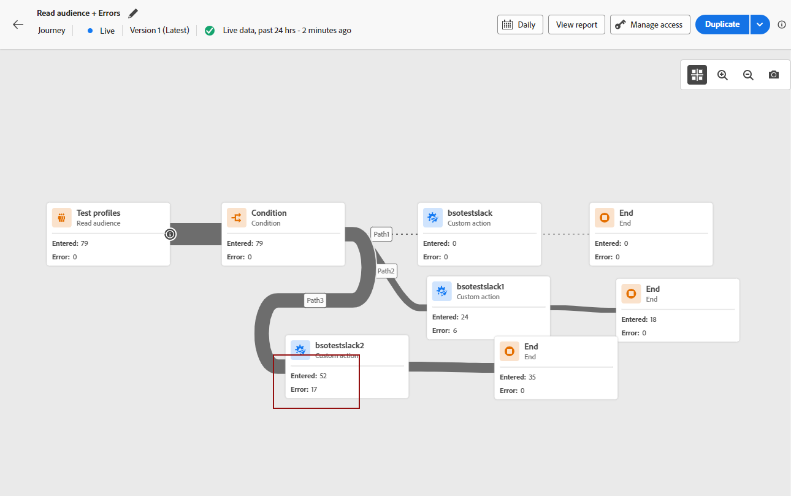

# Notes de mise à jour {#release-notes}

>[!CONTEXTUALHELP]
>id="ajo_homepage_card1"
>title="Nouveautés"
>abstract="**Adobe Journey Optimizer** offre en permanence de nouvelles fonctionnalités, des améliorations aux fonctionnalités existantes et des correctifs. Toutes les modifications sont consolidées la dernière semaine de chaque mois dans ces notes de mise à jour."

[!DNL Adobe Journey Optimizer] offre en permanence de nouvelles fonctionnalités, des améliorations aux fonctionnalités existantes et des correctifs. Toutes les modifications sont consolidées la dernière semaine de chaque mois dans ces notes de mise à jour.

[!DNL Adobe Journey Optimizer] est créé de manière native sur [!DNL Adobe Experience Platform] et hérite de ses dernières innovations et améliorations. En savoir plus sur ces modifications dans les [Notes de mise à jour d’Adobe Experience Platform](https://experienceleague.adobe.com/docs/experience-platform/release-notes/latest.html?lang=fr){target="_blank"}.

 Inscrivez-vous à la [newsletter trimestrielle d’Adobe Journey Optimizer](https://www.adobe.com/subscription/Adobe_Journey_Optimizer_NL.html){target="_blank"} dès aujourd’hui, et recevez les dernières mises à jour produits, les articles les plus intéressants, des cas pratiques, des conseils et bien plus encore, directement dans votre boîte de réception, tous les trimestres.

## Mises à jour de mai {#may-updates}

**Date de disponibilité**: 7 mai 2024

<table>
<thead>
<tr>
<th><strong>Prise de décision basée sur l’expérience - Disponibilité limitée</strong> </th>
</tr>
</thead>
<tbody>
<tr>
<td>

Experience Decisioning simplifie la personnalisation en offrant un catalogue centralisé d’offres marketing connues sous le nom d’« éléments de décision » et un moteur de décision sophistiqué. Ce moteur tire parti des règles et des critères de classement pour sélectionner et présenter les éléments de décision les plus pertinents à chaque individu.

Ces éléments de décision sont intégrés de manière transparente à un large éventail de surfaces entrantes grâce au nouveau canal d’expérience basé sur le code, désormais accessible dans les campagnes Journey Optimizer. Les stratégies de décision de prise de décision d’expérience ne peuvent être utilisées que dans des campagnes d’expérience basées sur du code.

Cette prise de décision basée sur l’expérience n’est actuellement disponible que pour un ensemble d’organisations (disponibilité limitée). Pour en bénéficier, contactez votre représentant ou représentante Adobe.

Pour plus d’informations, consultez la <a href="../experience-decisioning/gs-experience-decisioning.md">documentation détaillée</a>.

</td>
</tr>
</tbody>
</table>

De la version bêta à la version LA, les améliorations suivantes ont été ajoutées :

* **Prise de décision d’expérience + expériences basées sur le code (LA)**: vous pouvez désormais utiliser la fonction de prise de décision d’expérience pour utiliser des éléments de décision dans vos campagnes basées sur du code. Remarque : Le canal d’expérience basé sur le code et la prise de décision sur l’expérience ne sont pas disponibles pour les organisations qui ont acheté les offres complémentaires Adobe Healthcare Shield et Privacy and Security Shield. [En savoir plus](../code-based/get-started-code-based.md)
* Vous pouvez désormais exploiter les données contextuelles de Adobe Experience Platform dans vos règles de décision et vos formules de classement. [En savoir plus](../experience-decisioning/context-data.md)
* Une nouvelle autorisation « Gérer les décisions basées sur l’expérience » est désormais disponible pour la ressource Gestion des décisions. Il vous permet de gérer les droits liés à Experience Decisioning. [En savoir plus](../experience-decisioning/gs-experience-decisioning.md)
* Vous pouvez désormais ajouter plusieurs règles de limitation pour un élément de décision donné dans la prise de décision basée sur l’expérience. Cela vous permet d’augmenter le niveau de contrôle sur la manière dont les offres sont envoyées. [En savoir plus](../experience-decisioning/items.md#capping)
* Vous pouvez désormais créer des tableaux de bord de rapports personnalisés pour les campagnes Experience Decisioning à l’aide de [!DNL Customer Journey Analytics]. [En savoir plus](../experience-decisioning/cja-reporting.md)

## Notes de mise à jour d’avril 2024 {#apr-2024}

**Date de publication** : 2 mai 2024

### Nouvelles fonctionnalités {#apr-features}

<!--table>
<thead>
<tr>
<th><strong>Business rules - Private Beta</strong> </th>
</tr>
</thead>
<tbody>
<tr>
<td>

It is now possible to create and apply rule sets to your marketing communications.  

</td>
</tr>
</tbody>
</table-->

<!--table>
<thead>
<tr>
<th><strong>Personalization - Local Lookups - Multi-Entity Support - Beta</strong> </th>
</tr>
</thead>
<tbody>
<tr>
<td>

TBD

</td>
</tr>
</tbody>
</table-->

Cette version apporte les nouvelles fonctionnalités détaillées ci-dessous.

<table>
<thead>
<tr>
<th><strong>MMS (service de messagerie multimédia) - tous les fournisseurs</strong> </th>
</tr>
</thead>
<tbody>
<tr>
<td>

Avec le canal SMS, vous pouvez maintenant améliorer votre communication en envoyant des MMS, ce qui vous permet de partager des images, des GIF ou des vidéos avec vos clientes et clients. Initialement disponibles uniquement avec Sinch, les MMS sont désormais également pris en charge par Infobip et Twilio.

</td>
</tr>
</tbody>
</table>

<table>
<thead>
<tr>
<th><strong>Amélioration du concepteur de parcours et des rapports dynamiques</strong> </th>
</tr>
</thead>
<tbody>
<tr>
<td>

Dans cette version, nous avons amélioré l’interface d’utilisation de la zone de travail de parcours afin d’offrir une expérience client plus intuitive et efficace. Les activités sont plus claires et présentent plus d’informations sur la zone de travail de parcours avec moins de clics.

Outre la conception améliorée de la zone de travail de parcours, vous pouvez désormais afficher les mesures de création de rapports pour les dernières 24 heures directement dans la zone de travail de parcours. 

<strong>Note</strong> : ces modifications seront progressivement déployées dans tous les environnements à compter de la version d’avril.

Pour plus d’informations, consultez la <a href="new-canvas.md">documentation détaillée</a>.

</td>
</tr>
</tbody>
</table>

<!-- table>
<thead>
<tr>
<th><strong>AI Assistant - Experience Variant Generation - Beta</strong> </th>
</tr>
</thead>
<tbody>
<tr>
<td>

Once you have created and personalized your message, take your content to the next level with the AI assistant. You can now use the AI assistant to optimize your message's impact by experimenting with different main titles, and images. Each variant is managed as a unique Treatment, to measure and compare which title effectively generates more clicks.

</td>
</tr>
</tbody>
</table-->

<!--table>
<thead>
<tr>
<th><strong>IP Warmup Workflow - LA</strong> </th>
</tr>
</thead>
<tbody>
<tr>
<td>

You can now easily perform IP warmup workflows directly from the Journey Optimizer interface in a standardized and efficient way that follows the best practices for optimal deliverability.

</td>
</tr>
</tbody>
</table-->

<!--table>
<thead>
<tr>
<th><strong>Email Surface Personalization - Private beta </strong> </th>
</tr>
</thead>
<tbody>
<tr>
<td>

You can now define dynamic subdomains and personalized header parameters when creating email channel surfaces, for increased flexibility and control over your email settings.

</td>
</tr>
</tbody>
</table-->

### Améliorations {#apr-improvements}

Cette version est fournie avec les améliorations répertoriées ci-dessous.

<!--
* **Expression Fragments supported for Web and In-App**: Expression fragments are now available for the Web and In-app channels. 
-->

<!--
* **DULE for AJO Channel Surface**: It is now possible to apply a label on certain profile attributes to restrict their usage inside a channel surface through marketing actions.
-->

<!--
* **List-Unsubscribe updates**: Following on the recent Gmail and Yahoo announcements for bulk senders, Journey Optimizer supports the "post/1-click" List-Unsubscribe option. 
-->

**Configuration**

* Vous pouvez désormais sélectionner une action marketing au niveau de la surface de canal. Lorsqu’elles sont utilisées en surface, toutes les stratégies de consentement associées à cette action marketing sont exploitées afin de respecter les préférences de vos clients. [En savoir plus](../action/consent.md#surface-marketing-actions)
* L’utilisation du contrôle d’accès au niveau de l’objet est désormais disponible pour les surfaces de canal. [En savoir plus](../configuration/channel-surfaces.md#create-channel-surface)
* Lors de l’activation du désabonnement de la liste dans une surface de canal, vous pouvez maintenant définir le niveau de consentement pour vous aligner sur la manière dont vous gérez le consentement de toutes les autres sources. [En savoir plus](../email/email-settings.md#list-unsubscribe)

**Gestion de contenu**

* Vous pouvez désormais simuler des modèles de contenu pour tous les canaux. [En savoir plus](../content-management/content-templates.md#test-templates).

**Personnalisation**

* La nouvelle **toInt** La fonction d’assistance est disponible dans l’éditeur d’expression. Il vous permet de convertir n’importe lequel de ces types (nombre, double, entier, long, flottant, court, octet, booléen, chaîne) en entier. [En savoir plus](../personalization/functions/math.md#to-int)
