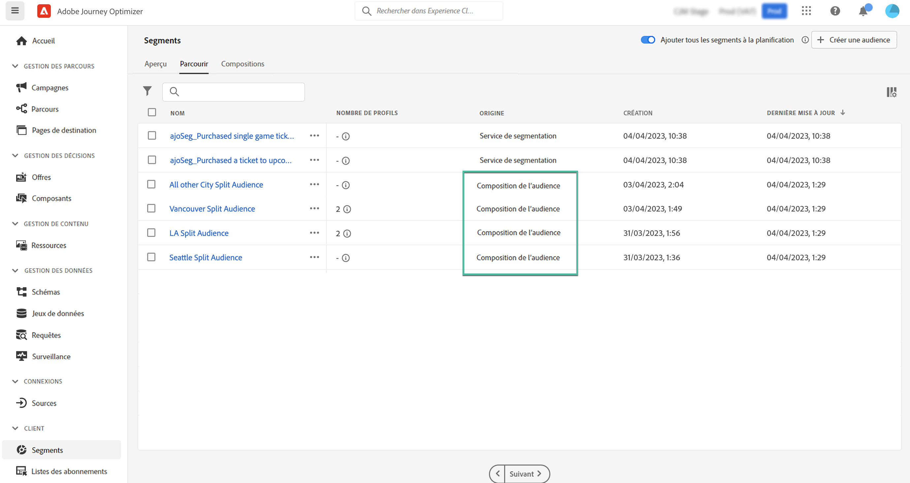

# Accéder aux audiences et les gérer {#access-manage-audiences}

Les audiences sont accessibles depuis l’onglet **[!UICONTROL Audiences]** du menu **[!UICONTROL Segments]**.

>[!IMPORTANT]
>
>Pour l’instant, les audiences issues des workflows de composition ne peuvent pas être ciblées dans Journey Optimizer.

Cet onglet répertorie toutes les audiences stockées dans Adobe Experience Platform. Les audiences créées à l’aide de compositions d’audience sont identifiables à leur origine **[!UICONTROL Composition de l’audience]**.

>[!NOTE]
>
>Pour plus d’informations sur les autres types d’audiences disponibles dans Adobe Experience Platform, reportez-vous à la [documentation de Segmentation Service](https://experienceleague.adobe.com/docs/experience-platform/segmentation/ui/overview.html?lang=fr).

La colonne **[!UICONTROL Nombre de profils]** fournit des informations sur le nombre de profils inclus dans une audience. Cliquez sur le bouton « i » pour plus d’informations sur la date de calcul de cette information.

Pour attribuer des libellés d’utilisation des données personnalisées ou de base à une audience, cliquez sur le bouton représentant des points de suspension, puis sélectionnez **[!UICONTROL Gérer l’accès]**. [En savoir plus sur le contrôle d’accès au niveau de l’objet (OLA)](../administration/object-based-access.md)

<!--
-edit an audience?
-->

En savoir plus :

* [Prise en main de la composition des audiences](get-started-audience-orchestration.md)
* [Créer des workflows de composition](create-compositions.md)
* [Utiliser la zone de travail de composition](composition-canvas.md)
