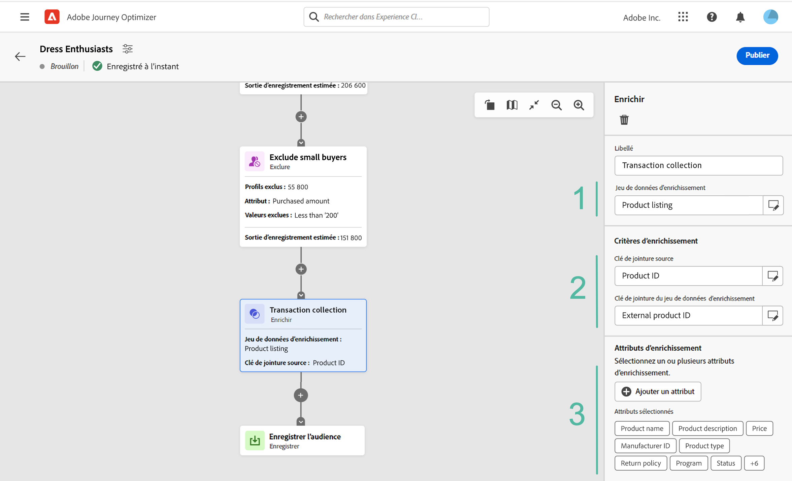

# Utiliser la zone de travail de composition {#composition-canvas}

>[!BEGINSHADEBOX]

Ce que vous trouverez dans cette documentation :

* [Prise en main de la composition des audiences](get-started-audience-orchestration.md)
* [Créer votre premier workflow de composition](create-compositions.md)
* **[Utiliser la zone de travail de composition](composition-canvas.md)**
* [Accéder aux audiences et les gérer](access-audiences.md)

>[!ENDSHADEBOX]

La composition de l’audience fournit un canevas visuel qui vous permet de créer des audiences et d’utiliser diverses activités (division, enrichissement, etc.).

Les étapes de composition d’une audience dans la zone de travail sont les suivantes :

1. [Définir votre/vos audience(s) de départ](#starting-audience)
1. [Ajouter une ou plusieurs activités](#action-activities)
1. [Enregistrer les résultats dans une nouvelle audience](#save)

## Sélectionner l’audience de départ {#starting-audience}

La première étape pour créer une composition consiste à sélectionner une ou plusieurs audiences existantes comme base de votre composition.

1. Sélectionnez l’activité **[!UICONTROL Audience]**, puis fournissez un libellé pour l’activité.

1. Choisissez l’audience à cibler :

   * Cliquez sur le bouton **[!UICONTROL Ajouter une audience]** pour sélectionner une ou plusieurs audiences existantes,
   * Cliquez sur le bouton **[!UICONTROL Créer une règle]** pour créer une définition de segment à l’aide du [service de segmentation ](https://experienceleague.adobe.com/docs/experience-platform/segmentation/ui/overview.html?lang=fr).

   

1. Si vous sélectionnez plusieurs audiences, indiquez comment les profils de ces audiences doivent être fusionnés :

* **[!UICONTROL Union]** : inclure tous les profils des audiences sélectionnées,
* **[!UICONTROL Intersection]** : inclure des profils communs à toutes les audiences sélectionnées,
* **[!UICONTROL Exclure le chevauchement]** : inclure des profils qui appartiennent à l’une des audiences uniquement. Les profils appartenant à plusieurs audiences ne seront pas inclus.

Dans cet exemple, nous allons cibler tous les profils appartenant aux audiences Gold et Silver.

Une fois les audiences sélectionnées, le nombre estimé de profils s’affiche au bas de l’activité.

## Ajouter des activités {#action-activities}

Ajoutez des activités après avoir sélectionné l’audience de départ afin d’affiner votre sélection.

Pour cela, cliquez sur le bouton + du chemin de composition, puis sélectionnez l’activité souhaitée. Le volet de droite s’ouvre, vous permettant de configurer l’activité nouvellement ajoutée.

Les activités disponibles sont les suivantes :

* [Audience](#audience) : inclure des profils supplémentaires appartenant à une ou plusieurs audiences existantes,
* [Exclure](#exclude) : exclure les profils appartenant à une audience existante ou exclure les profils en fonction d’attributs spécifiques,
* [Enrichir]{#enrich}: enrichir votre audience avec des attributs supplémentaires issus des jeux de données Adobe Experience Platform,
* [Classement](#rank) : classer les profils en fonction d’un attribut spécifique, spécifier le nombre de profils à conserver et les inclure dans votre composition,
* [Partager](#split) : diviser votre composition en plusieurs chemins d’accès en fonction de pourcentages aléatoires ou d’attributs.

Vous pouvez ajouter autant d’activités **[!UICONTROL Audience]** et **[!UICONTROL Exclure]** que vous le souhaitez à votre composition. Toutefois, aucune activité supplémentaire ne peut être ajoutée après les activités **[!UICONTROL Classement]** et **[!UICONTROL Partager]**.

Vous pouvez à tout moment supprimer une activité de la zone de travail en cliquant sur le bouton Supprimer dans le volet de droite.  Si l’activité que vous souhaitez supprimer est un parent d’autres activités de la composition, un message s’affiche, vous permettant de spécifier si vous souhaitez supprimer uniquement l’activité sélectionnée ou toutes ses activités enfants.

### Activité Audience {#audience}

>[!CONTEXTUALHELP]
>id="ajo_ao_audience"
>title="Activité Audience"
>abstract="L’activité Audience permet d’inclure dans votre composition des profils supplémentaires appartenant à une audience existante."

>[!CONTEXTUALHELP]
>id="ajo_ao_merge_types"
>title="Types de fusion"
>abstract="Indiquez le mode de fusion des profils des audiences sélectionnées."

L’activité **[!UICONTROL Audience]** vous permet d’inclure dans votre composition des profils supplémentaires appartenant à une audience existante.

La configuration de cette activité est identique à celle de l’[activité Audience](#starting-audience) de départ.

### Exclure l’activité {#exclude}

>[!CONTEXTUALHELP]
>id="ajo_ao_exclude_type"
>title="Type d’exclusion"
>abstract="Utilisez le type Exclure l’audience pour exclure les profils appartenant à une audience existante. Le type Exclure en utilisant l’attribut permet d’exclure des profils en fonction d’un attribut spécifique."

>[!CONTEXTUALHELP]
>id="ajo_ao_exclude"
>title="Exclure l’activité"
>abstract="L’activité Exclure permet d’exclure des profils de votre composition en sélectionnant une audience existante ou en utilisant une règle."

L’activité **[!UICONTROL Exclure]** vous permet d’exclure des profils de votre composition. Deux types d’exclusions sont disponibles :

* **[!UICONTROL Exclure l’audience]** : exclure les profils appartenant à une audience existante.

   Cliquez sur le bouton **[!UICONTROL Ajouter une audience]** puis sélectionnez l’audience à exclure.

   

* **[!UICONTROL Exclure en utilisant l’attribut]** : exclure des profils en fonction d’un attribut spécifique.

   Sélectionnez l’attribut à rechercher, puis spécifiez la valeur à exclure. Dans cet exemple, nous excluons des profils de composition dont l’adresse de domicile est au Japon.

   

### Enrichir {#enrich}

>[!CONTEXTUALHELP]
>id="ajo_ao_enrich"
>title="Activité d’enrichissement"
>abstract="Utilisez l&#39;activité Enrichir pour exclure les profils appartenant à une audience existante. Le type Exclure en utilisant l’attribut permet d’exclure des profils en fonction d’un attribut spécifique."

>[!CONTEXTUALHELP]
>id="ajo_ao_enrich_dataset"
>title="Jeu de données d’enrichissement"
>abstract="Sélectionnez le jeu de données d’enrichissement contenant les données que vous souhaitez associer à l’audience."

>[!CONTEXTUALHELP]
>id="ajo_ao_enrich_criteria"
>title="Critères d&#39;enrichissement"
>abstract="Sélectionnez les champs à utiliser comme clé de réconciliation entre le jeu de données source, c’est-à-dire l’audience, et le jeu de données d’enrichissement."

>[!CONTEXTUALHELP]
>id="ajo_ao_enrich_attributes"
>title="Attributs d’enrichissement"
>abstract="Sélectionnez un ou plusieurs attributs du jeu de données d’enrichissement à associer à l’audience. Une fois la composition publiée, ces attributs sont associés à l&#39;audience et peuvent être utilisés dans les campagnes pour personnaliser les diffusions."

Le **[!UICONTROL Enrichir]** activité vous permet d’enrichir votre audience avec des attributs supplémentaires provenant de jeux de données Adobe Experience Platform. Par exemple, vous pouvez ajouter des informations relatives au produit acheté, telles que son nom, son prix ou son identifiant de fabricant, et exploiter ces informations pour personnaliser les diffusions envoyées à l’audience.

>[!IMPORTANT]
>
>Pour l’instant, les libellés du jeu de données, au niveau du jeu de données ou au niveau du champ, ne sont pas propagés à l’audience nouvellement créée. Cela peut avoir une incidence sur le contrôle d’accès et/ou la gouvernance des données pour l’audience obtenue. Pour cette raison, utilisez uniquement les données de test lors de la composition d’audiences.

Pour configurer l’activité, procédez comme suit :

1. Sélectionnez la **[!UICONTROL Jeu de données d’enrichissement]** contenant les données que vous souhaitez associer à l’audience.

1. Dans le **[!UICONTROL Critères d&#39;enrichissement]** , sélectionnez les champs à utiliser comme clé de réconciliation entre le jeu de données source, c’est-à-dire l’audience, et le jeu de données d’enrichissement. Dans cet exemple, nous utilisons l’identifiant du produit acheté comme clé de réconciliation.

1. Cliquez sur le bouton **[!UICONTROL Ajout d’attributs]** puis sélectionnez un ou plusieurs attributs du jeu de données d’enrichissement à associer à l’audience.

   

Une fois la composition publiée, les attributs sélectionnés sont associés à l&#39;audience et peuvent être utilisés dans les campagnes pour personnaliser les diffusions.

### Activité Classement {#rank}

>[!CONTEXTUALHELP]
>id="ajo_ao_ranking"
>title="Activité de classement"
>abstract="L’activité Classement vous permet de classer les profils en fonction d’un attribut spécifique et de les inclure dans votre composition. Par exemple, incluez les 50 profils présentant le plus grand nombre de points de fidélité."

>[!CONTEXTUALHELP]
>id="ajo_ao_rank_profilelimit_text"
>title="Ajouter une limite de profil"
>abstract="Activez cette option pour spécifier un nombre maximum de profils à inclure dans la composition."

L’activité **[!UICONTROL Classement]** vous permet de classer les profils en fonction d’un attribut spécifique et de les inclure dans votre composition. Vous pouvez, par exemple, inclure les 50 profils présentant le plus grand nombre de points de fidélité.

1. Sélectionnez l’attribut que vous souhaitez rechercher et indiquez un ordre de classement (ascendant ou descendant).

   >[!NOTE]
   >
   >Vous pouvez sélectionner des attributs avec les types de données suivants : entiers, nombres, courts <!--(other?)-->

1. Activez l’option **[!UICONTROL Ajouter une limite de profil]** et indiquez un nombre maximum de profils à inclure dans la composition.

   

### Activité Partage {#split}

<!-- [!CONTEXTUALHELP]
>id="ajo_ao_control_group_text"
>title="Control Group"
>abstract="Use control groups to isolate a portion of the profiles. This allows you to measure the impact of a marketing activity and make a comparison with the behavior of the rest of the population."-->

>[!CONTEXTUALHELP]
>id="ajo_ao_split"
>title="Activité Partage"
>abstract="L’activité Partage permet de diviser votre composition en plusieurs chemins d’accès. Lors de la publication de la composition, une audience est enregistrée dans Adobe Experience Platform pour chaque chemin d’accès."

>[!CONTEXTUALHELP]
>id="ajo_ao_split_type"
>title="Type Partage"
>abstract="Utilisez le type Partage en pourcentage pour partager les profils de manière aléatoire en plusieurs chemins d’accès. Le type de partage des attributs permet de partager les profils en fonction d’un attribut spécifique."

>[!CONTEXTUALHELP]
>id="ajo_ao_split_otherprofiles_text"
>title="Autres profils"
>abstract="Activez cette option pour créer un chemin d’accès supplémentaire avec les profils restants qui ne correspondent à aucune des conditions spécifiées dans les autres chemins d’accès."

L’activité **[!UICONTROL Partage]** vous permet de diviser votre composition en plusieurs chemins d’accès.

Cette opération ajoute automatiquement une activité **[!UICONTROL Enregistrer]** à la fin de chaque chemin d’accès. Lors de la publication de la composition, une audience est enregistrée dans Adobe Experience Platform pour chaque chemin d’accès.

Deux types d’opérations de partage sont disponibles :

* **[!UICONTROL Partage en pourcentage]** : il s’agit de partager les profils de manière aléatoire en deux ou plusieurs chemins d’accès. Par exemple, vous pouvez fractionner les profils en 2 chemins distincts de 50 % chacun. <!--and add an additional path for control group.-->

   

* **[!UICONTROL Partage d’attributs]** : il s’agit de partager les profils en fonction d’un attribut spécifique. Dans cet exemple, nous partagerons les profils en fonction de leurs préférences de type de chambre.

   

   >[!NOTE]
   >
   >L’option **[!UICONTROL Autres profils]** vous permet de créer un chemin d’accès supplémentaire avec les profils restants qui ne correspondent à aucune des conditions spécifiées dans les autres chemins d’accès.

## Enregistrer vos audiences {#save}

Configurez les audiences qui seront enregistrées dans Adobe Experience Platform.

Pour ce faire, sélectionnez l’activité **[!UICONTROL Enregistrer l’audience]** à la fin de chaque chemin d’accès, puis spécifiez le nom de la nouvelle audience à créer.

Une fois votre composition prête, vous pouvez la publier. [Découvrez comment créer des compositions.](create-compositions.md)
