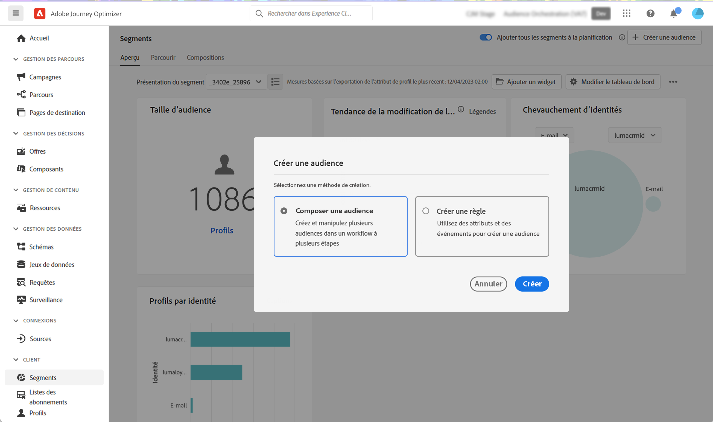
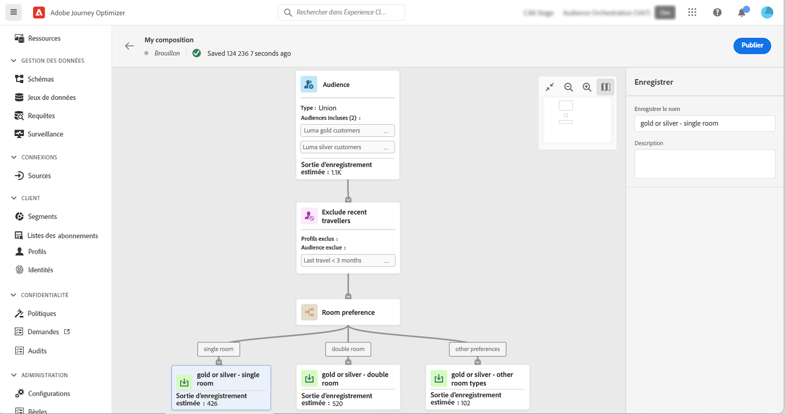
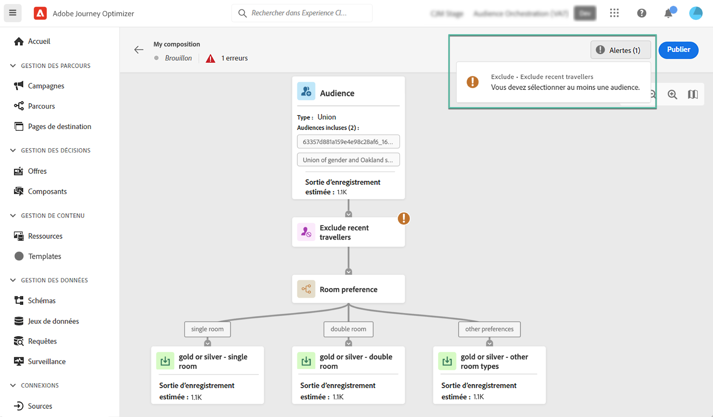
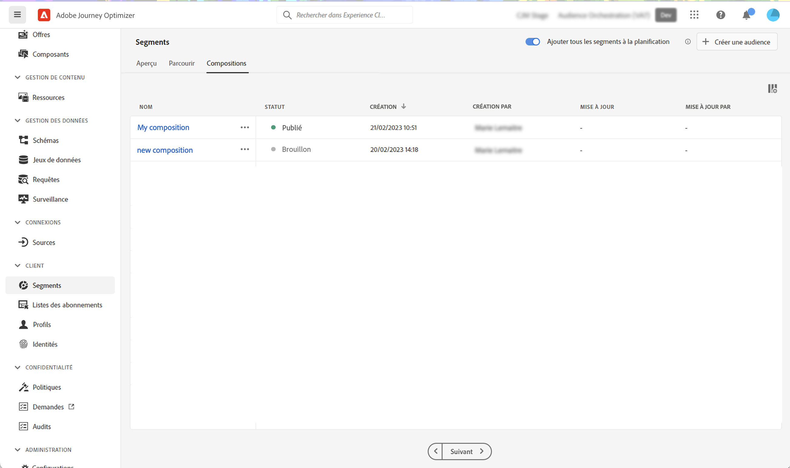

# Création de workflows de composition {#create-compositions}

Les workflows de composition vous permettent de combiner et d’organiser des audiences existantes pour créer de nouvelles audiences.

## Créer un workflow de composition {#create}

1. Accédez au **[!UICONTROL Segments]** et sélectionnez **[!UICONTROL Création d’une audience]**.

1. Sélectionner **[!UICONTROL Composer l’audience]**.

   >[!NOTE]
   >
   >Le **[!UICONTROL Créer une règle]** La méthode de création vous permet de créer une définition de segment à l’aide de la méthode [Segmentation Service](https://experienceleague.adobe.com/docs/experience-platform/segmentation/ui/overview.html?lang=fr).

   

1. Le canevas de composition s’affiche avec deux activités par défaut :

   * **[!UICONTROL Audience]**: le point de départ de votre composition. Cette activité permet de sélectionner une ou plusieurs audiences comme base de votre workflow,

   * **[!UICONTROL Enregistrer]**: la dernière étape de votre composition. Cette activité permet d&#39;enregistrer le résultat de votre workflow dans une nouvelle audience.
   Pour plus d’informations sur la configuration des activités dans la zone de travail du workflow de composition, reportez-vous à la section [Utilisation du canevas de composition](composition-canvas.md).

1. Sélectionnez la **[!UICONTROL Audience]** activité , puis spécifiez un libellé pour votre composition.

   >[!IMPORTANT]
   >
   >Le **[!UICONTROL Audience]** le libellé de l’activité est le libellé de votre composition. Veillez à fournir un nom significatif pour récupérer plus facilement la composition dans la liste.

   

1. Configurez votre composition en ajoutant autant d’activités que nécessaire entre le **[!UICONTROL Audience]** et **[!UICONTROL Enregistrer]** activités. [Découvrez comment utiliser le canevas de composition](composition-canvas.md)

   

1. Une fois votre composition prête, cliquez sur le bouton [**!UICONTROL Publish]Bouton ** pour publier la composition et enregistrer les audiences obtenues dans Adobe Experience Platform.

   Si une erreur se produit lors de la publication, des alertes s’affichent avec des informations sur la façon de résoudre le problème.

   

1. La composition est publiée. Les audiences qui en résultent sont enregistrées dans Adobe Experience Platform. <!-- and are ready to be targeted in Journey Optimizer campaigns. [Get started with campaigns](../campaigns/get-started-with-campaigns.md)-->

## Accéder aux compositions {#access}

>[!CONTEXTUALHELP]
>id="ajo_ao_publish"
>title="Publier votre audience"
>abstract="Publiez votre composition pour enregistrer les audiences qui en résultent dans Adobe Experience Platform."

Toutes les compositions créées sont accessibles à partir du **[!UICONTROL Compositions]** . Ils peuvent avoir plusieurs états :

* **[!UICONTROL Version préliminaire]**: la composition est en cours et n’a pas été publiée.
* **[!UICONTROL Publié]**: la composition a été publiée, les audiences qui en résultent ont été enregistrées. <!-- and are available for use.-->
* **[!UICONTROL Archivé]**: la composition a été archivée.

>[!NOTE]
>
>Vous pouvez dupliquer ou supprimer une composition existante à tout moment à l’aide du bouton représentant une ellipse dans la liste.

En savoir plus:

* [Prise en main de la composition de l’audience](get-started-audience-orchestration.md)
* [Utilisation du canevas de composition](composition-canvas.md)
* [Accès et gestion des audiences](access-audiences.md)
