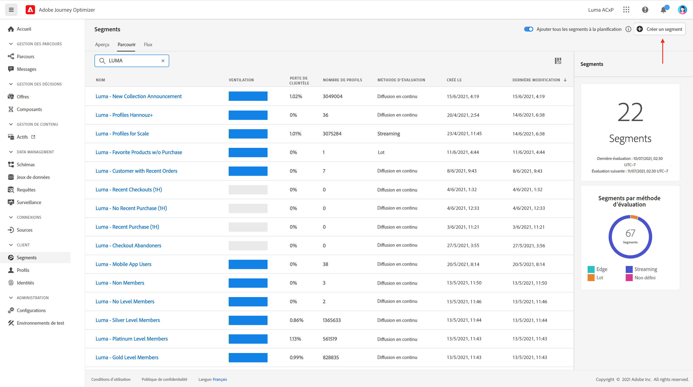
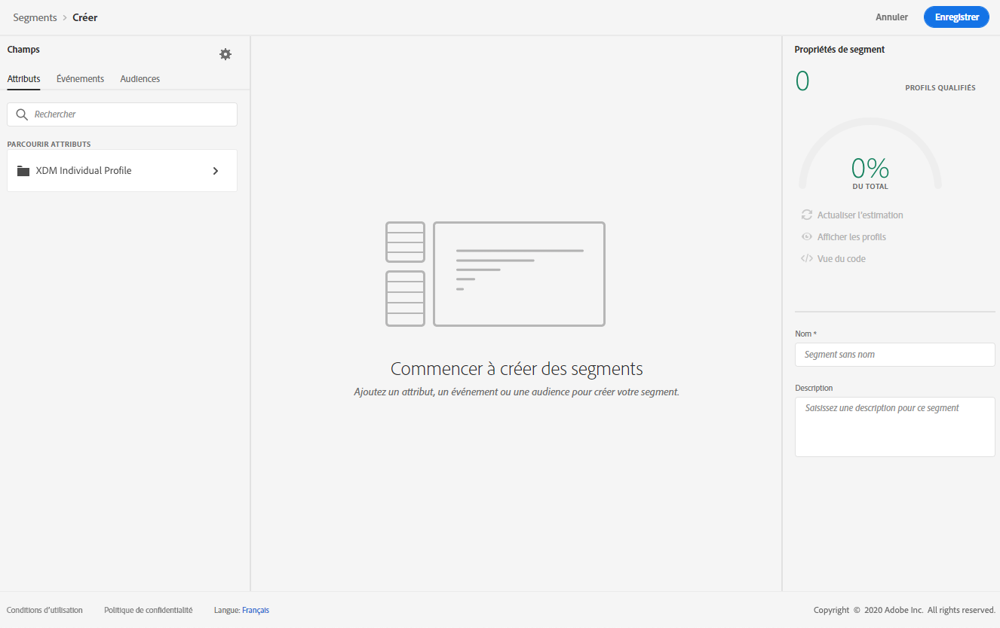
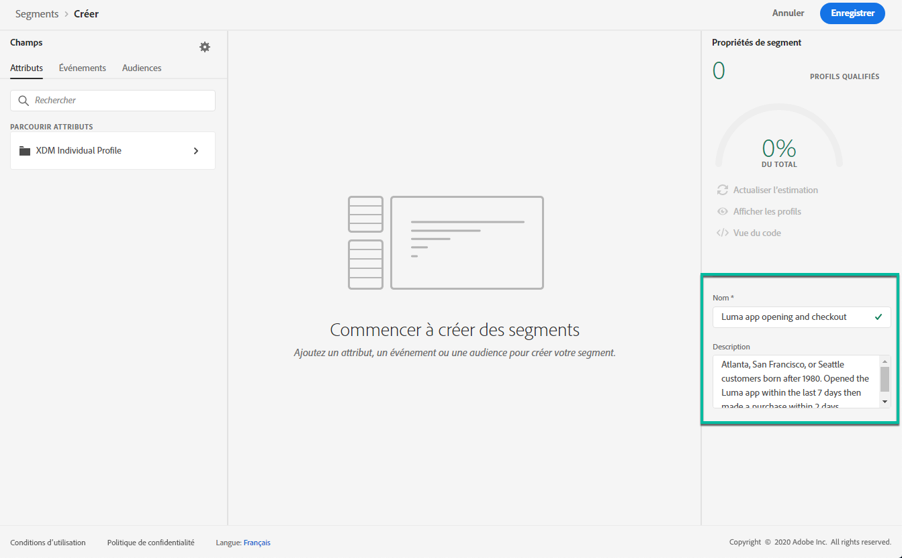
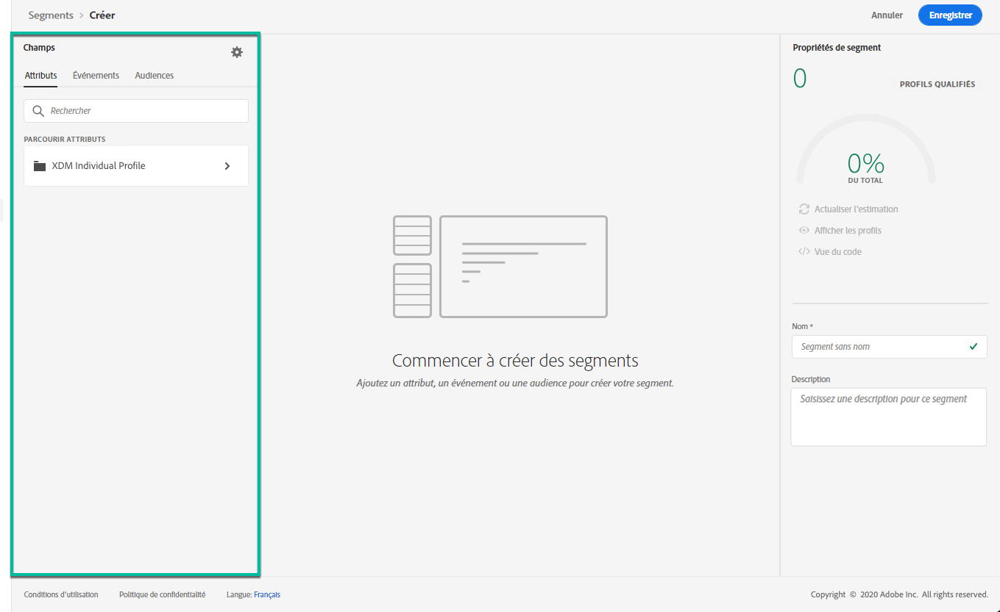
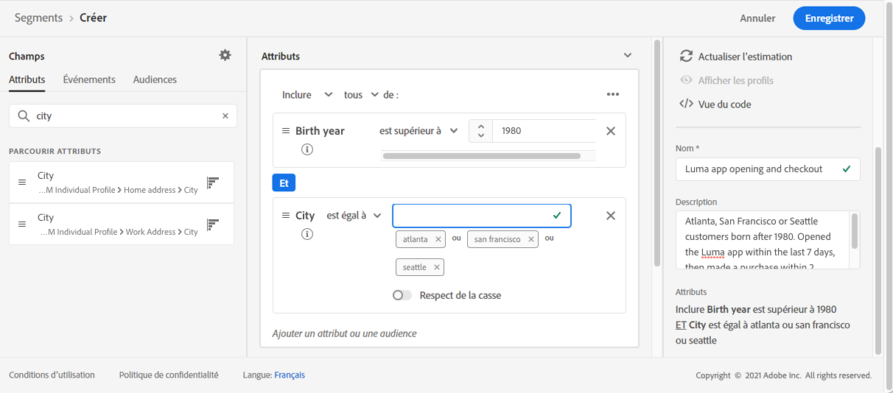
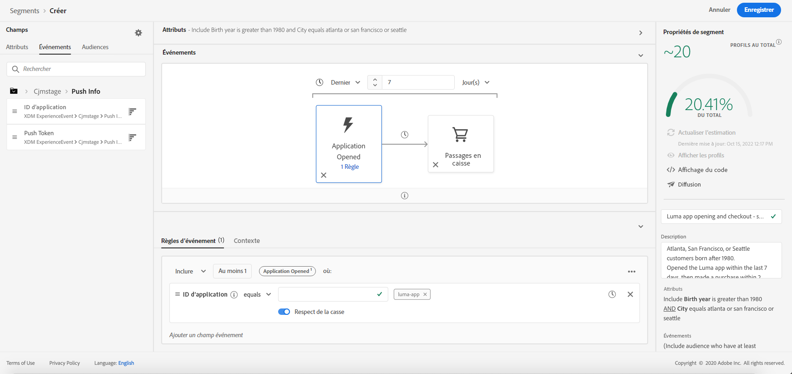
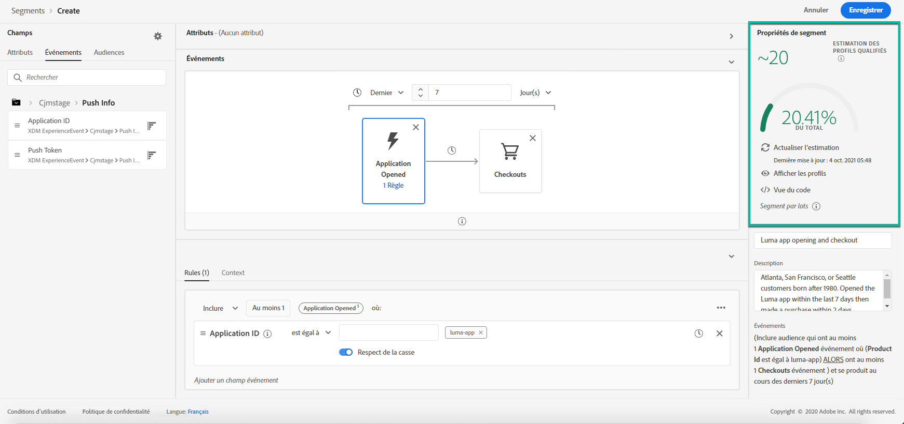

# Création de segments {#build-segments}

Dans cet exemple, nous allons créer un segment pour cibler tous les clients résidant à Atlanta, San Francisco ou Seattle et nés après 1980. Tous ces clients doivent avoir ouvert l&#39;application Luma dans les 7 derniers jours, puis fait un achat dans les 2 heures suivant l&#39;ouverture de l&#39;application.

➡️ [Découvrez comment créer des segments dans cette vidéo](#video-segment)

1. Accédez au menu **[!UICONTROL Segments]**, puis cliquez sur le bouton **[!UICONTROL Créer un segment]**.

   

   L’écran de définition de segment vous permet de configurer tous les champs à paramétrer. Découvrez comment configurer des segments dans la [documentation du service de segmentation](https://experienceleague.adobe.com/docs/experience-platform/segmentation/ui/overview.html?lang=fr){target=&quot;_blank&quot;}.

   

1. Dans le volet **[!UICONTROL Propriétés de segment]**, indiquez un nom et une description (facultatif) pour le segment.

   

1. Réalisez un glisser-déposer dans les champs de votre choix depuis le volet de gauche vers l’espace de travail central, puis configurez-les en fonction de vos besoins.

   >[!NOTE]
   >
   >Notez que les champs disponibles dans le volet de gauche varient selon la configuration des schémas **profil individuel XDM** et **XDM ExperienceEvent** pour votre organisation.  Pour en savoir plus, consultez la [documentation du modèle de données d’expérience (XDM)](https://experienceleague.adobe.com/docs/experience-platform/xdm/home.html?lang=fr){target=&quot;_blank&quot;}.

   

   Dans cet exemple, nous devons nous baser sur les champs **Attributs** et **Événements** pour créer le segment :

   * **Attributs** : profils qui vivent à Atlanta, San Francisco ou Seattle, nés après 1980

      

   * **Événements** : profils qui ont ouvert l&#39;application Luma au cours des 7 derniers jours, puis effectué un achat dans les 2 heures suivant l&#39;ouverture de l&#39;application.

      

1. À mesure que vous ajoutez et configurez de nouveaux champs dans l&#39;espace de travail, le volet **[!UICONTROL Propriétés du segment]** est automatiquement mis à jour avec des informations sur l&#39;estimation des profils appartenant au segment.

   

1. Une fois le segment prêt, cliquez sur **[!UICONTROL Enregistrer]**. Il s’affiche dans la liste des segments Adobe Experience Platform. Notez qu’une barre de recherche est disponible pour vous aider à rechercher un segment spécifique dans la liste.

Le segment peut désormais être utilisé dans vos parcours. Voir à ce propos [cette section](../segment/about-segments.md).

## Vidéo pratique{#video-segment}

Découvrez comment créer des segments.

>[!VIDEO](https://video.tv.adobe.com/v/334281?quality=12)
