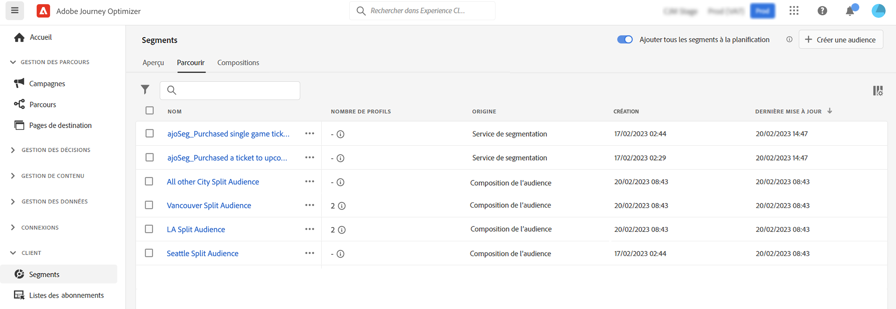

# Prise en main de la composition des audiences {#get-start-audience-composition}

>[!CONTEXTUALHELP]
>id="ajo_ao_create_composition"
>title="Créer une composition"
>abstract="Créez un workflow de composition afin de combiner les audiences d’Adobe Experience Platform existantes dans une zone de travail visuelle et d’exploiter diverses activités (telles que le partage, l’exclusion…) pour créer de nouvelles audiences."

>[!BEGINSHADEBOX]

Cette documentation couvre les sujets suivants :

* **[Prise en main de la composition de l’audience](get-started-audience-orchestration.md)**
* [Créer votre premier workflow de composition](create-compositions.md)
* [Utiliser la zone de travail de composition](composition-canvas.md)
* [Accéder aux audiences et les gérer](access-audiences.md)

>[!ENDSHADEBOX]

>[!AVAILABILITY]
>
>Actuellement, la composition de l’audience n’est disponible que pour un groupe limité de clientes et de clients. Contactez votre représentant ou représentante Adobe si vous avez des questions.

La composition de l’audience vous permet de créer des **workflows de composition**, où vous pouvez combiner des audiences d’Adobe Experience Platform existantes en une zone de travail visuelle et exploiter diverses activités (telles que le partage, l’exclusion...) pour créer de nouvelles audiences.

Une fois créées, les **audiences obtenues** sont enregistrés dans Adobe Experience Platform avec les audiences existantes et peuvent être utilisées pour cibler les clientes et clients dans les [campagnes Journey Optimizer](../campaigns/get-started-with-campaigns.md), ou dans les destinations Adobe [Real-time Customer Data Platform](https://experienceleague.adobe.com/docs/experience-platform/destinations/home.html?lang=fr){target="_blank"}.

>[!IMPORTANT]
>
>Pour l’instant, les audiences créées dans les workflows de composition ne sont pas disponibles dans les parcours.
>
>Les campagnes Adobe Journey Optimizer ne sont pas encore intégrées au service d’application de politique. Par conséquent, les libellés d’utilisation des données que vous appliquez à vos attributs d’audience ne sont pas implémentés dans les campagnes Journey Optimizer.

La composition de l’audience est accessible à partir du menu **[!UICONTROL Segments]** d’Adobe Journey Optimizer :

* L’onglet **[!UICONTROL Vue d’ensemble]** se compose d’un tableau de bord dédié avec des mesures clés liées aux données de segment de votre organisation. Pour en savoir plus, consultez le [guide des tableaux de bord d’Adobe Experience Platform](https://experienceleague.adobe.com/docs/experience-platform/dashboards/guides/segments.html?lang=fr).

* L’onglet **[!UICONTROL Parcourir]** répertorie toutes les audiences existantes stockées dans Adobe Experience Platform.

* L’onglet **[!UICONTROL Compositions]** vous permet de créer des workflows de composition dans lesquels vous pouvez combiner et organiser des audiences pour en créer de nouvelles.

Cliquez sur chaque vignette pour découvrir comment utiliser la composition de l’audience :

<table style="table-layout:fixed"><tr style="border: 0;">
<td>

<a href="create-compositions.md"><strong>Créer votre premier workflow de composition</strong></a>
</td>
<td>

<a href="composition-canvas.md"><strong>Utiliser la zone de travail de composition</strong></a>
</td>
<td>

<a href="access-audiences.md"><strong>Accéder aux audiences et les gérer</strong></a>
</td>
</tr></table>
