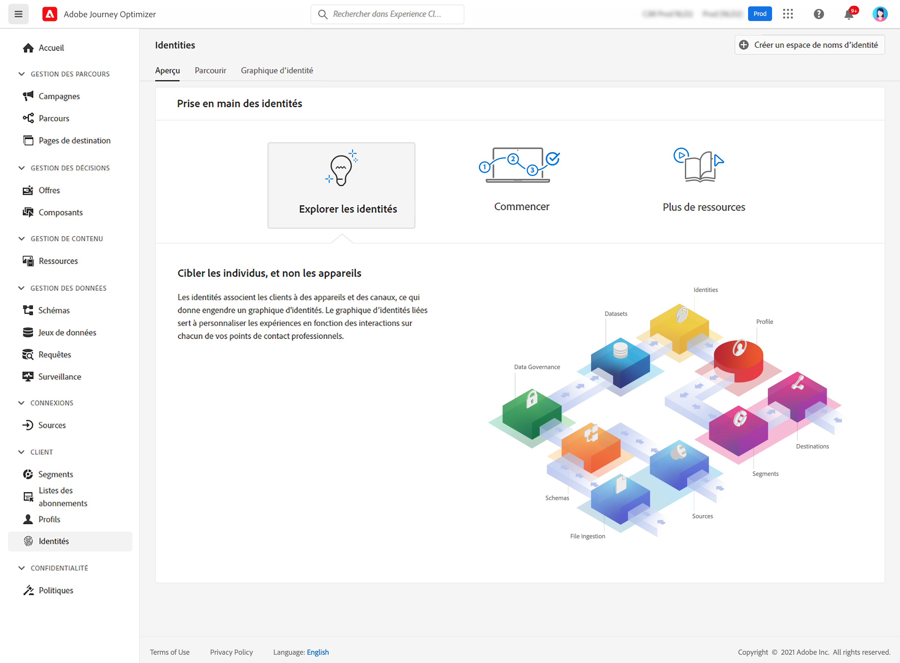

# Prise en main des identités {#identities-gs}

Une identité est une donnée propre à une entité, généralement une personne individuelle. Une identité telle qu’un identifiant de connexion, un ECID ou un identifiant de fidélité est appelée identité connue.

Les informations d’identification personnelle (PII), telles que l’adresse électronique et le numéro de téléphone, permettent d’identifier directement un client. Par conséquent, les PII sont utilisées pour faire correspondre les identités multiples d’un client sur plusieurs systèmes.

Dans [!DNL Adobe Journey Optimizer], **Identités** lier les consommateurs sur plusieurs appareils et canaux, le résultat est une [graphique d’identités](#id-graph). Le graphique d’identités lié est utilisé pour personnaliser les expériences en fonction des interactions entre tous les points de contact de votre entreprise.

En savoir plus sur **Identity Service** in [cette documentation](https://experienceleague.adobe.com/docs/experience-platform/identity/home.html){target=&quot;_blank&quot;}.

## Espaces de noms d’identité {#identity-namespaces}

**Espaces de noms d’identité** sont un composant d’Identity Service qui sert d’indicateurs du contexte auquel une identité se rapporte. Par exemple, ils distinguent une valeur de `name@email.com` comme adresse électronique ou `443522` comme identifiant CRM numérique. L’utilisation des espaces de noms d’identité nécessite une compréhension des différents services Adobe Experience Platform impliqués. Avant de commencer à utiliser les espaces de noms, veuillez consulter la documentation relative aux services suivants :

En savoir plus sur **Espaces de noms d’identité** in [cette documentation](https://experienceleague.adobe.com/docs/experience-platform/identity/namespaces.html){target=&quot;_blank&quot;}.

## Graphique d’identités{#id-graph}

Le **Graphique d’identités** est une carte des relations entre différentes identités pour un client particulier, qui vous fournit une représentation visuelle de la manière dont votre client interagit avec votre marque sur différents canaux. Tous les graphiques d’identités client sont gérés et mis à jour collectivement par Adobe Experience Platform Identity Service en temps quasi réel, en réponse à l’activité des clients.

Visionneuse de graphiques d’identités dans [!DNL Adobe Journey Optimizer] L’interface utilisateur vous permet de visualiser et de mieux comprendre les identités de client qui sont regroupées, et de quelles façons. La visionneuse vous permet de faire glisser et d’interagir différentes parties du graphique, ce qui vous permet d’examiner les relations d’identité complexes, de déboguer plus efficacement et de bénéficier d’une transparence accrue dans la manière dont les informations sont utilisées.

En savoir plus sur **Graphique d’identités** in [cette documentation](https://experienceleague.adobe.com/docs/experience-platform/identity/ui/identity-graph-viewer.html){target=&quot;_blank&quot;}.
