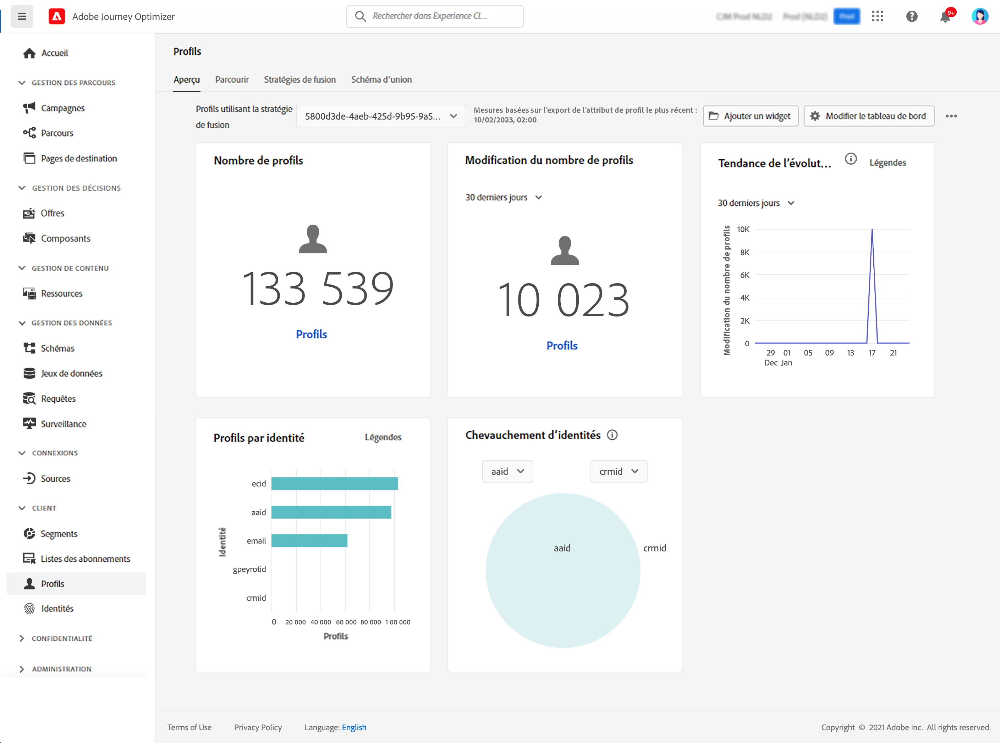

# Prise en main des profils {#profiles-gs}

Exploitation de Real-time Customer Profile dans [!DNL Adobe Journey Optimizer] pour obtenir une vue d’ensemble de chaque client en combinant des données provenant de plusieurs canaux, notamment en ligne, hors ligne, CRM et tiers. **Profils** permet de consolider les données de vos clients dans une vue unifiée offrant un compte horodaté et exploitable de chaque interaction client.

>[!NOTE]
>
>Si votre entreprise est une nouvelle société [!DNL Adobe Journey Optimizer] et ne dispose pas encore de jeux de données Profile actifs ni de stratégies de fusion créés, la variable **Profils** tableau de bord n’est pas visible. Au lieu de cela, la variable **Présentation** Cet onglet affiche des liens vers la documentation d’Adobe Experience Platform pour vous aider à prendre en main Real-time Customer Profile.

Pour savoir comment accéder à et utiliser le **Tableau de bord du profil** et des informations détaillées sur les mesures affichées dans le tableau de bord, voir [cette section](https://experienceleague.adobe.com/docs/experience-platform/profile/ui/user-guide.html){target=&quot;_blank&quot;}.

Vous pouvez rassembler des fragments de données provenant de plusieurs sources et les combiner afin d’obtenir une vue complète de chacun de vos clients. Lorsque vous rassemblez ces données, les stratégies de fusion sont les règles utilisées pour déterminer la priorité des données et les données qui seront combinées pour créer la vue unifiée.

En savoir plus sur **Stratégies de fusion** dans [documentation](https://experienceleague.adobe.com/docs/experience-platform/profile/merge-policies/ui-guide.html){target=&quot;_blank&quot;}.

**Voir aussi**

* [Documentation sur Real-time Customer Profile](https://experienceleague.adobe.com/docs/experience-platform/query/home.html){target=&quot;_blank&quot;}
* [Vidéo de présentation de Real-time Customer Profile](https://experienceleague.adobe.com/docs/experience-platform/profile/home.html){target=&quot;_blank&quot;}
