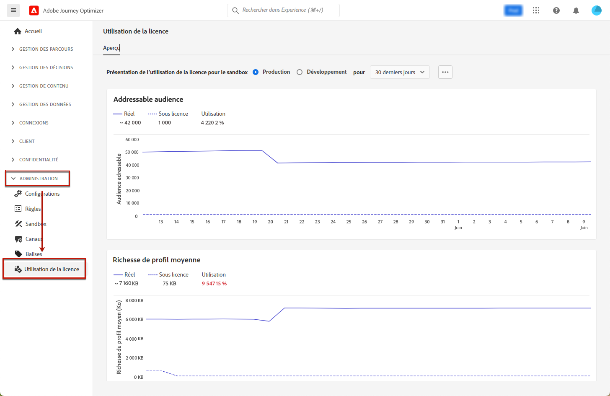

# Tableau de bord d’utilisation des licences {#license-usage}

L’[interface utilisateur](../start/user-interface.md) [!DNL Adobe Journey Optimizer] fournit un tableau de bord qui affiche des informations importantes sur l’utilisation des licences de votre entreprise, telles qu’elles sont capturées lors d’un instantané quotidien.

Pour accéder à ce tableau de bord, accédez à **[!UICONTROL Administration]** > **[!UICONTROL Utilisation de la licence]**. L’onglet **[!UICONTROL Vue d’ensemble]** du tableau de bord s’ouvre alors.

>[!NOTE]
>
>Pour pouvoir consulter le tableau de bord, l’autorisation [Afficher le tableau de bord d’utilisation des licences](https://experienceleague.adobe.com/docs/experience-platform/dashboards/permissions.html?lang=fr#available-permissions){target=&quot;_blank&quot;} doit vous avoir été accordée.

Pour en savoir plus, consultez la documentation Adobe Experience Platform :

* [Présentation du tableau de bord d’utilisation des licences](https://experienceleague.adobe.com/docs/experience-platform/dashboards/guides/license-usage.html?lang=fr){target=&quot;_blank&quot;}
* [Exploration du tableau de bord d’utilisation des licences](https://experienceleague.adobe.com/docs/experience-platform/dashboards/guides/license-usage.html?lang=fr#exploring-the-license-usage-dashboard){target=&quot;_blank&quot;}
* [Mesures disponibles](https://experienceleague.adobe.com/docs/experience-platform/dashboards/guides/license-usage.html?lang=fr#available-metrics){target=&quot;_blank&quot;}
