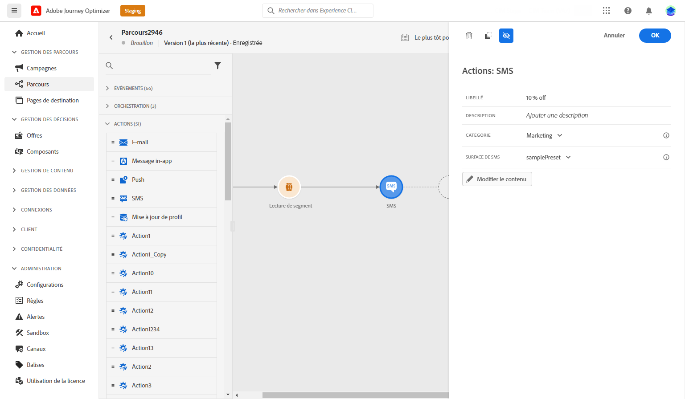
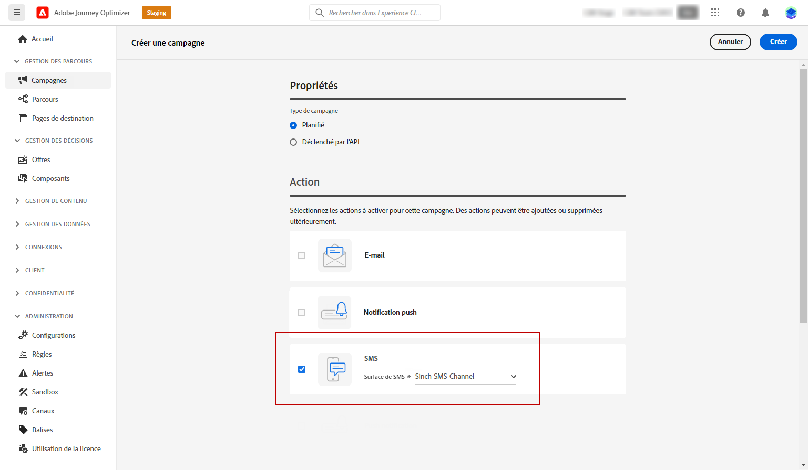
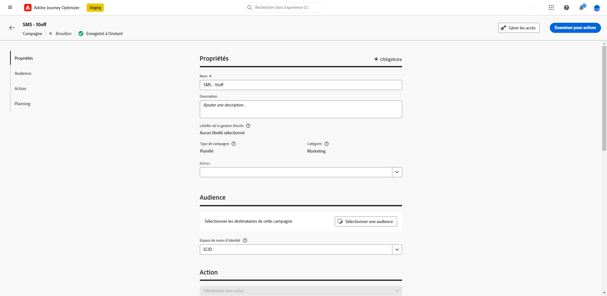
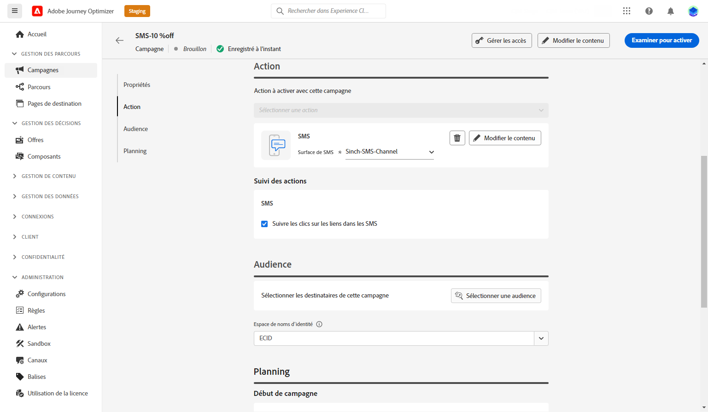
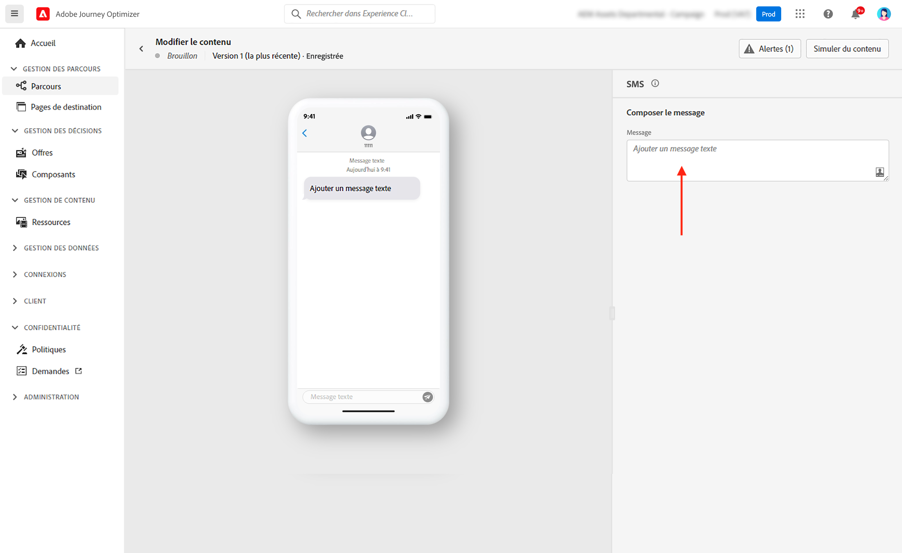
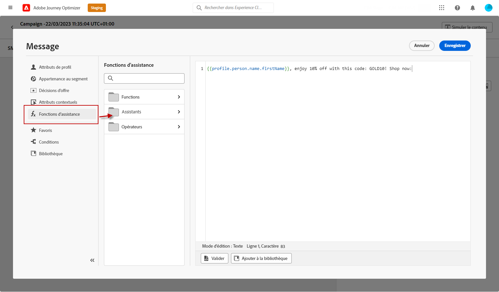
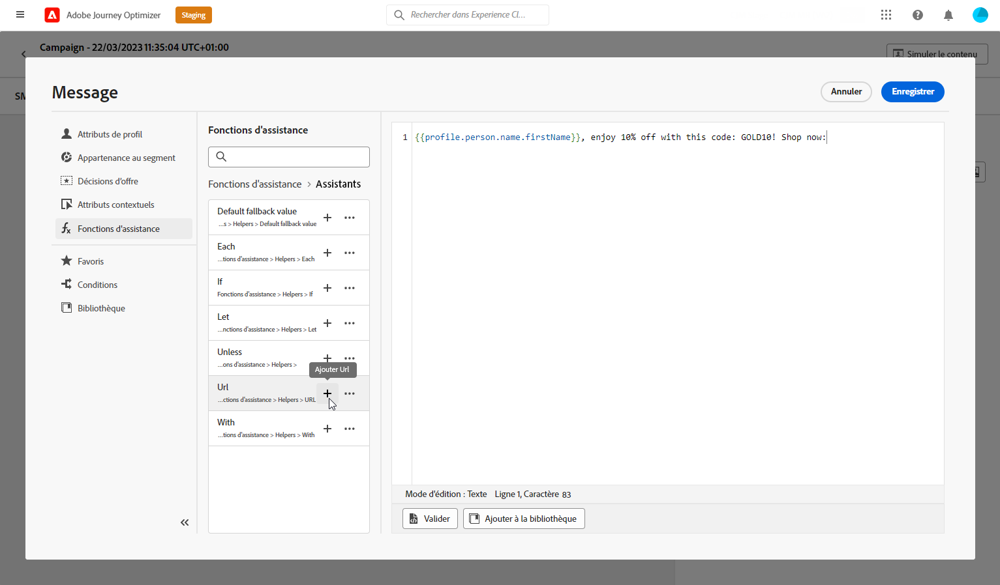
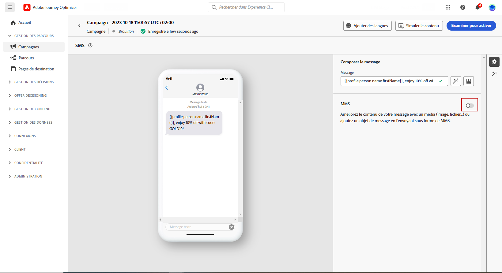
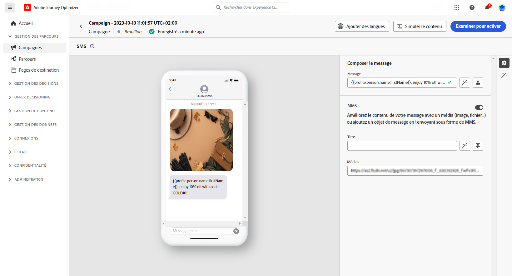
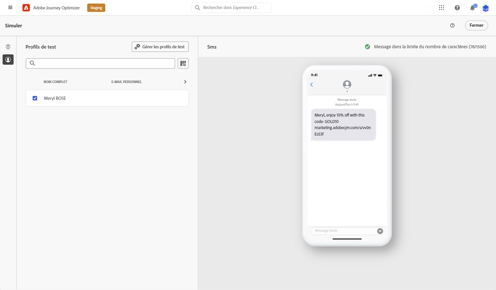

# Créer un message texte (SMS/MMS) {#create-sms}

>[!CONTEXTUALHELP]
>id="ajo_message_sms"
>title="Créer un message texte"
>abstract="Pour créer un message texte (SMS/MMS), ajoutez une action SMS dans un parcours ou une campagne et commencez la personnalisation à l’aide de l’éditeur d’expression."

Vous pouvez concevoir et envoyer des messages texte (SMS) et multimédia (MMS) avec Adobe Journey Optimizer. Vous devez d’abord ajouter une action SMS dans un parcours ou une campagne, puis définir le contenu du message texte, comme décrit ci-dessous. Adobe Journey Optimizer propose également des fonctionnalités permettant de tester vos messages texte avant l’envoi, afin que vous puissiez vérifier le rendu, les attributs de personnalisation et tous les autres paramètres.

>[!NOTE]
>
>Conformément aux normes et réglementations du secteur, tous les messages SMS/MMS de marketing doivent contenir un moyen permettant aux destinataires de se désabonner facilement. Pour ce faire, les destinataires de SMS peuvent répondre avec des mots-clés d’accord préalable et de droit d’opposition. [Découvrir comment gérer un droit d’opposition](../privacy/opt-out.md#sms-opt-out-management-sms-opt-out-management)

## Ajouter un message texte {#create-sms-journey-campaign}

Accédez aux onglets ci-dessous pour savoir comment ajouter un message texte (SMS/MMS) dans une campagne ou un parcours.

>[!BEGINTABS]

>[!TAB Ajouter un message texte à un parcours]

1. Ouvrez votre parcours, puis effectuez un glisser-déposer d’une activité SMS depuis la section **Actions** de la palette.

   

1. Fournissez des informations de base sur votre message (libellé, description, catégorie), puis choisissez la surface de message à utiliser.

   

   Pour plus d’informations sur la configuration de votre parcours, consultez cette [page](../building-journeys/journey-gs.md).

   Par défaut, le champ **[!UICONTROL Surface]** est prérempli avec la dernière surface utilisée par l’utilisateur ou l’utilisatrice pour ce canal.

Vous pouvez maintenant commencer à concevoir le contenu de votre message SMS en cliquant sur le bouton **[!UICONTROL Modifier le contenu]**, comme illustré ci-dessous.

>[!TAB Ajouter un message texte à une campagne]

1. Créez une campagne planifiée ou déclenchée par une API, sélectionnez **[!UICONTROL SMS]** comme action et choisissez la **[!UICONTROL surface d’application]** à utiliser. Pour en savoir plus sur la configuration de SMS, consultez [cette page](sms-configuration.md).

   

1. Cliquez sur **[!UICONTROL Créer]**.

1. Dans la section **[!UICONTROL Propriétés]**, modifiez le **[!UICONTROL Titre]** et la **[!UICONTROL Description]** de votre campagne.

   

1. Cliquez sur le bouton **[!UICONTROL Sélectionner une audience]** pour définir l’audience à cibler à partir de la liste des audiences Adobe Experience Platform disponibles. [En savoir plus](../audience/about-audiences.md).

1. Dans le champ **[!UICONTROL Espace de noms d’identité]**, choisissez l’espace de noms à utiliser pour identifier les personnes à partir de l’audience sélectionnée. [En savoir plus](../event/about-creating.md#select-the-namespace).

   

1. Cliquez sur **[!UICONTROL Créer une expérience]** pour commencer à configurer votre expérience de contenu et créer des traitements afin de mesurer leurs performances et d’identifier la meilleure option pour votre audience cible. [En savoir plus](../campaigns/content-experiment.md).

1. Dans la section **[!UICONTROL Tracking des actions]**, indiquez si vous souhaitez effectuer le tracking des clics sur les liens de votre SMS.

1. Les campagnes sont conçues pour être exécutées à une date spécifique ou à une fréquence récurrente. Découvrez comment configurer le **[!UICONTROL Planning]** de votre campagne dans [cette section](../campaigns/create-campaign.md#schedule).

1. Dans le menu **[!UICONTROL Déclencheurs d’action]**, choisissez la variable **[!UICONTROL Fréquence]** de votre SMS :

   * Une fois
   * Quotidien
   * Hebdomadaire
   * Mois

Vous pouvez maintenant commencer à concevoir le contenu de votre message texte en cliquant sur le bouton **[!UICONTROL Modifier le contenu]**, comme illustré ci-dessous.

>[!ENDTABS]

## Définir le contenu de votre SMS{#sms-content}

>[!CONTEXTUALHELP]
>id="ajo_message_sms_content"
>title="Définir le contenu de votre SMS"
>abstract="Personnalisez vos messages texte (SMS/MMS) à l’aide de l’éditeur d’expression pour définir le contenu et incorporer des éléments dynamiques."

Pour configurer le contenu de votre SMS, procédez comme suit. Les paramètres des MMS sont décrits dans [cette section](#mms-content).

1. Dans l’écran de configuration des parcours ou des campagnes, cliquez sur le bouton **[!UICONTROL Modifier le contenu]** pour configurer le contenu du message texte.

1. Cliquez sur le champ **[!UICONTROL Message]** pour ouvrir l’éditeur d’expression.

   

1. Utilisez l’éditeur d’expression pour définir le contenu, ou encore ajouter une personnalisation ou du contenu dynamique. Vous pouvez utiliser n’importe quel attribut, comme le nom du profil ou la ville. Vous pouvez également définir des règles conditionnelles. Accédez aux pages suivantes pour en savoir plus sur la [personnalisation](../personalization/personalize.md) le et [contenu dynamique](../personalization/get-started-dynamic-content.md) dans l’éditeur d’expression.

1. Une fois le contenu défini, ajoutez les URL trackées à votre message. Pour ce faire, accédez au menu **[!UICONTROL Fonctions d’assistance]** et sélectionnez **[!UICONTROL Helpers]**.

   Notez que pour utiliser la fonction de raccourcissement des URL, vous devez d’abord configurer un sous-domaine, qui sera ensuite lié à votre surface. [En savoir plus](sms-subdomains.md).

   >[!CAUTION]
   >
   > Pour accéder aux sous-domaines SMS et les modifier, vous devez disposer de l’autorisation **[!UICONTROL Gestion des sous-domaines SMS]** dans le sandbox de production. Pour en savoir plus sur les autorisations, consultez [cette section](../administration/high-low-permissions.md).

   

1. Dans le menu **[!UICONTROL Fonctions d’assistance]**, cliquez sur **[!UICONTROL Fonction URL]**, puis sélectionnez **[!UICONTROL Ajouter une URL]**.

   

1. Dans le champ `originalUrl`, collez l’URL à raccourcir, puis cliquez sur **[!UICONTROL Enregistrer]**.

1. Cliquez sur **[!UICONTROL Enregistrer]** et vérifiez votre message dans l’aperçu. Vous pouvez maintenant tester et vérifier le contenu de votre message, comme indiqué dans [cette section](#sms-mms-test).

## Définir le contenu de votre MMS{#mms-content}

Vous pouvez améliorer votre communication en envoyant des messages MMS (Multimedia Message Service), afin de partager des médias tels que des vidéos, des images, des clips audio, des GIF et bien plus encore. En outre, les MMS autorisent jusqu’à 1 600 caractères de texte dans votre message.

>[!NOTE]
>
>* Notez que cette fonctionnalité est actuellement disponible avec **Sinch** uniquement.
>
>* Le canal MMS est fourni avec quelques limites répertoriées sur [cette page](../start/guardrails.md#sms-guardrails).

Pour créer du contenu MMS, procédez comme suit :

1. Créez un SMS comme décrit dans [cette section](#create-sms-journey-campaign).

1. Modifiez le contenu de votre SMS comme indiqué dans [cette section](#sms-content).

1. Activez l’option MMS pour ajouter un média à votre contenu SMS.

   

1. Ajoutez un **[!UICONTROL Titre]** à votre média.

1. Saisissez lʼURL de votre média dans le champ **[!UICONTROL Média]**.

   

1. Cliquez sur **[!UICONTROL Enregistrer]** et vérifiez votre message dans l’aperçu. Vous pouvez maintenant tester et vérifier le contenu de votre message, comme décrit ci-dessous.

## Tester et envoyer vos messages {#sms-mms-test}

Cliquez sur le bouton **[!UICONTROL Simuler le contenu]** pour prévisualiser le contenu de votre message texte, les URL raccourcies et le contenu personnalisé.

Une fois que vous avez effectué vos tests et validé le contenu, vous pouvez envoyer votre message texte à votre audience. Ces étapes sont présentées sur [cette page](send-sms.md).

Après leur envoi, vous pouvez mesurer l’impact de vos SMS dans les rapports des campagnes et des parcours. Pour plus d’informations sur les rapports, consultez [cette section](../reports/campaign-global-report.md#sms-tab).

**Rubriques connexes**

* [Prévisualiser, tester et envoyer votre message texte](send-sms.md)
* [Configurer le canal SMS](sms-configuration.md)
* [Rapports SMS/MMS](../reports/journey-global-report.md#sms-global)
* [Ajouter un message dans un parcours](../building-journeys/journeys-message.md)
* [Ajouter un message dans une campagne](../campaigns/create-campaign.md)
