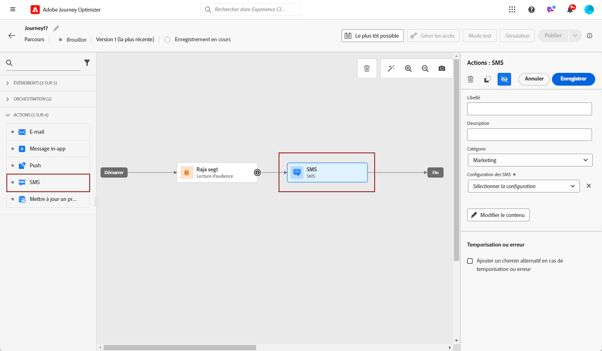
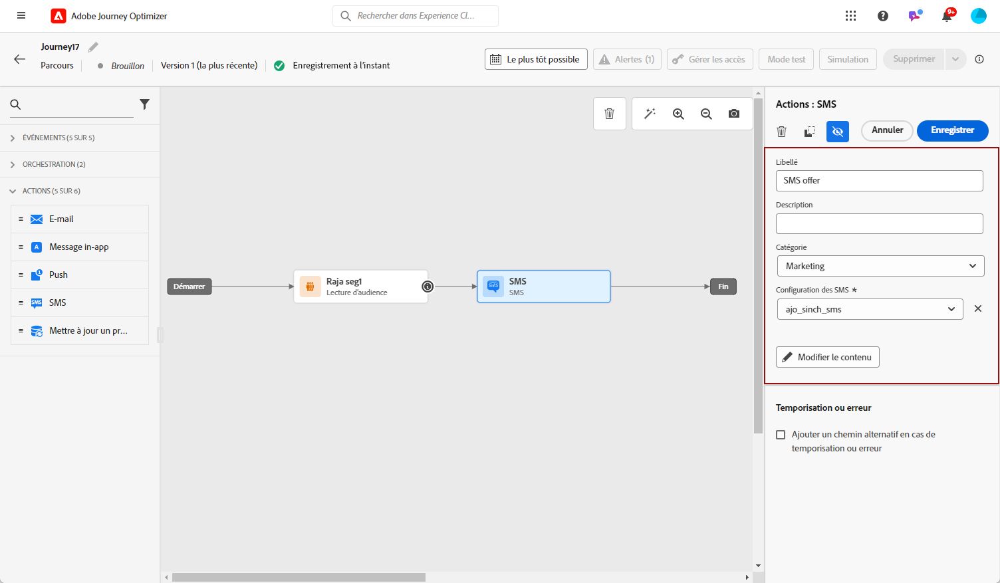
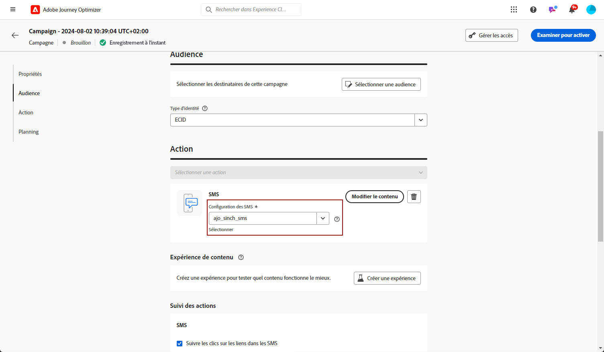

# Créer un SMS {#create-sms}

>[!CONTEXTUALHELP]
>id="ajo_message_sms"
>title="Création de SMS"
>abstract="Ajoutez votre message texte et commencez à le personnaliser à l&#39;aide de l&#39;éditeur d&#39;expression."

>[!NOTE]
>
>Conformément aux normes et réglementations du secteur, tous les messages de marketing SMS doivent contenir un moyen pour que les destinataires puissent facilement se désabonner. Pour ce faire, les destinataires SMS peuvent répondre avec des mots-clés d&#39;opt-in et d&#39;opt-out. [Découvrez comment gérer l’exclusion](../privacy/opt-out.md#sms-opt-out-management-sms-opt-out-management)

## Créer un SMS dans un parcours ou une campagne {#create-sms-journey-campaign}

Pour commencer à personnaliser votre SMS, procédez comme suit :

>[!BEGINTABS]

>[!TAB Ajout d’un SMS à un parcours]

1. Ouvrez votre parcours, puis faites glisser et déposez une activité SMS depuis la section Actions de la palette.

   

1. Fournissez des informations de base sur votre message (libellé, description, catégorie), puis choisissez la surface du message à utiliser.

   

   Pour plus d’informations sur la configuration d’un parcours, reportez-vous à la section [cette page](../building-journeys/journey-gs.md)

Vous pouvez maintenant commencer à concevoir le contenu de votre SMS à partir du **[!UICONTROL Edit content]** bouton . [Concevoir le contenu d&#39;un SMS](#sms-content)

>[!TAB Ajout d’un SMS à une campagne]

1. Créez une campagne planifiée ou déclenchée par une API, sélectionnez **[!UICONTROL SMS]** comme action et choisissez la variable **[!UICONTROL App surface]** à utiliser. [En savoir plus sur la configuration des SMS](sms-configuration.md).

   

1. Cliquez sur **[!UICONTROL Create]**.

1. Dans la **[!UICONTROL Properties]** , modifiez la section de votre campagne **[!UICONTROL Title]** et **[!UICONTROL Description]**.

   

1. Dans le **[!UICONTROL Actions tracking]** , indiquez si vous souhaitez effectuer le suivi des clics sur les liens de votre SMS.

1. Cliquez sur le bouton **[!UICONTROL Select audience]** pour définir l’audience à cibler à partir de la liste des segments Adobe Experience Platform disponibles. [En savoir plus](../segment/about-segments.md).

1. Dans le **[!UICONTROL Identity namespace]** , choisissez l’espace de noms à utiliser pour identifier les individus du segment sélectionné. [En savoir plus](../event/about-creating.md#select-the-namespace).

   

1. Les campagnes sont conçues pour être exécutées à une date spécifique ou à une fréquence récurrente. Découvrez comment configurer le **[!UICONTROL Schedule]** de votre campagne dans [cette section](../campaigns/create-campaign.md#schedule).

1. Dans la **[!UICONTROL Action triggers]** , choisissez la variable **[!UICONTROL Frequency]** de votre SMS :

   * Une fois
   * Quotidien
   * Hebdomadaire
   * Mois

Vous pouvez maintenant commencer à concevoir le contenu de votre SMS à partir du **[!UICONTROL Edit content]** bouton . [Concevoir le contenu d&#39;un SMS](#sms-content)

>[!ENDTABS]

## Définir le contenu du SMS{#sms-content}

1. Dans l’écran de configuration du parcours ou de la campagne, cliquez sur le bouton **[!UICONTROL Edit content]** pour configurer le contenu du SMS.

1. Cliquez sur le bouton **[!UICONTROL Message]** pour ouvrir l’éditeur d’expression.

   

1. Utilisez l&#39;éditeur d&#39;expression pour définir le contenu et ajouter du contenu dynamique. Vous pouvez utiliser n’importe quel attribut, tel que le nom du profil ou la ville. En savoir plus sur [personnalisation](../personalization/personalize.md) et [contenu dynamique](../personalization/get-started-dynamic-content.md) dans l&#39;éditeur d&#39;expression.

1. Cliquez sur **[!UICONTROL Save]** et vérifiez votre message dans l&#39;aperçu. [En savoir plus](send-sms.md)

   

**Rubriques connexes**

* [Configuration du canal SMS](sms-configuration.md)
* [Rapport SMS](../reports/journey-global-report.md#sms-global)
* [Ajout d’un message dans un parcours](../building-journeys/journeys-message.md)
