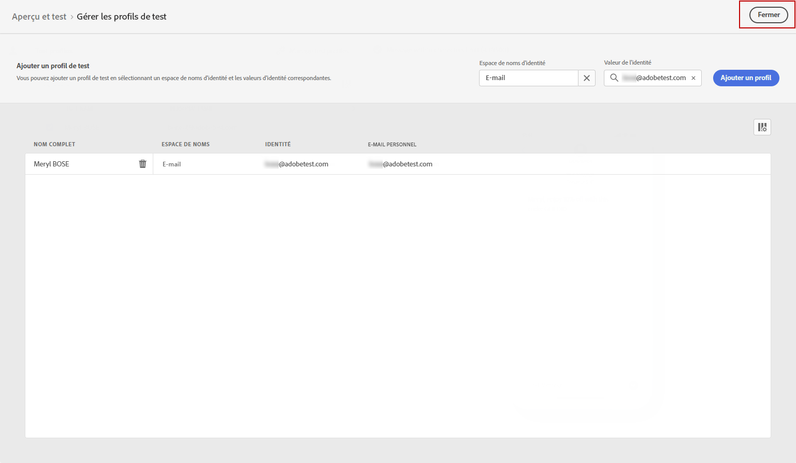

# Envoyer votre SMS {#send-sms}

## Prévisualiser votre SMS {#preview-sms}

Une fois le contenu de votre message défini, vous pouvez utiliser des profils de test pour le prévisualiser et le tester. Si vous avez inséré du contenu personnalisé, vous pourrez vérifier comment ce contenu s’affiche dans le message en exploitant les données du profil de test.

1. Cliquez sur **[!UICONTROL Simulation du contenu]**.

1. Cliquez sur **[!UICONTROL Gestion des profils de test]** pour ajouter un profil de test.

1. Recherchez votre profil de test avec la méthode **[!UICONTROL Espace de noms d’identité]** et **[!UICONTROL Valeur d’identité]** champs. Cliquez ensuite sur **[!UICONTROL Ajouter un profil]**.

   

1. Une fois que vous avez sélectionné votre profil de test, vous pouvez fermer la variable **[!UICONTROL Ajout d’un profil de test]** fenêtre.

   

1. Dans la fenêtre Aperçu et test , les données de profil de test sont exploitées dans le contenu du message.

   Par exemple, pour ce SMS, le contenu du message est personnalisé :

   

## Valider votre SMS{#sms-preview}

>[!NOTE]
>
> Pour une meilleure délivrabilité, vous devez toujours utiliser les numéros de téléphone dans les formats pris en charge par le fournisseur. Par exemple, Twilio et Sinch ne prennent en charge que les numéros de téléphone au format E.164.

Vous devez également vérifier les alertes dans la section supérieure de l’éditeur.  Certaines d’entre elles sont de simples avertissements, mais d’autres peuvent vous empêcher d’utiliser le message. Deux types d’alertes peuvent avoir lieu :

* Les **avertissements** se rapportent aux recommandations et aux bonnes pratiques. Par exemple, un message s&#39;affiche si votre SMS est vide.

* Les **erreurs** vous empêchent de tester ou d’activer le parcours tant qu’elles ne sont pas corrigées. Par exemple, un message vous avertit que l’objet est manquant.

Une fois votre SMS prêt, effectuez la configuration de votre [parcours](../building-journeys/journey-gs.md) ou [campaign](../campaigns/create-campaign.md) pour l’envoyer.

**Rubriques connexes**

* [Configurer le canal SMS](sms-configuration.md)
* [Rapport SMS](../reports/journey-global-report.md#sms-global)
* [Création dʼun SMS](create-sms.md)
* [Ajout dʼun message dans un parcours](../building-journeys/journeys-message.md)
