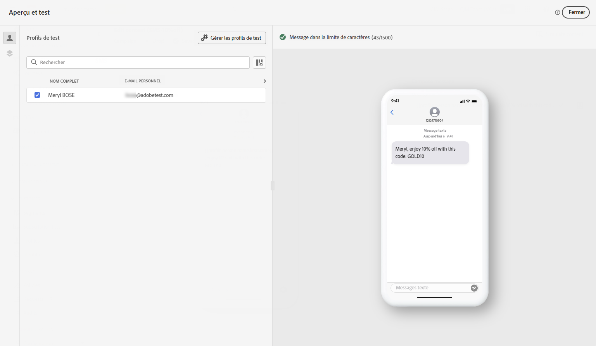
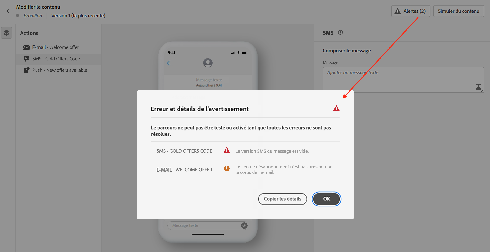

# Vérifier et envoyer votre message texte (SMS/MMS){#send-sms}

## Prévisualiser votre message texte {#preview-sms}

Une fois le contenu de votre message défini, vous pouvez utiliser des profils de test ou des exemples de données d’entrée chargés à partir d’un fichier CSV/JSON ou ajoutés manuellement pour prévisualiser son contenu. Si vous avez inséré du contenu personnalisé, vous pouvez vérifier la façon dont celui-ci s’affiche dans le message.

Pour ce faire, cliquez sur **[!UICONTROL Simuler du contenu]**, puis vérifiez votre message à l’aide des données de profil de test.

Vous trouverez des informations détaillées sur comment prévisualiser et tester votre contenu dans la section [Gestion de contenu](../content-management/preview-test.md).

## Valider votre contenu {#sms-validate}

Vous devez vérifier les alertes dans la section supérieure de l’éditeur. Certaines d’entre elles sont de simples avertissements, mais d’autres peuvent vous empêcher d’envoyer le message. Deux types d’alertes peuvent se produire : avertissements et erreurs.

* Les **avertissements** se rapportent aux recommandations et aux bonnes pratiques. Par exemple, un message d’avertissement s’affiche si votre message texte est vide.

* Les **erreurs** vous empêchent de tester ou d’activer le parcours ou de publier la campagne tant que celles-ci ne sont pas corrigées. Par exemple, un message d’erreur vous avertit lorsque l’objet est manquant.

>[!NOTE]
>
> Pour améliorer votre délivrabilité, utilisez les numéros de téléphone dans les formats pris en charge par le fournisseur. Par exemple, Twilio et Sinch ne prennent en charge que les numéros de téléphone au format E.164.

## Envoyer vos messages texte {#sms-send}

>[!IMPORTANT]
>
> Si votre campagne est soumise à une politique de validation, vous devrez effectuer une demande d’approbation afin de pouvoir envoyer vos SMS. [En savoir plus](../test-approve/gs-approval.md)

Une fois votre message texte prêt, effectuez la configuration de votre [parcours](../building-journeys/journey-gs.md) ou [campagne](../campaigns/create-campaign.md) pour l’envoyer.

**Rubriques connexes**

* [Configurer le canal SMS](sms-configuration.md)
* [Rapports SMS/MMS](../reports/journey-global-report-cja-sms.md)
* [Créer un message texte](create-sms.md)
* [Ajouter un message dans un parcours](../building-journeys/journeys-message.md)
