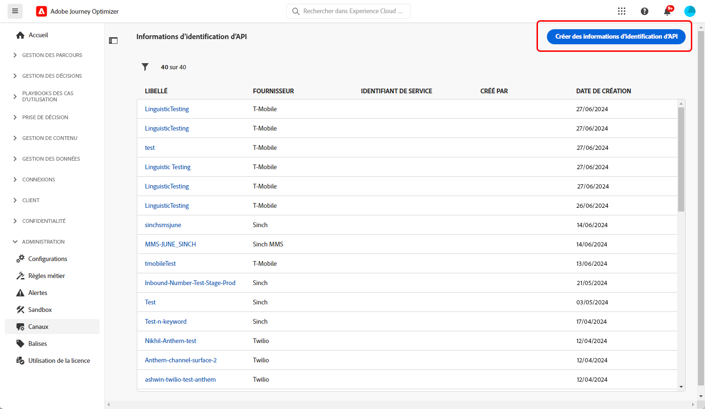
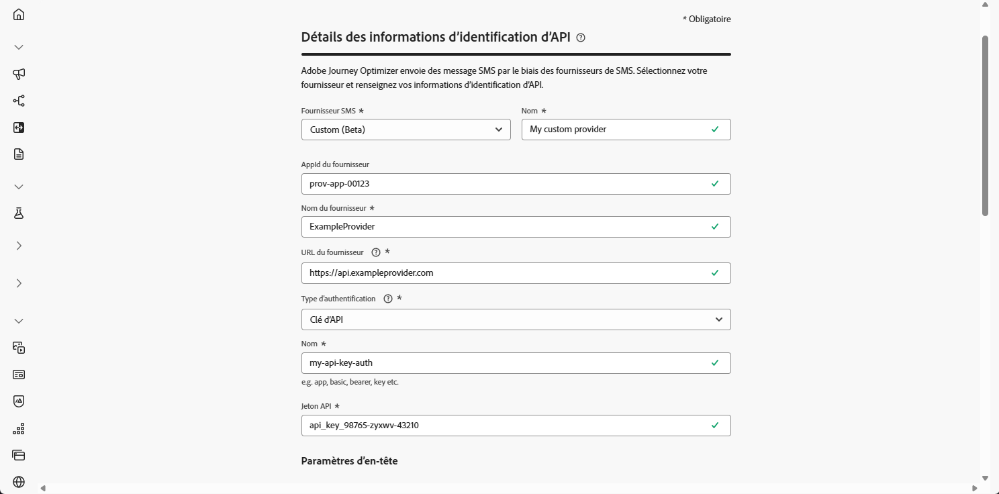
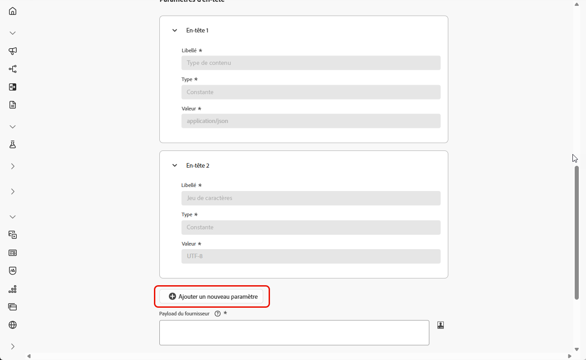
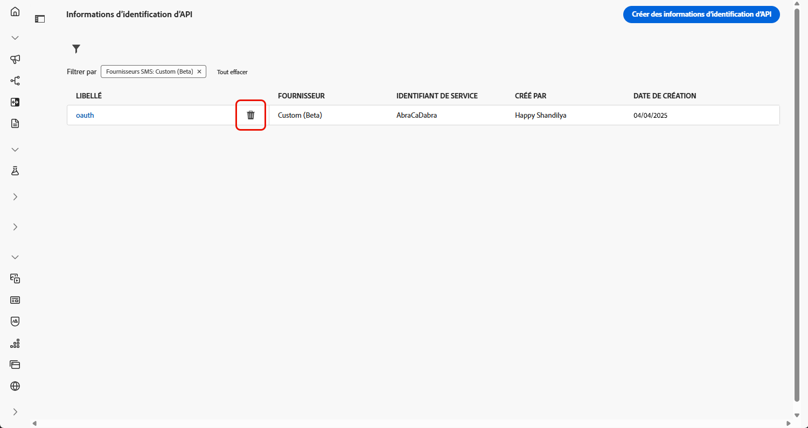
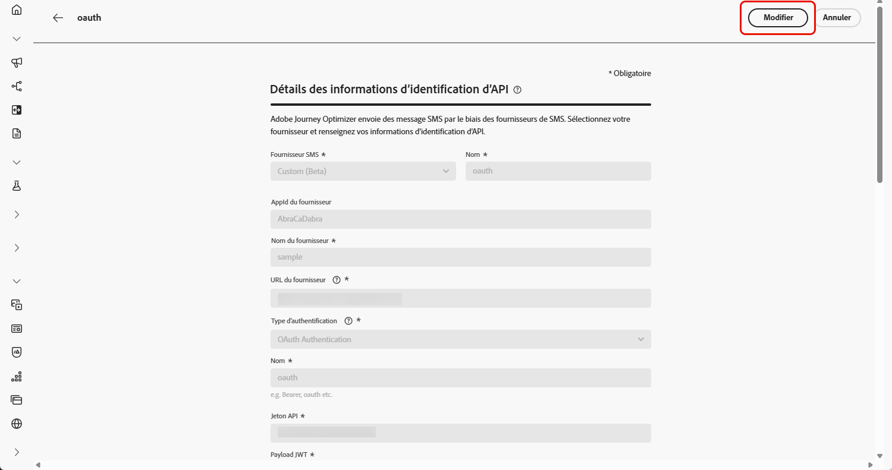
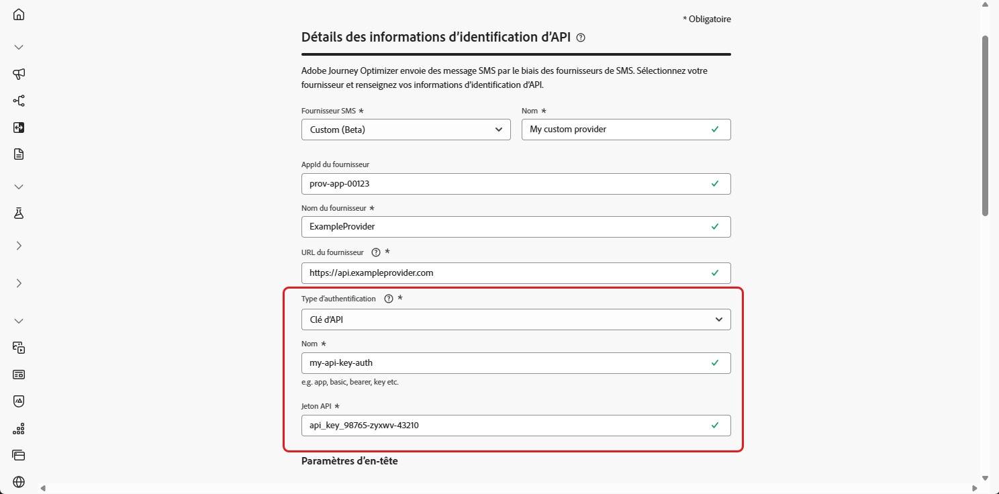
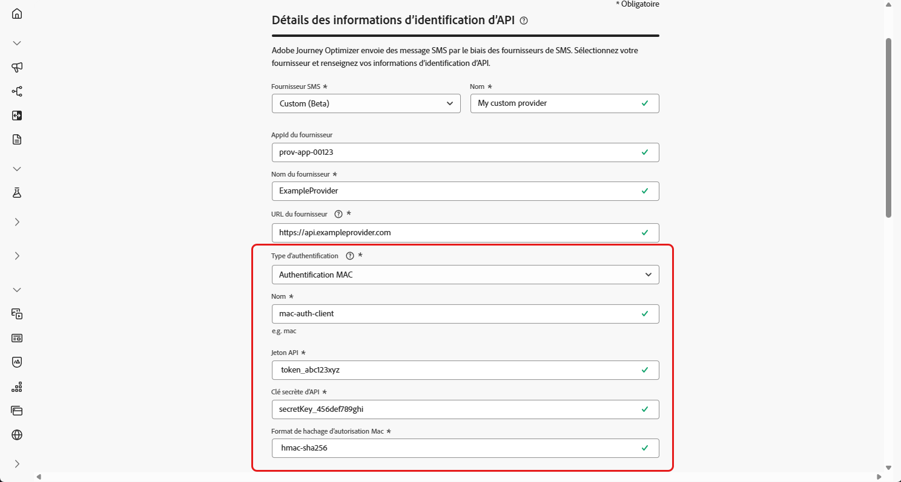
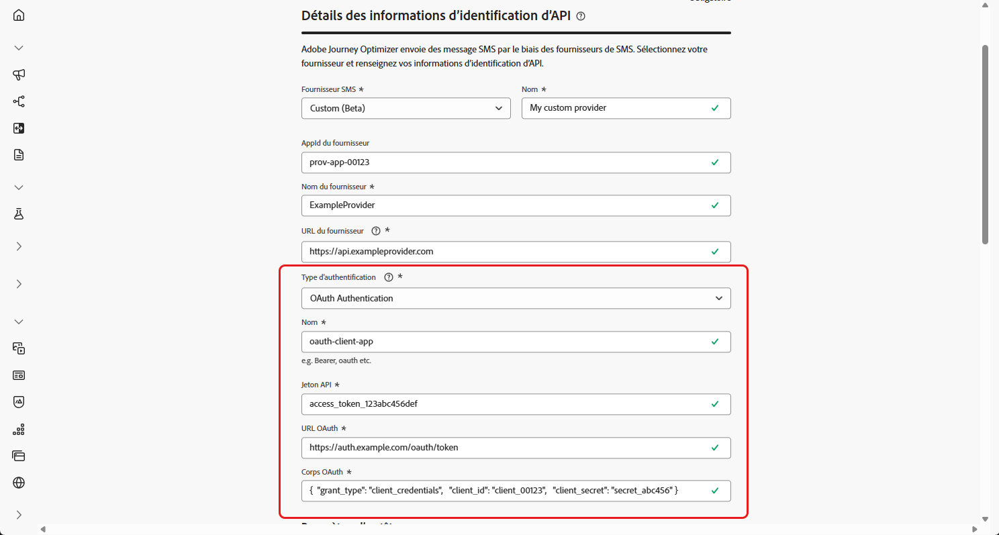
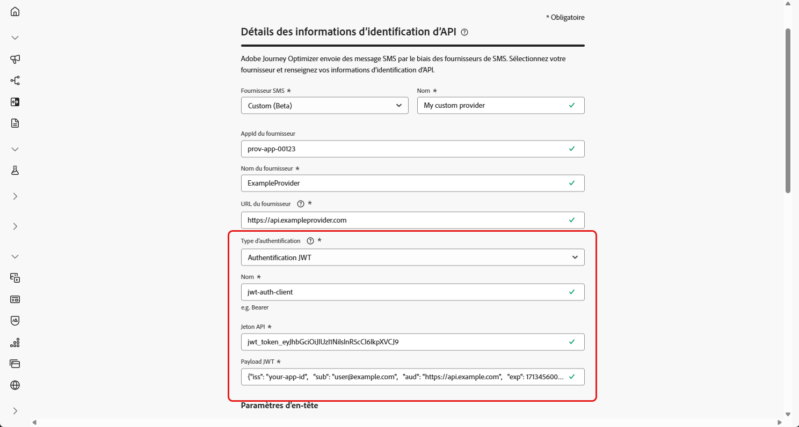

# Configurer un fournisseur personnalisé {#sms-configuration-custom}

>[!CONTEXTUALHELP]
>id="ajo_admin_sms_api_byop_provider_url"
>title="URL du fournisseur"
>abstract="Spécifiez l’URL de l’API externe à laquelle vous prévoyez de vous connecter. Cette URL sert de point d’entrée pour accéder aux fonctionnalités de l’API."

>[!CONTEXTUALHELP]
>id="ajo_admin_sms_api_byop_header_parameters"
>title="Paramètres d’en-tête"
>abstract="Spécifiez le libellé, le type et la valeur des en-têtes supplémentaires pour que l’authentification, la mise en forme du contenu et la communication avec l’API soient efficaces. "

>[!CONTEXTUALHELP]
>id="ajo_admin_sms_api_byop_provider_payload"
>title="Payload du fournisseur"
>abstract="Fournissez le payload de la requête pour vous assurer que les bonnes données sont envoyées pour le traitement et la génération de la réponse."

Cette fonctionnalité vous permet d’intégrer et de configurer vos propres fournisseurs de messagerie, offrant ainsi une flexibilité qui va au-delà des options disponibles par défaut (Sinch, Twilio et Infobip). Cela permet une création, une diffusion, des rapports et une gestion du consentement transparents pour les messages SMS et RCS.

En configurant un fournisseur personnalisé, vous pouvez connecter des services de messagerie tiers directement dans Journey Optimizer, personnaliser les payloads des messages pour du contenu dynamique et gérer les préférences d’opt-in/opt-out pour assurer la conformité sur les canaux SMS et RCS.

Pour configurer votre fournisseur personnalisé, procédez comme suit :

1. [Créer des informations d’identification d’API](#api-credential)
1. [Créer un webhook](sms-webhook.md)
1. [Créer une configuration des canaux](sms-configuration-surface.md)
1. [Créer un parcours ou une campagne avec une action de canal SMS](create-sms.md)

## Créer vos informations d’identification d’API {#api-credential}

Pour envoyer des SMS et des messages RCS dans Journey Optimizer à l’aide d’un fournisseur personnalisé non disponible par défaut chez Adobe (par exemple, Sinch, Infobip, Twilio), procédez comme suit :

1. Dans le rail de gauche, accédez à **[!UICONTROL Administration]** `>` **[!UICONTROL Canaux]**, sélectionnez le menu **[!UICONTROL Informations d’identification d’API]** sous **[!UICONTROL Paramètres SMS]**, puis cliquez sur le bouton **[!UICONTROL Créer de nouvelles informations d’identification d’API]**.

   

1. Configurez les informations d’identification pour l’API SMS, comme indiqué ci-dessous :

   * **[!UICONTROL Fournisseur de SMS]** : personnalisé.

   * **[!UICONTROL Nom]** : saisissez un nom pour les informations d’identification d’API.

   * **[!UICONTROL AppId du fournisseur]** : saisissez l’ID de l’application fourni par votre fournisseur de SMS.

   * **[!UICONTROL Nom du fournisseur]** : saisissez le nom du fournisseur de SMS.

   * **[!UICONTROL URL du fournisseur]** : saisissez l’URL du fournisseur de SMS.

   * **[!UICONTROL Type d’authentification]** : sélectionnez le type d’autorisation et [renseignez les champs correspondants](#auth-options) en fonction de la méthode d’authentification choisie.

     

1. Activez l’option **[!UICONTROL Prise en charge de mTLS]**, qui garantit que le client et le serveur s’authentifient mutuellement avant d’établir une connexion sécurisée.

   Pour utiliser mTLS uniquement, sélectionnez **[!UICONTROL Aucune authentification]** dans le menu déroulant **[!UICONTROL Type d’authentification]**, puis activez la **[!UICONTROL prise en charge de mTLS]**.

1. Dans la section **[!UICONTROL En-têtes]**, cliquez sur **[!UICONTROL Ajouter un nouveau paramètre]** pour définir les en-têtes HTTP du message de requête à envoyer au service externe.

   Les champs d’en-tête **Content-Type** et **Charset** sont définis par défaut et ne peuvent pas être supprimés.

   

1. Ajoutez la **[!UICONTROL payload du fournisseur]** pour valider et personnaliser les payloads de votre requête.

   Pour les messages RCS, cette payload est ensuite utilisée lors de la [conception du contenu](create-sms.md#sms-content).

   >[!NOTE]
   >
   >Lors de la configuration d’un fournisseur de SMS personnalisé avec l’authentification de base ou porteur, vous devez inclure le paramètre `authOption` dans la payload JSON. En outre, la **payload du fournisseur** doit référencer les variables de modèle `{{fromNumber}}`, `{{toNumber}}` et `{{message}}`.

1. Cliquez sur **[!UICONTROL Envoyer]** lorsque vous avez terminé la configuration de vos informations d’identification d’API.

1. Dans le menu **[!UICONTROL Informations d’identification d’API]**, cliquez sur l’ pour supprimer vos informations d’identification d’API.

   

1. Pour modifier les informations d’identification existantes, recherchez les informations d’identification d’API souhaitées et cliquez sur l’option **[!UICONTROL Modifier]** pour apporter les modifications nécessaires.

   

1. Cliquez sur **[!UICONTROL Vérifier la connexion SMS]**, à partir de vos informations d’identification d’API existantes, pour tester et vérifier vos informations d’identification d’API SMS en envoyant un exemple de message à un appareil désigné.

1. Renseignez les champs **Numéro** et **Message**, puis cliquez sur **[!UICONTROL Vérifier la connexion]**.

   >[!IMPORTANT]
   >
   >Le message doit être structuré de manière à s’aligner sur le format de payload du fournisseur.

   

Une fois vos informations d’identification d’API créées et configurées, vous devez configurer [les paramètres entrants du webhook](#webhook) pour les SMS.

### Options d’authentification pour les fournisseurs de SMS personnalisés {#auth-options}

>[!CONTEXTUALHELP]
>id="ajo_admin_sms_api_byop_auth_type"
>title="Type d’authentification"
>abstract="Indiquez la méthode d’authentification nécessaire pour accéder à l’API, afin de garantir une communication sécurisée et autorisée avec le service externe."

>[!BEGINTABS]

>[!TAB Clé d’API]

Une fois vos informations d’identification d’API créées, renseignez les champs obligatoires relatifs à l’authentification par clé API :

* **[!UICONTROL Nom]** : saisissez un nom pour votre configuration de clé d’API.
* **[!UICONTROL Jeton API]** : saisissez le jeton API fourni par votre fournisseur de SMS.

>[!TAB Authentification MAC]

Une fois vos informations d’identification d’API créées, renseignez les champs obligatoires relatifs à l’authentification MAC :

* **[!UICONTROL Nom]** : saisissez un nom pour votre configuration d’authentification MAC.
* **[!UICONTROL Jeton API]** : saisissez le jeton API fourni par votre fournisseur de SMS.
* **[!UICONTROL Clé secrète d’API]** : saisissez la clé secrète d’API fournie par votre fournisseur de SMS. Cette clé est utilisée pour générer la balise MAC (code d’authentification de message) pour une communication sécurisée.
* **[!UICONTROL Format de hachage d’autorisation Mac]** : sélectionnez le format de hachage pour l’authentification MAC.

>[!TAB Authentification OAuth]

Une fois vos informations d’identification d’API créées, renseignez les champs obligatoires relatifs à l’authentification OAuth :

* **[!UICONTROL Nom]** : saisissez un nom pour votre configuration d’authentification OAuth.

* **[!UICONTROL Jeton API]** : saisissez le jeton API fourni par votre fournisseur de SMS.

* **[!UICONTROL URL OAuth]** : saisissez l’URL permettant d’obtenir le jeton OAuth.

* **[!UICONTROL Corps OAuth]** : indiquez le corps de la requête OAuth au format JSON, y compris les paramètres tels que `grant_type`, `client_id` et `client_secret`.

>[!TAB Authentification JWT]

Une fois vos informations d’identification d’API créées, renseignez les champs obligatoires relatifs à l’authentification JWT :

* **[!UICONTROL Nom]** : saisissez un nom pour votre configuration d’authentification JWT.

* **[!UICONTROL Jeton API]** : saisissez le jeton API fourni par votre fournisseur de SMS.

* **[!UICONTROL Payload JWT]** : saisissez la payload JSON contenant les revendications requises pour JWT, telles que l’émetteur, l’objet, l’audience et l’expiration.

>[!ENDTABS]

## Vidéo pratique {#video}

>[!VIDEO](https://video.tv.adobe.com/v/3431625)

