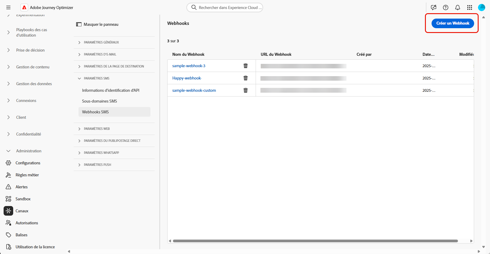

# Configurer un fournisseur de SMS personnalisé {#sms-configuration-custom}

>[!CONTEXTUALHELP]
>id="ajo_admin_sms_api_byop_provider_url"
>title="URL du fournisseur"
>abstract="Spécifiez l’URL de l’API externe à laquelle vous prévoyez de vous connecter. Cette URL sert de point d’entrée pour accéder aux fonctionnalités de l’API."

>[!CONTEXTUALHELP]
>id="ajo_admin_sms_api_byop_header_parameters"
>title="Paramètres d’en-tête"
>abstract="Spécifiez le libellé, le type et la valeur des en-têtes supplémentaires pour que l’authentification, la mise en forme du contenu et la communication avec l’API soient efficaces. "

>[!CONTEXTUALHELP]
>id="ajo_admin_sms_api_byop_provider_payload"
>title="Payload du fournisseur"
>abstract="Fournissez le payload de la requête pour vous assurer que les bonnes données sont envoyées pour le traitement et la génération de la réponse."

Cette fonctionnalité vous permet d’intégrer et de configurer vos propres fournisseurs SMS, offrant ainsi une flexibilité au-delà des fournisseurs par défaut (Sinch, Twilio et Infobip). Cela permet la création, la diffusion, le reporting et la gestion du consentement des SMS en toute transparence.

Grâce à la configuration de fournisseur personnalisé pour les SMS, vous pouvez configurer des fournisseurs de SMS personnalisés directement dans Journey Optimizer, utiliser la personnalisation avancée de la payload pour la messagerie dynamique et gérer les préférences de consentement (opt-in/opt-out) pour assurer la conformité.

Pour configurer votre fournisseur de SMS personnalisé, procédez comme suit :

1. [Créer des informations d’identification d’API](#api-credential)
1. [Créer un Webhook](#webhook)
1. [Créer une configuration de canal](sms-configuration-surface.md)
1. [Création d’un Parcours ou d’une campagne avec une action de canal SMS](create-sms.md)

## Création de vos informations d’identification API {#api-credential}

Pour envoyer des messages dans Journey Optimizer à l’aide d’un fournisseur personnalisé non disponible chez Adobe (par exemple, Sinch, Infobip, Twilio), procédez comme suit :

1. Dans le rail de gauche, accédez à **[!UICONTROL Administration]** `>` **[!UICONTROL Canaux]**, sélectionnez le menu **[!UICONTROL Informations d’identification de l’API]** sous **[!UICONTROL Paramètres SMS]**, puis cliquez sur le bouton **[!UICONTROL Créer de nouvelles informations d’identification de l’API]**.

   

1. Configurez vos informations d’identification pour l’API SMS, comme indiqué ci-dessous :

   * **[!UICONTROL Fournisseur de SMS]** : personnalisé.

   * **[!UICONTROL Nom]** : saisissez un nom pour vos informations d’identification API.

   * **[!UICONTROL AppId du fournisseur]** : saisissez l’ID d’application fourni par votre fournisseur SMS.

   * **[!UICONTROL Nom du fournisseur]** : saisissez le nom de votre fournisseur SMS.

   * **[!UICONTROL URL du fournisseur]** : saisissez l’URL de votre fournisseur SMS.

   * **[!UICONTROL Type d’authentification&#x200B;]** : sélectionnez votre type d’autorisation et [renseignez les champs correspondants](#auth-options) en fonction de la méthode d’authentification choisie.

     

1. Dans la section **[!UICONTROL En-têtes]**, cliquez sur **[!UICONTROL Ajouter un nouveau paramètre]** pour spécifier les en-têtes HTTP du message de requête qui sera envoyé au service externe.

   Les champs d’en-tête **Content-Type** et **Charset** sont définis par défaut et ne peuvent pas être supprimés.

   

1. Ajoutez votre **[!UICONTROL payload de fournisseur]** pour valider et personnaliser les payloads de votre requête.

1. Cliquez sur **[!UICONTROL Envoyer]** lorsque vous avez terminé la configuration de vos informations d’identification d’API.

1. Dans le menu **[!UICONTROL Informations d’identification de l’API]**, cliquez sur l’icône  pour supprimer vos informations d’identification d’API.

   

1. Pour modifier les informations d’identification existantes, recherchez les informations d’identification d’API souhaitées et cliquez sur l’option **[!UICONTROL Modifier]** pour apporter les modifications nécessaires.

   

Après avoir créé et configuré vos informations d’identification API, vous devez maintenant configurer [les paramètres entrants du Webhook](#webhook) pour les SMS.

### Options d’authentification pour les fournisseurs de SMS personnalisés {#auth-options}

>[!CONTEXTUALHELP]
>id="ajo_admin_sms_api_byop_auth_type"
>title="Type d’authentification"
>abstract="Indiquez la méthode d’authentification nécessaire pour accéder à l’API, afin de garantir une communication sécurisée et autorisée avec le service externe."

>[!BEGINTABS]

>[!TAB Clé API]

Une fois vos informations d’identification API créées, renseignez les champs requis pour l’authentification par clé API :

* **[!UICONTROL Nom]**&#x200B; : saisissez un nom pour la configuration de votre clé API.
* **[!UICONTROL Jeton API]**&#x200B; : saisissez le jeton API fourni par votre fournisseur SMS.

>[!TAB Authentification MAC]

Une fois vos informations d’identification d’API créées, renseignez les champs requis pour l’authentification MAC :

* **[!UICONTROL Nom]**&#x200B; : saisissez un nom pour votre configuration d’authentification MAC.
* **[!UICONTROL Jeton API]**&#x200B; : saisissez le jeton API fourni par votre fournisseur SMS.
* **[!UICONTROL Clé secrète API]** : saisissez la clé secrète API fournie par votre fournisseur SMS. Cette clé est utilisée pour générer le code d’authentification du message (MAC, Message Authentication Code) pour une communication sécurisée.
* **[!UICONTROL Format de hachage d’autorisation Mac]** : sélectionnez le format de hachage pour l’authentification MAC.

>[!TAB  Authentification OAuth ]

Une fois vos informations d’identification d’API créées, renseignez les champs requis pour l’authentification OAuth :

* **[!UICONTROL Nom]**&#x200B; : saisissez un nom pour votre configuration d’authentification OAuth.

* **[!UICONTROL Jeton API]**&#x200B; : saisissez le jeton API fourni par votre fournisseur SMS.

* **[!UICONTROL URL OAuth]**&#x200B; : saisissez l’URL pour obtenir le jeton OAuth.

* **[!UICONTROL Corps OAuth]**&#x200B; : indiquez le corps de la requête OAuth au format JSON, y compris les paramètres tels que `grant_type`, `client_id` et `client_secret`.

>[!TAB  Authentification JWT ]

Une fois vos informations d’identification d’API créées, renseignez les champs requis pour l’authentification JWT :

* **[!UICONTROL Nom]**&#x200B; : saisissez un nom pour votre configuration d’authentification JWT.

* **[!UICONTROL Jeton API]**&#x200B; : saisissez le jeton API fourni par votre fournisseur SMS.

* **[!UICONTROL Payload JWT]**&#x200B; : saisissez la payload JSON contenant les revendications requises pour JWT, telles que l’émetteur, l’objet, l’audience et l’expiration.

>[!ENDTABS]

## Créer un Webhook {#webhook}

>[!BEGINSHADEBOX]

Si les mots-clés relatifs à l’opt-in ou à l’opt-out ne sont pas fournis, des messages de consentement standard sont utilisés pour respecter la confidentialité des utilisateurs. L’ajout de mots-clés personnalisés remplace automatiquement les valeurs par défaut.

**Mots-clés par défaut :**

* **Opt-in** : S’ABONNER, OUI, REPRENDRE, DÉMARRER, CONTINUER, REPRENDRE, COMMENCER
* **Opt-out** : STOP, QUIT, CANCEL, END, UNSUBSCRIBE, NO
* **Aide** : AIDE

>[!ENDSHADEBOX]

Une fois vos informations d’identification d’API créées, l’étape suivante consiste à créer un webhook et à configurer vos paramètres entrants. Cette configuration garantit que votre système peut recevoir et traiter correctement les données ou messages entrants.

1. Dans le rail de gauche, accédez à **[!UICONTROL Administration]** `>` **[!UICONTROL Canaux]**, sélectionnez le menu **[!UICONTROL Webhooks SMS]** sous **[!UICONTROL Paramètres SMS]**, puis cliquez sur le bouton **[!UICONTROL Créer un Webhook]**.

   

1. Configurez vos paramètres Webhook, comme décrit ci-dessous :

   * **[!UICONTROL Nom]** : saisissez un nom pour votre Webhook.

   * **[!UICONTROL Sélectionnez le fournisseur de SMS]** : personnalisé.

   * **[!UICONTROL Sélectionner les informations d’identification de l’API]** : sélectionnez dans la liste déroulante les informations d’identification de l’API [configurées précédemment](#api-credential).

   * **[!UICONTROL Mots-clés d’accord préalable]** : saisissez les mots-clés par défaut ou personnalisés qui déclencheront automatiquement votre message d’accord préalable. Pour plusieurs mots-clés, utilisez des valeurs séparées par des virgules.

   * **[!UICONTROL Message d’accord préalable]** : saisissez la réponse personnalisée qui est automatiquement envoyée en tant que message d’accord préalable.

   * **[!UICONTROL Mots-clés d’exclusion]** : saisissez les mots-clés par défaut ou personnalisés qui déclencheront automatiquement votre message d’exclusion. Pour plusieurs mots-clés, utilisez des valeurs séparées par des virgules.

   * **[!UICONTROL Message d’opt-out]** : saisissez la réponse personnalisée qui est automatiquement envoyée en tant que message d’opt-out.

   

1. Cliquez sur **[!UICONTROL Afficher l’éditeur de payload]** pour valider et personnaliser les payloads de votre requête.

   Vous pouvez personnaliser votre payload de manière dynamique à l’aide d’attributs de profil, et vous assurer que des données précises sont envoyées pour le traitement et la génération de réponse à l’aide de fonctions d’assistance intégrées.

1. Cliquez sur **[!UICONTROL Envoyer]** lorsque vous avez terminé la configuration de votre Webhook.

1. Dans le menu **[!UICONTROL Webhooks]**, cliquez sur l’icône  pour supprimer votre Webhook.

1. Pour modifier la configuration existante, recherchez le Webhook souhaité, puis cliquez sur l’option **[!UICONTROL Modifier]** pour effectuer les modifications nécessaires.

1. Accédez à votre nouvelle **[!UICONTROL URL Webhook]** et copiez-la à partir de votre **[!UICONTROL Webhook]** précédemment envoyé.

   

Après avoir créé et configuré les paramètres entrants du Webhook, vous devez maintenant créer une [configuration des canaux](sms-configuration-surface.md) pour les SMS.

Une fois qu’il est configuré, vous pouvez tirer parti de toutes les fonctionnalités d’origine des canaux, telles que la création de messages, la personnalisation, le suivi des liens et la création de rapports.

