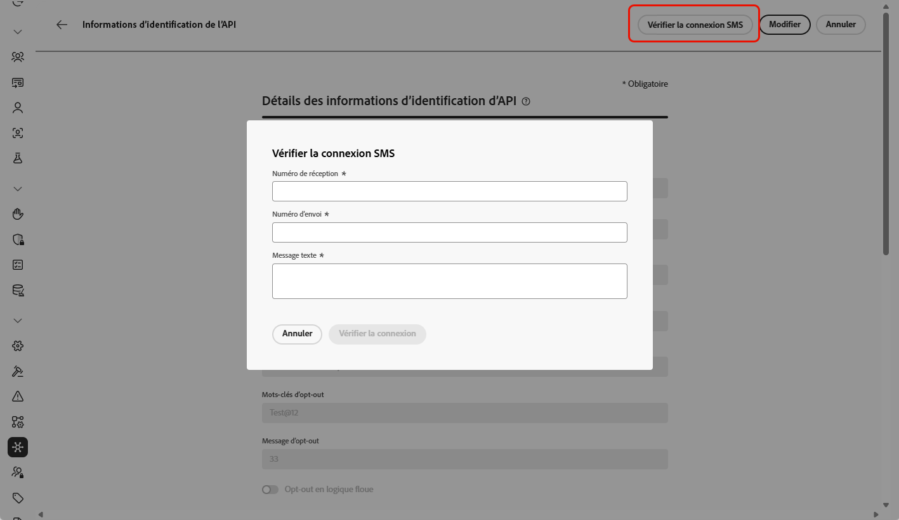

# Configurer le fournisseur Sinch {#sms-configuration-sinch}

Lorsque vous utilisez le fournisseur Sinch avec Journey Optimizer, vous disposez de trois options distinctes :

* **Configuration des SMS** : configurez vos informations d’identification d’API Sinch pour envoyer des messages SMS de manière transparente.

* **Configuration des MMS** : pour la messagerie multimédia (MMS), configurez vos informations d’identification d’API MMS Sinch. Notez que le suivi et la réponse aux messages entrants sont gérés par la configuration des SMS. La configuration des MMS concerne uniquement la diffusion sortante des messages MMS.

* **Configuration RCS** : configurez vos informations d’identification d’API Sinch pour envoyer des messages RCS de manière transparente.

## Configurer les informations d’identification d’API pour les SMS{#create-api}

>[!BEGINSHADEBOX]

Si les mots-clés relatifs à l’opt-in ou à l’opt-out ne sont pas fournis, des messages de consentement standard sont utilisés pour respecter la confidentialité des personnes. L’ajout de mots-clés personnalisés remplace automatiquement les valeurs par défaut.

**Mots-clés par défaut :**

* **Opt-in** : SUBSCRIBE (s’abonner), YES (oui), UNSTOP (redémarrer), START (démarrer), CONTINUE (continuer), RESUME (reprendre), BEGIN (commencer).
* **Opt-out** : STOP (arrêter), QUIT (quitter), CANCEL (annuler), END (terminer), UNSUBSCRIBE (se désabonner), NO (non).
* **Aide** : HELP (aide).

>[!ENDSHADEBOX]

Pour configurer votre fournisseur Sinch pour envoyer des SMS et des MMS avec Journey Optimizer, procédez comme suit :

1. Dans le rail de gauche, accédez à **[!UICONTROL Administration]** > **[!UICONTROL Canaux]** `>` **[!UICONTROL Paramètres des SMS]** et sélectionnez le menu **[!UICONTROL Informations d’identification de l’API]**. Cliquez sur le bouton **[!UICONTROL Créer des informations d’identification de l’API]**.

1. Configurez les informations d’identification pour l’API SMS, comme indiqué ci-dessous :

   +++ Liste des informations d’identification SMS pour la configuration

   | Champs de configuration | Description |
   |---|---|    
   | Fournisseur SMS | Sinch |
   | Nom | Saisissez un nom pour vos informations d’identification API. |
   | ID de service et jeton API | Accédez à la page des API, puis à vos informations d’identification sous l’onglet SMS. En savoir plus dans la [Documentation Sinch](https://developers.sinch.com/docs/sms/getting-started/){target="_blank"}. |
   | Mots-clés d’opt-in | Saisissez les mots-clés par défaut ou personnalisés qui déclencheront automatiquement votre message d’opt-in. Pour plusieurs mots-clés, utilisez des valeurs séparées par des virgules. |
   | Message d’opt-in | Saisissez la réponse personnalisée qui est automatiquement envoyée en tant que message d’opt-in. |
   | Mots-clés d’opt-out | Saisissez les mots-clés par défaut ou personnalisés qui déclencheront automatiquement votre message d’opt-out. Pour plusieurs mots-clés, utilisez des valeurs séparées par des virgules. |
   | Message d’opt-out | Saisissez la réponse personnalisée qui est automatiquement envoyée en tant que message d’opt-out. |
   | Mots-clés d’aide | Saisissez les mots-clés par défaut ou personnalisés qui déclencheront automatiquement votre **message d’aide**. Pour plusieurs mots-clés, utilisez des valeurs séparées par des virgules. |
   | Message d’aide | Saisissez la réponse personnalisée qui est automatiquement envoyée en tant que **message d’aide**. |
   | Mots-clés de double opt-in | Saisissez les mots-clés qui déclenchent le processus de double opt-in. Si un profil d’utilisateur ou d’utilisatrice n’existe pas, il est créé lors de la confirmation. Pour plusieurs mots-clés, utilisez des valeurs séparées par des virgules. [En savoir plus sur le double opt-in des SMS](https://video.tv.adobe.com/v/3427129/?learn=on). |
   | Message de double opt-in | Saisissez la réponse personnalisée qui est automatiquement envoyée en réponse à la confirmation de double opt-in. |
   | Numéro entrant | Ajoutez votre numéro entrant unique ou votre code court. Cela permet d’utiliser les mêmes informations d’identification d’API dans différents sandbox, chacun ayant son propre numéro entrant ou code court. |
   | Mots-clés entrants personnalisés | Définissez des mots-clés uniques et non liés au consentement pour des actions par lots, par exemple REMISE, OFFRES, INSCRIRE. Ces mots-clés sont capturés et stockés en tant qu’attributs dans le profil, ce qui vous permet de déclencher une qualification de segment par lots dans le parcours et de fournir une réponse ou une action personnalisée. |
   | Message de réponse entrant par défaut | Saisissez la réponse par défaut envoyée lorsqu’un utilisateur final ou une utilisatrice finale envoie un SMS entrant qui ne correspond à aucun des mots-clés définis. |
   | URL de remplacement | Saisissez votre URL personnalisée pour remplacer les points d’entrée par défaut des rapports de diffusion par SMS, des données de commentaires, des messages entrants ou des notifications d’événement. Sinch enverra toutes les mises à jour pertinentes à cette URL au lieu des mises à jour prédéfinies. |

   +++

1. Activez l’option **[!UICONTROL Opt-out en logique floue]** pour détecter les messages ressemblant à des mots-clés d’opt-out (par exemple, « CANCIL ») et personnalisez la réponse de confirmation dans le champ **[!UICONTROL Réponse automatique en logique floue]**.

   L’option **[!UICONTROL Opt-out en logique floue]** identifie les SMS indiquant qu’une personne souhaite se désabonner, même si le message ne correspond pas exactement à un mot-clé d’opt-out défini. Les expressions de désabonnement courantes et certains termes offensants peuvent être détectés, ce qui permet de s’assurer que vos campagnes respectent les préférences des utilisateurs et utilisatrices et qu’elles restent conformes.

1. Cliquez sur **[!UICONTROL Envoyer]** lorsque vous avez terminé la configuration de vos informations d’identification d’API.

1. Dans le menu **[!UICONTROL Informations d’identification d’API]**, cliquez sur l’icône de corbeille pour supprimer vos informations d’identification d’API.

1. Pour modifier les informations d’identification existantes, recherchez les informations d’identification d’API souhaitées et cliquez sur l’option **[!UICONTROL Modifier]** pour apporter les modifications nécessaires.

1. Cliquez sur **[!UICONTROL Vérifier la connexion SMS]**, à partir de vos informations d’identification d’API existantes, pour tester et vérifier vos informations d’identification d’API SMS en envoyant un exemple de message à un appareil désigné.

1. Renseignez les champs **Numéro** et **Message**, puis cliquez sur **[!UICONTROL Vérifier la connexion]**.

   >[!IMPORTANT]
   >
   >Le message doit être structuré de manière à s’aligner sur le format de payload du fournisseur.

   

Après avoir créé et configuré vos informations d’identification d’API, vous devez maintenant créer une configuration des canaux pour les messages SMS. [En savoir plus](sms-configuration-surface.md)

## Configurer les informations d’identification d’API pour les MMS{#sinch-mms}

>[!IMPORTANT]
>
> Avec la configuration des MMS, vous devez également créer des informations d’identification de l’API Sinch spécifiques pour le suivi des messages entrants et la gestion des demandes de consentement.

Pour configurer Sinch MMS avec Journey Optimizer, procédez comme suit :

1. Dans le rail de gauche, accédez à **[!UICONTROL Administration]** > **[!UICONTROL Canaux]** `>` **[!UICONTROL Paramètres des SMS]** et sélectionnez le menu **[!UICONTROL Informations d’identification de l’API]**. Cliquez sur le bouton **[!UICONTROL Créer des informations d’identification de l’API]**.

1. Configurez vos informations d’identification pour l’API MMS, comme indiqué ci-dessous :

   * **[!UICONTROL Fournisseur de SMS]** : Sinch MMS.

   * **[!UICONTROL Nom]** : choisissez un nom pour vos informations d’identification d’API.

   * **[!UICONTROL Identifiant de projet]**, **[!UICONTROL Identifiant d’application]** et **[!UICONTROL Jeton API]** : suivez les étapes ci-dessous pour collecter vos informations d’identification d’API MMS.

      * Pour l’**[!UICONTROL Identifiant de projet]** et l’**[!UICONTROL Identifiant d’application]** : accédez à la page [Vue d’ensemble de l’API de conversation](https://dashboard.sinch.com/convapi/overview) de votre projet Sinch sur votre tableau de bord Sinch.
      * Pour le **[!UICONTROL Jeton API]** : obtenez les [Clés d’accès](https://community.sinch.com/t5/Customer-Dashboard/Sinch-Access-Keys/ta-p/12638) pour votre projet Sinch et générez un **Jeton API Base64** à partir des **Clés d’accès** de votre projet Sinch.

1. Cliquez sur **[!UICONTROL Envoyer]** lorsque vous avez terminé la configuration de vos informations d’identification d’API.

1. Dans le menu **[!UICONTROL Informations d’identification d’API]**, cliquez sur l’icône de corbeille pour supprimer vos informations d’identification d’API.

1. Pour modifier les informations d’identification existantes, recherchez les informations d’identification d’API souhaitées et cliquez sur l’option **[!UICONTROL Modifier]** pour apporter les modifications nécessaires.

Après avoir créé et configuré vos informations d’identification d’API, vous devez maintenant créer une configuration des canaux pour les messages MMS. [En savoir plus](sms-configuration-surface.md)

## Configurer des informations d’identification d’API pour RCS

<!---->

La messagerie RCS (Rich Communication Services) est prise en charge dans Journey Optimizer via Sinch, ce qui permet d’envoyer des messages de base à l’aide de profils professionnels vérifiés avec des éléments de marque tels que des logos et des noms d’expéditeur ou d’expéditrice.

Notez que les messages redeviennent automatiquement des SMS lorsque l’appareil du profil ne prend pas en charge RCS ou est temporairement inatteignable via RCS.

<!--
### Basic RCS Messages

>[!AVAILABILITY]
>
> Basic RCS messages is only available upon Adobe RCS add-on offering.

1. **Set up your branded RCS agent**

    Create a branded RCS agent in the Sinch Dashboard. [Learn more on branded RCS agent](https://community.sinch.com/t5/RCS/Getting-Started-with-RCS-using-Conversation-API/ta-p/17844)

1. **Set up your [Custom API credentials](sms-configuration-custom.md)**
    
    Once your RCS agent is approved, you need to set up your Sinch API credentials, which include your access key, secret, and service plan ID. These credentials will be used by Journey Optimizer to authenticate and send messages through Sinch's platform.

1. **Create a [channel configuration](sms-configuration-surface.md) for your RCS messages**

    Configure a channel surface in Journey Optimizer by linking your Sinch credentials and defining the messaging parameters. This setup enables you to compose and send RCS messages from Journey Optimizer.

1. **Create and personalize your [SMS message](../sms/create-sms.md)**

    Your messages automatically falls back to SMS when the profile's device does not support RCS or is temporarily unreachable via RCS.
-->

### Messages multimédias RCS

>[!AVAILABILITY]
>
> Les messages RCS avancés ne sont disponibles qu’avec un compte direct géré par Sinch.

1. **Configurer votre agent RCS de marque**

   Créez un agent RCS de marque dans le tableau de bord Sinch. [En savoir plus sur l’agent RCS de marque](https://community.sinch.com/t5/RCS/Getting-Started-with-RCS-using-Conversation-API/ta-p/17844).

1. **Configurer vos [informations d’identification d’API personnalisées](sms-configuration-custom.md)**

   Une fois votre agent RCS approuvé, vous devez configurer vos informations d’identification d’API personnalisées, qui incluent vos ID d’application, nom, URL et type d’authentification.

1. **Configurez votre RCS avec la payload du fournisseur.**

   Dans vos [informations d’identification d’API personnalisées](sms-configuration-custom.md), ajoutez la payload de votre fournisseur pour valider et personnaliser vos messages RCS.

1. **Créer une [configuration de canaux](sms-configuration-surface.md) pour vos messages RCS**

   Configurez une surface de canal dans Journey Optimizer en liant vos informations d’identification Sinch et en définissant les paramètres de messagerie. Cette configuration vous permet de composer et d’envoyer des messages RCS à partir de Journey Optimizer.

1. **Créer et personnaliser votre [SMS](../sms/create-sms.md)**

   Collez directement la payload dans le contenu du SMS pour incorporer et diffuser vos messages RCS (Rich Communication Services).

   ➡️ [Découvrez dans la documentation Sinch comment Sinch prend en charge RCS](https://sinch.com/blog/rcs-api-guide/).

