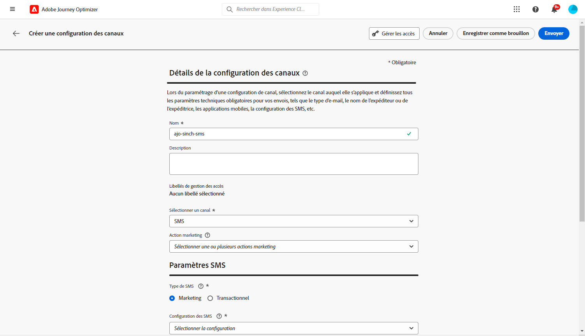
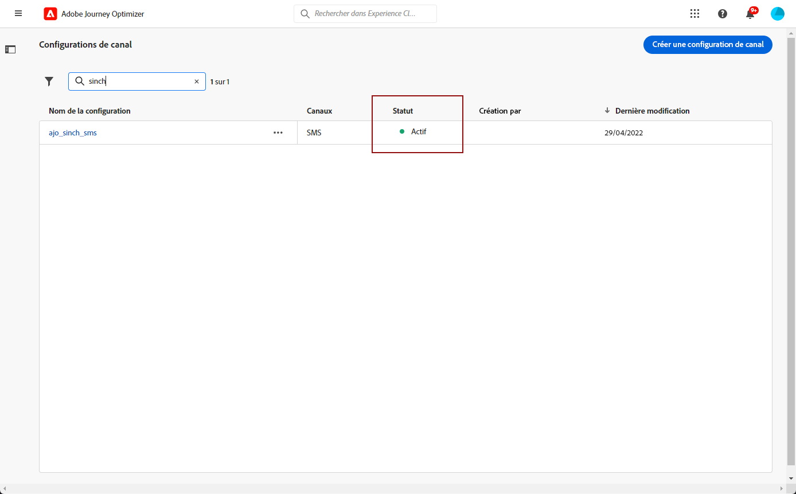

# Créer une surface SMS/MMS {#message-preset-sms}

>[!CONTEXTUALHELP]
>id="ajo_admin_surface_sms_type"
>title="Définir la catégorie de message"
>abstract="Sélectionnez le type de messages texte utilisant cette surface : marketing pour les messages promotionnels, qui nécessitent le consentement de l’utilisateur ou de l’utilisatrice, ou transactionnel pour les messages non commerciaux, tels que la réinitialisation du mot de passe."
>additional-url="https://experienceleague.adobe.com/docs/journey-optimizer/using/privacy/consent/opt-out.html?lang=fr#sms-opt-out-management" text="Se désinscrire dans les messages texte de marketing"

Une fois votre canal SMS/MMS configuré, vous devez créer une surface de canal afin de pouvoir envoyer des SMS et des MMS à partir de **[!DNL Journey Optimizer]**.

Pour créer une surface de canal, procédez comme suit :

1. Dans le rail de gauche, accédez à **[!UICONTROL Administration]** > **[!UICONTROL Canaux]** et sélectionnez **[!UICONTROL Branding]** > **[!UICONTROL Surfaces de canal]**. Cliquez sur le bouton **[!UICONTROL Créer une surface de canal]**.

   

1. Saisissez un nom et une description (facultatif) pour la surface, puis sélectionnez le canal SMS.

   

   >[!NOTE]
   >
   > Les noms doivent commencer par une lettre (A-Z). Ils ne peuvent contenir que des caractères alphanumériques. Vous pouvez également utiliser le trait de soulignement `_`, le point`.` et le trait d&#39;union `-`.

1. Définissez les **paramètres SMS**.

   

   Sélectionnez le **[!UICONTROL Type de SMS]** qui sera envoyé avec la surface : **[!UICONTROL Transactionnel]** ou **[!UICONTROL Marketing]**.

   * Choisissez **Marketing** pour les messages texte promotionnels : ces messages nécessitent le consentement de l’utilisateur ou de l’utilisatrice.
   * Choisissez **Transactionnel** pour les messages non commerciaux tels que la confirmation de commande, les notifications de réinitialisation de mot de passe ou les informations de diffusion, par exemple.

   Lors de la création d’un SMS/MMS, vous devez choisir une surface de canal valide correspondant à la catégorie que vous avez sélectionnée pour votre message.

   >[!CAUTION]
   >
   >Les messages **transactionnels** peuvent être envoyés aux profils qui se sont désabonnés des communications marketing. Ces messages ne peuvent être envoyés que dans des contextes spécifiques.

1. Sélectionnez la **[!UICONTROL Configuration SMS]** à associer à la surface.

   Pour plus dʼinformations sur la configuration de votre environnement pour envoyer des messages SMS, consultez [cette section](#create-api).

1. Saisissez le **[!UICONTROL Numéro dʼexpéditeur]** à utiliser lors de vos communications.

1. Sélectionnez votre **[!UICONTROL Champ d’exécution SMS]** pour sélectionner l’**[!UICONTROL Attribut de profil]** associé aux numéros de téléphone des profils.

1. Si vous souhaitez utiliser la fonction de raccourcissement des URL dans vos SMS, sélectionnez un élément de la liste **[!UICONTROL Sous-domaine]**.

   >[!NOTE]
   >
   >Avant de pouvoir sélectionner un sous-domaine, vous devez avoir configuré au moins un sous-domaine SMS/MMS. [Voici comment procéder.](sms-subdomains.md)

1. Saisissez le **[!UICONTROL numéro d’opt-out]** que vous voulez utiliser pour cette surface. Lorsque les profils décident de ne plus recevoir de messages depuis ce numéro, vous pouvez toujours leur en envoyer à partir d’autres numéros que vous pouvez utiliser pour envoyer des messages texte avec [!DNL Journey Optimizer].

   >[!NOTE]
   >
   >Dans [!DNL Journey Optimizer], la désinscription aux messages texte n’est plus gérée au niveau du canal. Elle est désormais spécifique à un numéro.

1. Une fois tous les paramètres configurés, cliquez sur **[!UICONTROL Envoyer]** pour confirmer. Vous pouvez également enregistrer la surface de canal en tant que brouillon et reprendre sa configuration ultérieurement.

   

1. Une fois la surface de canal créée, elle s&#39;affiche dans la liste avec le statut **[!UICONTROL Traitement]**.

   >[!NOTE]
   >
   >Si les vérifications ne réussissent pas, découvrez les raisons possibles de l’échec dans [cette section](#monitor-channel-surfaces).

1. Une fois les vérifications effectuées, la surface de canal obtient le statut **[!UICONTROL Actif]**. Elle est prête à être utilisée pour diffuser des messages.

   

Vous pouvez maintenant envoyer des messages texte avec Journey Optimizer.
