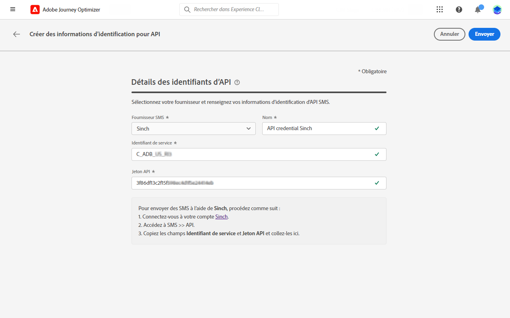
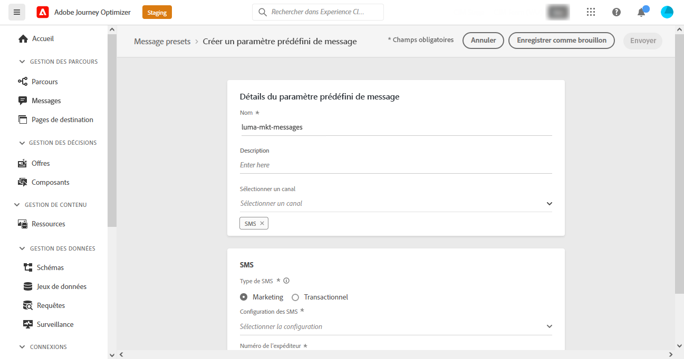
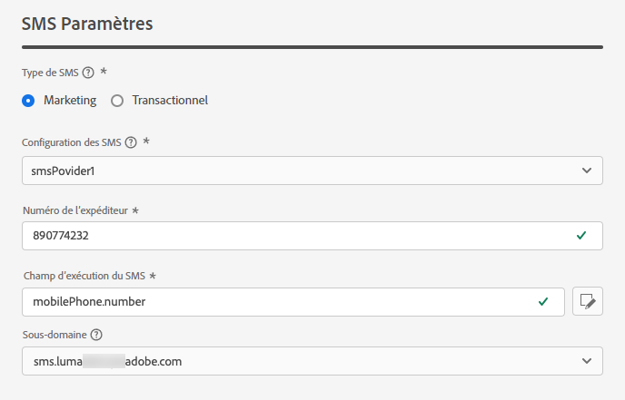
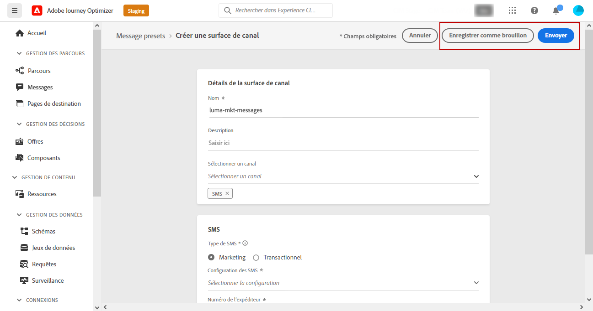

# Configuration du canal SMS {#sms-configuration}

[!DNL Journey Optimizer] vous permet de créer vos parcours et d’envoyer des messages à une audience ciblée.

Avant d&#39;envoyer un SMS, configurez votre instance. Vous devez [intégrer les paramètres du fournisseur](#create-api) avec Journey Optimizer et [créer une surface SMS ;](#message-preset-sms) (c.-à-d. paramètre prédéfini SMS). Ces étapes doivent être exécutées par une [Administrateur système Adobe Journey Optimizer](../start/path/administrator.md).

>[!IMPORTANT]
>
>Adobe Journey Optimizer s’intègre actuellement à des fournisseurs tiers tels que Sinch et Twilio, qui offrent des services SMS indépendamment d’Adobe Journey Optimizer.  Avant la configuration des SMS, vous devez créer un compte auprès de l’un de ces fournisseurs SMS afin de recevoir le jeton API et l’ID de service qui vous permettront d’établir la connexion entre Adobe Journey Optimizer et le fournisseur SMS approprié. Votre utilisation des services SMS sera sujette à des conditions supplémentaires de la part du fournisseur de SMS concerné. Étant donné que Sinch et Twilio sont des produits tiers disponibles pour les utilisateurs d’Adobe Journey Optimizer via une intégration, pour tout problème ou toute demande liée aux services SMS, les utilisateurs de Sinch ou Twilio devront contacter le fournisseur de services SMS concerné pour obtenir de l’aide. Adobe ne contrôle pas et n’est pas responsable des produits tiers.

## Création d’informations d’identification d’API {#create-api}

>[!CONTEXTUALHELP]
>id="ajo_admin_sms_api_header"
>title="Configuration de votre fournisseur de SMS avec Journey Optimizer"
>abstract="Sélectionnez votre fournisseur et renseignez vos informations d’identification d’API SMS."

>[!CONTEXTUALHELP]
>id="ajo_admin_sms_api"
>title="Configuration de votre fournisseur de SMS avec Journey Optimizer"
>abstract="Avant d’envoyer des SMS, vous devez intégrer les paramètres du fournisseur à Journey Optimizer. Une fois cette opération terminée, vous devrez créer une surface SMS. Ces étapes doivent être effectuées par un administrateur système Adobe Journey Optimizer."
>additional-url="https://experienceleague.adobe.com/docs/journey-optimizer/using/sms/sms-configuration.html?lang=en#message-preset-sms" text="Créer une surface de canal SMS"

>[!CONTEXTUALHELP]
>id="ajo_admin_sms_configuration"
>title="Sélectionner la configuration du fournisseur de SMS"
>abstract="Sélectionnez les informations d’identification d’API configurées pour votre fournisseur SMS."

Pour configurer votre fournisseur de SMS avec Journey Optimizer, procédez comme suit :

1. Accédez au **[!UICONTROL Administration]** > **[!UICONTROL Channels]** > **[!UICONTROL API Credentials]** , puis cliquez sur **[!UICONTROL Create API credential]**.

   

1. Sélectionnez votre **[!UICONTROL SMS vendor]**:

   * [!DNL Sinch]. Pour rechercher votre **[!UICONTROL Service ID]** et **[!UICONTROL API Token]**, accédez au menu SMS > API depuis votre compte Sinch.
   * [!DNL Twilio]. Pour rechercher votre **[!UICONTROL Service ID]** et **[!UICONTROL API Token]**, accédez au volet Informations du compte de la page Tableau de bord de la console .

1. Saisissez un **[!UICONTROL Name]** pour vos informations d’identification d’API.

1. Saisissez votre **[!UICONTROL Service ID]** et **[!UICONTROL API Token]**.

   

1. Cliquez sur **[!UICONTROL Submit]** lorsque vous avez terminé la configuration de vos informations d’identification d’API.

Après avoir créé et configuré vos informations d’identification API, vous devez maintenant créer une surface de canal (c’est-à-dire un paramètre prédéfini de message) pour les messages SMS.

## Créer une surface de canal pour les SMS {#message-preset-sms}

>[!CONTEXTUALHELP]
>id="ajo_admin_surface_sms_type"
>title="Définition de la catégorie SMS"
>abstract="Sélectionnez le type de SMS qui sera envoyé lors de l&#39;utilisation de cette surface : Marketing pour les SMS promotionnels, qui nécessitent un consentement de l’utilisateur, ou Transactionnel pour les SMS non commerciaux, qui peuvent également être envoyés aux profils désabonnés dans des contextes spécifiques."
>additional-url="https://experienceleague.adobe.com/docs/journey-optimizer/using/privacy/consent/opt-out.html#sms-opt-out-management" text="Exclusion dans les SMS marketing"

Une fois votre canal SMS configuré, vous devez créer une surface de canal pour pouvoir envoyer des SMS depuis **[!DNL Journey Optimizer]**.

Pour créer une surface de canal, procédez comme suit :

1. Accédez au **[!UICONTROL Channels]** > **[!UICONTROL Branding]** > **[!UICONTROL Channel surfaces]** , puis cliquez sur **[!UICONTROL Create channel surface]**.

   

1. Saisissez un nom et une description (facultatif) pour la surface, puis sélectionnez le canal SMS.

   

   >[!NOTE]
   >
   > Les noms doivent commencer par une lettre (A-Z). Elle ne peut contenir que des caractères alphanumériques. Vous pouvez également utiliser des traits de soulignement. `_`, point`.` et trait d’union `-` caractères.

1. Configurez la variable **SMS** paramètres.

   

   * Sélectionnez la **[!UICONTROL SMS Type]** qui sera envoyé avec la surface : **[!UICONTROL Transactional]** ou **[!UICONTROL Marketing]**.

   * Sélectionnez la **[!UICONTROL SMS configuration]** à associer à la surface.

      Pour plus d&#39;informations sur la configuration de votre environnement pour envoyer des SMS, reportez-vous à la section [cette section](#create-api).

   * Saisissez le **[!UICONTROL Sender number]** &#x200B; que vous voulez utiliser pour vos communications.

   * Sélectionnez votre **[!UICONTROL SMS Execution Field]** pour sélectionner la variable **[!UICONTROL Profile attribute]** associée aux numéros de téléphone des profils.

1. Une fois tous les paramètres configurés, cliquez sur **[!UICONTROL Submit]** pour confirmer. Vous pouvez également enregistrer la surface du canal en tant que version préliminaire et reprendre sa configuration ultérieurement.

   

1. Une fois la surface du canal créée, elle s’affiche dans la liste avec le **[!UICONTROL Processing]** statut.

   >[!NOTE]
   >
   >Si les vérifications échouent, découvrez les raisons possibles de l’échec dans la section [cette section](#monitor-channel-surfaces).

1. Une fois les vérifications effectuées, la surface du canal reçoit la valeur **[!UICONTROL Active]** statut. Il est prêt à être utilisé pour diffuser des messages.

   

Vous êtes maintenant prêt à envoyer des SMS avec Journey Optimizer.

**Rubriques connexes**

* [Créer un SMS](create-sms.md)
* [Ajout d’un message dans un parcours](../building-journeys/journeys-message.md)
